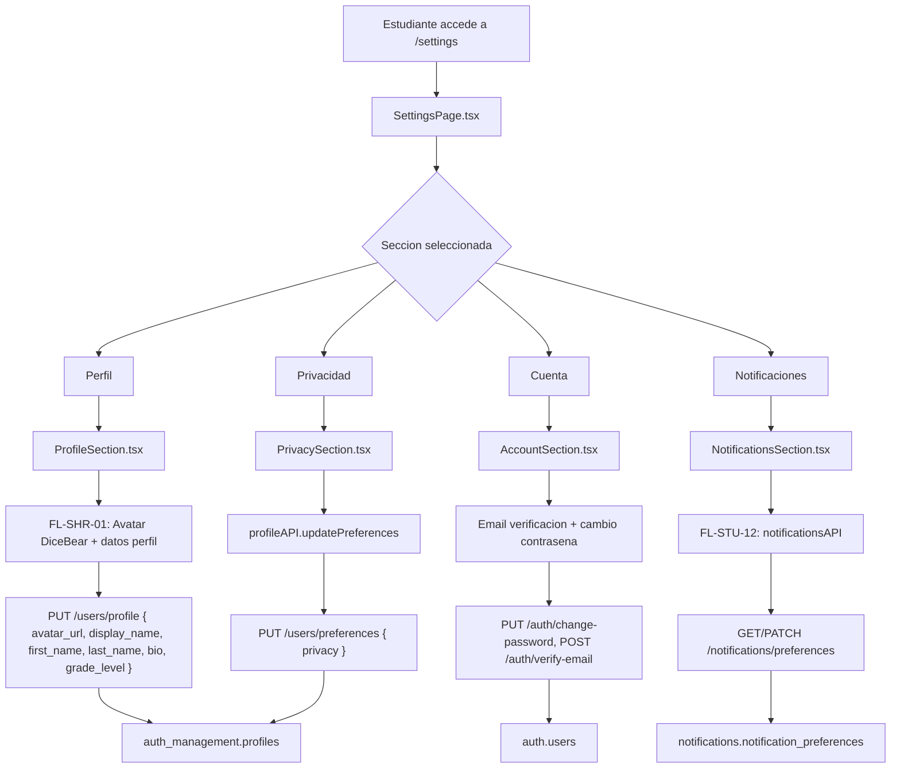

# FL-STU-05 - Perfil y Ajustes del Estudiante

**ID:** FL-STU-05
**Version:** 1.2.0
**Fecha:** 2026-02-19
**Estado:** Activo
**Portal:** Student
**Prioridad:** P1

---

## Tipo de Flujo

**Tipo:** Compuesto
**Sub-flujos:**
- FL-SHR-01 — Perfil y configuracion multi-portal (edicion de perfil, avatar DiceBear)
- FL-STU-11 — Settings de dispositivos (gestion de dispositivos vinculados)
- FL-STU-12 — Settings de notificaciones (preferencias de notificaciones del estudiante)

---

## 1. Resumen

Flujo compuesto que agrupa todas las acciones de configuracion personal del estudiante. Desde la perspectiva del estudiante, todas estas acciones se acceden desde `SettingsPage.tsx` que actua como contenedor orquestador de 4 secciones: Perfil, Cuenta, Notificaciones y Privacidad.

**Secciones del SettingsPage (post-refactor v1.1.0):**

| Seccion | Componente | Sub-flujo | Descripcion |
|---------|-----------|-----------|-------------|
| Perfil | `settings/ProfileSection.tsx` | FL-SHR-01 | Avatar DiceBear, nombre de usuario, nombre, apellido, grado escolar, biografia |
| Cuenta | `settings/AccountSection.tsx` | FL-SHR-01 | Email (verificacion), cambio de contrasena |
| Notificaciones | `settings/NotificationsSection.tsx` | FL-STU-12 | 5 toggles conectados a `notificationsAPI` real |
| Privacidad | `settings/PrivacySection.tsx` | — | Visibilidad, estado en linea, solicitudes (carga de backend on mount) |

**Eliminado en v1.1.0:** Tab "Connected Accounts" (sin backend OAuth), selectores theme/language (sin i18n/dark mode implementado), file upload de avatar (backend retorna placeholder).

**Actualizado en v1.2.0:** ProfileSection ampliado con campos `first_name`, `last_name`, `grade_level` (backend `toUserResponse` ahora los incluye). PrivacySection carga preferencias de backend al montar. Botones de subpaginas avanzadas eliminados de NotificationsSection (rutas no existen). `refreshUser()` sincroniza AuthContext tras cada save.

Impacto funcional: Permite al estudiante personalizar su experiencia en la plataforma, gestionar su identidad y controlar como recibe comunicaciones.

## 2. Precondiciones

- Usuario autenticado con rol `student`.
- Perfil existente en `auth_management.profiles`.
- Sesion activa en frontend (`useAuth` retorna `isAuthenticated: true`).

## 3. Diagrama Mermaid



### Subpaginas avanzadas (rutas dedicadas)

> **Nota v1.2.0:** Los botones "Preferencias detalladas" y "Gestionar dispositivos" fueron eliminados de `NotificationsSection` porque las rutas `/settings/notifications` y `/settings/devices` no existen como rutas registradas en App.tsx. La funcionalidad completa de notificaciones se maneja dentro de la seccion inline con 5 toggles. FL-STU-11 y FL-STU-12 quedan como flujos futuros si se implementan subpaginas dedicadas.

## 4. Secuencia FE -> BE -> DB

Este flujo delega a sus sub-flujos. Consultar cada uno para la secuencia detallada:

1. **Perfil y avatar:** Ver [FL-SHR-01 FLUJO-PERFIL-CONFIGURACION](../shared/FLUJO-PERFIL-CONFIGURACION.md)
2. **Dispositivos:** Ver [FL-STU-11 FLUJO-SETTINGS-DISPOSITIVOS](./FLUJO-SETTINGS-DISPOSITIVOS.md)
3. **Notificaciones:** Ver [FL-STU-12 FLUJO-SETTINGS-NOTIFICACIONES](./FLUJO-SETTINGS-NOTIFICACIONES.md)

### Secuencia interna de NotificationsSection (nueva en v1.1.0)

```
1. Mount → GET /notifications/preferences → notificationsAPI.getPreferences()
   → Derivar toggles de preferencias backend
2. Toggle cambio → estado local
3. Guardar → PATCH /notifications/preferences → notificationsAPI.updateMultiplePreferences()
   → Batch update de 5 tipos: achievement_unlocked, assignment_created, mission_completed, friend_request, system_announcement
```

### Secuencia interna de PrivacySection (nueva en v1.2.0)

```
1. Mount → GET /users/preferences → profileAPI.getPreferences()
   → Leer prefs.privacy (soporta camelCase y snake_case)
   → Spinner mientras carga
2. Toggle/select cambio → estado local
3. Guardar → GET /users/preferences (fetch current) → merge privacy → PUT /users/preferences
   → profileAPI.updatePreferences() con merge para no sobreescribir otras prefs
```

### Secuencia interna de ProfileSection (actualizada en v1.2.0)

```
1. Init → Cargar campos del user prop (displayName, firstName, lastName, bio, gradeLevel)
2. Edicion → estado local (5 campos InputDetective + 1 textarea)
3. Avatar → AvatarSelectionModal → profileAPI.updateProfile({avatar_url}) → refreshUser()
4. Guardar → PUT /users/profile {display_name, first_name, last_name, bio, grade_level}
   → profileAPI.updateProfile() → refreshUser() → sync AuthContext + authStore
```

## 5. Componentes y artefactos implicados

### Frontend (contenedor + secciones)
- Orquestador: `apps/frontend/src/apps/student/pages/SettingsPage.tsx` (~80 lineas)
- Sidebar: `apps/frontend/src/apps/student/pages/settings/SettingsSidebar.tsx`
- Seccion Perfil: `apps/frontend/src/apps/student/pages/settings/ProfileSection.tsx`
- Seccion Cuenta: `apps/frontend/src/apps/student/pages/settings/AccountSection.tsx`
- Seccion Notificaciones: `apps/frontend/src/apps/student/pages/settings/NotificationsSection.tsx`
- Seccion Privacidad: `apps/frontend/src/apps/student/pages/settings/PrivacySection.tsx`
- Componentes compartidos: `SaveButton.tsx`, `ToggleSwitch.tsx`, `PasswordStrengthIndicator.tsx`
- Modal avatar: `apps/frontend/src/shared/components/profile/AvatarSelectionModal.tsx`

### Frontend (APIs usadas)
- `apps/frontend/src/services/api/profileAPI.ts` — perfil, contrasena, email verification, privacidad
- `apps/frontend/src/services/api/notificationsAPI.ts` — preferencias de notificacion (sistema real)

### Sub-flujos referenciados
| Sub-flujo | Archivo de flujo | Componentes principales |
|-----------|-----------------|------------------------|
| FL-SHR-01 | `shared/FLUJO-PERFIL-CONFIGURACION.md` | `ProfileSection.tsx`, `AvatarSelectionModal.tsx` |
| FL-STU-11 | `student/FLUJO-SETTINGS-DISPOSITIVOS.md` | `DeviceManagementSection.tsx` |
| FL-STU-12 | `student/FLUJO-SETTINGS-NOTIFICACIONES.md` | `NotificationsSection.tsx`, `NotificationPreferencesPage.tsx` |

### Datos (agregados)
- `auth_management.profiles`
- `auth.users`
- `notifications.user_devices`
- `notifications.notification_preferences`

## 6. Reglas y validaciones

- Cada sub-flujo tiene sus propias reglas de validacion (ver documentos referenciados).
- El acceso a `/settings` requiere autenticacion con rol `student`.
- RLS aplica en todas las tablas: el estudiante solo puede modificar sus propios datos.
- **Contrasena:** minimo 8 caracteres, indicador de fuerza visual, show/hide en 3 campos, estado independiente del save de perfil.
- **Avatar:** seleccion de catalogo DiceBear (12 opciones), default basado en displayName. File upload soportado en backend (base64 data URI).
- **Notificaciones:** 5 toggles mapeados a tipos backend reales, guardados via `notificationsAPI.updateMultiplePreferences()`.
- **Privacidad:** Carga preferencias de backend al montar. Save hace merge (no sobreescribe). Soporta campos camelCase y snake_case del backend.
- **Componentes UI:** `InputDetective` para inputs, `DetectiveCard` para cards, `SaveButton` con estados idle/saving/saved/error (text-white en saving).

## 7. Manejo de errores

- **Perfil/Contrasena:** Toast con mensaje de error del backend, botones vuelven a estado `idle` tras 3s.
- **Notificaciones:** Fallback a defaults si `getPreferences()` falla (in_app=true, email=true, push=false).
- **Email verification:** Modal con reenvio de codigo, estados idle/sending/verifying/error.
- **Validacion inline:** Campos de contrasena muestran errores individuales (campo vacio, < 8 chars, no coinciden).

## 8. Trazabilidad cruzada

| Capa | Archivo | Evidencia |
|------|---------|-----------|
| Frontend (orquestador) | `apps/frontend/src/apps/student/pages/SettingsPage.tsx` | Ruta `/settings`, 4 secciones |
| Frontend (secciones) | `apps/frontend/src/apps/student/pages/settings/*.tsx` | 8 componentes (3 shared + 4 secciones + sidebar) |
| Sub-flujo FL-SHR-01 | `docs/30-ux-ui/flujos/shared/FLUJO-PERFIL-CONFIGURACION.md` | Edicion perfil + avatar DiceBear |
| Sub-flujo FL-STU-11 | `docs/30-ux-ui/flujos/student/FLUJO-SETTINGS-DISPOSITIVOS.md` | Gestion dispositivos push |
| Sub-flujo FL-STU-12 | `docs/30-ux-ui/flujos/student/FLUJO-SETTINGS-NOTIFICACIONES.md` | Preferencias notificaciones (API real) |

## 9. Referencias

- Guia de portal estudiante: `docs/60-portals/student/PORTAL-STUDENT-GUIDE.md`
- Especificacion de perfiles: `docs/10-requirements/epics/EPIC-GAM-F3-PROFILES/`
- Matriz de trazabilidad: `docs/30-ux-ui/flujos/TRACEABILITY-MATRIX.md`
