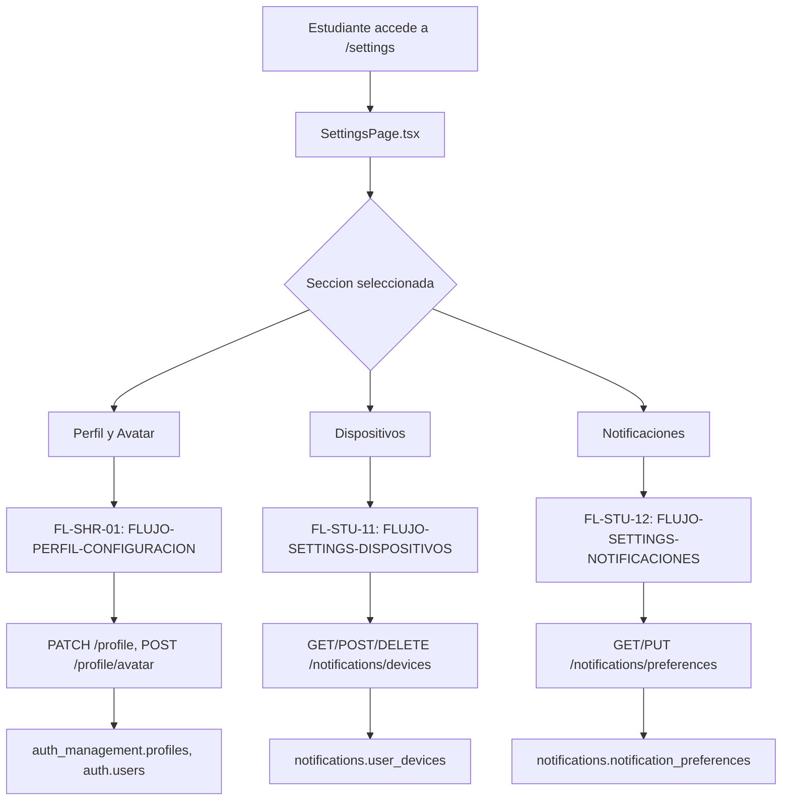

# FL-STU-05 - Perfil y Ajustes del Estudiante

**ID:** FL-STU-05
**Version:** 1.0.0
**Fecha:** 2026-02-17
**Estado:** Activo
**Portal:** Student
**Prioridad:** P1

---

## Tipo de Flujo

**Tipo:** Compuesto
**Sub-flujos:**
- FL-SHR-01 — Perfil y configuracion multi-portal (edicion de perfil, avatar, preferencias)
- FL-STU-11 — Settings de dispositivos (gestion de dispositivos vinculados)
- FL-STU-12 — Settings de notificaciones (preferencias de notificaciones del estudiante)

---

## 1. Resumen

Flujo compuesto que agrupa todas las acciones de configuracion personal del estudiante: edicion de perfil y avatar (delegado al flujo compartido FL-SHR-01), gestion de dispositivos (FL-STU-11) y preferencias de notificaciones (FL-STU-12). Desde la perspectiva del estudiante, todas estas acciones se acceden desde `SettingsPage.tsx` que actua como contenedor de multiples secciones.

Impacto funcional: Permite al estudiante personalizar su experiencia en la plataforma, gestionar su identidad y controlar como recibe comunicaciones.

## 2. Precondiciones

- Usuario autenticado con rol `student`.
- Perfil existente en `auth_management.profiles`.
- Sesion activa en frontend (`useAuth` retorna `isAuthenticated: true`).

## 3. Diagrama Mermaid

## 4. Secuencia FE -> BE -> DB

Este flujo delega a sus sub-flujos. Consultar cada uno para la secuencia detallada:

1. **Perfil y avatar:** Ver [FL-SHR-01 FLUJO-PERFIL-CONFIGURACION](../shared/FLUJO-PERFIL-CONFIGURACION.md)
2. **Dispositivos:** Ver [FL-STU-11 FLUJO-SETTINGS-DISPOSITIVOS](./FLUJO-SETTINGS-DISPOSITIVOS.md)
3. **Notificaciones:** Ver [FL-STU-12 FLUJO-SETTINGS-NOTIFICACIONES](./FLUJO-SETTINGS-NOTIFICACIONES.md)

## 5. Componentes y artefactos implicados

### Frontend (contenedor)
- Pagina: `apps/frontend/src/apps/student/pages/SettingsPage.tsx`
- Pagina: `apps/frontend/src/apps/student/pages/EnhancedProfilePage.tsx`

### Sub-flujos referenciados
| Sub-flujo | Archivo de flujo | Componentes principales |
|-----------|-----------------|------------------------|
| FL-SHR-01 | `shared/FLUJO-PERFIL-CONFIGURACION.md` | `SettingsPage.tsx`, `GeneralSettings.tsx` |
| FL-STU-11 | `student/FLUJO-SETTINGS-DISPOSITIVOS.md` | `DeviceManagementSection.tsx` |
| FL-STU-12 | `student/FLUJO-SETTINGS-NOTIFICACIONES.md` | `NotificationPreferencesPage.tsx` |

### Datos (agregados)
- `auth_management.profiles`
- `auth.users`
- `notifications.user_devices`
- `notifications.notification_preferences`

## 6. Reglas y validaciones

- Cada sub-flujo tiene sus propias reglas de validacion (ver documentos referenciados).
- El acceso a `/settings` requiere autenticacion con rol `student`.
- RLS aplica en todas las tablas: el estudiante solo puede modificar sus propios datos.

## 7. Manejo de errores

Delegado a cada sub-flujo. Ver documentos referenciados para escenarios especificos.

## 8. Trazabilidad cruzada

| Capa | Archivo | Evidencia |
|------|---------|-----------|
| Frontend (contenedor) | `apps/frontend/src/apps/student/pages/SettingsPage.tsx` | Ruta `/settings`, agrupa secciones |
| Sub-flujo FL-SHR-01 | `docs/30-ux-ui/flujos/shared/FLUJO-PERFIL-CONFIGURACION.md` | Edicion perfil/avatar |
| Sub-flujo FL-STU-11 | `docs/30-ux-ui/flujos/student/FLUJO-SETTINGS-DISPOSITIVOS.md` | Gestion dispositivos |
| Sub-flujo FL-STU-12 | `docs/30-ux-ui/flujos/student/FLUJO-SETTINGS-NOTIFICACIONES.md` | Preferencias notificaciones |

## 9. Referencias

- Guia de portal estudiante: `docs/60-portals/student/PORTAL-STUDENT-GUIDE.md`
- Especificacion de perfiles: `docs/10-requirements/epics/EPIC-GAM-F3-PROFILES/`
- Matriz de trazabilidad: `docs/30-ux-ui/flujos/TRACEABILITY-MATRIX.md`
