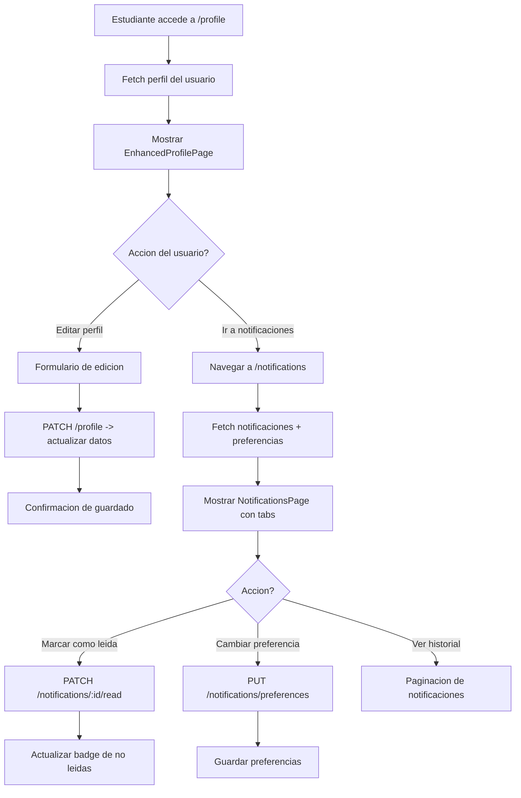

# FL-STU-18 - Perfil y Notificaciones

**ID:** FL-STU-18
**Version:** 1.0.0
**Fecha:** 2026-02-17
**Estado:** Activo
**Portal:** Student
**Prioridad:** P2

---

## 1. Resumen

Flujo de gestion del perfil personal y centro de notificaciones del estudiante. El estudiante puede visualizar y editar su informacion de perfil (avatar, nombre, preferencias), gestionar sus preferencias de notificaciones (email, push, in-app) y consultar el historial de notificaciones recibidas con estados de lectura. Las notificaciones cubren eventos academicos (asignaciones, calificaciones), gamificacion (logros, rangos) y sistema (mantenimiento, actualizaciones).

---

## 2. Precondiciones

- Usuario autenticado con rol `student`.
- Sesion activa con JWT valido.
- Perfil existente en auth_management.profiles.
- Preferencias de notificacion inicializadas (creadas al registrarse).

---

## 3. Diagrama Mermaid



---

## 4. Secuencia FE -> BE -> DB

```
=== Visualizar y editar perfil ===
1. FE: EnhancedProfilePage monta -> solicita datos de perfil
2. FE: GET /api/v1/profile/me
3. BE: ProfileController.getMyProfile() -> ProfileService.findByUserId()
4. DB: SELECT FROM auth_management.profiles WHERE user_id = :userId (RLS)
5. BE: Retorna { id, firstName, lastName, avatar, email, grade, school, preferences }
6. FE: Renderiza perfil con avatar, stats de gamificacion, info personal
7. FE: Estudiante edita campos -> PATCH /api/v1/profile/me { firstName, lastName, avatar }
8. BE: ProfileController.updateMyProfile() -> valida -> actualiza
9. DB: UPDATE auth_management.profiles SET ... WHERE user_id = :userId
10. FE: Toast de confirmacion "Perfil actualizado"

=== Centro de notificaciones ===
11. FE: Estudiante navega a /notifications -> NotificationsPage monta
12. FE: GET /api/v1/notifications?page=1&limit=20
13. BE: NotificationsController.findAll() -> NotificationsService.findByUser()
14. DB: SELECT FROM notifications.notifications WHERE user_id = :userId ORDER BY created_at DESC
15. BE: Retorna { items[], total, unreadCount }
16. FE: Renderiza lista con badge de no leidas

=== Marcar notificacion como leida ===
17. FE: Click en notificacion -> PATCH /api/v1/notifications/:id/read
18. BE: NotificationsController.markAsRead() -> actualiza estado
19. DB: UPDATE notifications.notifications SET read_at = NOW() WHERE id = :id
20. FE: Actualiza UI y decrementa unreadCount

=== Gestionar preferencias ===
21. FE: Tab de preferencias -> GET /api/v1/notifications/preferences
22. BE: NotificationsController.getPreferences() -> retorna preferencias
23. DB: SELECT FROM notifications.notification_preferences WHERE user_id = :userId
24. FE: Toggle de preferencias (email, push, in-app por categoria)
25. FE: PUT /api/v1/notifications/preferences { category, channel, enabled }
26. BE: Valida -> actualiza preferencia
27. DB: UPDATE notifications.notification_preferences SET enabled = :enabled
```

---

## 5. Componentes y artefactos implicados

### Frontend

| Tipo | Archivo |
|------|---------|
| Pagina perfil | `apps/frontend/src/apps/student/pages/EnhancedProfilePage.tsx` |
| Pagina notificaciones | `apps/frontend/src/apps/student/pages/NotificationsPage.tsx` |
| API profile | `apps/frontend/src/lib/api/profile.api.ts` |
| API notifications | `apps/frontend/src/lib/api/notifications.api.ts` |
| Rutas | `apps/frontend/src/App.tsx` (rutas: `/profile`, `/notifications`) |

### Backend

| Tipo | Archivo |
|------|---------|
| Controller perfil | `apps/backend/src/modules/profile/controllers/profile.controller.ts` |
| Controller notificaciones | `apps/backend/src/modules/notifications/controllers/notifications.controller.ts` |
| Service perfil | `apps/backend/src/modules/profile/services/profile.service.ts` |
| Service notificaciones | `apps/backend/src/modules/notifications/services/notifications.service.ts` |
| Guard JWT | `apps/backend/src/modules/auth/guards/jwt-auth.guard.ts` |

### Base de Datos

| Tipo | Archivo |
|------|---------|
| Tabla profiles | `apps/database/ddl/schemas/auth_management/tables/03-profiles.sql` |
| Tabla notifications | `apps/database/ddl/schemas/notifications/tables/01-notifications.sql` |
| Tabla notification_preferences | `apps/database/ddl/schemas/notifications/tables/02-notification_preferences.sql` |

---

## 6. Reglas y validaciones

| Regla | Capa | Descripcion |
|-------|------|-------------|
| Autenticacion requerida | BE | JwtAuthGuard en todos los endpoints |
| Solo perfil propio | BE | userId extraido del JWT, no parametrizable |
| Validacion de avatar | BE | Solo formatos de imagen validos, tamano max 2MB |
| Campos editables limitados | BE | Email y rol no editables por el estudiante |
| RLS por tenant | DB | Datos filtrados automaticamente por tenant_id |
| Preferencias por defecto | BE | Al crear usuario se inicializan todas las preferencias en ON |
| Notificaciones paginadas | BE | limit=20 por defecto, max=100 |

---

## 7. Manejo de errores

| Escenario | Capa | Codigo HTTP | Comportamiento |
|-----------|------|-------------|----------------|
| Token JWT expirado | BE | 401 | Redirige a login |
| Perfil no encontrado | BE | 404 | NotFoundException (error critico, no deberia ocurrir) |
| Avatar demasiado grande | BE | 413 | PayloadTooLargeException |
| Error al actualizar perfil | FE | N/A | Toast de error sin perder cambios del formulario |
| Notificacion no encontrada | BE | 404 | NotFoundException |
| Sin notificaciones | FE | 200 | Estado vacio "No tienes notificaciones" |
| Error de red al paginar | FE | N/A | Reintentar automatico en scroll |

---

## 8. Trazabilidad cruzada

| Capa | Archivo | Evidencia |
|------|---------|-----------|
| Frontend Pagina | `apps/frontend/src/apps/student/pages/EnhancedProfilePage.tsx` | Perfil con edicion |
| Frontend Pagina | `apps/frontend/src/apps/student/pages/NotificationsPage.tsx` | Centro de notificaciones |
| Backend Controller | `apps/backend/src/modules/profile/controllers/profile.controller.ts` | GET/PATCH perfil |
| Backend Controller | `apps/backend/src/modules/notifications/controllers/notifications.controller.ts` | CRUD notificaciones |
| DDL profiles | `apps/database/ddl/schemas/auth_management/tables/03-profiles.sql` | Tabla de perfiles |
| DDL notifications | `apps/database/ddl/schemas/notifications/tables/01-notifications.sql` | Tabla de notificaciones |
| DDL preferences | `apps/database/ddl/schemas/notifications/tables/02-notification_preferences.sql` | Preferencias |

---

## 9. Referencias

- Flujo perfil compartido: [FL-SHR-01](../shared/FLUJO-PERFIL-CONFIGURACION.md)
- Flujo settings notificaciones: [FL-STU-12](./FLUJO-SETTINGS-NOTIFICACIONES.md)
- Guia portal estudiante: `docs/60-portals/student/PORTAL-STUDENT-GUIDE.md`
