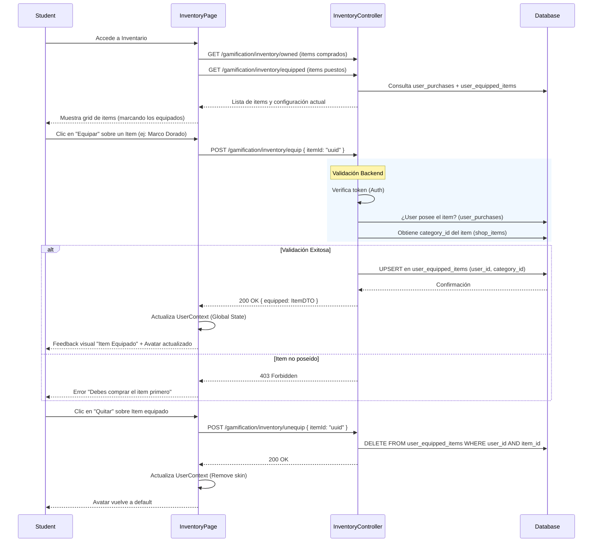

# Flujo Student - Personalización de Avatar (Skins)

**Version:** 1.1.0
**Fecha:** 2026-02-18
**Estado:** Parcialmente Implementado (Header/Dropdown integrados; Perfil pendiente)

---

## Resumen

Este flujo describe cómo un estudiante equipa items cosméticos (skins, marcos, fondos) que ha adquirido previamente en la tienda. La personalización se refleja inmediatamente en su avatar visible en toda la plataforma.

## Reglas de Negocio

1.  **Pre-requisito de Propiedad:** El usuario solo puede equipar items que posee (registrados en `user_purchases` con estado `completed`).
2.  **Exclusividad por Categoría:** Solo se puede tener equipado **un ítem por categoría** a la vez (ej: 1 solo marco, 1 solo fondo).
    *   Al equipar un nuevo ítem de una categoría, se reemplaza automáticamente el anterior.
3.  **Desequipamiento:** El usuario puede desequipar un ítem, volviendo al estado "default" (null) para esa categoría.
4.  **Persistencia:** La configuración se guarda en base de datos y persiste entre sesiones.
5.  **Visibilidad Global:** Los items equipados deben ser devueltos en el perfil público y en el contexto de sesión (`/auth/profile`) para que el Frontend pueda renderizarlos en el header, leaderboards y posts.

## Diagrama de Proceso

## Trazabilidad Técnica

### Frontend (Impacto)
- **Pages:** `apps/student/pages/InventoryPage.tsx` (Botón Equipar/Quitar implementado).
- **Hooks:** `useEquipment` (`features/gamification/social/hooks/useEquipment.ts`) — React Query hook con equip/unequip mutations e invalidación de cache.
- **Components:** `AvatarDisplay` (`shared/components/AvatarDisplay.tsx`) — Componente reutilizable que recibe `src`, `frameColor`, `size`. Integrado en `GamifiedHeader` y dropdown de usuario.

### Backend (Impacto)
- **Controller:** `InventoryController` (Nuevos endpoints).
- **Service:** `InventoryService` (Lógica de negocio).
- **Entity:** `UserEquippedItem`.

### Datos (Nuevo Modelo)
- **Tabla:** `gamification_system.user_equipped_items`
- **Columnas:** `user_id`, `category_id`, `item_id`, `equipped_at`.
- **Constraint:** `UNIQUE (user_id, category_id)`.

---

## Escenarios de Error

| Escenario | Respuesta HTTP | Mensaje Usuario |
| :--- | :--- | :--- |
| Item no existe | 404 Not Found | "El item no existe." |
| Usuario no compró el item | 403 Forbidden | "No tienes este item en tu inventario." |
| Item es consumible (no equipable) | 400 Bad Request | "Este item no se puede equipar." |
