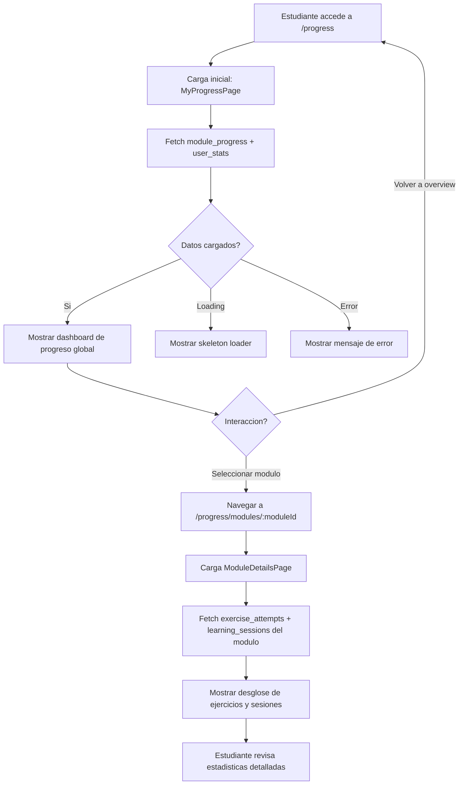

# FL-STU-16 - Progreso Academico

**ID:** FL-STU-16
**Version:** 1.0.0
**Fecha:** 2026-02-17
**Estado:** Activo
**Portal:** Student
**Prioridad:** P1

---

## 1. Resumen

Flujo de consulta del progreso academico detallado desde el portal Student. El estudiante accede a su dashboard de progreso global donde visualiza el avance por modulo educativo (literal, inferencial, critica, reorganizativa, apreciativa), porcentajes de completitud, ejercicios resueltos y pendientes. Puede seleccionar un modulo especifico para ver el desglose detallado con tasas de completitud por tipo de ejercicio, historial de intentos y sesiones de aprendizaje. Los datos provienen del schema progress_tracking con consultas filtradas por RLS de tenant.

---

## 2. Precondiciones

- Usuario autenticado con rol `student`.
- Sesion activa con JWT valido.
- Tenant asignado (multi-tenancy RLS activo).
- Al menos un ejercicio intentado (para datos significativos en el dashboard).
- Modulos educativos configurados por el administrador.

---

## 3. Diagrama Mermaid



---

## 4. Secuencia FE -> BE -> DB

```
=== Carga inicial - Dashboard de progreso ===
1. FE: MyProgressPage monta -> solicita progreso global
2. FE: GET /api/v1/progress/modules (progreso por modulo)
3. BE: ModuleProgressController.findAll() -> ModuleProgressService.getStudentProgress()
4. DB: SELECT FROM progress_tracking.module_progress WHERE user_id = :userId (RLS)
5. BE: Retorna array de { moduleId, moduleName, completionRate, exercisesCompleted, totalExercises }
6. FE: Renderiza cards por modulo con barras de progreso

=== Detalle de modulo especifico ===
7. FE: Estudiante hace click en modulo -> navega a /progress/modules/:moduleId
8. FE: ModuleDetailsPage monta -> solicita detalle
9. FE: GET /api/v1/progress/modules/:moduleId/attempts
10. BE: ExerciseAttemptController.findByModule() -> ExerciseAttemptService.getModuleAttempts()
11. DB: SELECT FROM progress_tracking.exercise_attempts WHERE module_id = :moduleId AND user_id = :userId
12. FE: GET /api/v1/progress/sessions?moduleId=:moduleId
13. BE: LearningSessionController -> LearningSessionService.getByModule()
14. DB: SELECT FROM progress_tracking.learning_sessions WHERE module_id = :moduleId AND user_id = :userId
15. FE: Renderiza tabla de intentos, graficas de sesiones, tasas de completitud
```

---

## 5. Componentes y artefactos implicados

### Frontend

| Tipo | Archivo |
|------|---------|
| Pagina progreso global | `apps/frontend/src/apps/student/pages/MyProgressPage.tsx` |
| Pagina detalle modulo | `apps/frontend/src/apps/student/pages/ModuleDetailsPage.tsx` |
| API progress | `apps/frontend/src/services/api/progress/progressAPI.ts` |
| Rutas | `apps/frontend/src/App.tsx` (rutas: `/progress`, `/progress/modules/:moduleId`) |

### Backend

| Tipo | Archivo |
|------|---------|
| Controller progreso | `apps/backend/src/modules/progress/controllers/module-progress.controller.ts` |
| Controller intentos | `apps/backend/src/modules/progress/controllers/exercise-attempt.controller.ts` |
| Service progreso | `apps/backend/src/modules/progress/services/module-progress.service.ts` |
| Service intentos | `apps/backend/src/modules/progress/services/exercise-attempt.service.ts` |
| Guard JWT | `apps/backend/src/modules/auth/guards/jwt-auth.guard.ts` |

### Base de Datos

| Tipo | Archivo |
|------|---------|
| Tabla module_progress | `apps/database/ddl/schemas/progress_tracking/tables/01-module_progress.sql` |
| Tabla exercise_attempts | `apps/database/ddl/schemas/progress_tracking/tables/02-exercise_attempts.sql` |
| Tabla learning_sessions | `apps/database/ddl/schemas/progress_tracking/tables/04-learning_sessions.sql` |

---

## 6. Reglas y validaciones

| Regla | Capa | Descripcion |
|-------|------|-------------|
| Autenticacion requerida | BE | JwtAuthGuard en todos los endpoints de progreso |
| Solo progreso propio | BE | userId extraido del JWT, no parametrizable por el estudiante |
| RLS por tenant | DB | Datos filtrados automaticamente por tenant_id |
| Modulo debe existir | BE | Valida que moduleId corresponda a un modulo activo |
| Porcentaje 0-100 | FE + BE | completionRate siempre entre 0 y 100 |
| Ordenamiento por fecha | BE | Intentos ordenados por created_at DESC por defecto |

---

## 7. Manejo de errores

| Escenario | Capa | Codigo HTTP | Comportamiento |
|-----------|------|-------------|----------------|
| Token JWT expirado | BE | 401 | Redirige a login |
| Modulo no encontrado | BE | 404 | NotFoundException, FE muestra mensaje informativo |
| Sin datos de progreso | FE | 200 | Muestra estado vacio "Aun no tienes progreso registrado" |
| Error de red | FE | N/A | Muestra error con boton de reintentar |
| moduleId invalido (no UUID) | BE | 400 | BadRequestException con mensaje de validacion |

---

## 8. Trazabilidad cruzada

| Capa | Archivo | Evidencia |
|------|---------|-----------|
| Frontend Pagina | `apps/frontend/src/apps/student/pages/MyProgressPage.tsx` | Dashboard global de progreso |
| Frontend Pagina | `apps/frontend/src/apps/student/pages/ModuleDetailsPage.tsx` | Detalle por modulo |
| Backend Controller | `apps/backend/src/modules/progress/controllers/module-progress.controller.ts` | GET progreso por modulo |
| Backend Controller | `apps/backend/src/modules/progress/controllers/exercise-attempt.controller.ts` | GET intentos de ejercicio |
| DDL module_progress | `apps/database/ddl/schemas/progress_tracking/tables/01-module_progress.sql` | Tabla de progreso por modulo |
| DDL exercise_attempts | `apps/database/ddl/schemas/progress_tracking/tables/02-exercise_attempts.sql` | Tabla de intentos |
| DDL learning_sessions | `apps/database/ddl/schemas/progress_tracking/tables/04-learning_sessions.sql` | Tabla de sesiones |

---

## 9. Referencias

- Guia portal estudiante: `docs/60-portals/student/PORTAL-STUDENT-GUIDE.md`
- Modelo datos progress_tracking: `docs/20-architecture/schema-reference/`
- ADR-016: Simplificar Backend XP Acumulacion (`docs/90-adr/ADR-016-simplificar-backend-xp-acumulacion.md`)
