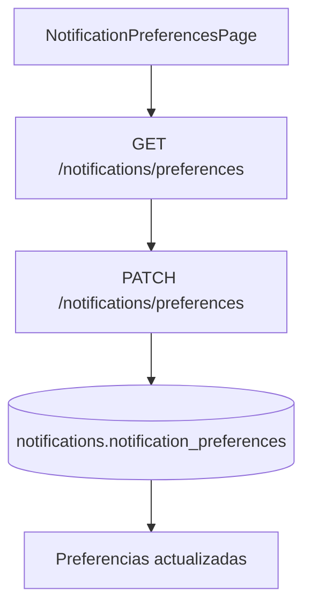

# Flujo Student - Settings Notificaciones

**Version:** 1.0.0  
**Fecha:** 2026-02-17  
**Estado:** Activo

---

## Resumen

Flujo para consultar y actualizar preferencias de notificaciones por canal.

## Diagrama Mermaid

## Trazabilidad

### Frontend
- `apps/frontend/src/apps/student/pages/NotificationPreferencesPage.tsx`
- `apps/frontend/src/services/api/notificationsAPI.ts`

### Backend
- `apps/backend/src/modules/notifications/controllers/preferences.controller.ts`
- `apps/backend/src/modules/notifications/services/preferences.service.ts`

### Datos
- `notifications.notification_preferences`
