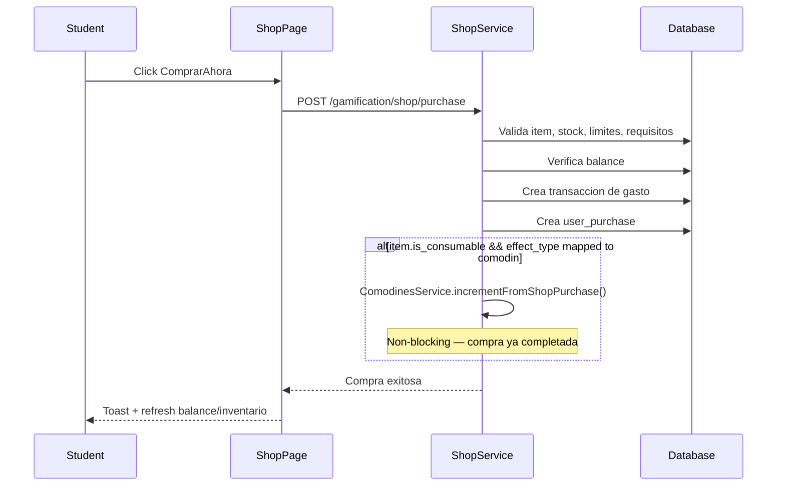

# Flujo Student - Tienda (Compra y Asignacion)

**Version:** 1.0.0  
**Fecha:** 2026-02-17  
**Estado:** Activo

---

## Resumen

Cubre la seleccion de item en tienda, validacion de requisitos/saldo, cobro en ML Coins y alta de compra para reflejo en inventario/personalizacion.

> Flujo maestro relacionado: `FLUJO-COMPRA-INVENTARIO-EQUIPAR.md`.

## Diagrama Mermaid

## Trazabilidad

### Frontend
- `apps/frontend/src/apps/student/pages/ShopPage.tsx` (Thin Shell, 235 lines post-refactor v10.0.0)
- `apps/frontend/src/features/gamification/economy/hooks/useShopData.ts` (React Query: items, categories, purchases)
- `apps/frontend/src/features/gamification/economy/hooks/useShopPurchase.ts` (mutation + cache invalidation)
- `apps/frontend/src/apps/student/components/shop/ShopItemCard.tsx` (item card + purchase trigger)
- `apps/frontend/src/apps/student/components/shop/PurchaseModal.tsx` (confirmation dialog)
- `apps/frontend/src/features/gamification/economy/api/shopAPI.ts`
- `apps/frontend/src/features/gamification/economy/store/economyStore.ts`

### Backend
- `apps/backend/src/modules/gamification/controllers/shop.controller.ts`
- `apps/backend/src/modules/gamification/services/shop.service.ts`
- `apps/backend/src/modules/gamification/services/ml-coins.service.ts`

### Datos
- `gamification_system.shop_items`
- `gamification_system.user_purchases`
- `gamification_system.ml_coins_transactions`
- `gamification_system.user_stats`

## Gap funcional a validar

- Cerrado por definición en flujo maestro E2E: `FLUJO-COMPRA-INVENTARIO-EQUIPAR.md`.

### Mapeo: Shop Effect Types → Comodines

Cuando un item consumible es comprado, su `effect_type` se mapea automáticamente a un tipo de comodín. Este mapeo está implementado en `SHOP_EFFECT_TO_COMODIN` en `shop.service.ts`.

| Shop effect_type | ComodinType | Descripcion |
|-----------------|-------------|-------------|
| `hint` | `pistas` | Pistas de ayuda en ejercicios |
| `highlight` | `vision_lectora` | Resaltado de palabras clave |
| `retry` | `segunda_oportunidad` | Segunda oportunidad de respuesta |

Otros effect_types (`xp_boost`, `coins_boost`) **NO** se sincronizan a comodines — activan un registro temporal en `gamification_system.active_boosts` via `BoostService.activateBoost()`. El boost anterior del mismo tipo se desactiva (`is_active=false`). Duracion basada en `duration_days` del item. Frontend muestra indicador en GamifiedHeader con multiplicador y tiempo restante.

### Re-compra de Consumibles

1. Usuario selecciona consumible ya comprado previamente
2. Sistema desactiva compra anterior (`is_active=false, consumed_at=NOW()`)
3. Sistema crea nueva compra activa (`status='completed', is_active=true`)
4. Bridge sincroniza inventario de comodines (incrementFromShopPurchase) — SOLO para effect_types mapeados
5. Usuario ve "Tienes: N" actualizado en la tarjeta del item

## Errores esperados de compra

| HTTP | Condicion | Accion UX |
|------|-----------|-----------|
| 400 | Saldo insuficiente o regla de negocio | Mostrar mensaje contextual + CTA recargar/ganar monedas |
| 404 | Item no encontrado | Refrescar catálogo y notificar indisponibilidad |
| 409 | Compra duplicada de item único activo / Conflicto concurrencia consumible | Mostrar estado ya adquirido / Reintentar compra tras 1-2 segundos |
| 500 | Error interno | Mostrar fallback y permitir reintento |
