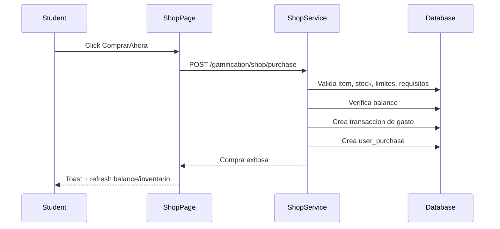

# Flujo Student - Tienda (Compra y Asignacion)

**Version:** 1.0.0  
**Fecha:** 2026-02-17  
**Estado:** Activo

---

## Resumen

Cubre la seleccion de item en tienda, validacion de requisitos/saldo, cobro en ML Coins y alta de compra para reflejo en inventario/personalizacion.

## Diagrama Mermaid

## Trazabilidad

### Frontend
- `apps/frontend/src/apps/student/pages/ShopPage.tsx` (`handlePurchase`, `confirmPurchase`)
- `apps/frontend/src/features/gamification/economy/api/shopAPI.ts`
- `apps/frontend/src/features/gamification/economy/store/economyStore.ts`

### Backend
- `apps/backend/src/modules/gamification/controllers/shop.controller.ts`
- `apps/backend/src/modules/gamification/services/shop.service.ts`
- `apps/backend/src/modules/gamification/services/ml-coins.service.ts`

### Datos
- `gamification_system.shop_items`
- `gamification_system.user_purchases`
- `gamification_system.ml_coins_transactions`
- `gamification_system.user_stats`

## Gap funcional a validar

- Verificar que la compra no solo descuente coins, sino que el item quede aplicado en inventario/estado consumible del usuario en todos los casos.
