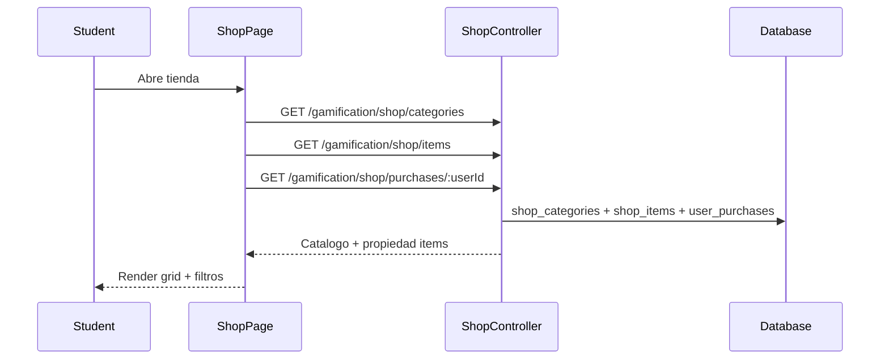

# Flujo Student - Tienda (Overview y Catalogo)

**Version:** 1.0.0  
**Fecha:** 2026-02-17  
**Estado:** Activo

---

## Resumen

Flujo para navegar el catalogo de la tienda, aplicar filtros, visualizar detalle de items y validar propiedad del usuario.

## Diagrama Mermaid

## Trazabilidad

### Frontend
- `apps/frontend/src/apps/student/pages/ShopPage.tsx`
- `apps/frontend/src/features/gamification/economy/api/shopAPI.ts`

### Backend
- `apps/backend/src/modules/gamification/controllers/shop.controller.ts`
- `apps/backend/src/modules/gamification/services/shop.service.ts`

### Datos
- `gamification_system.shop_categories`
- `gamification_system.shop_items`
- `gamification_system.user_purchases`
