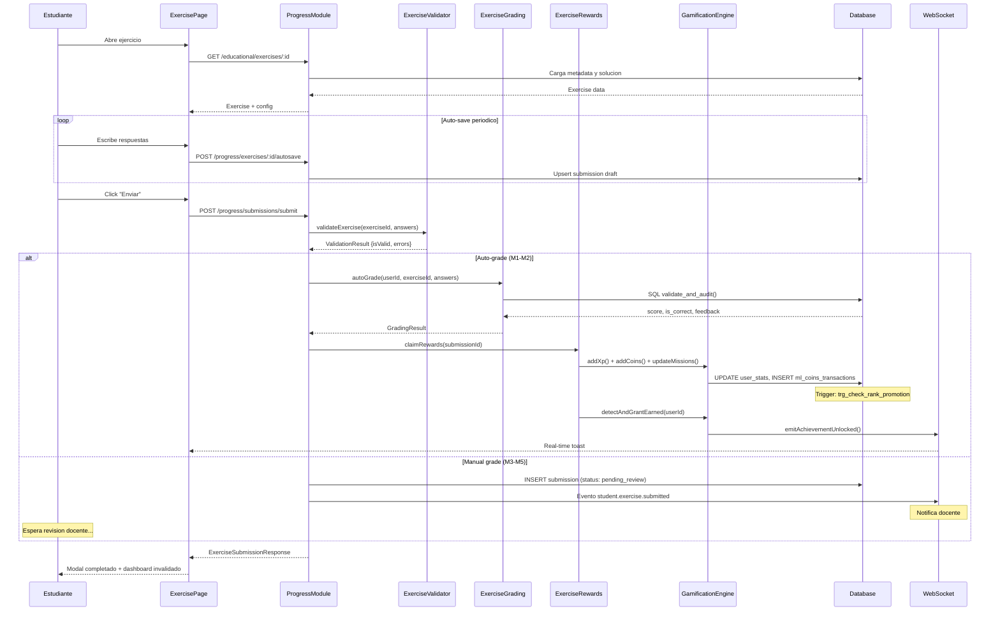

# FL-SYS-02: Exercise Submission Pipeline

**Version:** 1.0.0
**Fecha:** 2026-02-27
**Estado:** Activo

---

## Descripcion

Pipeline completo para el envio de ejercicios por parte del estudiante. El sistema soporta dos arquitecturas de calificacion segun el tipo de ejercicio: auto-grading (Modulos 1-2, ejercicios autocorregibles) y manual grading (Modulos 3-5, requieren revision docente). Los ejercicios auto-graded pasan por la funcion SQL `validate_and_audit()` o validadores TypeScript especializados (rueda_inferencias, quiz_tiktok). Los ejercicios manual-graded se encolan para revision docente con notificacion via evento `student.exercise.submitted`.

Tras la calificacion, el pipeline distribuye recompensas: XP via `UserStatsService`, ML Coins via `MLCoinsService` (con pessimistic locking), actualiza progreso de misiones, detecta achievements automaticamente, y actualiza leaderboards con cache Redis de 60 segundos.

## Actores

- **Estudiante**: Completa y envia el ejercicio desde ExercisePage
- **Sistema (Auto-Grading)**: Califica automaticamente ejercicios M1-M2 via SQL o TypeScript
- **Docente (Manual Grading)**: Revisa y califica ejercicios M3-M5 desde portal maestro
- **Gamification Engine**: Distribuye XP, ML Coins, detecta achievements, actualiza leaderboards

## Precondiciones

- Estudiante autenticado con JWT valido (req.user.id = profiles.id)
- Ejercicio asignado y no completado previamente (guard en ExercisePage)
- ExerciseContext cargado con datos del ejercicio y progreso
- Auto-save activo durante la sesion (POST /progress/exercises/:id/autosave)

## Flujo Principal

1. **Estudiante abre ejercicio**: Frontend carga ExercisePage (thin shell) → ExerciseProvider compone hooks (useExerciseData, useExerciseProgress, useExerciseComodines)
2. **Carga de datos**: `GET /educational/exercises/:id` obtiene metadata, configuracion, y solucion del ejercicio
3. **Progreso guardado**: Durante la resolucion, `POST /progress/exercises/:exerciseId/autosave` guarda respuestas parciales periodicamente (partial_answers, time_spent_seconds, metadata)
4. **Envio del ejercicio**:
   - **M1-M2 (auto-grade)**: Frontend envia via ExerciseAttemptService (multiples intentos permitidos)
   - **M3-M5 (manual grade)**: Frontend envia `POST /progress/submissions/submit` con userId, exerciseId, answers
5. **Validacion backend**:
   - `ExerciseValidatorService.validateExercise()` verifica estructura de respuestas segun tipo
   - Validaciones especificas: diario_multimedia (min 150 palabras), comic_digital (min 4 paneles), video_carta (URL + min 30s duracion), verificador_fake_news (min 3 claims), etc.
   - `ExerciseAnswerValidator.validate()` centralizada para todos los tipos
   - Anti-redundancia para completar_espacios (espacios 5 y 6 deben ser diferentes)
6. **Calificacion**:
   - **Auto-grade path**: `ExerciseGradingService.autoGrade()` → SQL `validate_and_audit()` o TypeScript custom (rueda_inferencias, quiz_tiktok)
   - **Manual grade path**: Submission queda en status `pending_review` → evento `student.exercise.submitted` notifica al docente → docente califica via `POST /submissions/:id/grade` con GradeSubmissionDto
7. **Distribucion de recompensas** (`ExerciseRewardsService.claimRewards()`):
   - Calculo de XP base: `(percentage / 100) * 10 * 10`, multiplicado por: dificultad (1.0x-2.0x), perfect score (1.5x), sin hints (1.2x), primer intento (1.1x)
   - XP via `UserStatsService.addXp()` → trigger DB `trg_check_rank_promotion_on_xp_gain` verifica promocion de rango automaticamente
   - ML Coins via `MLCoinsService.addCoins()` con pessimistic locking (base 5 + 3 bonus perfecto, multiplicado por dificultad)
   - ML Coins netos: ganados - gastados en comodines
8. **Post-recompensas**:
   - `MissionsService`: Actualiza progreso de misiones diarias (complete_exercises, earn_xp) y semanales (exercise_marathon)
   - `AchievementsService.detectAndGrantEarned()`: Evalua 18 condition types contra perfil actualizado (exercise_completion, streak, module_completion, perfect_score, social, etc.)
   - WebSocket `emitAchievementUnlocked()` para toast en tiempo real
   - Notificacion in-app persistida en DB
   - Cron de auto-reconciliacion (cada 5 min) reclama recompensas no reclamadas manualmente
9. **Actualizacion de UI**: Frontend invalida cache React Query → dashboard actualizado con nuevo score, XP, ML Coins

## Flujos Alternativos

### Auto-Save Recovery
- Si el estudiante cierra el navegador, `GET /progress/exercises/:exerciseId/autosave` recupera progreso guardado al recargar
- Retorna null (200 OK) si es primera vez

### Ejercicio Ya Completado
- ExercisePage verifica `exercise.completed === true` al cargar
- Muestra `ExerciseCompletedState` con boton "Volver al Modulo" en lugar de la mecanica
- ModuleDetailPage deshabilita boton con texto "Ejercicio Completado" y gradiente verde

### Double Submit Prevention
- Guard frontend previene envio multiple
- Backend idempotency check previene duplicados
- Submission con status `graded` no puede recalificarse (`BadRequestException: Submission already graded`)

### Calificacion Manual con Score Explícito
- Docente puede proveer `final_score` y `feedback` en GradeSubmissionDto
- Si `final_score` presente → calificacion manual (grader_id del JWT)
- Si `final_score` ausente → auto-grading ejecutado

### Rate Limiting de Achievements
- Maximo 20 achievements por minuto por usuario (RF-GAM-001)
- Cache en memoria con ventana deslizante de 1 minuto
- Si excedido, retorna registro existente sin otorgar nuevo

## Diagrama

## Postcondiciones

- Submission persistida en `progress_tracking.exercise_submissions` con score, status, rewards
- `gamification_system.user_stats` actualizado: total_xp, ml_coins, exercises_completed
- `gamification_system.ml_coins_transactions` con registro atomico (pessimistic lock)
- Misiones diarias/semanales actualizadas si aplica
- Achievements detectados y otorgados automaticamente
- Leaderboard cache invalidado (TTL 60s)
- Progress snapshot actualizado

## Endpoints Involucrados

| Metodo | Ruta | Descripcion |
|--------|------|-------------|
| GET | /api/v1/educational/exercises/:id | Obtener metadata del ejercicio |
| POST | /api/v1/progress/exercises/:exerciseId/autosave | Auto-guardar progreso parcial |
| GET | /api/v1/progress/exercises/:exerciseId/autosave | Recuperar progreso guardado |
| POST | /api/v1/progress/submissions/submit | Enviar ejercicio (M3-M5 manual) |
| POST | /api/v1/progress/submissions | Crear submission record |
| POST | /api/v1/progress/submissions/:id/grade | Calificar submission [Teacher] |
| POST | /api/v1/progress/submissions/:id/feedback | Proveer feedback [Teacher] |
| POST | /api/v1/progress/submissions/:id/claim-rewards | Reclamar recompensas |
| PATCH | /api/v1/progress/submissions/:id/status | Actualizar status |
| GET | /api/v1/progress/submissions/pending-review | Envios pendientes [Teacher] |
| GET | /api/v1/progress/submissions/users/:userId | Envios por usuario |
| GET | /api/v1/progress/submissions/users/:userId/stats | Estadisticas de envios |

## Trazabilidad

### Frontend
- `apps/frontend/src/apps/student/pages/ExercisePage.tsx` (thin shell)
- `apps/frontend/src/features/exercises/context/ExerciseContext.tsx` (state management)
- `apps/frontend/src/features/exercises/hooks/useExerciseData.ts`
- `apps/frontend/src/features/exercises/hooks/useExerciseProgress.ts`
- `apps/frontend/src/features/exercises/hooks/useExerciseComodines.ts`
- `apps/frontend/src/features/exercises/registry/registrations.ts` (30 mecanicas)
- `apps/frontend/src/services/api/educationalAPI.ts`

### Backend
- `apps/backend/src/modules/progress/controllers/exercise-submission.controller.ts`
- `apps/backend/src/modules/progress/services/exercise-submission.service.ts`
- `apps/backend/src/modules/progress/services/grading/exercise-grading.service.ts`
- `apps/backend/src/modules/progress/services/grading/exercise-rewards.service.ts`
- `apps/backend/src/modules/progress/services/validators/exercise-validator.service.ts`
- `apps/backend/src/modules/progress/events/exercise-submission.event.ts`

### Datos
- `progress_tracking.exercise_submissions` (submissions con score, status, rewards)
- `progress_tracking.exercise_attempts` (intentos para auto-grade)
- `gamification_system.user_stats` (XP, level, rank, coins)
- `gamification_system.ml_coins_transactions` (historial de transacciones)
- `gamification_system.user_achievements` (logros otorgados)
- `gamification_system.missions` (misiones diarias/semanales)

## Reglas y Validaciones

- Ejercicios M3-M5 (requires_manual_grading=true) van por ExerciseSubmissionService; M1-M2 por ExerciseAttemptService
- Score minimo para aprobar: 60% del max_score (manual grade threshold)
- Recompensas solo se pueden reclamar una vez (`rewards_claimed` flag)
- Submission ya calificada no puede recalificarse
- Calificacion manual requiere rol `admin_teacher` o `super_admin`
- OTP de comodines validados via `/gamification/comodines/inventory/:userId`
- Anti-redundancia en completar_espacios (ejercicio 1.3, espacios 5-6)

## Manejo de Errores

| Escenario | Capa | Comportamiento |
|-----------|------|----------------|
| Ejercicio no encontrado | BE | NotFoundException, 404 |
| Respuestas invalidas (estructura) | BE/VAL | BadRequestException con detalle |
| Diario < 150 palabras | BE | BadRequestException con conteo actual |
| Comic < 4 paneles | BE | BadRequestException con conteo |
| Video sin URL | BE | BadRequestException |
| Submission ya calificada | BE | BadRequestException: "already graded" |
| Recompensas ya reclamadas | BE | BadRequestException: "already claimed" |
| SQL validate_and_audit falla | BE/DB | InternalServerErrorException con rollback |
| Rate limit achievements (>20/min) | BE | Skip silencioso, retorna existente |
| Profile no encontrado (JWT) | BE | NotFoundException |
| Balance ML Coins insuficiente (comodines) | BE | BadRequestException con balance disponible |

## Referencias

- Flujo estudiante: [FLUJO-EJERCICIO-COMPLETO.md](../student/FLUJO-EJERCICIO-COMPLETO.md)
- Flujo M3-M5: [FLUJO-EJERCICIO-M3-M5.md](../student/FLUJO-EJERCICIO-M3-M5.md)
- Flujo logros: [FLUJO-LOGROS-MISIONES-CLAIM.md](../student/FLUJO-LOGROS-MISIONES-CLAIM.md)
