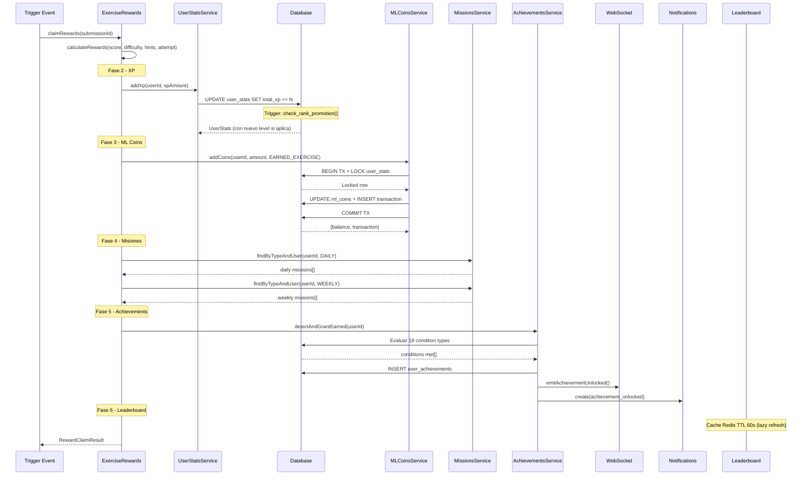

# FL-SYS-03: Gamification Reward Chain

**Version:** 1.0.0
**Fecha:** 2026-02-27
**Estado:** Activo

---

## Descripcion

Cadena completa de recompensas del sistema de gamificacion, desde el evento trigger hasta la actualizacion de UI en tiempo real. El sistema integra 6 subsistemas: XP/Niveles (formula cuadratica sincronizada con DB), Rangos Maya (5 rangos con promocion via trigger DB), ML Coins (economia virtual con pessimistic locking y multiplicadores por rango 1.0x-2.0x), Achievements (18 condition types con auto-deteccion), Misiones (diarias/semanales con claim atómico via SQL), y Leaderboards (global/escuela/aula/amigos con cache Redis 60s).

La cadena se activa tras eventos como completar ejercicio, login diario, compra en tienda, o actividad social. Cada etapa es independiente con manejo de errores aislado (try/catch per subsystem), garantizando que un fallo en achievements no bloquee la distribucion de XP.

## Actores

- **Trigger Event**: Accion del usuario que inicia la cadena (ejercicio completado, login, compra)
- **ExerciseRewardsService**: Orquesta calculo y distribucion de recompensas post-ejercicio
- **UserStatsService**: Gestiona XP, niveles, y estadisticas del usuario
- **MLCoinsService**: Economia virtual con transacciones atomicas
- **RankMultiplierService**: Calcula multiplicadores basados en rango maya (1.0x-2.0x)
- **AchievementsService**: Deteccion y otorgamiento automatico de logros (18 condition types)
- **MissionsService**: Progreso de misiones diarias y semanales
- **LeaderboardService**: Rankings con cache Redis
- **NotificationService**: Notificaciones in-app persistidas
- **WebSocketService**: Eventos en tiempo real (toasts, balance updates)

## Precondiciones

- Usuario con perfil activo y `user_stats` inicializado (se auto-crea si no existe)
- Evento trigger valido (ejercicio calificado con `is_correct=true`, status `graded`)
- Recompensas no reclamadas previamente (`rewards_claimed=false`)

## Flujo Principal

### Fase 1: Calculo de Recompensas

1. **Evento trigger**: Ejercicio completado y calificado (`ExerciseRewardsService.claimRewards()`)
2. **Obtener submission y ejercicio**: Validar que existe, no reclamado, correcto, y calificado
3. **Calcular recompensas** (`calculateRewards()`):
   - **XP Base**: `round((score / maxScore) * 100)` puntos
   - **ML Coins Base**: 5 por ejercicio completado
   - **Multiplicador dificultad**: easy=1.0x, medium=1.25x, hard=1.5x, expert=2.0x
   - **Bonus perfect score**: 1.5x XP + 3 ML Coins extra (si score=maxScore y sin hints)
   - **Bonus sin hints**: 1.2x XP (si hint_used=false y hints_count=0)
   - **Bonus primer intento**: 1.1x XP (si attempt_number=1)
   - **ML Coins netos**: max(0, ganados - ml_coins_spent en comodines)

### Fase 2: Distribucion de XP

4. **Agregar XP** (`UserStatsService.addXp(userId, xpAmount)`):
   - Resuelve auth.users.id → profiles.id via `resolveProfileId()`
   - Acumula XP en `user_stats.total_xp`
   - `userStatsRepo.save(stats)` dispara trigger AFTER UPDATE automaticamente
5. **Trigger DB**: `trg_check_rank_promotion_on_xp_gain`
   - Verifica si XP alcanza umbral del siguiente rango
   - Llama `check_rank_promotion()` → `promote_to_next_rank()` si corresponde
   - Actualiza `current_rank`, otorga ML Coins bonus de promocion
6. **Calculo de nivel**: Formula cuadratica sincronizada DB/Backend:
   - DB: `FLOOR(SQRT(XP / 100)) + 1`
   - Backend: `XP = 100 * (nivel - 1)^2`
   - Nivel 1=0XP, 2=100XP, 3=400XP, 4=900XP, 5=1600XP

### Fase 3: Distribucion de ML Coins

7. **Agregar ML Coins** (`MLCoinsService.addCoins()`):
   - Ejecuta dentro de `dataSource.transaction()` con `pessimistic_write` lock
   - Obtiene lock exclusivo en fila `user_stats` del usuario
   - Calcula `balanceBefore` y `balanceAfter`
   - Actualiza `ml_coins`, `ml_coins_earned_total`, `ml_coins_earned_today`
   - Reset diario automatico si han pasado 24h desde `last_ml_coins_reset`
   - Crea registro en `ml_coins_transactions` (tipo, balance before/after, multiplier, reference)
   - Todo atomico: si falla cualquier paso, rollback completo

### Fase 4: Actualizacion de Misiones

8. **Progreso de misiones** (`ExerciseRewardsService.updateMissionProgress()`):
   - Obtiene misiones diarias del usuario (`MissionsService.findByTypeAndUser(userId, DAILY)`)
   - Verifica objectives: `complete_exercises`, `earn_xp`
   - Obtiene misiones semanales (`findByTypeAndUser(userId, WEEKLY)`)
   - Verifica objectives: `complete_exercises`, `exercise_marathon`
   - Registra IDs de misiones progresadas (deduplicados)

### Fase 5: Deteccion de Achievements

9. **Auto-deteccion** (`AchievementsService.detectAndGrantEarned(userId)`):
   - Obtiene `user_stats` actualizado del usuario
   - Obtiene todos los achievements activos (incluidos secretos)
   - Para cada achievement no completado, evalua condiciones (`meetsConditions()`):
     - `exercise_completion`: `exercises_completed >= N`
     - `streak`: `current_streak >= consecutive_days`
     - `module_completion`: Query a `progress_tracking.module_progress` por module_code
     - `all_modules_completion`: `modules_completed >= N` con score promedio minimo
     - `perfect_score`: `perfect_scores >= N`
     - `social`: Query a `social_features.classroom_members` y `friendships`
     - `special`: Primer login detection
     - `module_first_exercise`: Query cross-schema submissions por modulo
     - `exercise_score`: Max score por tipo de ejercicio
     - `exercise_repetition`: Count completions por tipo con score minimo
     - `exercise_speed`: Completar en tiempo limite con score minimo
     - `content_analysis`: Alias de exercise_repetition para analisis
     - `module_average_score`: Promedio de score por modulo
     - Legacy: `progress`, `level`, `score`, `rank`, `ml_coins`
10. **Rate limiting**: Maximo 20 achievements por minuto por usuario (in-memory Map)

### Fase 6: Notificaciones y Real-time

11. **Achievement unlocked notification**:
    - WebSocket `emitAchievementUnlocked()`: Toast en tiempo real con titulo, descripcion, icono
    - In-app notification: `NotificationService.create()` con tipo `achievement_unlocked`, prioridad `high` si legendary
    - Balance update via WebSocket (`GAP-LOW-003`)
12. **Leaderboard update**: Cache Redis TTL 60s → se refresca en siguiente request
13. **Frontend update**: React Query invalidation → dashboard, perfil, tienda actualizados

## Flujos Alternativos

### Rank Promotion (Evento especial)
- Trigger DB `trg_check_rank_promotion_on_xp_gain` detecta que XP supera umbral
- Ejecuta `promote_to_next_rank()` en DB
- Actualiza `current_rank` de Ajaw → Nacom → Ah K'in → Halach Uinic → K'uk'ulkan
- Otorga bonus ML Coins de promocion
- Multiplicadores ML Coins aumentan: 1.0x → 1.25x → 1.5x → 1.75x → 2.0x

### Claim de Achievement via SQL Atomico
- `AchievementsService.claimRewards(userId, achievementId)`
- Llama funcion SQL `gamification_system.claim_achievement_reward(userId, achievementId)`
- Valida completado + no reclamado → distribuye XP + ML Coins → registra transaccion
- Todo atomico en una sola llamada SQL

### Compra en Tienda
- `MLCoinsService.spendCoins()` con pessimistic locking
- Valida balance suficiente (`ml_coins >= amount`)
- Registra transaccion negativa
- Si balance insuficiente: `BadRequestException` con balance actual
- Post-transacción: Si `item.is_consumable && effect_data.type ∈ {hint, highlight, retry}`: `ComodinesService.incrementFromShopPurchase()` sincroniza al inventario de comodines (non-blocking, `source: 'shop_bridge'`)

### Cron Auto-Reconciliacion
- Cada 5 minutos: busca submissions calificadas con `rewards_claimed=false`
- Reclama recompensas automaticamente
- Previene recompensas perdidas por errores de red o UI

## Diagrama

## Postcondiciones

- `user_stats.total_xp` incrementado con XP calculado
- `user_stats.level` recalculado por formula cuadratica
- `user_stats.current_rank` potencialmente promovido (via trigger DB)
- `user_stats.ml_coins` incrementado (neto de gastos en comodines)
- `ml_coins_transactions` con registro atomico de cada movimiento
- `user_achievements` actualizados con nuevos logros detectados
- Misiones diarias/semanales con progreso actualizado
- Leaderboard cache marcado para refresh (TTL 60s)
- Notificaciones push/in-app enviadas si aplica
- `exercise_submissions.rewards_claimed = true`

## Endpoints Involucrados

| Metodo | Ruta | Descripcion |
|--------|------|-------------|
| POST | /api/v1/progress/submissions/:id/claim-rewards | Reclamar recompensas de submission |
| GET | /api/v1/gamification/users/:userId/summary | Resumen gamificacion del usuario |
| GET | /api/v1/gamification/users/:userId/stats | Estadisticas del usuario |
| POST | /api/v1/gamification/achievements/claim | Reclamar recompensas de achievement |
| GET | /api/v1/gamification/achievements/user/:userId | Logros del usuario |
| GET | /api/v1/gamification/leaderboard/global | Leaderboard global |
| GET | /api/v1/gamification/leaderboard/school/:schoolId | Leaderboard por escuela |
| GET | /api/v1/gamification/leaderboard/classroom/:classroomId | Leaderboard por aula |
| GET | /api/v1/gamification/leaderboard/friends/:userId | Leaderboard de amigos |
| GET | /api/v1/gamification/leaderboard/user/:userId/position | Posicion del usuario |
| GET | /api/v1/gamification/ml-coins/balance/:userId | Balance ML Coins |
| GET | /api/v1/gamification/ml-coins/stats/:userId | Estadisticas ML Coins |
| GET | /api/v1/gamification/ml-coins/transactions/:userId | Historial transacciones |
| GET | /api/v1/gamification/missions/user/:userId | Misiones del usuario |

## Trazabilidad

### Backend
- `apps/backend/src/modules/progress/services/grading/exercise-rewards.service.ts` (orquestador)
- `apps/backend/src/modules/gamification/services/user-stats.service.ts` (XP y niveles)
- `apps/backend/src/modules/gamification/services/ml-coins.service.ts` (economia virtual)
- `apps/backend/src/modules/gamification/services/rank-multiplier.service.ts` (multiplicadores)
- `apps/backend/src/modules/gamification/services/achievements.service.ts` (logros)
- `apps/backend/src/modules/gamification/services/missions.service.ts` (misiones)
- `apps/backend/src/modules/gamification/services/leaderboard.service.ts` (rankings)
- `apps/backend/src/modules/gamification/errors/gamification.errors.ts` (17 domain errors)
- `apps/backend/src/modules/websocket/websocket.service.ts` (real-time)
- `apps/backend/src/modules/notifications/services/notification.service.ts`

### Datos
- `gamification_system.user_stats` (XP, level, rank, coins, streak, exercises_completed)
- `gamification_system.ml_coins_transactions` (historial atomico de movimientos)
- `gamification_system.achievements` (definiciones de logros)
- `gamification_system.user_achievements` (logros otorgados con progress)
- `gamification_system.missions` (misiones activas)
- `gamification_system.maya_ranks` (definiciones de rangos)
- `gamification_system.leaderboard_metadata` (config de rankings)

### Database Functions/Triggers
- `gamification_system.calculate_level_from_xp()` — formula cuadratica
- `gamification_system.check_rank_promotion()` — verificacion de umbral
- `gamification_system.promote_to_next_rank()` — promocion automatica
- `gamification_system.claim_achievement_reward()` — claim atomico SQL
- Trigger: `trg_check_rank_promotion_on_xp_gain` — AFTER UPDATE on user_stats

## Reglas y Validaciones

- XP solo positivo (amount > 0), acumulativo
- ML Coins con pessimistic locking para prevenir race conditions
- Reset diario automatico de `ml_coins_earned_today` cada 24h
- Rate limit achievements: 20/min por usuario (in-memory)
- Achievements no repetibles no se re-otorgan si ya completados
- Multiplicador rango: Ajaw=1.0x, Nacom=1.25x, Ah K'in=1.5x, Halach Uinic=1.75x, K'uk'ulkan=2.0x
- Formula nivel: `FLOOR(SQRT(XP / 100)) + 1` (sincronizada DB/Backend)
- Leaderboard cache: 60s para global/school/friends, 5min para posicion usuario

## Manejo de Errores

| Escenario | Capa | Comportamiento |
|-----------|------|----------------|
| User stats no encontrado | BE | ProfileNotFoundError / UserStatsNotFoundError (auto-create si via summary) |
| Submission no encontrada | BE | NotFoundException |
| Recompensas ya reclamadas | BE | BadRequestException: "already claimed" |
| Submission incorrecta o sin calificar | BE | BadRequestException |
| Fallo addXp | BE | Error aislado (try/catch), no bloquea coins |
| Fallo addCoins | BE | Error aislado, transaccion rollback atomico |
| Fallo missions update | BE | Warning log, no bloquea rewards |
| Fallo achievement detection | BE | Error aislado, no bloquea pipeline |
| Balance insuficiente (spend) | BE | BadRequestException con balance actual |
| Campo no numerico en incrementField | BE | NonNumericFieldError |

## Referencias

- ADR-016: Sincronizacion de formulas XP DB/Backend
- Rangos Maya: `docs/01-fase-alcance-inicial/EAI-003-gamificacion/especificaciones/ET-GAM-003-rangos-maya.md`
- FL-SYS-02: [Exercise Submission Pipeline](FL-SYS-02-EXERCISE-SUBMISSION-PIPELINE.md)
