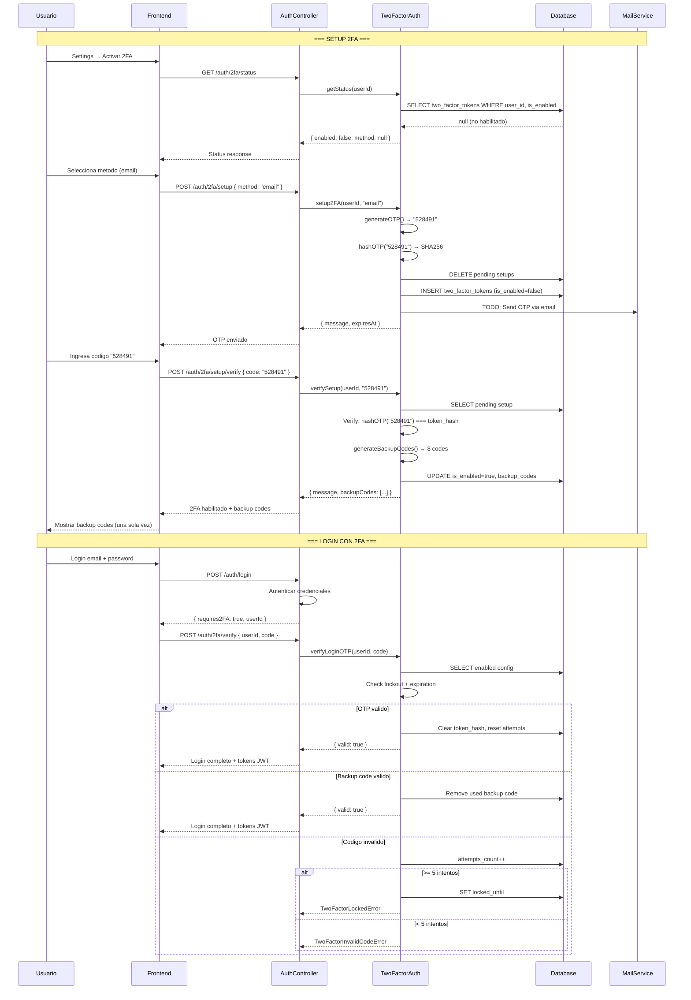

# FL-SYS-04: Two-Factor Authentication (2FA) Flow

**Version:** 1.0.0
**Fecha:** 2026-02-27
**Estado:** Activo

---

## Descripcion

Flujo completo de autenticacion en dos factores (2FA) implementado en el modulo auth. El sistema soporta tres metodos: email (OTP implementado), SMS (futuro), y authenticator/TOTP (futuro). Utiliza OTP de 6 digitos con hash SHA256 antes de almacenamiento, expiracion configurable de 10 minutos, maximo 5 intentos antes de lockout de 15 minutos, y 8 codigos de respaldo generados al activar 2FA. La entidad `TwoFactorToken` en schema `auth_management.two_factor_tokens` persiste la configuracion, tokens hasheados, y codigos de respaldo encriptados.

El flujo cubre: habilitacion de 2FA (setup + verificacion), login con 2FA (OTP + backup codes), deshabilitacion de 2FA, y reenvio de codigos con rate limiting (1 minuto entre reenvios).

## Actores

- **Usuario**: Habilita/deshabilita 2FA y proporciona codigos durante login
- **TwoFactorAuthService**: Genera OTP, valida codigos, gestiona backup codes
- **AuthController**: Expone endpoints 2FA bajo `/api/auth/2fa/*`
- **MailService**: Envia OTP via email (TODO: integracion completa con MailModule)
- **SecurityService**: Rate limiting de login (5 intentos/15 min por email)

## Precondiciones

- Usuario autenticado con JWT valido (para setup, status, disable)
- `TwoFactorToken` entity registrada en TypeORM con datasource `auth`
- Para login con 2FA: usuario ha completado setup previo (is_enabled=true, is_verified=true)

## Flujo Principal

### A. Habilitacion de 2FA (Setup)

1. **Verificar estado actual**: `GET /api/auth/2fa/status` → retorna `{ enabled: boolean, method: string | null }`
2. **Iniciar setup**: `POST /api/auth/2fa/setup` con `{ method: "email" | "sms" | "authenticator" }`
   - Verifica que no tenga 2FA ya habilitado (`TwoFactorAlreadyEnabledError` si existe)
   - Genera OTP de 6 digitos (`Math.floor(100000 + Math.random() * 900000)`)
   - Hash del OTP con SHA256 (`crypto.createHash('sha256').update(otp).digest('hex')`)
   - Elimina cualquier setup pendiente previo (is_enabled=false)
   - Crea registro `TwoFactorToken`: method, token_hash, expires_at (10 min), is_enabled=false, is_verified=false
   - TODO: Envia OTP via metodo configurado (MailModule integration)
   - Retorna `{ message: "Codigo enviado...", expiresAt: Date }`
3. **Verificar setup**: `POST /api/auth/2fa/setup/verify` con `{ code: "123456" }`
   - Busca config pendiente (is_enabled=false, is_verified=false)
   - Verifica lockout: `config.isLocked()` → compara `locked_until` con `Date.now()`
   - Verifica expiracion: `config.isExpired()` → compara `expires_at` con `Date.now()`, elimina si expirado
   - Hash del codigo recibido y compara con `token_hash`
   - Si codigo invalido:
     - Incrementa `attempts_count`
     - Si `attempts_count >= 5`: establece `locked_until` = now + 15 minutos
     - Lanza `TwoFactorInvalidCodeError`
   - Si codigo valido:
     - Establece `is_enabled=true`, `is_verified=true`, `verified_at=now()`
     - Limpia `token_hash` (OTP de setup ya usado)
     - Genera 8 codigos de respaldo: `crypto.randomBytes(4).toString('hex').toUpperCase()` (formato: 8 chars hex uppercase)
     - Almacena hashes SHA256 de backup codes en `backup_codes_encrypted` (JSON stringified array)
     - Retorna `{ message: "2FA habilitado", backupCodes: [...] }` — codigos en texto plano SOLO ESTA VEZ

### B. Login con 2FA

4. **Login normal**: `POST /api/auth/login` con email/password
   - SecurityService verifica rate limiting (5 intentos/15 min por email)
   - AuthService autentica credenciales
   - Si 2FA habilitado para el usuario, retorna indicador `requires2FA: true` con userId temporal
5. **Enviar OTP login**: `POST /api/auth/2fa/verify` implicitamente via `sendLoginOTP(userId)`
   - Verifica que 2FA esta habilitado (`TwoFactorNotEnabledError` si no)
   - Genera nuevo OTP de 6 digitos
   - Actualiza `token_hash`, `expires_at`, resetea `attempts_count` y `locked_until`
   - TODO: Envia via metodo configurado
6. **Verificar OTP login**: `POST /api/auth/2fa/verify` con `{ userId, code }`
   - Verifica lockout y expiracion
   - Compara hash del codigo con `token_hash`:
     - Si match: limpia `token_hash`, resetea attempts, retorna `{ valid: true }`
   - Si no match con OTP, verifica contra backup codes:
     - Parse `backup_codes_encrypted` (JSON array de hashes)
     - Si hash del codigo esta en array: elimina ese backup code del array, actualiza, retorna `{ valid: true }`
   - Si ni OTP ni backup match:
     - Incrementa `attempts_count`
     - Si `>= 5 attempts`: lockout 15 minutos
     - Lanza `TwoFactorInvalidCodeError`

### C. Deshabilitacion de 2FA

7. **Deshabilitar**: `POST /api/auth/2fa/disable` con `{ password }` (JWT requerido)
   - Verifica que 2FA esta habilitado
   - TODO: Validar password via AuthService antes de deshabilitar
   - Elimina registro `TwoFactorToken` de la DB
   - Retorna `{ message: "2FA deshabilitado correctamente" }`

### D. Reenvio de Codigo

8. **Reenviar OTP**: `POST /api/auth/2fa/resend` con `{ userId }`
   - Obtiene config mas reciente del usuario
   - Verifica rate limiting: no puede reenviar dentro de 1 minuto de `last_attempt_at`
   - Genera nuevo OTP, actualiza hash y expiracion
   - Resetea attempts y lockout
   - TODO: Envia via metodo configurado

## Flujos Alternativos

### OTP Expirado
- Si `expires_at < now()`: elimina registro y lanza `TwoFactorCodeExpiredError`
- Usuario debe reiniciar setup o solicitar nuevo OTP via resend

### Cuenta Bloqueada (Lockout)
- Tras 5 intentos fallidos: `locked_until = now + 15 min`
- Cualquier intento durante lockout lanza `TwoFactorLockedError(15)`
- Se desbloquea automaticamente al pasar 15 minutos

### Uso de Backup Code
- Funciona como alternativa al OTP en login
- Cada backup code es de un solo uso (eliminado del array tras uso)
- 8 codigos iniciales, se agotan con cada uso
- Formato: 8 caracteres hex uppercase (ej: `A1B2C3D4`)
- Si se agotan todos: usuario queda sin acceso alternativo (debe contactar admin)

### 2FA Ya Habilitado
- Si intenta setup con 2FA ya activo: `TwoFactorAlreadyEnabledError`
- Debe deshabilitar primero y luego volver a habilitar

## Diagrama

## Postcondiciones

### Post-Setup
- `two_factor_tokens` con `is_enabled=true`, `is_verified=true`, `verified_at` set
- `token_hash=null` (OTP de setup consumido)
- `backup_codes_encrypted` con 8 hashes SHA256 almacenados
- Usuario tiene 8 backup codes en texto plano (mostrados una sola vez)

### Post-Login 2FA
- `token_hash=null` (OTP consumido)
- `attempts_count=0` (reseteado tras exito)
- Si uso backup code: array reducido en 1 elemento
- Tokens JWT emitidos (access + refresh)

### Post-Disable
- Registro `two_factor_tokens` eliminado de DB
- Login subsiguiente no requiere 2FA

## Endpoints Involucrados

| Metodo | Ruta | Auth | Descripcion |
|--------|------|------|-------------|
| GET | /api/auth/2fa/status | JWT | Obtener estado de 2FA del usuario |
| POST | /api/auth/2fa/setup | JWT | Iniciar configuracion de 2FA |
| POST | /api/auth/2fa/setup/verify | JWT | Verificar y completar setup |
| POST | /api/auth/2fa/verify | No | Verificar codigo durante login |
| POST | /api/auth/2fa/disable | JWT | Deshabilitar 2FA (requiere password) |
| POST | /api/auth/2fa/resend | No | Reenviar codigo OTP |
| POST | /api/auth/login | No | Login inicial (detecta 2FA) |

## Trazabilidad

### Backend
- `apps/backend/src/modules/auth/controllers/auth.controller.ts` (endpoints 2FA, lineas 307-493)
- `apps/backend/src/modules/auth/services/two-factor-auth.service.ts` (logica completa)
- `apps/backend/src/modules/auth/entities/two-factor-token.entity.ts` (entity con helpers)
- `apps/backend/src/modules/auth/errors/auth.errors.ts` (7 domain errors 2FA)
- `apps/backend/src/modules/auth/services/security.service.ts` (rate limiting login)

### Datos
- `auth_management.two_factor_tokens` (configuracion 2FA, OTP hash, backup codes)
- `auth_management.users` (FK user_id)
- `auth_management.security_events` (log de eventos de seguridad)

### Domain Errors (auth.errors.ts)
- `TwoFactorAlreadyEnabledError`: 2FA ya esta activo
- `TwoFactorNotEnabledError`: 2FA no esta habilitado
- `TwoFactorPendingSetupNotFoundError`: No hay setup pendiente
- `TwoFactorLockedError`: Cuenta bloqueada por intentos fallidos
- `TwoFactorCodeExpiredError`: Codigo OTP expirado
- `TwoFactorInvalidCodeError`: Codigo invalido
- `TwoFactorRateLimitError`: Reenvio demasiado rapido (<1 min)
- `SessionNotFoundError`: Sesion no encontrada para reenvio

## Reglas y Validaciones

- OTP: 6 digitos numericos, generado con `Math.floor(100000 + Math.random() * 900000)`
- Hash: SHA256 antes de almacenamiento (nunca se guarda OTP en texto plano)
- Expiracion: 10 minutos desde generacion
- Max intentos: 5 antes de lockout
- Lockout: 15 minutos de bloqueo
- Rate limit reenvio: 1 minuto minimo entre reenvios
- Backup codes: 8 codigos, 4 bytes random hex uppercase, un solo uso cada uno
- Password requerido para deshabilitar (TODO: validacion via AuthService)
- Metodos soportados: email (implementado), sms (futuro), authenticator (futuro)

## Manejo de Errores

| Escenario | Capa | Comportamiento |
|-----------|------|----------------|
| 2FA ya habilitado (setup) | BE | TwoFactorAlreadyEnabledError, 400 |
| No hay setup pendiente | BE | TwoFactorPendingSetupNotFoundError, 404 |
| OTP expirado | BE | TwoFactorCodeExpiredError, 400 + delete record |
| Cuenta bloqueada | BE | TwoFactorLockedError(15), 429 |
| Codigo invalido | BE | TwoFactorInvalidCodeError, 401 + increment attempts |
| 2FA no habilitado (verify/disable) | BE | TwoFactorNotEnabledError, 400 |
| Reenvio < 1 min | BE | TwoFactorRateLimitError, 429 |
| Sesion no encontrada (resend) | BE | SessionNotFoundError, 404 |
| Backup codes corruptos | BE | TwoFactorInvalidCodeError + warn log |

## Notas de Implementacion

### Pendientes (TODO en codigo)
1. **Envio real de OTP**: Actualmente el OTP se genera pero no se envia (TODO: integracion MailModule). El OTP se registra en logs de debug.
2. **Validacion de password al deshabilitar**: El parametro `_password` se recibe pero no se valida contra AuthService.
3. **Metodos SMS y Authenticator**: Entity soporta los 3 metodos, pero solo `email` tiene implementacion parcial.

### Seguridad
- Los tokens OTP se almacenan hasheados (SHA256), nunca en texto plano
- Los backup codes se almacenan como JSON array de hashes SHA256
- Backup codes se muestran al usuario SOLO una vez durante setup
- El campo `secret_key` (para futura TOTP) esta excluido de serialization (`@Exclude()`)
- Indices DB: `[user_id]` y `[user_id, is_enabled]` para queries eficientes
- Relacion `ManyToOne` con `User` con `onDelete: CASCADE`

## Referencias

- Flujo login: [FLUJO-REGISTRO-LOGIN.md](../auth/FLUJO-REGISTRO-LOGIN.md)
- Flujo password: [FLUJO-RECUPERACION-PASSWORD.md](../auth/FLUJO-RECUPERACION-PASSWORD.md)
- GAP-P0-001: Implementacion inicial de 2FA endpoints
