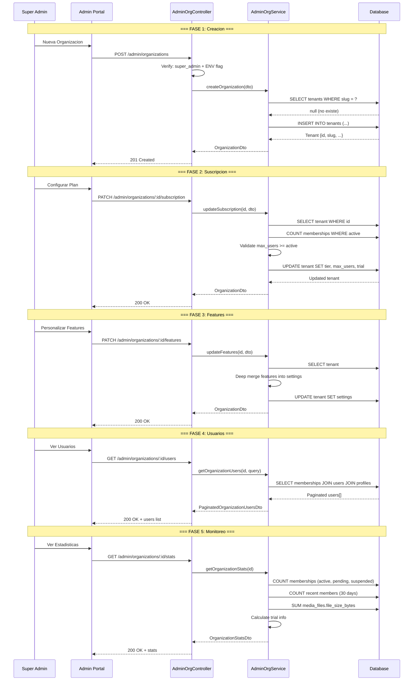

# FL-SYS-05: Multi-tenant Onboarding

**Version:** 1.0.0
**Fecha:** 2026-02-27
**Estado:** Activo

---

## Descripcion

Flujo de onboarding para nuevas organizaciones (tenants) en el sistema multi-tenant. El proceso cubre la creacion del tenant, configuracion de suscripcion y features, asignacion de administrador, y gestion de usuarios miembros. Cada tenant (entidad `Tenant` en schema `auth_management.tenants`) tiene aislamiento completo de datos, configuracion personalizable (tema, idioma, timezone, features), limites de suscripcion (max_users, max_storage_gb), y soporte para periodos de prueba (trial_ends_at).

La creacion de organizaciones esta restringida por politica: requiere rol `super_admin` y feature flag `ALLOW_ADMIN_ORGANIZATION_CREATE=true`. Los datos se aislan via Row-Level Security (RLS) con 251 politicas en 18 schemas, donde cada tabla con `tenant_id` tiene RLS habilitado. La gestion post-creacion se realiza via el portal Admin con 8 endpoints de organizaciones.

## Actores

- **Super Admin**: Crea organizaciones y gestiona suscripciones (unico rol autorizado)
- **Admin Teacher**: Gestiona usuarios dentro de su propia organizacion
- **AdminOrganizationsService**: Logica de negocio para CRUD de tenants
- **AdminOrganizationsController**: Endpoints REST con AdminGuard + JwtAuthGuard
- **Sistema RLS**: Row-Level Security policies para aislamiento de datos

## Precondiciones

- Super Admin autenticado con JWT valido y rol `super_admin`
- Feature flag `ALLOW_ADMIN_ORGANIZATION_CREATE=true` en variables de entorno
- Base de datos PostgreSQL con 18 schemas y RLS configurado
- Slug unico disponible para la nueva organizacion

## Flujo Principal

### Fase 1: Creacion del Tenant

1. **Solicitar creacion**: `POST /api/v1/admin/organizations` con `CreateOrganizationDto`:
   ```json
   {
     "name": "Escuela Primaria Maya",
     "slug": "escuela-primaria-maya",
     "domain": "maya.gamilit.com",
     "logo_url": "https://cdn.gamilit.com/logos/maya.png",
     "subscription_tier": "basic",
     "max_users": 200,
     "max_storage_gb": 10,
     "settings": {
       "theme": "detective",
       "features": {
         "analytics_enabled": true,
         "gamification_enabled": true,
         "social_features_enabled": true
       },
       "language": "es",
       "timezone": "America/Mexico_City"
     },
     "metadata": { "billing_contact": "admin@escuela-maya.edu" }
   }
   ```
2. **Validacion de politica**: Controller verifica:
   - `ALLOW_ADMIN_ORGANIZATION_CREATE === 'true'` (env var)
   - `req.user.role === 'super_admin'`
   - Si cualquier condicion falla: `ForbiddenException`
3. **Validacion de unicidad**: Service verifica que el `slug` no exista ya → `ConflictException` si duplicado
4. **Crear registro tenant**: `tenantRepo.create()` con valores por defecto:
   - `subscription_tier`: del DTO o `SubscriptionTierEnum.FREE`
   - `max_users`: del DTO o 100
   - `max_storage_gb`: del DTO o 5
   - `settings`: del DTO o configuracion por defecto (theme detective, features habilitadas, es, America/Mexico_City)
   - `metadata`: del DTO o `{}`
   - `is_active`: true
5. **Persistir**: `tenantRepo.save(tenant)` → UUID generado automaticamente
6. **Retornar**: `OrganizationDto` con todos los campos serializados via `plainToInstance()`

### Fase 2: Configuracion de Suscripcion

7. **Establecer suscripcion**: `PATCH /api/v1/admin/organizations/:id/subscription` con `UpdateSubscriptionDto`:
   - `subscription_tier`: free | basic | premium | enterprise
   - `max_users`: limite de usuarios (validado >= miembros activos actuales)
   - `max_storage_gb`: limite de almacenamiento
   - `trial_ends_at`: fecha de fin de periodo de prueba
8. **Validacion de max_users**: Si `max_users < active_members_count` → `BadRequestException` con detalle de cuantos miembros activos hay
9. **Calcular trial info**: Si `trial_ends_at > now()` → `is_trial=true`, calcula `trial_days_remaining`

### Fase 3: Configuracion de Features

10. **Personalizar features**: `PATCH /api/v1/admin/organizations/:id/features` con `UpdateFeaturesDto`:
    - Merge de features en `settings.features` (no reemplaza, agrega/sobrescribe)
    - Features disponibles: `analytics_enabled`, `gamification_enabled`, `social_features_enabled`
    - Deep merge: `{ ...currentSettings, features: { ...currentFeatures, ...newFeatures } }`

### Fase 4: Gestion de Usuarios

11. **Listar usuarios**: `GET /api/v1/admin/organizations/:id/users` con filtros:
    - Filtro por rol (`role`), status de membership (`status`)
    - Paginacion (`page`, `limit`)
    - JOIN con `auth.users` y `auth.profiles` (cross-datasource limitation: `full_name` no disponible)
    - Retorna: user_id, email, role, membership_role, membership_status, joined_at, last_active_at
12. **Agregar usuarios**: Via sistema de memberships (`auth_management.memberships`):
    - `MembershipStatusEnum`: ACTIVE, PENDING, SUSPENDED, INACTIVE
    - Cada membership tiene `tenant_id`, `user_id`, `role`, `status`, `joined_at`
13. **Invitar usuarios**: Al registrar nuevos usuarios, se les asigna al tenant via membership
    - El registro (`POST /api/auth/register`) crea user + profile + membership automaticamente

### Fase 5: Monitoreo Post-Onboarding

14. **Estadisticas**: `GET /api/v1/admin/organizations/:id/stats` retorna `OrganizationStatsDto`:
    - `total_members`, `active_members`, `pending_members`, `suspended_members`
    - `max_users` (limite del plan)
    - `storage_used_gb`: calculado desde `content_management.media_files` (SUM file_size_bytes)
    - `max_storage_gb` (limite del plan)
    - `members_last_30_days` (crecimiento reciente)
    - `is_trial`, `trial_days_remaining`
15. **Listar organizaciones**: `GET /api/v1/admin/organizations` con filtros:
    - Excluye personal_tenants (metadata.personal_tenant != 'true')
    - Filtro por `search` (nombre o slug ILIKE), `subscription_tier`, `is_active`
    - Paginado y ordenado por `created_at DESC`

## Flujos Alternativos

### Creacion Denegada por Politica
- Si `ALLOW_ADMIN_ORGANIZATION_CREATE !== 'true'` o rol no es `super_admin`:
  `ForbiddenException: "Organization creation is disabled by policy. Requires super_admin and ALLOW_ADMIN_ORGANIZATION_CREATE=true."`

### Slug Duplicado
- Si ya existe organizacion con el mismo slug:
  `ConflictException: "Organization with slug 'escuela-maya' already exists"`

### Reduccion de max_users con Miembros Activos
- Si intenta establecer `max_users=50` pero tiene 75 miembros activos:
  `BadRequestException: "Cannot set max_users to 50. Organization has 75 active members. Please remove or deactivate members first, or set max_users to at least 75."`

### Eliminacion de Organizacion con Miembros
- `DELETE /api/v1/admin/organizations/:id`
- Si tiene miembros activos: `BadRequestException: "Cannot delete organization with N active members. Remove or transfer members first."`
- Si no tiene miembros: eliminacion exitosa (hard delete)

### Soft Delete via is_active
- Alternativa a eliminacion: `PUT /api/v1/admin/organizations/:id` con `{ is_active: false }`
- Entity tiene `@DeleteDateColumn` (`deleted_at`) para soft delete via TypeORM

### Vulnerabilidad Cross-Tenant (Documentada)
- **SECURITY WARNING** (FIX-2025-01-07): AdminGuard solo verifica rol, no ownership del tenant
- Un `admin_teacher` podria modificar organizaciones de otros tenants
- `super_admin` puede operar cross-tenant por diseno
- Solucion recomendada: `TenantOwnershipGuard` que valide `user.tenant_id === targetTenantId`
- Prioridad: P1 (documentada en servicio, pendiente implementacion)

## Diagrama



## Postcondiciones

- Registro `auth_management.tenants` creado con UUID, slug unico, configuracion
- Suscripcion establecida con limites de usuarios y almacenamiento
- Features personalizadas en `settings.features` (JSONB)
- RLS policies activas para aislamiento de datos del nuevo tenant
- Memberships creadas para usuarios asignados
- Estadisticas disponibles via endpoint de stats

## Endpoints Involucrados

| Metodo | Ruta | Rol | Descripcion |
|--------|------|-----|-------------|
| GET | /api/v1/admin/organizations | Admin | Listar organizaciones con filtros |
| GET | /api/v1/admin/organizations/:id | Admin | Obtener organizacion por ID |
| POST | /api/v1/admin/organizations | Super Admin | Crear nueva organizacion |
| PUT | /api/v1/admin/organizations/:id | Admin | Actualizar organizacion |
| DELETE | /api/v1/admin/organizations/:id | Admin | Eliminar organizacion (sin miembros) |
| GET | /api/v1/admin/organizations/:id/stats | Admin | Estadisticas de organizacion |
| GET | /api/v1/admin/organizations/:id/users | Admin | Usuarios de la organizacion |
| PATCH | /api/v1/admin/organizations/:id/subscription | Admin | Actualizar suscripcion |
| PATCH | /api/v1/admin/organizations/:id/features | Admin | Actualizar features |

## Trazabilidad

### Backend
- `apps/backend/src/modules/admin/controllers/admin-organizations.controller.ts`
- `apps/backend/src/modules/admin/services/admin-organizations.service.ts`
- `apps/backend/src/modules/admin/guards/admin.guard.ts`
- `apps/backend/src/modules/auth/entities/tenant.entity.ts`
- `apps/backend/src/modules/auth/entities/membership.entity.ts`
- `apps/backend/src/modules/auth/guards/jwt-auth.guard.ts`

### DTOs
- `apps/backend/src/modules/admin/dto/organizations/create-organization.dto.ts`
- `apps/backend/src/modules/admin/dto/organizations/update-organization.dto.ts`
- `apps/backend/src/modules/admin/dto/organizations/list-organizations.dto.ts`
- `apps/backend/src/modules/admin/dto/organizations/organization.dto.ts`
- `apps/backend/src/modules/admin/dto/organizations/organization-stats.dto.ts`
- `apps/backend/src/modules/admin/dto/organizations/update-subscription.dto.ts`
- `apps/backend/src/modules/admin/dto/organizations/update-features.dto.ts`

### Datos
- `auth_management.tenants` (organizaciones con settings JSONB, limites, trial)
- `auth_management.memberships` (relacion usuario-tenant con status y rol)
- `auth_management.users` (usuarios del sistema)
- `auth_management.profiles` (perfiles con tenant_id FK)
- `content_management.media_files` (archivos para calculo de storage)

### Database (RLS)
- 251 politicas RLS distribuidas en 18 schemas
- Cada tabla con `tenant_id` tiene politica de aislamiento
- `gamilit_user` role con BYPASSRLS activo (CORR-F2-01b: pendiente de remover en produccion)

## Reglas y Validaciones

- Creacion: Solo `super_admin` + env flag `ALLOW_ADMIN_ORGANIZATION_CREATE=true`
- Slug: Unico, URL-friendly, validado contra existentes
- `max_users`: Debe ser >= numero actual de miembros activos
- `max_storage_gb`: Debe ser > 0 (CHECK constraint en DB)
- Eliminacion: Solo si no tiene miembros activos
- Personal tenants (`metadata.personal_tenant='true'`) excluidos de listado
- `subscription_tier`: Enum (free, basic, premium, enterprise)
- Settings: JSONB con deep merge (no reemplaza, agrega/sobrescribe)

## Manejo de Errores

| Escenario | Capa | Comportamiento |
|-----------|------|----------------|
| No es super_admin | CTRL | ForbiddenException: "requires super_admin" |
| ENV flag deshabilitado | CTRL | ForbiddenException: "disabled by policy" |
| Slug duplicado | SVC | ConflictException: "slug already exists" |
| Organizacion no encontrada | SVC | NotFoundException |
| max_users < active members | SVC | BadRequestException con conteo |
| Eliminacion con miembros | SVC | BadRequestException con conteo |
| Error calculo storage | SVC | Warning log, retorna 0 GB |
| Cross-tenant access | N/A | VULNERABILIDAD DOCUMENTADA (P1) |

## Notas de Seguridad

### Vulnerabilidad Cross-Tenant (P1 - Pendiente)
El `AdminGuard` solo verifica el rol del usuario (`admin` o `super_admin`) pero NO valida que el admin pertenezca a la organizacion que esta modificando. Un `admin_teacher` podria potencialmente modificar suscripciones o features de otras organizaciones. La solucion recomendada (documentada en el servicio) es implementar un `TenantOwnershipGuard`:

```typescript
// Solucion propuesta (no implementada aun)
if (user.role !== 'super_admin' && user.tenant_id !== targetTenantId) {
  throw new ForbiddenException('Cannot modify other organizations');
}
```

### RLS (Row-Level Security)
- 251 politicas RLS activas en 18 schemas
- `gamilit_user` tiene BYPASSRLS activo (pendiente CORR-F2-01b para produccion)
- En produccion, cada query filtra por `tenant_id` del usuario autenticado

## Referencias

- Arquitectura multi-tenant: `docs/20-architecture/security/MULTI-TENANT-ISOLATION.md`
- ADR-003: Row-Level Security
- Schema reference: `docs/20-architecture/schema-reference/01-auth-management.md`
- Portal Admin: `docs/60-portals/portal-admin/`
