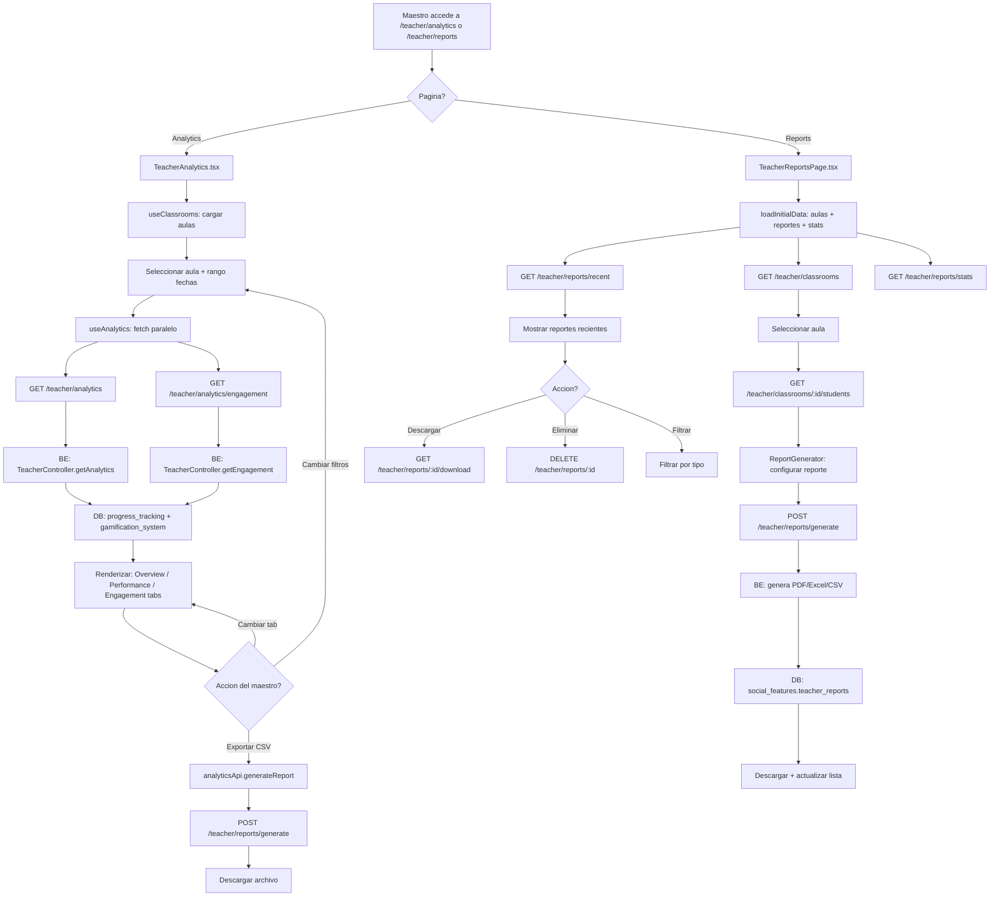

# FL-TCH-04 - Teacher Analytics / Reports

**ID:** FL-TCH-04
**Version:** 1.0.0
**Fecha:** 2026-02-17
**Estado:** Activo
**Portal:** Teacher
**Prioridad:** P1

---

## 1. Resumen

Flujo de analiticas y reportes del portal docente. El maestro accede a dos paginas complementarias: (1) **TeacherAnalytics** para visualizar metricas en tiempo real sobre rendimiento academico, tasas de completitud, engagement (DAU/WAU), y graficas por modulo; y (2) **TeacherReportsPage** para generar, descargar y gestionar reportes personalizados en formatos PDF, Excel y CSV.

El flujo utiliza filtros por aula y rango de fechas, con tres pestanas de vista (Overview, Performance, Engagement) en analiticas. Los reportes soportan 4 tipos (progreso, evaluacion, intervencion, personalizado) y se persisten en la base de datos para descarga posterior. Incluye analisis de riesgo basado en heuristicas y comparacion con periodos anteriores.

Impacto funcional: Permite al maestro tomar decisiones pedagogicas basadas en datos, identificar estudiantes en riesgo, y generar evidencia documental del progreso de sus aulas.

## 2. Precondiciones

- Usuario autenticado con JWT valido y rol `admin_teacher` o `super_admin`.
- Al menos un aula asignada al maestro en `social_features.classrooms`.
- Estudiantes vinculados a las aulas del maestro (`social_features.classroom_members`).
- Backend con datasources `progress`, `gamification`, `social` operativos.
- Para reportes: espacio de almacenamiento disponible para archivos generados.
- Para graficas: libreria Chart.js registrada en el frontend (CategoryScale, LinearScale, BarElement).

## 3. Diagrama Mermaid

## 4. Secuencia FE -> BE -> DB

### Flujo A: Analiticas (TeacherAnalytics)

#### Paso 1: Carga inicial
1. **Frontend:** `TeacherAnalytics.tsx` se monta en ruta `/teacher/analytics`.
2. **Frontend:** `useClassrooms()` obtiene las aulas del maestro.
3. **Frontend:** Auto-selecciona la primera aula disponible.

#### Paso 2: Fetch de analiticas
4. **Frontend:** `useAnalytics(analyticsQuery, engagementQuery)` ejecuta `Promise.all` con 2 llamadas:
   - `GET /api/v1/teacher/analytics?classroom_id=X&start_date=Y&end_date=Z`
   - `GET /api/v1/teacher/analytics/engagement?classroom_id=X&period=daily`
5. **Backend:** `TeacherController` (linea 257) delega a `TeacherService.getAnalytics()`.
6. **DB:** Consultas agregadas sobre `progress_tracking.module_progress`, `exercise_attempts`, `gamification_system.user_stats`.
7. **Backend:** Retorna `ClassroomAnalytics` (average_score, completion_rate, engagement_rate, module_stats, student_performance).
8. **Backend:** `TeacherController` (linea 289) delega engagement a servicio.
9. **DB:** Metricas de sesion de `progress_tracking.engagement_metrics`, `learning_sessions`.
10. **Backend:** Retorna `EngagementMetrics` (dau, wau, session_duration_avg, sessions_per_user, feature_usage, comparison_previous_period).

#### Paso 3: Visualizacion
11. **Frontend:** Tab Overview: summary stats (3 cards) + graficas Chart.js (score por modulo, completitud por modulo).
12. **Frontend:** Tab Performance: tabla de estudiantes con score, completitud, ultima actividad, estado (Excelente/Regular/Bajo).
13. **Frontend:** Tab Engagement: 4 cards (DAU, WAU, duracion, sesiones/usuario) + comparacion periodo anterior + tabla uso features.

#### Paso 4: Exportacion
14. **Frontend:** Boton "Exportar a CSV" invoca `analyticsApi.generateReport()`.
15. **Backend:** `POST /teacher/reports/generate` genera archivo y retorna `Report { status, file_url }`.
16. **Frontend:** Si `status === 'completed'`, abre `file_url` en nueva pestana.

### Flujo B: Reportes (TeacherReportsPage)

#### Paso 1: Carga inicial
1. **Frontend:** `TeacherReportsPage.tsx` se monta en ruta `/teacher/reports`.
2. **Frontend:** `loadInitialData()` ejecuta 3 llamadas secuenciales:
   - `GET /api/v1/teacher/classrooms` (aulas del maestro)
   - `GET /api/v1/teacher/reports/recent` (reportes recientes)
   - `GET /api/v1/teacher/reports/stats` (estadisticas de reportes)
3. **Backend:** `TeacherController` consulta `social_features.teacher_reports` y aulas.
4. **Frontend:** Muestra 4 cards de estadisticas (total generados, ultimo reporte, formato preferido, promedio estudiantes).

#### Paso 2: Generacion de reporte
5. **Frontend:** Maestro selecciona aula, se cargan estudiantes via `GET /teacher/classrooms/:id/students`.
6. **Frontend:** `ReportGenerator` permite configurar tipo, formato, rango de fechas, estudiantes.
7. **Frontend:** `POST /teacher/reports/generate` con `GenerateReportsDto`.
8. **Backend:** Genera reporte (PDF/Excel/CSV) con datos de progreso y analisis de riesgo.
9. **DB:** Inserta metadata en `social_features.teacher_reports`.
10. **Frontend:** Descarga automatica del archivo generado.

#### Paso 3: Gestion de reportes existentes
11. **Frontend:** Lista de reportes recientes con filtros por tipo (progreso, evaluacion, intervencion, personalizado).
12. **Frontend:** Acciones por reporte: Descargar (`GET /teacher/reports/:id/download`) o Eliminar (`DELETE /teacher/reports/:id`).
13. **Frontend:** Confirmacion modal antes de eliminar (TASK-2026-01-18-015 Sprint 4.2).

## 5. Componentes y artefactos implicados

### Frontend

| Tipo | Ruta | Descripcion |
|------|------|-------------|
| Pagina | `apps/frontend/src/apps/teacher/pages/TeacherAnalytics.tsx` | Dashboard de analiticas con 3 tabs |
| Pagina | `apps/frontend/src/apps/teacher/pages/TeacherReportsPage.tsx` | Generador y gestor de reportes |
| Componente | `apps/frontend/src/apps/teacher/components/reports/ReportGenerator.tsx` | Formulario de generacion de reportes |
| Componente | `apps/frontend/src/shared/components/base/DetectiveCard.tsx` | Card base del sistema de diseno |
| Componente | `apps/frontend/src/shared/components/base/DetectiveButton.tsx` | Boton base del sistema de diseno |
| Componente | `apps/frontend/src/shared/components/common/FormField.tsx` | Campo de formulario reutilizable |
| Componente | `apps/frontend/src/shared/components/base/Toast.tsx` | Sistema de notificaciones toast |
| Hook | `apps/frontend/src/apps/teacher/hooks/useAnalytics.ts` | Fetch de analiticas y engagement (Promise.all) |
| Hook | `apps/frontend/src/apps/teacher/hooks/useClassrooms.ts` | Lista de aulas del maestro |
| API Service | `apps/frontend/src/services/api/teacher/analyticsApi.ts` | API de analiticas (7 metodos) |
| API Service | `apps/frontend/src/services/api/teacher/reportsApi.ts` | API de reportes (5 metodos) |
| Layout | `apps/frontend/src/apps/teacher/layouts/TeacherLayout.tsx` | Layout del portal docente |
| Config | `apps/frontend/src/config/api.config.ts` | Endpoints configurados |

### Backend

| Tipo | Ruta | Descripcion |
|------|------|-------------|
| Controller | `apps/backend/src/modules/teacher/controllers/teacher.controller.ts` | Controller principal del maestro (rutas lineas 257-786) |
| Endpoint | `GET /teacher/analytics` | Analiticas de aula (average_score, completion_rate, module_stats) |
| Endpoint | `GET /teacher/analytics/classroom/:id` | Analiticas especificas de aula |
| Endpoint | `GET /teacher/analytics/engagement` | Metricas de engagement (DAU, WAU, sesiones) |
| Endpoint | `GET /teacher/analytics/economy` | Analiticas de economia ML Coins |
| Endpoint | `GET /teacher/analytics/achievements` | Estadisticas de logros |
| Endpoint | `GET /teacher/students/:studentId/insights` | Insights individuales de estudiante |
| Endpoint | `POST /teacher/reports/generate` | Generar reporte (PDF/Excel/CSV) |
| Endpoint | `GET /teacher/reports/recent` | Reportes recientes del maestro |
| Endpoint | `GET /teacher/reports/stats` | Estadisticas de reportes |
| Endpoint | `GET /teacher/reports/:id/download` | Descargar reporte |
| Endpoint | `GET /teacher/reports/:id/status` | Estado de generacion de reporte |
| Endpoint | `GET /teacher/reports/scheduled` | Reportes programados |
| Endpoint | `POST /teacher/reports/scheduled` | Crear reporte programado |
| Endpoint | `POST /teacher/reports/share` | Compartir reporte |
| Controller | `apps/backend/src/modules/teacher/controllers/teacher-classrooms.controller.ts` | Gestion de aulas del maestro |

### Datos (Base de Datos)

| Schema | Tabla/Vista | Uso |
|--------|-------------|-----|
| `progress_tracking` | `module_progress` | Progreso por modulo y estudiante |
| `progress_tracking` | `exercise_attempts` | Intentos, scores, tiempos por ejercicio |
| `progress_tracking` | `learning_sessions` | Sesiones de aprendizaje (duracion, actividad) |
| `progress_tracking` | `engagement_metrics` | Metricas de engagement calculadas |
| `gamification_system` | `user_stats` | XP, nivel, rachas por estudiante |
| `social_features` | `teacher_reports` | Metadata de reportes generados |
| `social_features` | `scheduled_reports` | Reportes programados |
| `social_features` | `shared_reports` | Reportes compartidos entre maestros |
| `social_features` | `classrooms` | Aulas del maestro |
| `social_features` | `classroom_members` | Estudiantes en cada aula |
| `educational_content` | `modules` | Catalogo de modulos educativos |
| `data_warehouse` | `fact_daily_progress` | Progreso diario agregado |
| `data_warehouse` | `fact_exercise_completions` | Completaciones de ejercicios agregadas |
| `data_warehouse` | `fact_teacher_metrics` | Metricas de maestro agregadas |
| `data_warehouse` | `v_student_engagement_metrics` | Vista de engagement por estudiante |
| `data_warehouse` | `v_student_performance_metrics` | Vista de rendimiento por estudiante |

## 6. Reglas y validaciones

- **RBAC:** Solo roles `admin_teacher` y `super_admin` pueden acceder a `/teacher/analytics` y `/teacher/reports`.
- **RLS (Row-Level Security):** El maestro solo ve datos de aulas donde es miembro (`classroom_members.role = 'teacher'`). Politicas en `teacher_reports`, `classrooms`, `classroom_members`.
- **Propiedad de reportes:** Solo el maestro que genero un reporte puede descargarlo o eliminarlo (validacion en backend).
- **Filtros obligatorios:** Se requiere seleccionar aula para obtener analiticas (sin aula, no se ejecuta query).
- **Rango de fechas:** Las consultas de analiticas siempre incluyen `start_date` y `end_date`.
- **Tipos de reporte:** 4 tipos validos: `progress`, `evaluation`, `intervention`, `custom`.
- **Formatos de exportacion:** 3 formatos: PDF (presentacion), Excel (analisis), CSV (integracion).
- **Comparacion con periodo anterior:** Se calcula automaticamente basado en la duracion del rango seleccionado.
- **Estudiantes en riesgo:** Se clasifican por heuristicas (score < 60% = Bajo, 60-80% = Regular, >= 80% = Excelente).
- **Mock data fallback:** Si el backend no responde, `TeacherReportsPage` activa `isUsingMockData` y muestra banner de advertencia.
- **Eliminacion de reportes:** Requiere confirmacion modal; operacion irreversible.

## 7. Manejo de errores

| Escenario | Capa | Codigo HTTP | Comportamiento |
|-----------|------|-------------|----------------|
| Token JWT expirado | FE | 401 | Redirect a `/login` via interceptor axios |
| Sin aulas asignadas | BE | 200 (vacio) | Select de aulas vacio, botones deshabilitados |
| Endpoint analytics falla | BE | 500 | Card de error con mensaje y boton "Reintentar" |
| Endpoint engagement falla | BE | 500 | Tab Engagement muestra estado vacio con icono |
| Generacion de reporte falla | BE | 500 | Toast error "Error al generar el reporte" |
| Descarga de reporte falla | BE | 404/500 | Toast error "Error al descargar el reporte" |
| Eliminacion de reporte falla | BE | 500 | Toast error, reporte permanece en lista |
| Reporte en generacion | BE | 200 | Toast info "El reporte esta siendo generado" |
| Backend no disponible | FE | Network Error | `isUsingMockData=true`, banner amarillo, datos de ejemplo |
| Datos de estudiante invalidos | FE | - | Filtros `.filter()` descartan registros con campos null/undefined |
| Sin datos de modulos | BE | 200 (vacio) | Graficas muestran ejes vacios, tabla vacia |

## 8. Trazabilidad cruzada

| Capa | Archivo | Evidencia |
|------|---------|-----------|
| Frontend (analytics) | `apps/frontend/src/apps/teacher/pages/TeacherAnalytics.tsx` | Ruta `/teacher/analytics`, 3 tabs, graficas Chart.js |
| Frontend (reports) | `apps/frontend/src/apps/teacher/pages/TeacherReportsPage.tsx` | Ruta `/teacher/reports`, ReportGenerator, CRUD reportes |
| Frontend (hook) | `apps/frontend/src/apps/teacher/hooks/useAnalytics.ts` | Promise.all de analytics + engagement |
| Frontend (API analytics) | `apps/frontend/src/services/api/teacher/analyticsApi.ts` | 7 metodos: getClassroomAnalytics, getEngagementMetrics, generateReport, etc. |
| Frontend (API reports) | `apps/frontend/src/services/api/teacher/reportsApi.ts` | 5 metodos: generateReport, getRecentReports, getReportStats, downloadReport, deleteReport |
| Frontend (rutas) | `apps/frontend/src/App.tsx` lineas 238-241, 294-297 | Routes `/teacher/analytics`, `/teacher/reports` |
| Backend (controller) | `apps/backend/src/modules/teacher/controllers/teacher.controller.ts` | 30+ endpoints teacher/* (analytics linea 257, reports linea 384) |
| Backend (classrooms) | `apps/backend/src/modules/teacher/controllers/teacher-classrooms.controller.ts` | GET classrooms del maestro |
| Database | `apps/database/ddl/schemas/social_features/tables/08-teacher_reports.sql` | Metadata de reportes generados |
| Database | `apps/database/ddl/schemas/social_features/tables/11-scheduled_reports.sql` | Reportes programados |
| Database | `apps/database/ddl/schemas/progress_tracking/tables/01-module_progress.sql` | Fuente de datos de progreso |
| Database | `apps/database/ddl/schemas/progress_tracking/tables/03-exercise_attempts.sql` | Fuente de datos de intentos |
| Database | `apps/database/ddl/schemas/progress_tracking/tables/engagement_metrics.sql` | Metricas de engagement |
| Database | `apps/database/ddl/schemas/data_warehouse/views/v_student_engagement_metrics.sql` | Vista agregada de engagement |
| Database | `apps/database/ddl/schemas/data_warehouse/views/v_student_performance_metrics.sql` | Vista agregada de performance |
| Database | `apps/database/ddl/schemas/data_warehouse/tables/fact_daily_progress.sql` | Hechos de progreso diario |
| Database | `apps/database/ddl/schemas/data_warehouse/tables/fact_exercise_completions.sql` | Hechos de completaciones |
| Database | `apps/database/ddl/schemas/data_warehouse/tables/fact_teacher_metrics.sql` | Hechos de metricas docente |

## 9. Referencias

- Guia de portal docente: `docs/60-portals/teacher/PORTAL-TEACHER-GUIDE.md`
- Flujos del portal docente: `docs/60-portals/teacher/PORTAL-TEACHER-FLOWS.md`
- Especificacion dashboard progreso: `docs/10-requirements/epics/EPIC-GAM-F1-ANALYTICS/specifications/ET-ANA-006-dashboard-progreso.md`
- Especificacion metricas: `docs/10-requirements/epics/EPIC-GAM-F1-ANALYTICS/specifications/ET-ANA-002-api-metricas.md`
- Especificacion exportacion: `docs/10-requirements/epics/EPIC-GAM-F1-ANALYTICS/specifications/ET-ANA-003-exportacion-datos.md`
- Requerimiento reportes: `docs/10-requirements/epics/EPIC-GAM-F1-ANALYTICS/requirements/RF-ANA-003-reportes-docente.md`
- Arquitectura de API frontend: `docs/50-guides/frontend/impl/API-ARCHITECTURE.md`
- Especificacion sistema de exportacion: `docs/10-requirements/epics/EPIC-GAM-F3-ADMIN-EXTENDED/specifications/ET-EXPORT-SYSTEM.md`
- Integracion student-teacher: `docs/50-guides/integration/INTEGRACION-STUDENT-TEACHER.md`
