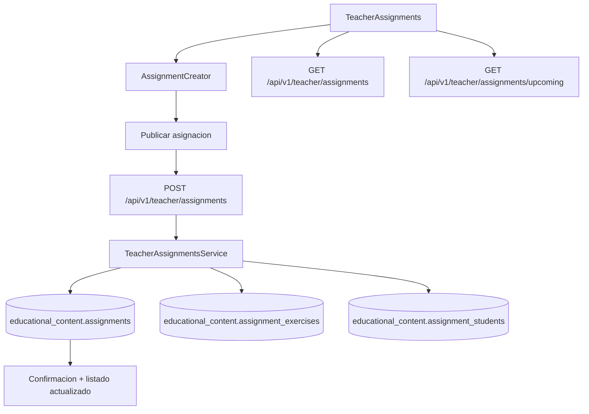

# FL-TCH-02 - Gestion de Asignaciones de Clase

**Portal:** Teacher
**Prioridad:** Alta
**Estado:** Documentado

---

## 1. Resumen

Flujo para crear, configurar y publicar asignaciones a aulas/estudiantes. El docente selecciona modulo, ejercicios, fecha limite y aula destino. El backend persiste la asignacion y permite enviar recordatorios a estudiantes pendientes.

## 2. Precondiciones

| Condicion | Detalle |
|-----------|---------|
| Rol requerido | `ADMIN_TEACHER` o `SUPER_ADMIN` |
| Sesion activa | JWT valido con `JwtAuthGuard` + `RolesGuard` |
| Aula existente | El docente debe tener al menos un classroom asignado en `social_features.teacher_classrooms` |
| Ejercicios disponibles | Deben existir ejercicios publicados en `educational_content.exercises` |
| Tenant activo | El usuario debe pertenecer a un tenant activo (`auth_management.tenants`) |

## 3. Diagrama Mermaid

## 4. Secuencia FE -> BE -> DB

1. Docente abre `TeacherAssignments` page, hook `useAssignments` ejecuta `GET /api/v1/teacher/assignments` y `GET /api/v1/teacher/assignments/upcoming`.
2. Docente usa `AssignmentCreator` para configurar: titulo, descripcion, tipo (practice/quiz/exam/homework), fecha limite, classroom_id y exercise_ids.
3. FE envia `POST /api/v1/teacher/assignments` con `CreateAssignmentDto`.
4. Backend (`TeacherAssignmentsController`) valida ownership del aula, existencia de ejercicios y parametros via guards `JwtAuthGuard` + `RolesGuard`.
5. `TeacherAssignmentsService` persiste en `educational_content.assignments`, `educational_content.assignment_exercises` y `educational_content.assignment_students`.
6. Para actualizaciones: `PUT /api/v1/teacher/assignments/:id` con `UpdateAssignmentDto`.
7. Para enviar recordatorio: `POST /api/v1/teacher/assignments/:id/send-reminder` notifica a estudiantes sin entrega.
8. Para consultar entregas: `GET /api/v1/teacher/assignments/:id/submissions`.
9. FE refresca listado via `useAssignments.refresh()`.

## 5. Componentes y artefactos implicados

| Capa | Archivo | Descripcion |
|------|---------|-------------|
| FE Page | `apps/frontend/src/apps/teacher/pages/TeacherAssignments.tsx` | Pagina principal de asignaciones |
| FE Component | `apps/frontend/src/apps/teacher/components/assignments/AssignmentCreator.tsx` | Creador de asignaciones |
| FE Component | `apps/frontend/src/apps/teacher/components/assignments/AssignmentCard.tsx` | Tarjeta de asignacion |
| FE Component | `apps/frontend/src/apps/teacher/components/assignments/AssignmentList.tsx` | Listado de asignaciones |
| FE Component | `apps/frontend/src/apps/teacher/components/assignments/AssignmentWizard.tsx` | Wizard paso a paso |
| FE Component | `apps/frontend/src/apps/teacher/components/assignments/SubmissionsModal.tsx` | Modal de entregas |
| FE Hook | `apps/frontend/src/apps/teacher/hooks/useAssignments.ts` | Hook CRUD de asignaciones |
| FE API | `apps/frontend/src/services/api/teacher/assignmentsApi.ts` | Cliente API asignaciones |
| BE Controller | `apps/backend/src/modules/teacher/controllers/teacher-assignments.controller.ts` | 8 endpoints REST |
| BE Service | `apps/backend/src/modules/teacher/services/teacher-assignments.service.ts` | Logica de negocio |
| DB Table | `apps/database/ddl/schemas/educational_content/tables/05-assignments.sql` | Tabla de asignaciones |
| DB Table | `apps/database/ddl/schemas/educational_content/tables/06-assignment_exercises.sql` | Relacion asignacion-ejercicio |
| DB Table | `apps/database/ddl/schemas/educational_content/tables/07-assignment_students.sql` | Relacion asignacion-estudiante |
| DB Table | `apps/database/ddl/schemas/educational_content/tables/08-assignment_submissions.sql` | Entregas de estudiantes |
| DB Table | `apps/database/ddl/schemas/social_features/tables/03-classrooms.sql` | Aulas |
| DB Table | `apps/database/ddl/schemas/social_features/tables/teacher_classrooms.sql` | Relacion docente-aula |

## 6. Reglas y validaciones

| Regla | Detalle |
|-------|---------|
| RBAC | Solo roles `ADMIN_TEACHER` y `SUPER_ADMIN` pueden acceder a endpoints de asignaciones |
| Ownership | El docente solo puede modificar/eliminar asignaciones que el mismo creo (validacion por `teacherId`) |
| Tenant isolation | Las consultas se filtran por `tenant_id` del usuario autenticado |
| Classroom membership | El docente debe estar registrado como owner/member del classroom destino |
| Fecha limite | `due_date` debe ser una fecha futura al momento de creacion |
| Ejercicios validos | Los `exercise_ids` deben corresponder a ejercicios existentes y publicados |
| Tipo valido | `assignment_type` debe ser uno de: `practice`, `quiz`, `exam`, `homework` |
| Eliminacion en cascada | Al eliminar asignacion se eliminan `assignment_exercises`, `assignment_students` y `assignment_submissions` relacionados |

## 7. Manejo de errores

| Escenario | Capa | Codigo HTTP | Comportamiento |
|-----------|------|-------------|----------------|
| Token JWT invalido o expirado | BE Guard | 401 Unauthorized | FE redirige a login, muestra mensaje de sesion expirada |
| Rol insuficiente (no es teacher) | BE Guard | 403 Forbidden | FE muestra toast "Sin permisos para esta accion" |
| Asignacion no encontrada | BE Service | 404 Not Found | FE muestra mensaje "Asignacion no encontrada" |
| Docente no es owner de la asignacion | BE Service | 403 Forbidden | FE muestra toast "No tienes permiso para modificar esta asignacion" |
| Datos invalidos (DTO validation) | BE Pipe | 400 Bad Request | FE resalta campos con error en el formulario |
| Error de red / timeout | FE Hook | - | `useAssignments` establece `error` state, UI muestra banner de reintento |

## 8. Trazabilidad cruzada

| Capa | Archivo | Evidencia |
|------|---------|-----------|
| Requerimiento | `docs/10-requirements/epics/EPIC-GAM-F3-TEACHER-PORTAL/specifications/ET-TCH-003-asignaciones.md` | Especificacion de asignaciones |
| DDL | `apps/database/ddl/schemas/educational_content/tables/05-assignments.sql` | CREATE TABLE educational_content.assignments |
| Entity | `apps/backend/src/modules/teacher/services/teacher-assignments.service.ts` | TeacherAssignmentsService |
| Controller | `apps/backend/src/modules/teacher/controllers/teacher-assignments.controller.ts` | @Controller('teacher/assignments') |
| Frontend | `apps/frontend/src/apps/teacher/pages/TeacherAssignments.tsx` | Pagina de asignaciones |
| API Client | `apps/frontend/src/services/api/teacher/assignmentsApi.ts` | assignmentsApi |

## 9. Referencias

- Requerimiento: `EPIC-GAM-F3-TEACHER-PORTAL`
- Matriz: `../TRACEABILITY-MATRIX.md`
- Cobertura total: `../COBERTURA-TOTAL-PROCESOS.md`
