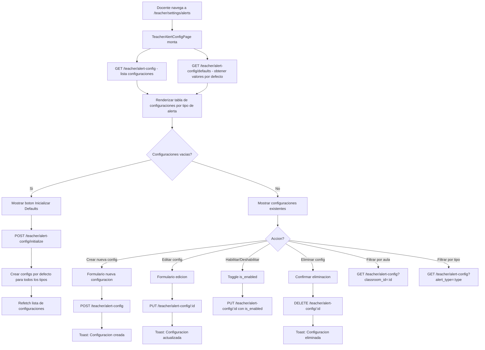

# FL-TCH-17 - Configuracion de Alertas

**ID:** FL-TCH-17
**Version:** 1.0.0
**Fecha:** 2026-02-27
**Estado:** Activo
**Portal:** Teacher
**Prioridad:** P3

---

## 1. Resumen

Flujo de la pagina `/teacher/settings/alerts` del portal docente (componente `TeacherAlertConfigPage`, implementado en US-PM-007). Permite al maestro personalizar los umbrales y parametros que disparan alertas automaticas de intervencion estudiantil. El docente puede configurar por tipo de alerta: umbrales numericos (ej. score minimo para activar la alerta), periodos de tiempo (dias de inactividad), y si la alerta esta habilitada globalmente o por aula especifica. El sistema usa estas configuraciones al ejecutar la funcion SQL `generate_student_alerts()` periodicamente.

---

## 2. Actores

- Maestro: Personaliza cuando el sistema debe generarle alertas de intervencion.
- Sistema: Usa las configuraciones al evaluar el progreso de los estudiantes.

---

## 3. Precondiciones

- Usuario autenticado con rol `teacher` o `admin_teacher`.
- Sesion activa con JWT valido.
- Configuraciones de alerta inicializadas (o se inicializan automaticamente con defaults).

---

## 4. Diagrama Mermaid



---

## 5. Secuencia FE -> BE -> DB

```
=== Carga inicial ===
1. FE: TeacherAlertConfigPage monta
2. FE: GET /api/v1/teacher/alert-config (lista configuraciones del teacher)
3. BE: AlertConfigController.getConfigurations() -> AlertConfigService.getConfigurations(teacherId, query)
4. DB: SELECT * FROM progress_tracking.alert_configurations
        WHERE teacher_id = :teacherId
        ORDER BY alert_type, classroom_id NULLS FIRST
5. BE: Retorna AlertConfigListResponseDto { data: AlertConfigResponseDto[], total }
6. FE: GET /api/v1/teacher/alert-config/defaults (valores por defecto para cada tipo)
7. BE: AlertConfigController.getDefaults() -> AlertConfigService.getDefaultConfigurations()
8. BE: Retorna array de AlertConfigDefaultsDto con thresholds por defecto por tipo
9. FE: Renderiza tabla con configuraciones actuales y opciones de edicion

=== Inicializar configuraciones por defecto ===
10. FE: Click en "Inicializar con valores por defecto"
11. FE: POST /api/v1/teacher/alert-config/initialize
12. BE: AlertConfigController.initializeDefaults() -> AlertConfigService.initializeDefaults()
13. BE: Para cada tipo de alerta (low_score, inactivity, missing_submissions, etc.):
        verifica si ya existe config, si no la crea con valores defaults
14. DB: INSERT INTO progress_tracking.alert_configurations (teacher_id, tenant_id, alert_type, thresholds, is_enabled)
         VALUES ... ON CONFLICT DO NOTHING
15. BE: Retorna array de AlertConfigResponseDto (creadas + existentes)
16. FE: Refetch lista, toast: "Configuraciones inicializadas"

=== Crear configuracion especifica por aula ===
17. FE: Click en "Nueva configuracion" -> formulario
18. FE: Docente selecciona: aula (classroom_id), tipo de alerta, umbral, habilitado
19. FE: POST /api/v1/teacher/alert-config
         Body: { classroom_id: "uuid", alert_type: "low_score", thresholds: { min_score: 60 }, is_enabled: true }
20. BE: AlertConfigController.createConfiguration() -> AlertConfigService.createConfiguration()
21. BE: Valida que no exista config con mismo (teacher_id, classroom_id, alert_type)
22. DB: INSERT INTO progress_tracking.alert_configurations ... RETURNING *
23. BE: Retorna AlertConfigResponseDto
24. FE: Agrega a la lista, toast: "Configuracion creada"

=== Actualizar umbral de alerta ===
25. FE: Click en editar -> formulario de edicion con valores actuales
26. FE: Docente modifica threshold (ej. cambia min_score de 60 a 50)
27. FE: PUT /api/v1/teacher/alert-config/:configId
         Body: { thresholds: { min_score: 50 }, is_enabled: true }
28. BE: AlertConfigController.updateConfiguration() -> AlertConfigService.updateConfiguration()
29. BE: Valida ownership (teacher_id del JWT debe coincidir con la config)
30. DB: UPDATE progress_tracking.alert_configurations SET thresholds = :thresholds WHERE id = :id AND teacher_id = :teacherId
31. BE: Retorna AlertConfigResponseDto actualizada
32. FE: Actualiza fila en tabla, toast: "Configuracion actualizada"

=== Eliminar configuracion ===
33. FE: Click en eliminar -> dialogo de confirmacion
34. FE: DELETE /api/v1/teacher/alert-config/:configId
35. BE: AlertConfigController.deleteConfiguration() -> AlertConfigService.deleteConfiguration()
36. BE: Valida ownership, elimina el registro
37. DB: DELETE FROM progress_tracking.alert_configurations WHERE id = :id AND teacher_id = :teacherId
38. BE: Retorna 204 No Content
39. FE: Remove de la lista, toast: "Configuracion eliminada"

=== Uso de las configuraciones por el sistema ===
40. Sistema (cron): Ejecuta periodicamente generate_student_alerts()
41. DB: Funcion SQL consulta progress_tracking.alert_configurations del teacher
        Compara con datos de progress_tracking.* de sus estudiantes
42. DB: Genera registros en progress_tracking.student_intervention_alerts para alertas disparadas
43. FE (MonitoringPage): El docente ve las alertas generadas en /teacher/alerts o /teacher/monitoring
```

---

## 6. Tipos de Alerta Configurables

| Tipo | Descripcion | Threshold por Defecto |
|------|-------------|----------------------|
| `low_score` | Estudiante con promedio por debajo del umbral | min_score: 60 |
| `inactivity` | Estudiante sin actividad durante N dias | days_inactive: 7 |
| `missing_submissions` | Asignaciones sin entregar vencidas | max_missing: 3 |
| `rapid_decline` | Caida brusca en el rendimiento | score_drop: 20 (puntos) |
| `completion_rate` | Tasa de completitud por debajo del umbral | min_completion: 50% |

---

## 7. Componentes y artefactos implicados

### Frontend

| Tipo | Archivo |
|------|---------|
| Pagina | `apps/frontend/src/apps/teacher/pages/TeacherAlertConfigPage.tsx` |
| Ruta | `apps/frontend/src/App.tsx` (ruta: `/teacher/settings/alerts`) |

### Backend

| Tipo | Archivo |
|------|---------|
| Controller | `apps/backend/src/modules/teacher/controllers/alert-config.controller.ts` |
| Service | `apps/backend/src/modules/teacher/services/alert-config.service.ts` |
| Guard | `apps/backend/src/modules/teacher/guards/teacher.guard.ts` |
| DTOs | `apps/backend/src/modules/teacher/dto/alert-config.dto.ts` |

### Base de Datos

| Tipo | Archivo |
|------|---------|
| Tabla alert_configurations | `apps/database/ddl/schemas/progress_tracking/tables/alert_configurations.sql` |
| Tabla student_intervention_alerts | `apps/database/ddl/schemas/progress_tracking/tables/student_intervention_alerts.sql` |
| Funcion generate_student_alerts | `apps/database/ddl/schemas/progress_tracking/functions/generate_student_alerts.sql` |

---

## 8. Endpoints Involucrados

| Metodo | Ruta | Descripcion |
|--------|------|-------------|
| GET | `/api/v1/teacher/alert-config` | Lista configuraciones del docente (filtros: classroom_id, alert_type, is_enabled) |
| GET | `/api/v1/teacher/alert-config/defaults` | Valores por defecto para cada tipo de alerta |
| GET | `/api/v1/teacher/alert-config/:id` | Detalle de una configuracion especifica |
| POST | `/api/v1/teacher/alert-config` | Crear nueva configuracion de alerta |
| POST | `/api/v1/teacher/alert-config/initialize` | Inicializar configuraciones con valores por defecto |
| PUT | `/api/v1/teacher/alert-config/:id` | Actualizar configuracion (umbral, habilitado, etc.) |
| DELETE | `/api/v1/teacher/alert-config/:id` | Eliminar configuracion |

---

## 9. Reglas y validaciones

| Regla | Capa | Descripcion |
|-------|------|-------------|
| Autenticacion requerida | BE | JwtAuthGuard en todos los endpoints |
| Guard de teacher | BE | TeacherGuard (no solo RolesGuard) verifica perfil de teacher |
| Ownership en actualizacion | BE | AlertConfigService valida teacher_id del JWT |
| Config unica por (teacher, classroom, type) | DB | UNIQUE constraint, retorna 409 en conflicto |
| Inicializar es idempotente | BE | ON CONFLICT DO NOTHING, no falla si ya existen |
| Filtros opcionales en lista | BE | classroom_id, alert_type e is_enabled son opcionales |

---

## 10. Manejo de errores

| Escenario | Capa | Codigo HTTP | Comportamiento |
|-----------|------|-------------|----------------|
| Token JWT expirado | BE | 401 | Redirige a login |
| Configuracion ya existe | BE | 409 | Toast: "Ya existe una configuracion para este tipo en esta aula" |
| Config no encontrada | BE | 404 | Toast de error |
| Sin acceso a la configuracion | BE | 403 | ForbiddenException, toast de error |
| Sin configuraciones inicializadas | FE | 200 | Muestra EmptyState con boton de inicializar |

---

## 11. Trazabilidad cruzada

| Capa | Archivo | Evidencia |
|------|---------|-----------|
| Frontend Pagina | `apps/frontend/src/apps/teacher/pages/TeacherAlertConfigPage.tsx` | Gestion de configs de alerta |
| Backend Controller | `apps/backend/src/modules/teacher/controllers/alert-config.controller.ts` | CRUD de configuraciones |
| Backend Service | `apps/backend/src/modules/teacher/services/alert-config.service.ts` | Logica de inicializacion y merge |
| DDL alert_configurations | `apps/database/ddl/schemas/monitoring/tables/alert_configurations.sql` | Configuraciones por teacher/aula |
| DDL generate_student_alerts | `apps/database/ddl/schemas/monitoring/functions/` | Funcion que usa las configs |

---

## 12. Referencias

- Flujo monitoreo y alertas: [FL-TCH-06](./FLUJO-MONITOREO-ALERTAS.md)
- Flujo notificaciones docente: [FL-TCH-15](./FLUJO-NOTIFICACIONES-DOCENTE.md)
- Flujo preferencias notificaciones: [FL-TCH-16](./FLUJO-PREFERENCIAS-NOTIFICACIONES.md)
- Flujo configuracion docente: [FL-TCH-14](./FLUJO-CONFIGURACION-DOCENTE.md)
- ADR-003 (RLS): `docs/90-adr/ADR-003-RLS-POLICY.md`
