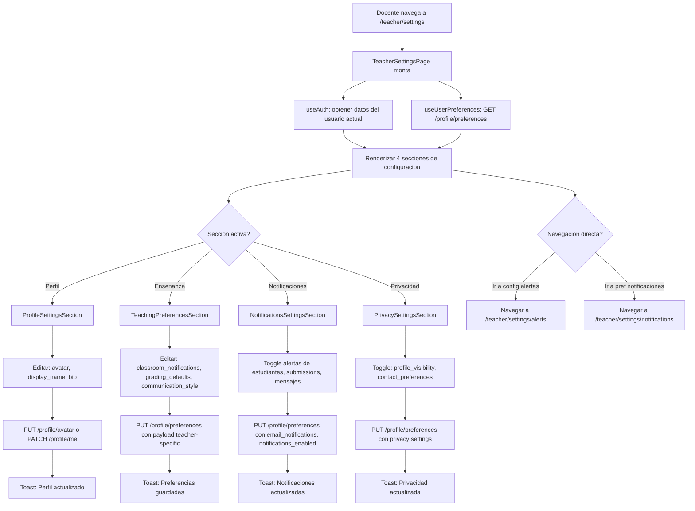

# FL-TCH-14 - Configuracion del Docente

**ID:** FL-TCH-14
**Version:** 1.0.0
**Fecha:** 2026-02-27
**Estado:** Activo
**Portal:** Teacher
**Prioridad:** P3

---

## 1. Resumen

Flujo de la pagina `/teacher/settings` del portal docente. Permite al maestro gestionar sus preferencias y configuracion personal en cuatro secciones: Perfil (avatar, nombre visible, bio), Preferencias de ensenanza (notificaciones del aula, defaults de calificacion, comunicacion), Notificaciones (alertas de estudiantes, submissions, mensajes), y Privacidad (visibilidad del perfil, preferencias de contacto). Los cambios se persisten via la API de perfil del usuario. La pagina actua como centro de configuracion personal del docente.

---

## 2. Actores

- Maestro: Configura sus preferencias de trabajo y perfil en la plataforma.
- Sistema: Persiste las preferencias y las aplica en otros modulos (notificaciones, alertas).

---

## 3. Precondiciones

- Usuario autenticado con rol `teacher` o `admin_teacher`.
- Sesion activa con JWT valido.
- Perfil de usuario existente en la base de datos.

---

## 4. Diagrama Mermaid



---

## 5. Secuencia FE -> BE -> DB

```
=== Carga inicial de la pagina ===
1. FE: TeacherSettingsPage monta -> obtiene datos del usuario del store de auth
2. FE: useUserPreferences -> GET /api/v1/profile/preferences
3. BE: ProfileController.getPreferences() -> UserPreferencesService.getPreferences(userId)
4. DB: SELECT preferences FROM auth.user_profiles WHERE user_id = :userId
5. BE: Retorna JSON de preferencias del usuario (theme, language, notifications, teacher-specific)
6. FE: Renderiza 4 secciones con datos precargados

=== Actualizar perfil (nombre, bio) ===
7. FE: Docente edita campos en ProfileSettingsSection y hace click en guardar
8. FE: PATCH /api/v1/profile/me
        Body: { display_name: "Profe Juan", bio: "Maestra de 5to grado..." }
9. BE: ProfileController.updateProfile() -> actualiza user_profiles
10. DB: UPDATE auth.user_profiles SET display_name = :name, bio = :bio WHERE user_id = :userId
11. BE: Retorna perfil actualizado
12. FE: Actualiza store de auth, toast de exito

=== Actualizar avatar ===
13. FE: Docente selecciona nueva imagen
14. FE: PUT /api/v1/profile/avatar (multipart/form-data con el archivo)
15. BE: ProfileController.updateAvatar() -> sube imagen a storage, actualiza URL en BD
16. DB: UPDATE auth.user_profiles SET avatar_url = :newUrl WHERE user_id = :userId
17. BE: Retorna nueva avatar_url
18. FE: Actualiza avatar en UI, toast de exito

=== Actualizar preferencias de ensenanza ===
19. FE: Docente modifica toggles en TeachingPreferencesSection
20. FE: PUT /api/v1/profile/preferences
        Body: { preferences: { teaching: { classroom_notifications: true, grading_defaults: { default_max_score: 100 }, communication_style: 'formal' } } }
21. BE: ProfileController.updatePreferences() -> fusiona con preferencias existentes
22. DB: UPDATE auth.user_profiles SET preferences = preferences || :partialPreferences WHERE user_id = :userId
23. BE: Retorna preferencias completas actualizadas
24. FE: Toast: "Preferencias de ensenanza guardadas"

=== Actualizar preferencias de notificaciones ===
25. FE: Docente ajusta toggles en NotificationsSettingsSection
26. FE: PUT /api/v1/profile/preferences
        Body: { email_notifications: true, notifications_enabled: true, preferences: { notifications: { student_alerts: true, submissions: true, messages: false } } }
27. BE/DB: Idem al flujo de preferencias
28. FE: Toast: "Configuracion de notificaciones guardada"

=== Actualizar preferencias de privacidad ===
29. FE: Docente cambia visibilidad del perfil en PrivacySettingsSection
30. FE: PUT /api/v1/profile/preferences
        Body: { preferences: { privacy: { profile_visibility: 'school', contact_preference: 'platform_only' } } }
31. BE/DB: Idem al flujo de preferencias
32. FE: Toast: "Configuracion de privacidad actualizada"
```

---

## 6. Componentes y artefactos implicados

### Frontend

| Tipo | Archivo |
|------|---------|
| Pagina | `apps/frontend/src/apps/teacher/pages/TeacherSettingsPage.tsx` |
| Seccion perfil | `apps/frontend/src/apps/teacher/components/settings/ProfileSettingsSection.tsx` |
| Seccion ensenanza | `apps/frontend/src/apps/teacher/components/settings/TeachingPreferencesSection.tsx` |
| Seccion notificaciones | `apps/frontend/src/apps/teacher/components/settings/NotificationsSettingsSection.tsx` |
| Seccion privacidad | `apps/frontend/src/apps/teacher/components/settings/PrivacySettingsSection.tsx` |
| Hook preferencias | `apps/frontend/src/shared/hooks/useUserPreferences.ts` |
| API profile | `apps/frontend/src/services/api/teacher/profileAPI.ts` |
| Ruta | `apps/frontend/src/App.tsx` (ruta: `/teacher/settings`) |

### Backend

| Tipo | Archivo |
|------|---------|
| Controller profile | `apps/backend/src/modules/profile/` (modulo profile) |
| Auth store | `apps/backend/src/modules/auth/` (datos de usuario del JWT) |

### Base de Datos

| Tipo | Archivo |
|------|---------|
| Tabla user_profiles | `apps/database/ddl/schemas/auth/tables/user_profiles.sql` |
| Tabla users | `apps/database/ddl/schemas/auth/tables/users.sql` |

---

## 7. Endpoints Involucrados

| Metodo | Ruta | Descripcion |
|--------|------|-------------|
| GET | `/api/v1/profile/preferences` | Obtener preferencias actuales del docente |
| PATCH | `/api/v1/profile/me` | Actualizar datos del perfil (nombre, bio) |
| PUT | `/api/v1/profile/avatar` | Actualizar foto de perfil (multipart) |
| PUT | `/api/v1/profile/preferences` | Persistir preferencias (merge con existentes) |

---

## 8. Reglas y validaciones

| Regla | Capa | Descripcion |
|-------|------|-------------|
| Autenticacion requerida | BE | JwtAuthGuard en todos los endpoints de profile |
| Solo su propio perfil | BE | userId extraido del JWT, no de params |
| Merge de preferencias | BE | El PUT hace JSON merge (|| operador en PostgreSQL), no reemplaza |
| Avatar: validacion de tipo | BE | Solo acepta image/jpeg, image/png, image/webp |
| Avatar: tamano maximo | BE | Limite de 5MB en el upload |
| Campos opcionales | FE | Todas las secciones son independientes y guardan solo sus campos |

---

## 9. Manejo de errores

| Escenario | Capa | Codigo HTTP | Comportamiento |
|-----------|------|-------------|----------------|
| Token JWT expirado | BE | 401 | Redirige a login |
| Error al guardar preferencias | BE | 500 | Toast de error, cambios revertidos en UI |
| Avatar demasiado grande | BE | 400 | Mensaje: "La imagen no puede superar 5MB" |
| Tipo de archivo invalido | BE | 400 | Mensaje: "Solo se aceptan imagenes" |
| Error de red | FE | N/A | Toast de error con opcion de reintentar |

---

## 10. Trazabilidad cruzada

| Capa | Archivo | Evidencia |
|------|---------|-----------|
| Frontend Pagina | `apps/frontend/src/apps/teacher/pages/TeacherSettingsPage.tsx` | Configuracion 4 secciones |
| Frontend Componentes | `apps/frontend/src/apps/teacher/components/settings/` | Secciones de configuracion |
| DDL user_profiles | `apps/database/ddl/schemas/auth/tables/user_profiles.sql` | Almacenamiento de preferencias |

---

## 11. Referencias

- Flujo preferencias de notificaciones: [FL-TCH-15](./FLUJO-PREFERENCIAS-NOTIFICACIONES.md)
- Flujo configuracion de alertas: [FL-TCH-16](./FLUJO-CONFIGURACION-ALERTAS.md)
- Flujo monitoreo y alertas: [FL-TCH-06](./FLUJO-MONITOREO-ALERTAS.md)
