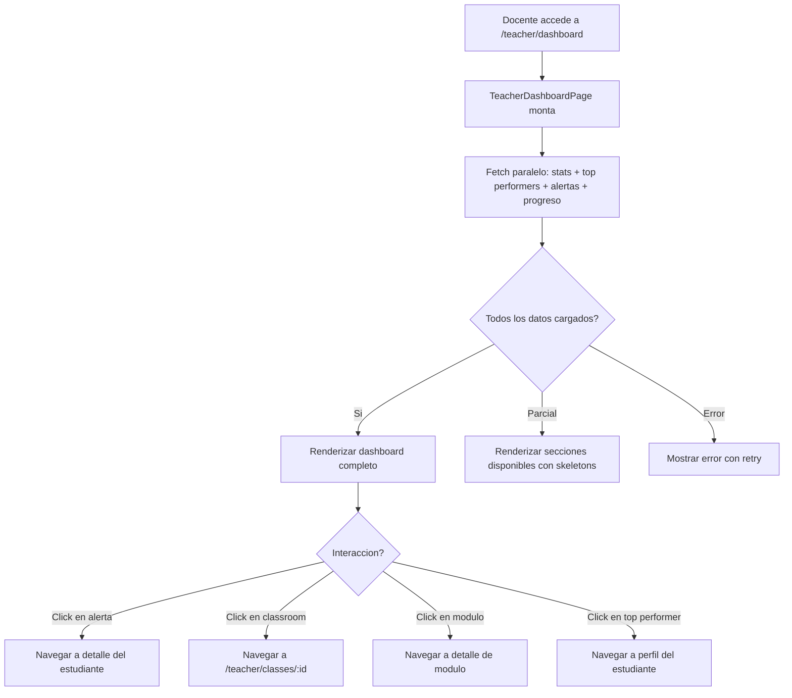

# FL-TCH-08 - Dashboard Docente

**ID:** FL-TCH-08
**Version:** 1.0.0
**Fecha:** 2026-02-17
**Estado:** Activo
**Portal:** Teacher
**Prioridad:** P1

---

## 1. Resumen

Flujo del dashboard principal del portal docente. Al iniciar sesion, el docente visualiza un resumen consolidado de sus aulas: estadisticas generales (total alumnos, ejercicios completados, promedio de calificaciones), top performers de la semana, alertas recientes (estudiantes en riesgo, asignaciones vencidas), y un overview del progreso por modulo educativo. El dashboard es el punto central de navegacion del portal y se actualiza en cada visita con datos en tiempo real del backend.

---

## 2. Precondiciones

- Usuario autenticado con rol `teacher`.
- Sesion activa con JWT valido.
- Docente asignado a al menos un classroom en social_features.teacher_classrooms.
- Estudiantes matriculados en al menos un classroom del docente.

---

## 3. Diagrama Mermaid



---

## 4. Secuencia FE -> BE -> DB

```
=== Carga inicial - Dashboard completo ===
1. FE: TeacherDashboardPage monta -> dispara 4 fetches en paralelo
2. FE: GET /api/v1/teacher/dashboard/stats
3. BE: TeacherController.getDashboardStats() -> agrega datos de todas las aulas del docente
4. DB: SELECT counts FROM social_features.teacher_classrooms tc
       JOIN social_features.classroom_members cm ON tc.classroom_id = cm.classroom_id
       JOIN progress_tracking.exercise_attempts ea ON cm.user_id = ea.user_id
       WHERE tc.teacher_id = :teacherId (RLS)
5. BE: Retorna { totalStudents, totalClassrooms, exercisesCompleted, avgGrade }

6. FE: GET /api/v1/teacher/dashboard/top-performers?limit=5
7. BE: TeacherController.getTopPerformers() -> ranking de estudiantes por XP
8. DB: SELECT FROM gamification_system.user_stats us
       JOIN social_features.classroom_members cm WHERE teacher classrooms (RLS)
       ORDER BY us.total_xp DESC LIMIT 5
9. BE: Retorna array de { studentId, name, avatar, totalXp, level, rank }

10. FE: GET /api/v1/teacher/dashboard/alerts
11. BE: TeacherController.getAlerts() -> alertas de estudiantes en riesgo
12. DB: SELECT estudiantes con bajo rendimiento o inactividad prolongada
13. BE: Retorna array de { type, studentId, studentName, message, severity, createdAt }

14. FE: GET /api/v1/teacher/dashboard/module-progress
15. BE: TeacherController.getModuleProgress() -> progreso agregado por modulo
16. DB: SELECT FROM progress_tracking.module_progress
        WHERE user_id IN (estudiantes de mis aulas) GROUP BY module_id
17. BE: Retorna array de { moduleId, moduleName, avgCompletion, studentCount }

18. FE: Renderiza 4 secciones: Stats cards, Top Performers, Alertas, Module Overview
```

---

## 5. Componentes y artefactos implicados

### Frontend

| Tipo | Archivo |
|------|---------|
| Pagina dashboard | `apps/frontend/src/apps/teacher/pages/TeacherDashboardPage.tsx` |
| API teacher | `apps/frontend/src/lib/api/teacher.api.ts` |
| Rutas | `apps/frontend/src/App.tsx` (ruta: `/teacher/dashboard`) |

### Backend

| Tipo | Archivo |
|------|---------|
| Controller teacher | `apps/backend/src/modules/teacher/controllers/teacher.controller.ts` |
| Service teacher | `apps/backend/src/modules/teacher/services/teacher.service.ts` |
| Guard JWT + Role | `apps/backend/src/modules/auth/guards/jwt-auth.guard.ts`, `roles.guard.ts` |

### Base de Datos

| Tipo | Archivo |
|------|---------|
| Tabla teacher_classrooms | `apps/database/ddl/schemas/social_features/tables/teacher_classrooms.sql` |
| Tabla module_progress | `apps/database/ddl/schemas/progress_tracking/tables/01-module_progress.sql` |
| Tabla exercise_attempts | `apps/database/ddl/schemas/progress_tracking/tables/02-exercise_attempts.sql` |
| Tabla user_stats | `apps/database/ddl/schemas/gamification_system/tables/01-user_stats.sql` |

---

## 6. Reglas y validaciones

| Regla | Capa | Descripcion |
|-------|------|-------------|
| Autenticacion + rol teacher | BE | JwtAuthGuard + RolesGuard(@Role('teacher')) |
| Solo datos de sus aulas | BE | Filtro por teacher_id del JWT en todas las queries |
| RLS por tenant | DB | Datos filtrados automaticamente por tenant_id |
| Top performers max 10 | BE | Limite parametrizable, default 5 |
| Alertas solo activas | BE | Solo alertas no resueltas (resolved_at IS NULL) |
| Agregacion por modulo | BE | Promedios calculados sobre estudiantes activos unicamente |
| Cache de stats | BE | Stats cacheados 5 minutos en Redis para reducir carga |

---

## 7. Manejo de errores

| Escenario | Capa | Codigo HTTP | Comportamiento |
|-----------|------|-------------|----------------|
| Token JWT expirado | BE | 401 | Redirige a login |
| Docente sin classrooms | FE | 200 | Muestra dashboard vacio con CTA "Solicita acceso a un aula" |
| Error parcial en fetch | FE | N/A | Secciones con error muestran skeleton + retry individual |
| Error de base de datos | BE | 500 | InternalServerErrorException, log de error |
| Sin estudiantes en aulas | FE | 200 | Stats en cero, secciones vacias con mensajes informativos |
| Timeout en agregacion | BE | 504 | FE muestra error con retry |

---

## 8. Trazabilidad cruzada

| Capa | Archivo | Evidencia |
|------|---------|-----------|
| Frontend Pagina | `apps/frontend/src/apps/teacher/pages/TeacherDashboardPage.tsx` | Dashboard principal docente |
| Backend Controller | `apps/backend/src/modules/teacher/controllers/teacher.controller.ts` | Endpoints dashboard |
| Backend Service | `apps/backend/src/modules/teacher/services/teacher.service.ts` | Logica de agregacion |
| DDL teacher_classrooms | `apps/database/ddl/schemas/social_features/tables/teacher_classrooms.sql` | Relacion docente-aula |
| DDL module_progress | `apps/database/ddl/schemas/progress_tracking/tables/01-module_progress.sql` | Progreso por modulo |
| DDL user_stats | `apps/database/ddl/schemas/gamification_system/tables/01-user_stats.sql` | XP y nivel de estudiantes |

---

## 9. Referencias

- Flujo gestion de clases: [FL-TCH-09](./FLUJO-GESTION-CLASES.md)
- Flujo analytics docente: [FL-TCH-04](./FLUJO-ANALYTICS-REPORTES.md)
- Guia portal docente: `docs/60-portals/teacher/PORTAL-TEACHER-GUIDE.md`
