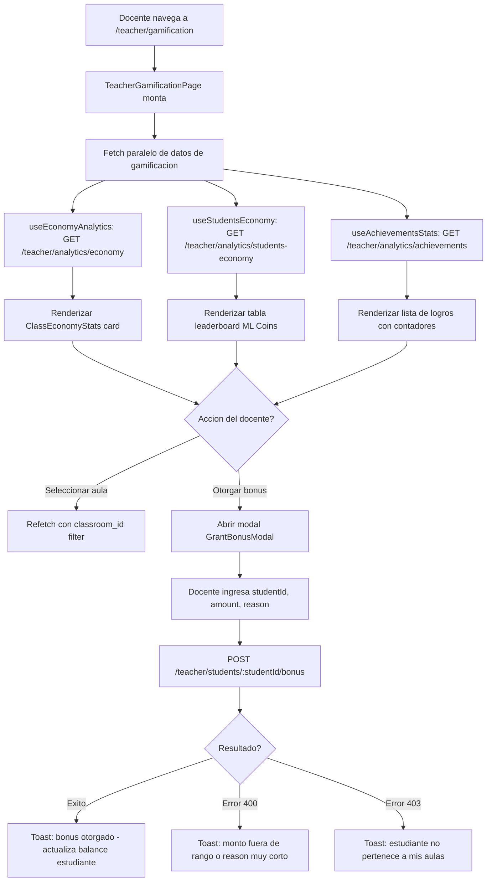

# FL-TCH-11 - Gamificacion Docente

**ID:** FL-TCH-11
**Version:** 1.0.0
**Fecha:** 2026-02-27
**Estado:** Activo
**Portal:** Teacher
**Prioridad:** P2

---

## 1. Resumen

Flujo de la pagina `/teacher/gamification` del portal docente. Permite al maestro visualizar la economia de ML Coins de sus aulas (circulacion total, balance promedio, inflacion), consultar el leaderboard de estudiantes por ML Coins, ver estadisticas de logros desbloqueados por sus estudiantes, y otorgar bonus manuales de ML Coins a estudiantes individuales como recompensa por buen comportamiento o participacion especial. La pagina actua como panel de control de la economia gamificada del aula.

---

## 2. Precondiciones

- Usuario autenticado con rol `teacher` o `admin_teacher`.
- Sesion activa con JWT valido.
- Docente asignado a al menos un classroom activo con estudiantes.
- El sistema de gamificacion esta activo para el tenant.

---

## 3. Diagrama Mermaid



---

## 4. Secuencia FE -> BE -> DB

```
=== Carga inicial de metricas de economia ===
1. FE: TeacherGamificationPage monta -> dispara 3 fetches en paralelo
2. FE: GET /api/v1/teacher/analytics/economy (useEconomyAnalytics)
3. BE: TeacherController.getEconomyAnalytics() -> AnalyticsService.getEconomyAnalytics(teacherId)
4. DB: SELECT SUM(ml_coins_balance), AVG(ml_coins_balance), distribution stats
        FROM gamification_system.user_economy ue
        JOIN social_features.classroom_members cm ON ue.user_id = cm.user_id
        JOIN social_features.teacher_classrooms tc ON cm.classroom_id = tc.classroom_id
        WHERE tc.teacher_id = :teacherId
5. BE: Retorna EconomyAnalyticsDto { totalCirculation, averageBalance, inflationRate,
       distributionByRange, topEarners, wealthDistribution: { top10Pct, bottom50Pct } }

6. FE: GET /api/v1/teacher/analytics/students-economy (useStudentsEconomy)
7. BE: TeacherController.getStudentsEconomy() -> AnalyticsService.getStudentsEconomy(teacherId)
8. DB: SELECT u.full_name, ue.ml_coins_balance, ue.total_earned_this_week, ue.total_spent_this_week,
              us.current_rank, us.level
        FROM gamification_system.user_economy ue
        JOIN gamification_system.user_stats us ON ue.user_id = us.user_id
        JOIN auth.users u ON ue.user_id = u.id
        WHERE user_id IN (students de mis aulas)
        ORDER BY ue.ml_coins_balance DESC
9. BE: Retorna StudentsEconomyResponseDto { students: StudentEconomyData[], pagination }

10. FE: GET /api/v1/teacher/analytics/achievements (useAchievementsStats)
11. BE: TeacherController.getAchievementsStats() -> AnalyticsService.getAchievementsStats(teacherId)
12. DB: SELECT a.name, a.description, a.icon, COUNT(ua.user_id) as unlock_count
         FROM gamification_system.achievements a
         LEFT JOIN gamification_system.user_achievements ua ON a.id = ua.achievement_id
             AND ua.user_id IN (students de mis aulas)
         GROUP BY a.id ORDER BY unlock_count DESC
13. BE: Retorna AchievementsStatsResponseDto { achievements: AchievementWithStats[] }

14. FE: Renderiza 3 secciones: ClassEconomyStats card, tabla leaderboard, lista de logros

=== Filtro por aula ===
15. FE: Docente selecciona aula del dropdown
16. FE: Refetch con query param classroom_id=:classroomId en los 3 endpoints
17. BE: Filtra por classroom_id en lugar de todos los classrooms del teacher

=== Otorgar bonus manual de ML Coins ===
18. FE: Click en icono de regalo junto a un estudiante -> abre GrantBonusModal
19. FE: Docente ingresa amount (1-1000), reason (min 10 chars)
20. FE: POST /api/v1/teacher/students/:studentId/bonus
        Body: { amount: 50, reason: "Excelente participacion en debate" }
21. BE: TeacherController.grantBonus() -> BonusCoinsService.grantBonus(teacherId, studentId, dto)
22. BE: Valida que amount este en rango [1, 1000] y reason tenga minimo 10 chars
23. BE: Valida que studentId pertenezca a un classroom del teacher (acceso)
24. DB: UPDATE gamification_system.user_economy SET ml_coins_balance += :amount WHERE user_id = :studentId
        INSERT INTO gamification_system.coin_transactions (user_id, amount, reason, granted_by) VALUES ...
25. BE: Retorna GrantBonusResponseDto { studentName, newBalance, bonusAmount, grantedAt }
26. FE: Cierra modal, invalida queries -> refetch tabla leaderboard
27. FE: Toast de exito: "50 ML Coins otorgados a [nombre]"
```

---

## 5. Componentes y artefactos implicados

### Frontend

| Tipo | Archivo |
|------|---------|
| Pagina | `apps/frontend/src/apps/teacher/pages/TeacherGamificationPage.tsx` |
| Hook economy analytics | `apps/frontend/src/apps/teacher/hooks/useEconomyAnalytics.ts` |
| Hook students economy | `apps/frontend/src/apps/teacher/hooks/useStudentsEconomy.ts` |
| Hook achievements stats | `apps/frontend/src/apps/teacher/hooks/useAchievementsStats.ts` |
| Hook grant bonus | `apps/frontend/src/apps/teacher/hooks/useGrantBonus.ts` |
| Ruta | `apps/frontend/src/App.tsx` (ruta: `/teacher/gamification`) |

### Backend

| Tipo | Archivo |
|------|---------|
| Controller teacher | `apps/backend/src/modules/teacher/controllers/teacher.controller.ts` |
| Service analytics | `apps/backend/src/modules/teacher/services/analytics.service.ts` |
| Service bonus coins | `apps/backend/src/modules/teacher/services/bonus-coins.service.ts` |

### Base de Datos

| Tipo | Archivo |
|------|---------|
| Tabla user_economy | `apps/database/ddl/schemas/gamification_system/tables/user_economy.sql` |
| Tabla user_stats | `apps/database/ddl/schemas/gamification_system/tables/01-user_stats.sql` |
| Tabla user_achievements | `apps/database/ddl/schemas/gamification_system/tables/user_achievements.sql` |
| Tabla achievements | `apps/database/ddl/schemas/gamification_system/tables/achievements.sql` |
| Tabla coin_transactions | `apps/database/ddl/schemas/gamification_system/tables/coin_transactions.sql` |

---

## 6. Endpoints Involucrados

| Metodo | Ruta | Descripcion |
|--------|------|-------------|
| GET | `/api/v1/teacher/analytics/economy` | Estadisticas de economia ML Coins del aula |
| GET | `/api/v1/teacher/analytics/students-economy` | Datos economicos por estudiante (balance, ganancias) |
| GET | `/api/v1/teacher/analytics/achievements` | Logros con conteo de desbloqueos por estudiantes |
| POST | `/api/v1/teacher/students/:studentId/bonus` | Otorgar bonus manual de ML Coins |

---

## 7. Reglas y validaciones

| Regla | Capa | Descripcion |
|-------|------|-------------|
| Autenticacion + rol teacher | BE | JwtAuthGuard + RolesGuard(@Roles(ADMIN_TEACHER)) |
| Bonus: rango [1, 1000] | BE | BonusCoinsService valida amount con BadRequestException |
| Bonus: reason minimo 10 chars | BE | Validacion en GrantBonusDto con class-validator |
| Solo bonus a propios estudiantes | BE | BonusCoinsService verifica que student este en classrooms del teacher |
| Docente no puede modificar tasas | FE | Solo Admin puede cambiar porcentajes de recompensa (read-only en esta pagina) |
| RLS por tenant | DB | Todas las consultas filtradas por tenant_id automaticamente |
| Filtro por classroom opcional | BE | Sin classroom_id = datos agregados de todas las aulas del teacher |

---

## 8. Manejo de errores

| Escenario | Capa | Codigo HTTP | Comportamiento |
|-----------|------|-------------|----------------|
| Token JWT expirado | BE | 401 | Redirige a login |
| Estudiante sin balance | BE | 200 | Retorna balance = 0, se muestra correctamente |
| Monto de bonus invalido | BE | 400 | Toast: "El monto debe estar entre 1 y 1000 ML Coins" |
| Reason muy corto | BE | 400 | Toast: "El motivo debe tener al menos 10 caracteres" |
| Estudiante no en mis aulas | BE | 403 | Toast: "No tienes acceso a este estudiante" |
| Error en carga de achievements | FE | N/A | Seccion muestra error con retry, resto carga |

---

## 9. Trazabilidad cruzada

| Capa | Archivo | Evidencia |
|------|---------|-----------|
| Frontend Pagina | `apps/frontend/src/apps/teacher/pages/TeacherGamificationPage.tsx` | Panel economia gamificada |
| Backend Service | `apps/backend/src/modules/teacher/services/analytics.service.ts` | Metodos getEconomyAnalytics, getStudentsEconomy, getAchievementsStats |
| Backend Service | `apps/backend/src/modules/teacher/services/bonus-coins.service.ts` | Logica de otorgar bonus manual |
| DDL user_economy | `apps/database/ddl/schemas/gamification_system/tables/user_economy.sql` | Balance y transacciones ML Coins |
| DDL achievements | `apps/database/ddl/schemas/gamification_system/tables/achievements.sql` | Catalogo de logros del sistema |

---

## 10. Referencias

- Flujo analytics y reportes: [FL-TCH-04](./FLUJO-ANALYTICS-REPORTES.md)
- Flujo gestion estudiantes: [FL-TCH-09](./FLUJO-GESTION-ESTUDIANTES.md)
- Guia portal docente: `docs/60-portals/teacher/PORTAL-TEACHER-GUIDE.md`
