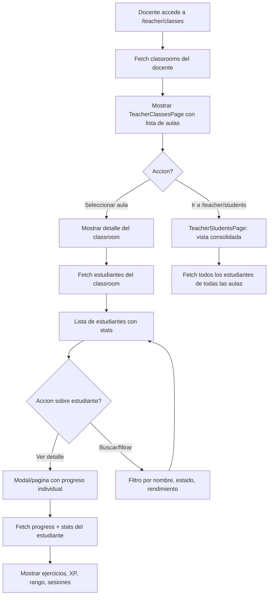

# FL-TCH-09 - Gestion de Clases

**ID:** FL-TCH-09
**Version:** 1.0.0
**Fecha:** 2026-02-17
**Estado:** Activo
**Portal:** Teacher
**Prioridad:** P1

---

## 1. Resumen

Flujo de gestion de aulas y estudiantes desde el portal docente. El docente visualiza sus classrooms asignados, puede ver la lista de estudiantes de cada aula, revisar el progreso individual de cada alumno, y gestionar la membresia del aula. Incluye funcionalidades de busqueda, filtrado por estado academico, y navegacion al detalle de cada estudiante con su historial de ejercicios y estadisticas de gamificacion.

---

## 2. Precondiciones

- Usuario autenticado con rol `teacher`.
- Sesion activa con JWT valido.
- Docente vinculado a al menos un classroom via social_features.teacher_classrooms.
- Classrooms con al menos un estudiante matriculado.

---

## 3. Diagrama Mermaid



---

## 4. Secuencia FE -> BE -> DB

```
=== Carga inicial - Lista de classrooms ===
1. FE: TeacherClassesPage monta -> solicita classrooms
2. FE: GET /api/v1/teacher/classrooms
3. BE: TeacherClassroomsController.getMyClassrooms() -> TeacherClassroomsService.findByTeacher()
4. DB: SELECT FROM social_features.classrooms c
       JOIN social_features.teacher_classrooms tc ON c.id = tc.classroom_id
       WHERE tc.teacher_id = :teacherId (RLS)
5. BE: Retorna array de { id, name, grade, studentCount, avgProgress }
6. FE: Renderiza cards de classrooms con metricas

=== Detalle del classroom - Estudiantes ===
7. FE: Docente selecciona classroom -> mostrar detalle
8. FE: GET /api/v1/teacher/classrooms/:classroomId/students
9. BE: TeacherClassroomsController.getClassroomStudents()
10. DB: SELECT FROM social_features.classroom_members cm
        JOIN auth_management.profiles p ON cm.user_id = p.user_id
        WHERE cm.classroom_id = :classroomId (RLS)
11. BE: Retorna array de { studentId, name, avatar, lastActive, exercisesCompleted, avgGrade }
12. FE: Renderiza tabla de estudiantes con columnas ordenables

=== Vista consolidada de estudiantes ===
13. FE: Navegar a /teacher/students
14. FE: GET /api/v1/teacher/students?page=1&limit=25&search=&sort=name
15. BE: Agrega estudiantes de todas las aulas del docente
16. DB: SELECT DISTINCT FROM social_features.classroom_members WHERE classroom_id IN (mis aulas)
17. FE: Tabla paginada con busqueda y filtros

=== Progreso individual del estudiante ===
18. FE: Click en estudiante -> modal o vista detallada
19. FE: GET /api/v1/teacher/students/:studentId/progress
20. BE: Consulta progreso, stats y sesiones del estudiante
21. DB: SELECT FROM progress_tracking.module_progress + gamification_system.user_stats
        WHERE user_id = :studentId
22. FE: Muestra graficas de progreso, historial, y estadisticas de gamificacion
```

---

## 5. Componentes y artefactos implicados

### Frontend

| Tipo | Archivo |
|------|---------|
| Pagina clases | `apps/frontend/src/apps/teacher/pages/TeacherClassesPage.tsx` |
| Pagina estudiantes | `apps/frontend/src/apps/teacher/pages/TeacherStudentsPage.tsx` |
| API teacher | `apps/frontend/src/lib/api/teacher.api.ts` |
| Rutas | `apps/frontend/src/App.tsx` (rutas: `/teacher/classes`, `/teacher/students`) |

### Backend

| Tipo | Archivo |
|------|---------|
| Controller classrooms | `apps/backend/src/modules/teacher/controllers/teacher-classrooms.controller.ts` |
| Controller social classrooms | `apps/backend/src/modules/social/controllers/classrooms.controller.ts` |
| Service teacher classrooms | `apps/backend/src/modules/teacher/services/teacher-classrooms.service.ts` |
| Guard JWT + Role | `apps/backend/src/modules/auth/guards/jwt-auth.guard.ts`, `roles.guard.ts` |

### Base de Datos

| Tipo | Archivo |
|------|---------|
| Tabla classrooms | `apps/database/ddl/schemas/social_features/tables/classrooms.sql` |
| Tabla classroom_members | `apps/database/ddl/schemas/social_features/tables/classroom_members.sql` |
| Tabla profiles | `apps/database/ddl/schemas/auth_management/tables/03-profiles.sql` |
| Tabla teacher_classrooms | `apps/database/ddl/schemas/social_features/tables/teacher_classrooms.sql` |

---

## 6. Reglas y validaciones

| Regla | Capa | Descripcion |
|-------|------|-------------|
| Autenticacion + rol teacher | BE | JwtAuthGuard + RolesGuard(@Role('teacher')) |
| Solo aulas propias | BE | Docente solo accede a classrooms donde es teacher |
| RLS por tenant | DB | Datos filtrados automaticamente por tenant_id |
| Paginacion obligatoria | BE | Default limit=25, max=100 |
| Busqueda case-insensitive | BE | Filtro por nombre usando ILIKE |
| Estudiante en multiples aulas | BE | Vista consolidada usa DISTINCT para evitar duplicados |
| Ordenamiento configurable | BE | Por nombre, ultima actividad, promedio, XP |

---

## 7. Manejo de errores

| Escenario | Capa | Codigo HTTP | Comportamiento |
|-----------|------|-------------|----------------|
| Token JWT expirado | BE | 401 | Redirige a login |
| Classroom no encontrado | BE | 404 | NotFoundException |
| Docente sin acceso a classroom | BE | 403 | ForbiddenException |
| Sin estudiantes en aula | FE | 200 | Estado vacio "No hay estudiantes matriculados" |
| Estudiante sin datos de progreso | FE | 200 | Muestra metricas en cero |
| Error de red en busqueda | FE | N/A | Debounce 300ms + retry |
| Timeout en query compleja | BE | 504 | FE muestra error con retry |

---

## 8. Trazabilidad cruzada

| Capa | Archivo | Evidencia |
|------|---------|-----------|
| Frontend Pagina | `apps/frontend/src/apps/teacher/pages/TeacherClassesPage.tsx` | Lista de aulas |
| Frontend Pagina | `apps/frontend/src/apps/teacher/pages/TeacherStudentsPage.tsx` | Vista consolidada estudiantes |
| Backend Controller | `apps/backend/src/modules/teacher/controllers/teacher-classrooms.controller.ts` | Endpoints de aulas docente |
| Backend Controller | `apps/backend/src/modules/social/controllers/classrooms.controller.ts` | Endpoints sociales de aulas |
| DDL classrooms | `apps/database/ddl/schemas/social_features/tables/classrooms.sql` | Tabla de aulas |
| DDL classroom_members | `apps/database/ddl/schemas/social_features/tables/classroom_members.sql` | Miembros de aula |
| DDL profiles | `apps/database/ddl/schemas/auth_management/tables/03-profiles.sql` | Perfiles de estudiantes |

---

## 9. Referencias

- Flujo dashboard docente: [FL-TCH-08](./FLUJO-DASHBOARD-DOCENTE.md)
- Flujo asignaciones docente: [FL-TCH-02](./FLUJO-ASIGNACIONES-CLASE.md)
- Guia portal docente: `docs/60-portals/teacher/PORTAL-TEACHER-GUIDE.md`
