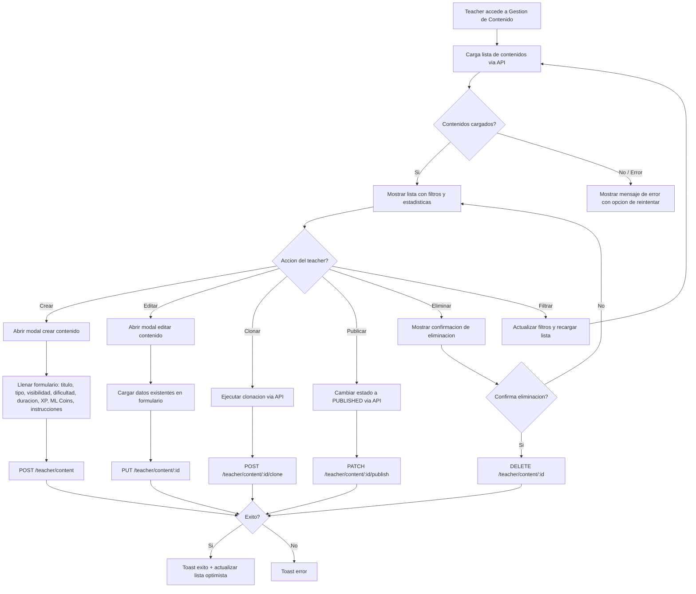

# FL-TCH-05 - Teacher Content Management

**ID:** FL-TCH-05
**Version:** 1.0.0
**Fecha:** 2026-02-17
**Estado:** Activo
**Portal:** Teacher
**Prioridad:** P2

---

## 1. Resumen

Flujo completo de gestion de contenido educativo personalizado desde el portal Teacher. El docente puede crear, editar, clonar, publicar y eliminar contenidos educativos (ejercicios personalizados, hojas de trabajo, material de lectura, lecciones en video, presentaciones, cuestionarios, asignaciones y paquetes de recursos). Incluye filtros por tipo, estado y busqueda, asi como paginacion de resultados. Los contenidos siguen un ciclo de vida: borrador, pendiente de revision, aprobado, publicado y archivado.

---

## 2. Precondiciones

- Usuario autenticado con rol `admin_teacher`.
- Sesion activa con JWT valido.
- Tenant asignado (multi-tenancy RLS activo).
- Acceso al portal Teacher (redireccion post-login basada en rol).
- Permisos de gestion de contenido habilitados para el teacher.

---

## 3. Diagrama Mermaid



---

## 4. Secuencia FE -> BE -> DB

```
1. FE: TeacherContentManagement monta → useTeacherContent() dispara fetchContent()
2. FE: teacherContentApi.getContent(params) → GET /teacher/content?filters
3. BE: TeacherContentController.getContent() → TeacherContentService.findAll()
4. DB: SELECT FROM educational_content.teacher_content WHERE tenant_id = current (RLS)
5. BE: Retorna PaginatedTeacherContentResponseDto {data, total, limit, offset}
6. FE: Renderiza lista, estadisticas (total, publicados, borradores)

--- Crear contenido ---
7. FE: handleSave() → teacherContentApi.createContent(data)
8. BE: TeacherContentController.create() → TeacherContentService.create()
9. DB: INSERT INTO educational_content.teacher_content (...)
10. BE: Retorna TeacherContentResponseDto
11. FE: Actualizacion optimista — agrega al inicio de lista + toast exito

--- Editar contenido ---
12. FE: handleSave() → teacherContentApi.updateContent(id, data)
13. BE: TeacherContentController.update() → TeacherContentService.update()
14. DB: UPDATE educational_content.teacher_content SET ... WHERE id = :id
15. FE: Reemplaza item en lista local + toast exito

--- Clonar contenido ---
16. FE: handleClone() → teacherContentApi.cloneContent(id, cloneData)
17. BE: TeacherContentController.clone() → TeacherContentService.clone()
18. DB: INSERT (copia de contenido con nuevo titulo y status DRAFT)
19. FE: Agrega clon al inicio de lista + toast exito

--- Publicar contenido ---
20. FE: handlePublish() → teacherContentApi.publishContent(id)
21. BE: TeacherContentController.publish() → TeacherContentService.publish()
22. DB: UPDATE educational_content.teacher_content SET status = 'published'
23. FE: Actualiza estado en lista + toast exito

--- Eliminar contenido ---
24. FE: handleDelete() (post-confirmacion) → teacherContentApi.deleteContent(id)
25. BE: TeacherContentController.delete() → TeacherContentService.softDelete()
26. DB: UPDATE educational_content.teacher_content SET deleted_at = NOW()
27. FE: Remueve de lista local + toast exito
```

---

## 5. Componentes y artefactos implicados

### Frontend

| Tipo | Archivo |
|------|---------|
| Pagina | `apps/frontend/src/apps/teacher/pages/TeacherContentManagementPage.tsx` |
| Hook | `apps/frontend/src/apps/teacher/hooks/useTeacherContent.ts` |
| API Service | `apps/frontend/src/services/api/teacher/teacherContentApi.ts` |
| Layout | `apps/frontend/src/apps/teacher/layouts/TeacherLayout.tsx` |
| Componente base | `apps/frontend/src/shared/components/base/DetectiveCard.tsx` |
| Componente base | `apps/frontend/src/shared/components/base/DetectiveButton.tsx` |
| Rutas | `apps/frontend/src/App.tsx` |

### Backend

| Tipo | Archivo |
|------|---------|
| Controller | `apps/backend/src/modules/teacher/controllers/teacher-content.controller.ts` |
| Service | `apps/backend/src/modules/teacher/services/teacher-content.service.ts` |
| DTO | `apps/backend/src/modules/teacher/dto/teacher-content.dto.ts` |
| Entity | `apps/backend/src/modules/teacher/entities/teacher-content.entity.ts` |
| Guard | `apps/backend/src/modules/auth/guards/jwt-auth.guard.ts` |
| Guard | `apps/backend/src/modules/auth/guards/roles.guard.ts` |

### Base de Datos

| Tipo | Archivo |
|------|---------|
| Tabla teacher_content | `apps/database/ddl/schemas/educational_content/tables/25-teacher_content.sql` |
| RLS policies | `apps/database/ddl/schemas/educational_content/` (politicas por schema) |
| Enums content_status | `apps/database/ddl/schemas/content_management/enums/content_status.sql` |
| Enums content_type | `apps/database/ddl/schemas/content_management/enums/content_type.sql` |

---

## 6. Reglas y validaciones

| Regla | Capa | Descripcion |
|-------|------|-------------|
| Titulo obligatorio | FE + BE | El campo `title` es requerido para crear/editar contenido |
| Tipo de contenido valido | FE + BE | Debe ser uno de: CUSTOM_EXERCISE, WORKSHEET, READING_MATERIAL, VIDEO_LESSON, PRESENTATION, QUIZ, ASSIGNMENT, RESOURCE_PACK |
| Visibilidad valida | FE + BE | Debe ser: PRIVATE, CLASSROOM, SCHOOL, PUBLIC |
| Dificultad valida | FE + BE | Debe ser: easy, medium, hard, expert (DDL CHECK constraint) |
| Solo el creador puede editar | BE | El teacher solo puede gestionar sus propios contenidos |
| Publicacion requiere campos completos | BE | Solo contenidos con titulo, tipo y visibilidad pueden publicarse |
| Soft delete | BE + DB | La eliminacion es logica (deleted_at), no fisica |
| RLS por tenant | DB | Contenidos filtrados automaticamente por tenant_id del teacher |
| Paginacion por defecto | FE + BE | Limite de 20 registros por pagina, offset 0 |

---

## 7. Manejo de errores

| Escenario | Capa | Codigo HTTP | Comportamiento |
|-----------|------|-------------|----------------|
| Token JWT expirado | BE | 401 | Redirige a login, refresca token si refresh valido |
| Rol no autorizado (no es teacher) | BE | 403 | Muestra error "No autorizado" |
| Contenido no encontrado | BE | 404 | Toast error "Contenido no encontrado" |
| Titulo vacio al crear | FE | N/A | Boton "Crear" deshabilitado, validacion local |
| Error de red al cargar lista | FE | N/A | Muestra banner de error con boton cerrar |
| Error al crear contenido | BE | 400/500 | Toast error con mensaje del servidor |
| Error al clonar contenido | BE | 400/500 | Toast error "Error al clonar contenido" |
| Error al publicar contenido | BE | 400/500 | Toast error "Error al publicar contenido" |
| Error al eliminar contenido | BE | 400/500 | Toast error "Error al eliminar contenido" |
| Violacion de RLS | DB | 403 | "Forbidden" — contenido no pertenece al tenant |

---

## 8. Trazabilidad cruzada

| Capa | Archivo | Evidencia |
|------|---------|-----------|
| Frontend Pagina | `apps/frontend/src/apps/teacher/pages/TeacherContentManagementPage.tsx` | Componente principal, CRUD completo con modales |
| Frontend Hook | `apps/frontend/src/apps/teacher/hooks/useTeacherContent.ts` | Estado, filtros, paginacion, metodos CRUD |
| Frontend API | `apps/frontend/src/services/api/teacher/teacherContentApi.ts` | Llamadas HTTP a endpoints /teacher/content |
| Backend Controller | `apps/backend/src/modules/teacher/controllers/teacher-content.controller.ts` | Endpoints REST: GET, POST, PUT, DELETE, PATCH |
| Backend Service | `apps/backend/src/modules/teacher/services/teacher-content.service.ts` | Logica de negocio CRUD + clonar + publicar |
| Backend DTO | `apps/backend/src/modules/teacher/dto/teacher-content.dto.ts` | Validacion de entrada/salida |
| Backend Entity | `apps/backend/src/modules/teacher/entities/teacher-content.entity.ts` | Mapeo ORM a tabla teacher_content |
| DDL | `apps/database/ddl/schemas/educational_content/tables/25-teacher_content.sql` | Definicion de tabla con campos y constraints |

---

## 9. Referencias

- Epic: EPIC-GAM-F3-CONTENT
- Especificacion: `docs/10-requirements/epics/EPIC-GAM-F3-CONTENT/_INDEX.md`
- Guia portal teacher: `docs/60-portals/teacher/PORTAL-TEACHER-GUIDE.md`
- Estandar API: `docs/50-guides/backend/impl/README.md`
- ADR-011: Frontend API Client Structure (`docs/90-adr/ADR-011-frontend-api-client-structure.md`)
