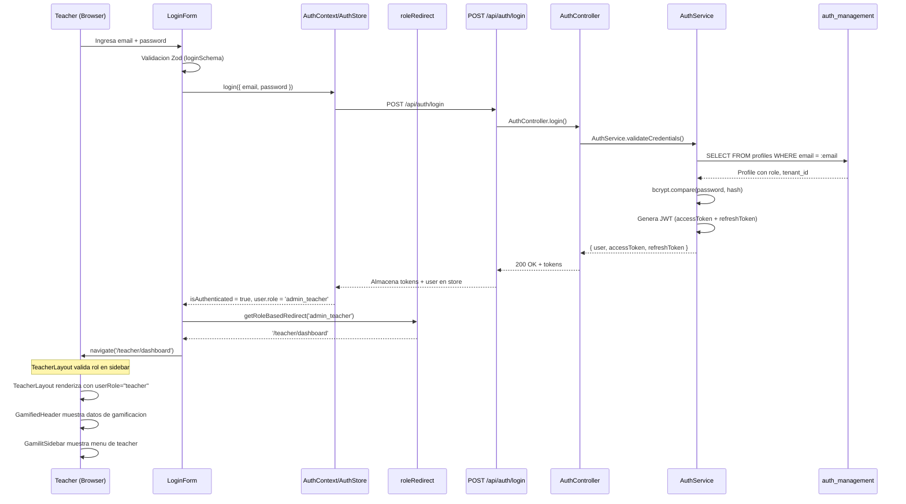

# FL-TCH-06 - Teacher Role-Specific Login

**ID:** FL-TCH-06
**Version:** 1.0.0
**Fecha:** 2026-02-17
**Estado:** Activo
**Portal:** Teacher
**Prioridad:** P3

---

## 1. Resumen

Flujo de autenticacion y redireccion especifica para el rol docente (admin_teacher). El login es compartido entre todos los roles a traves del formulario LoginForm, pero tras autenticarse exitosamente, el sistema detecta el rol del usuario y redirige automaticamente al portal correspondiente. Para docentes, la redireccion es a `/teacher/dashboard`. El flujo incluye: validacion de credenciales, generacion de JWT (access + refresh token), role-based redirect, proteccion de rutas con guards en el layout, y manejo de sesion con remember me. El portal Teacher usa TeacherLayout con GamifiedHeader y GamilitSidebar con seccion `userRole="teacher"`.

---

## 2. Precondiciones

- Cuenta de usuario existente con rol `admin_teacher` en la base de datos.
- Tenant asignado al usuario.
- Servicio de autenticacion (backend) disponible.
- Endpoint POST /api/auth/login operativo.

---

## 3. Diagrama Mermaid



---

## 4. Secuencia FE -> BE -> DB

```
=== Login ===
1. FE: Teacher accede a /login → LoginForm renderiza
2. FE: useForm con zodResolver(loginSchema) → validacion email/password
3. FE: onSubmit → clearError() + localStorage.removeItem('is_logging_out')
4. FE: AuthContext.login({ email, password }) o AuthStore.login()
5. FE: POST /api/auth/login con body { email, password }
6. BE: AuthController.login() → Throttle(60s, 3 intentos)
7. BE: AuthService.validateUser(email, password)
8. DB: SELECT FROM auth_management.profiles WHERE email = :email (con tenant RLS)
9. DB: SELECT FROM auth_management.roles para obtener rol del usuario
10. BE: bcrypt.compare(password, hashed_password)
11. BE: Genera accessToken (JWT, corta duracion) + refreshToken (larga duracion)
12. DB: INSERT INTO auth_management.user_sessions (nueva sesion)
13. BE: Retorna { user: { id, email, role, tenant_id, ... }, accessToken, refreshToken }

=== Redirect por rol ===
14. FE: AuthStore/AuthContext almacena user + tokens
15. FE: isAuthenticated = true → useEffect en LoginForm detecta cambio
16. FE: getRoleBasedRedirect(user.role) → 'admin_teacher' mapea a '/teacher/dashboard'
17. FE: navigate('/teacher/dashboard')

=== Carga del portal Teacher ===
18. FE: App.tsx route /teacher/* → ProtectedRoute verifica isAuthenticated
19. FE: TeacherLayout renderiza con user, gamificationData, organizationName
20. FE: GamifiedHeader muestra XP, nivel, rango maya del teacher
21. FE: GamilitSidebar con userRole="teacher" muestra navegacion de teacher
22. FE: children (TeacherDashboard) renderiza dentro del layout

=== Logout ===
23. FE: TeacherLayout.onLogout → logout() del AuthStore
24. FE: Limpia tokens, user, isAuthenticated
25. FE: localStorage.setItem('is_logging_out', 'true')
26. FE: window.location.href = '/login'
```

---

## 5. Componentes y artefactos implicados

### Frontend

| Tipo | Archivo |
|------|---------|
| Login Form | `apps/frontend/src/features/auth/components/LoginForm.tsx` |
| Auth Context | `apps/frontend/src/app/providers/AuthContext.tsx` |
| Auth Store | `apps/frontend/src/features/auth/store/authStore.ts` |
| Auth Hook (Zustand) | `apps/frontend/src/features/auth/hooks/useAuth.ts` |
| Auth API | `apps/frontend/src/features/auth/api/authAPI.ts` |
| Auth Schemas | `apps/frontend/src/shared/schemas/auth.schemas.ts` |
| Role Redirect | `apps/frontend/src/shared/utils/roleRedirect.ts` |
| Teacher Layout | `apps/frontend/src/apps/teacher/layouts/TeacherLayout.tsx` |
| Gamified Header | `apps/frontend/src/shared/components/layout/GamifiedHeader.tsx` |
| Sidebar | `apps/frontend/src/shared/components/layout/GamilitSidebar.tsx` |
| Rutas | `apps/frontend/src/App.tsx` |

### Backend

| Tipo | Archivo |
|------|---------|
| Controller Auth | `apps/backend/src/modules/auth/controllers/auth.controller.ts` |
| Controller Password | `apps/backend/src/modules/auth/controllers/password.controller.ts` |
| Service Auth | `apps/backend/src/modules/auth/services/auth.service.ts` |
| Guard JWT | `apps/backend/src/modules/auth/guards/jwt-auth.guard.ts` |
| Guard Roles | `apps/backend/src/modules/auth/guards/roles.guard.ts` |
| Entity User | `apps/backend/src/modules/auth/entities/user.entity.ts` |
| Entity Profile | `apps/backend/src/modules/auth/entities/profile.entity.ts` |
| Entity Role | `apps/backend/src/modules/auth/entities/role.entity.ts` |
| Entity Session | `apps/backend/src/modules/auth/entities/user-session.entity.ts` |
| Entity Auth Attempt | `apps/backend/src/modules/auth/entities/auth-attempt.entity.ts` |
| Entity Tenant | `apps/backend/src/modules/auth/entities/tenant.entity.ts` |

### Base de Datos

| Tipo | Archivo |
|------|---------|
| Tabla profiles | `apps/database/ddl/schemas/auth_management/tables/03-profiles.sql` |
| Tabla roles | `apps/database/ddl/schemas/auth_management/tables/03b-roles.sql` |
| Tabla roles (legacy) | `apps/database/ddl/schemas/auth_management/tables/04-roles.sql` |
| Tabla user_sessions | `apps/database/ddl/schemas/auth_management/tables/11-user_sessions.sql` |
| Tabla auth_attempts | `apps/database/ddl/schemas/auth_management/tables/02-auth_attempts.sql` |
| Tabla tenants | `apps/database/ddl/schemas/auth_management/tables/01-tenants.sql` |
| Trigger default tenant | `apps/database/ddl/schemas/auth_management/triggers/01-trg_set_default_tenant.sql` |

---

## 6. Reglas y validaciones

| Regla | Capa | Descripcion |
|-------|------|-------------|
| Email valido (formato) | FE | Zod schema con z.string().email() |
| Password minimo 6 chars | FE | Zod schema con z.string().min(6) |
| Throttle login 3/60s | BE | @Throttle({ default: { ttl: 60000, limit: 3 } }) |
| Role-based redirect | FE | admin_teacher -> /teacher/dashboard (getRoleBasedRedirect) |
| JWT expiration corta | BE | Access token expira en minutos |
| Refresh token larga vida | BE | Refresh token para renovacion de sesion |
| Remember me | FE | localStorage flag para persistencia de sesion |
| is_logging_out flag | FE | Previene auto-redirect loop al hacer logout |
| TeacherLayout userRole | FE | GamilitSidebar recibe userRole="teacher" para menu correcto |
| RLS por tenant | DB | Login filtra por tenant del usuario |

---

## 7. Manejo de errores

| Escenario | Capa | Codigo HTTP | Comportamiento |
|-----------|------|-------------|----------------|
| Email no registrado | BE | 401 | UnauthorizedException, FE muestra error de auth |
| Password incorrecta | BE | 401 | UnauthorizedException, FE muestra error de auth |
| Cuenta suspendida | BE | 403 | Forbidden, mensaje "Cuenta suspendida" |
| Throttle excedido | BE | 429 | TooManyRequests, "Demasiados intentos" |
| Email formato invalido | FE | N/A | Validacion Zod, mensaje inline bajo input |
| Password muy corta | FE | N/A | Validacion Zod, mensaje inline bajo input |
| Error de red | FE | N/A | AuthContext.error mostrado como banner |
| Token refresh fallido | FE | 401 | Redirige a login, limpia sesion |
| Rol desconocido | FE | N/A | Fallback a /dashboard (portal estudiante) |
| Acceso a ruta teacher sin rol | FE | N/A | ProtectedRoute redirige a login |

---

## 8. Trazabilidad cruzada

| Capa | Archivo | Evidencia |
|------|---------|-----------|
| Frontend LoginForm | `apps/frontend/src/features/auth/components/LoginForm.tsx` | Formulario con Zod, auto-redirect por rol, getRoleBasedRedirect |
| Frontend AuthContext | `apps/frontend/src/app/providers/AuthContext.tsx` | Provider de autenticacion con login/logout/user |
| Frontend AuthStore | `apps/frontend/src/features/auth/store/authStore.ts` | Zustand store con user, tokens, isAuthenticated |
| Frontend roleRedirect | `apps/frontend/src/shared/utils/roleRedirect.ts` | Mapeo: admin_teacher -> /teacher/dashboard |
| Frontend TeacherLayout | `apps/frontend/src/apps/teacher/layouts/TeacherLayout.tsx` | Layout con GamifiedHeader + GamilitSidebar userRole="teacher" |
| Backend AuthController | `apps/backend/src/modules/auth/controllers/auth.controller.ts` | POST /api/auth/login con throttle |
| Backend AuthService | `apps/backend/src/modules/auth/services/auth.service.ts` | Validacion credenciales + generacion JWT |
| Backend Guards | `apps/backend/src/modules/auth/guards/jwt-auth.guard.ts` | Proteccion de endpoints |
| DDL Profiles | `apps/database/ddl/schemas/auth_management/tables/03-profiles.sql` | Tabla con email, password_hash, role |
| DDL Sessions | `apps/database/ddl/schemas/auth_management/tables/11-user_sessions.sql` | Tracking de sesiones activas |

---

## 9. Referencias

- Epic: EPIC-GAM-F1-AUTH
- Especificacion RBAC: `docs/10-requirements/epics/EPIC-GAM-F1-AUTH/specifications/ET-AUTH-001-rbac.md`
- Especificacion Roles: `docs/10-requirements/epics/EPIC-GAM-F1-AUTH/requirements/RF-AUTH-001-roles.md`
- Especificacion Estados: `docs/10-requirements/epics/EPIC-GAM-F1-AUTH/specifications/ET-AUTH-002-estados-cuenta.md`
- Portal teacher: `docs/60-portals/teacher/PORTAL-TEACHER-GUIDE.md`
- Flujos teacher: `docs/60-portals/teacher/PORTAL-TEACHER-FLOWS.md`
- ADR-013: React Query Adoption (`docs/90-adr/ADR-013-react-query-adoption.md`)
