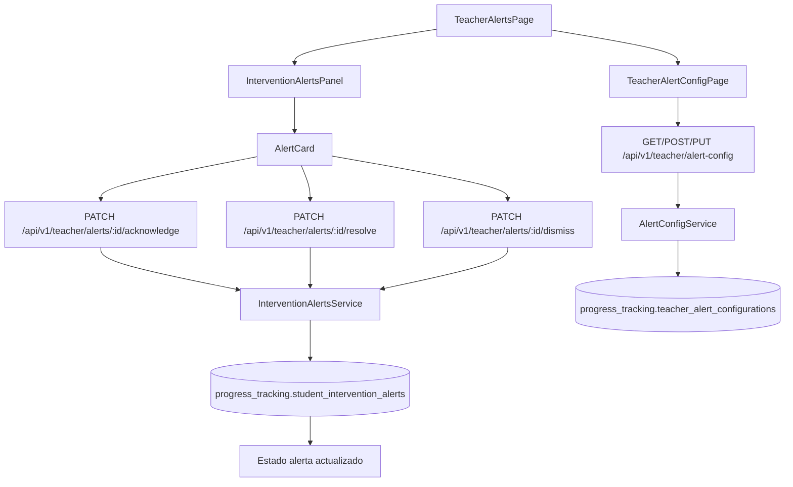

# FL-TCH-03 - Monitoreo de Estudiantes y Alertas

**Portal:** Teacher
**Prioridad:** Alta
**Estado:** Documentado

---

## 1. Resumen

Flujo para visualizar alertas de riesgo academico generadas automaticamente por el sistema de monitoreo, confirmarlas (acknowledge), resolverlas con notas de intervencion o descartarlas. Incluye tambien la configuracion de umbrales y preferencias de alertas por classroom.

## 2. Precondiciones

| Condicion | Detalle |
|-----------|---------|
| Rol requerido | `ADMIN_TEACHER` o `SUPER_ADMIN` |
| Sesion activa | JWT valido con `JwtAuthGuard` + `RolesGuard` |
| Classrooms asignados | El docente debe tener al menos un classroom en `social_features.teacher_classrooms` |
| Alertas generadas | El sistema debe haber ejecutado `progress_tracking.generate_student_alerts()` para poblar alertas |
| Tenant activo | El usuario debe pertenecer a un tenant activo (`auth_management.tenants`) |

## 3. Diagrama Mermaid

## 4. Secuencia FE -> BE -> DB

1. Docente abre `TeacherAlertsPage`, hook `useInterventionAlerts` ejecuta `GET /api/v1/teacher/alerts` con filtros (classroom, tipo, severidad, estado, busqueda).
2. Backend (`InterventionAlertsController`) valida permisos y filtra alertas de classrooms del docente.
3. `InterventionAlertsService` consulta `progress_tracking.student_intervention_alerts` con paginacion.
4. FE renderiza alertas en `InterventionAlertsPanel` con `AlertCard` para cada alerta.
5. Docente ejecuta accion:
   - **Acknowledge**: `PATCH /api/v1/teacher/alerts/:id/acknowledge` -- cambia estado a `acknowledged`.
   - **Resolve**: `PATCH /api/v1/teacher/alerts/:id/resolve` con `resolution_notes` -- cambia estado a `resolved`.
   - **Dismiss**: `PATCH /api/v1/teacher/alerts/:id/dismiss` -- cambia estado a `dismissed`.
6. Para historial de un estudiante: `GET /api/v1/teacher/alerts/student/:studentId/history`.
7. Para generar alertas manualmente (testing): `POST /api/v1/teacher/alerts/generate`.
8. Configuracion de umbrales en `TeacherAlertConfigPage` via `GET/POST/PUT/DELETE /api/v1/teacher/alert-config`.
9. FE aplica actualizaciones optimistas y refresca con `useInterventionAlerts.refresh()`.

## 5. Componentes y artefactos implicados

| Capa | Archivo | Descripcion |
|------|---------|-------------|
| FE Page | `apps/frontend/src/apps/teacher/pages/TeacherAlertsPage.tsx` | Pagina principal de alertas |
| FE Page | `apps/frontend/src/apps/teacher/pages/TeacherAlertConfigPage.tsx` | Pagina de configuracion de alertas |
| FE Page | `apps/frontend/src/apps/teacher/pages/TeacherMonitoringPage.tsx` | Pagina de monitoreo de estudiantes |
| FE Component | `apps/frontend/src/apps/teacher/components/alerts/AlertCard.tsx` | Tarjeta individual de alerta |
| FE Component | `apps/frontend/src/apps/teacher/components/alerts/InterventionAlertsPanel.tsx` | Panel contenedor de alertas |
| FE Component | `apps/frontend/src/apps/teacher/components/monitoring/StudentMonitoringPanel.tsx` | Panel de monitoreo estudiantes |
| FE Component | `apps/frontend/src/apps/teacher/components/monitoring/StudentStatusCard.tsx` | Tarjeta de estado del estudiante |
| FE Component | `apps/frontend/src/apps/teacher/components/monitoring/StudentDetailModal.tsx` | Modal detalle estudiante |
| FE Component | `apps/frontend/src/apps/teacher/components/dashboard/StudentAlerts.tsx` | Alertas en dashboard docente |
| FE Hook | `apps/frontend/src/apps/teacher/hooks/useInterventionAlerts.ts` | Hook gestion de alertas |
| FE Hook | `apps/frontend/src/apps/teacher/hooks/useAlertConfig.ts` | Hook configuracion de alertas |
| FE Hook | `apps/frontend/src/apps/teacher/hooks/useStudentMonitoring.ts` | Hook monitoreo estudiantes |
| FE API | `apps/frontend/src/services/api/teacher/interventionAlertsApi.ts` | Cliente API alertas |
| BE Controller | `apps/backend/src/modules/teacher/controllers/intervention-alerts.controller.ts` | 7 endpoints REST alertas |
| BE Controller | `apps/backend/src/modules/teacher/controllers/alert-config.controller.ts` | 7 endpoints REST configuracion |
| BE Service | `apps/backend/src/modules/teacher/services/intervention-alerts.service.ts` | Logica de negocio alertas |
| BE Service | `apps/backend/src/modules/teacher/services/alert-config.service.ts` | Logica de negocio configuracion |
| DB Table | `apps/database/ddl/schemas/progress_tracking/tables/19-student_intervention_alerts.sql` | Alertas de intervencion |
| DB Table | `apps/database/ddl/schemas/progress_tracking/tables/20-teacher_alert_configurations.sql` | Configuraciones de alerta |
| DB Table | `apps/database/ddl/schemas/progress_tracking/tables/17-teacher_interventions.sql` | Intervenciones docentes |
| DB Function | `apps/database/ddl/schemas/progress_tracking/functions/15-generate_student_alerts.sql` | Funcion generadora de alertas |
| DB Table | `apps/database/ddl/schemas/social_features/tables/03-classrooms.sql` | Aulas (filtro de visibilidad) |

## 6. Reglas y validaciones

| Regla | Detalle |
|-------|---------|
| RBAC | Solo roles `ADMIN_TEACHER` y `SUPER_ADMIN` pueden acceder a endpoints de alertas |
| Visibilidad por classroom | El docente solo ve alertas de estudiantes en sus classrooms asignados |
| Tenant isolation | Todas las consultas se filtran por `tenant_id` del usuario autenticado |
| Transicion de estados | `active` -> `acknowledged` -> `resolved`; o `active` -> `dismissed` |
| Notas obligatorias | La accion `resolve` requiere `resolution_notes` no vacio en el body |
| Alertas dismissed ocultas | Por defecto las consultas excluyen alertas en estado `dismissed` (flag `include_dismissed`) |
| Generacion automatica | Las alertas se generan via funcion SQL `generate_student_alerts()` ejecutada por cron o manualmente |
| Configuracion por classroom | Los umbrales pueden ser globales o especificos por classroom |

## 7. Manejo de errores

| Escenario | Capa | Codigo HTTP | Comportamiento |
|-----------|------|-------------|----------------|
| Token JWT invalido o expirado | BE Guard | 401 Unauthorized | FE redirige a login, muestra mensaje de sesion expirada |
| Rol insuficiente (no es teacher) | BE Guard | 403 Forbidden | FE muestra toast "Sin permisos para acceder al classroom" |
| Alerta no encontrada | BE Service | 404 Not Found | FE muestra mensaje "Alerta no encontrada" |
| Alerta ya resuelta (doble resolve) | BE Service | 400 Bad Request | FE muestra toast "Esta alerta ya esta resuelta" |
| Solo se puede acknowledge alerta activa | BE Service | 400 Bad Request | FE muestra toast "Solo se pueden reconocer alertas activas" |
| Error de red / timeout | FE Hook | - | `useInterventionAlerts` establece `error` state, UI muestra banner con boton de reintento |

## 8. Trazabilidad cruzada

| Capa | Archivo | Evidencia |
|------|---------|-----------|
| Requerimiento | `docs/10-requirements/epics/EPIC-GAM-F3-NOTIFICATIONS/` | Epic de notificaciones |
| DDL | `apps/database/ddl/schemas/progress_tracking/tables/19-student_intervention_alerts.sql` | CREATE TABLE progress_tracking.student_intervention_alerts |
| DDL | `apps/database/ddl/schemas/progress_tracking/tables/20-teacher_alert_configurations.sql` | CREATE TABLE progress_tracking.teacher_alert_configurations |
| Controller | `apps/backend/src/modules/teacher/controllers/intervention-alerts.controller.ts` | @Controller('teacher/alerts') |
| Controller | `apps/backend/src/modules/teacher/controllers/alert-config.controller.ts` | @Controller('teacher/alert-config') |
| Frontend | `apps/frontend/src/apps/teacher/pages/TeacherAlertsPage.tsx` | Pagina de alertas |
| API Client | `apps/frontend/src/services/api/teacher/interventionAlertsApi.ts` | interventionAlertsApi |

## 9. Referencias

- Requerimiento: `EPIC-GAM-F3-NOTIFICATIONS`
- Matriz: `../TRACEABILITY-MATRIX.md`
- Cobertura total: `../COBERTURA-TOTAL-PROCESOS.md`
