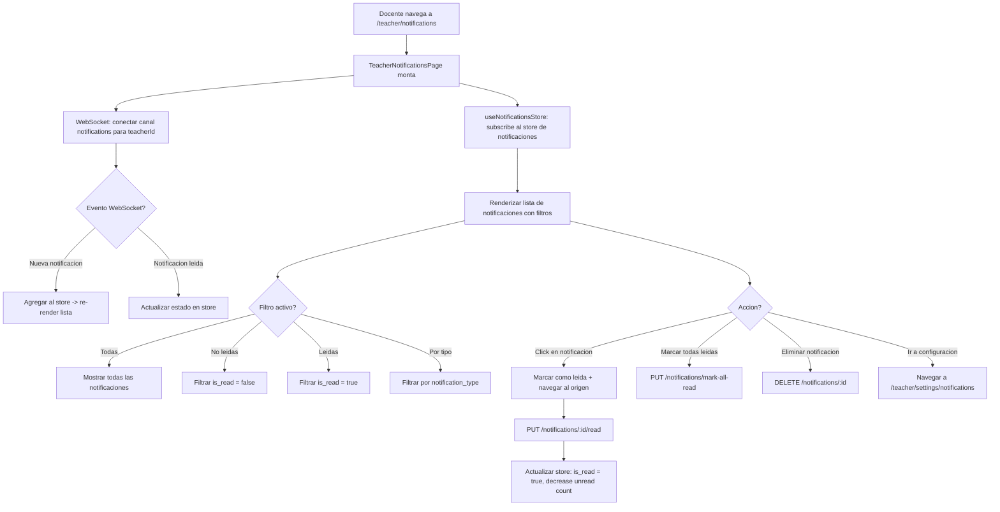

# FL-TCH-15 - Notificaciones del Docente

**ID:** FL-TCH-15
**Version:** 1.0.0
**Fecha:** 2026-02-27
**Estado:** Activo
**Portal:** Teacher
**Prioridad:** P2

---

## 1. Resumen

Flujo de la pagina `/teacher/notifications` del portal docente. Proporciona el centro de notificaciones del maestro con lista completa de notificaciones, filtros por estado (todas, leidas, no leidas) y por tipo de notificacion. Soporta marcar notificaciones como leidas de forma individual y masiva, eliminar notificaciones, y recibe actualizaciones en tiempo real via WebSocket. Los tipos de notificacion relevantes para el docente incluyen: `assignment_submitted`, `student_message`, `student_progress`, `alert`, `system_announcement`, `achievement_unlocked` de sus estudiantes.

---

## 2. Actores

- Maestro: Recibe y gestiona notificaciones de actividad de sus estudiantes y del sistema.
- Sistema (WebSocket): Envia notificaciones en tiempo real cuando ocurren eventos relevantes.

---

## 3. Precondiciones

- Usuario autenticado con rol `teacher` o `admin_teacher`.
- Sesion activa con JWT valido.
- Conexion WebSocket activa para notificaciones en tiempo real.
- Al menos una notificacion generada por el sistema o por actividad de estudiantes.

---

## 4. Diagrama Mermaid



---

## 5. Secuencia FE -> BE -> DB

```
=== Carga inicial y conexion WebSocket ===
1. FE: TeacherNotificationsPage monta -> accede al store de Zustand (notificationsStore)
2. FE: Si el store no tiene notificaciones cargadas: GET /api/v1/notifications
3. BE: NotificationsController.getNotifications() -> filtra por teacherId del JWT
4. DB: SELECT n.*, np.is_read, np.read_at FROM notifications.notifications n
        JOIN notifications.notification_participants np ON n.id = np.notification_id
        WHERE np.user_id = :teacherId
        ORDER BY n.created_at DESC LIMIT 50
5. BE: Retorna lista de notificaciones con is_read y metadatos
6. FE: Actualiza store con notificaciones, renderiza lista

7. FE: WebSocket conecta al canal `notifications.teacher.{teacherId}` via Socket.IO
8. BE: WebSocket gateway registra listener para ese canal
9. BE: Cuando ocurre un evento (submission enviado, alerta generada, etc.) -> emite al canal

=== Recepcion de notificacion en tiempo real ===
10. BE: Evento emitido: { type: 'assignment_submitted', studentName: 'Ana', exerciseTitle: 'Crucigrama', createdAt }
11. FE: WebSocket handler recibe evento -> dispatch a notificationsStore
12. FE: notificationsStore.addNotification(notification) -> actualiza unread count
13. FE: Lista se re-renderiza con AnimatePresence (motion.li con animacion de entrada)
14. FE: Badge de no leidas en el nav del sidebar se actualiza

=== Marcar notificacion individual como leida ===
15. FE: Click en notificacion no leida
16. FE: PUT /api/v1/notifications/:notificationId/read
17. BE: NotificationsController.markAsRead() -> actualiza is_read en notification_participants
18. DB: UPDATE notifications.notification_participants
         SET is_read = true, read_at = NOW()
         WHERE notification_id = :id AND user_id = :teacherId
19. BE: Retorna { success: true }
20. FE: Store actualiza is_read = true para esa notificacion, disminuye unread count
21. FE: FE navega al origen de la notificacion (si tiene action_url)

=== Marcar todas como leidas ===
22. FE: Click en boton "Marcar todas como leidas" (CheckCheck icon)
23. FE: PUT /api/v1/notifications/mark-all-read
24. BE: NotificationsController.markAllAsRead() -> bulk update
25. DB: UPDATE notifications.notification_participants SET is_read = true, read_at = NOW()
         WHERE user_id = :teacherId AND is_read = false
26. BE: Retorna { updated: count }
27. FE: Store actualiza todas las notificaciones a is_read = true, unread count = 0
28. FE: Toast: "Todas las notificaciones marcadas como leidas"

=== Eliminar notificacion ===
29. FE: Click en icono de basura junto a una notificacion
30. FE: DELETE /api/v1/notifications/:notificationId
31. BE: NotificationsController.deleteNotification() -> soft delete o remove participant
32. DB: DELETE FROM notifications.notification_participants
         WHERE notification_id = :id AND user_id = :teacherId
33. BE: Retorna { success: true }
34. FE: Remove notificacion del store, AnimatePresence anima la salida
```

---

## 6. Componentes y artefactos implicados

### Frontend

| Tipo | Archivo |
|------|---------|
| Pagina | `apps/frontend/src/apps/teacher/pages/TeacherNotificationsPage.tsx` |
| Store Zustand | `apps/frontend/src/features/notifications/store/notificationsStore.ts` |
| WebSocket hook | `apps/frontend/src/features/notifications/hooks/useNotificationsSocket.ts` |
| Ruta | `apps/frontend/src/App.tsx` (ruta: `/teacher/notifications`) |

### Backend

| Tipo | Archivo |
|------|---------|
| Controller notificaciones | `apps/backend/src/modules/notifications/` |
| WebSocket gateway | `apps/backend/src/modules/websocket/` |

### Base de Datos

| Tipo | Archivo |
|------|---------|
| Tabla notifications | `apps/database/ddl/schemas/notifications/tables/notifications.sql` |
| Tabla notification_participants | `apps/database/ddl/schemas/notifications/tables/notification_participants.sql` |

---

## 7. Endpoints Involucrados

| Metodo | Ruta | Descripcion |
|--------|------|-------------|
| GET | `/api/v1/notifications` | Lista de notificaciones del docente (paginada) |
| PUT | `/api/v1/notifications/:id/read` | Marcar notificacion individual como leida |
| PUT | `/api/v1/notifications/mark-all-read` | Marcar todas las notificaciones como leidas |
| DELETE | `/api/v1/notifications/:id` | Eliminar notificacion especifica |
| WS | `notifications.teacher.{teacherId}` | Canal WebSocket de notificaciones en tiempo real |

---

## 8. Tipos de Notificacion del Docente

| Tipo | Icono | Descripcion |
|------|-------|-------------|
| `achievement_unlocked` | Trophy | Estudiante desbloqueo un logro |
| `rank_promoted` | TrendingUp | Estudiante subio de rango maya |
| `assignment_submitted` | ClipboardCheck | Estudiante envio un ejercicio |
| `assignment_graded` | CheckCheck | Ejercicio calificado (confirmacion propia) |
| `student_message` | MessageSquare | Estudiante envio un mensaje |
| `class_update` | BookOpen | Actualizacion en el aula |
| `system_announcement` | Megaphone | Anuncio del sistema |
| `alert` | AlertCircle | Alerta de riesgo estudiantil |
| `student_progress` | TrendingUp | Actualizacion de progreso de estudiante |
| `new_student` | Users | Nuevo estudiante se unio al aula |

---

## 9. Reglas y validaciones

| Regla | Capa | Descripcion |
|-------|------|-------------|
| Autenticacion requerida | BE | JwtAuthGuard en todos los endpoints |
| Solo propias notificaciones | BE | Filtro por user_id del JWT en notification_participants |
| RLS por tenant | DB | Politicas RLS filtran notificaciones por tenant_id |
| WebSocket autenticado | BE | Socket.IO con JWT middleware, valida en handshake |
| Paginacion en lista | BE | Default 50 notificaciones, carga mas al scroll (infinite) |

---

## 10. Manejo de errores

| Escenario | Capa | Codigo HTTP | Comportamiento |
|-----------|------|-------------|----------------|
| Token JWT expirado | BE | 401 | Redirige a login |
| WebSocket desconectado | FE | N/A | Muestra indicador de conexion perdida, reintento automatico |
| Error al marcar como leida | FE | N/A | Toast de error, estado no se actualiza en UI |
| Sin notificaciones | FE | 200 | EmptyState con mensaje "No tienes notificaciones" |
| Error en carga inicial | FE | N/A | Error state con boton de retry |

---

## 11. Trazabilidad cruzada

| Capa | Archivo | Evidencia |
|------|---------|-----------|
| Frontend Pagina | `apps/frontend/src/apps/teacher/pages/TeacherNotificationsPage.tsx` | Centro de notificaciones |
| Frontend Store | `apps/frontend/src/features/notifications/store/notificationsStore.ts` | Estado global de notificaciones |
| Backend WebSocket | `apps/backend/src/modules/websocket/` | Gateway de tiempo real |
| DDL notifications | `apps/database/ddl/schemas/notifications/` | Tablas de notificaciones y participantes |

---

## 12. Referencias

- Flujo configuracion notificaciones: [FL-TCH-16](./FLUJO-PREFERENCIAS-NOTIFICACIONES.md)
- Flujo monitoreo y alertas: [FL-TCH-06](./FLUJO-MONITOREO-ALERTAS.md)
- Flujo configuracion docente: [FL-TCH-14](./FLUJO-CONFIGURACION-DOCENTE.md)
