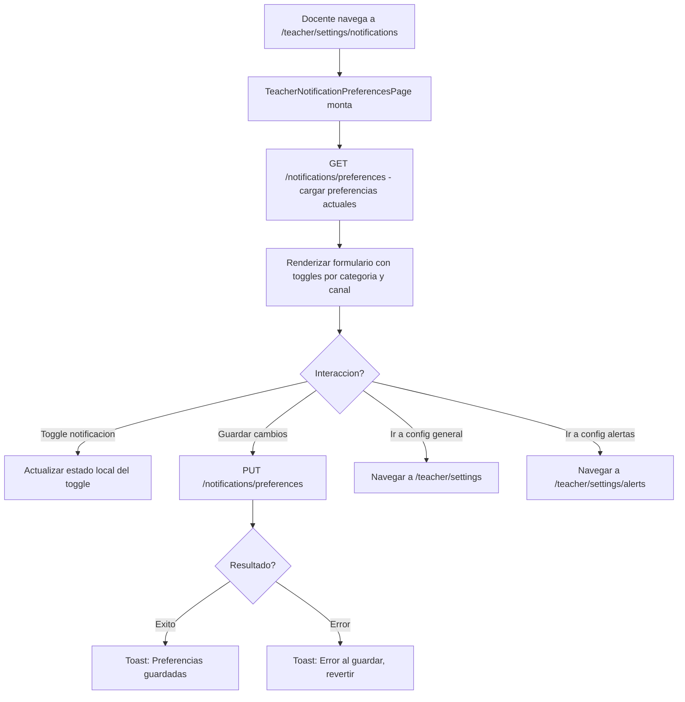

# FL-TCH-16 - Preferencias de Notificaciones

**ID:** FL-TCH-16
**Version:** 1.0.0
**Fecha:** 2026-02-27
**Estado:** Activo
**Portal:** Teacher
**Prioridad:** P3

---

## 1. Resumen

Flujo de la pagina `/teacher/settings/notifications` del portal docente (componente `TeacherNotificationPreferencesPage`). Permite al maestro configurar granularmente que tipo de notificaciones desea recibir y por que canales (email, push, in-app). Las preferencias se organizan por categoria: actividad estudiantil, asignaciones y entregas, mensajes, y alertas del sistema. Cada categoria permite habilitar/deshabilitar por canal individualmente. Los cambios se persisten via la API de notificaciones del modulo correspondiente.

---

## 2. Actores

- Maestro: Define que eventos le generan notificaciones y por que canal.
- Sistema: Aplica las preferencias al generar nuevas notificaciones.

---

## 3. Precondiciones

- Usuario autenticado con rol `teacher` o `admin_teacher`.
- Sesion activa con JWT valido.
- Perfil de usuario y preferencias de notificacion existentes en BD.

---

## 4. Diagrama Mermaid



---

## 5. Secuencia FE -> BE -> DB

```
=== Carga inicial de preferencias ===
1. FE: TeacherNotificationPreferencesPage monta
2. FE: GET /api/v1/notifications/preferences
3. BE: NotificationsController.getPreferences() -> obtiene preferencias del usuario
4. DB: SELECT notification_preferences FROM auth.user_profiles WHERE user_id = :userId
5. BE: Retorna { categories: { student_activity: { email: true, push: true, in_app: true },
                               assignments: { email: true, push: false, in_app: true },
                               messages: { email: false, push: true, in_app: true },
                               system_alerts: { email: true, push: true, in_app: true } } }
6. FE: Inicializa todos los toggles con los valores actuales

=== Modificar una preferencia ===
7. FE: Docente desactiva toggle "Email para Asignaciones"
8. FE: Actualiza estado local (no llama al backend aun)
9. FE: Boton "Guardar" se activa (dirty state)

=== Guardar cambios ===
10. FE: Click en "Guardar cambios"
11. FE: PUT /api/v1/notifications/preferences
         Body: { categories: { assignments: { email: false, push: false, in_app: true } } }
12. BE: NotificationsController.updatePreferences() -> merge con preferencias existentes
13. DB: UPDATE auth.user_profiles
         SET notification_preferences = notification_preferences || :partialPrefs
         WHERE user_id = :userId
14. BE: Retorna preferencias completas actualizadas
15. FE: Toast: "Preferencias de notificacion guardadas"
16. FE: Reset dirty state, desactiva boton guardar

=== Resultado al generar notificaciones ===
17. BE: Cuando un evento ocurre (submission enviado), el servicio de notificaciones
         consulta las preferencias del teacher para determinar canales activos
18. BE: Si in_app = true -> crea registro en notifications.notifications
        Si email = true -> encola email via MailService
        Si push = true -> envia via PushNotificationService (si configurado)
```

---

## 6. Componentes y artefactos implicados

### Frontend

| Tipo | Archivo |
|------|---------|
| Pagina | `apps/frontend/src/apps/teacher/pages/TeacherNotificationPreferencesPage.tsx` |
| Ruta | `apps/frontend/src/App.tsx` (ruta: `/teacher/settings/notifications`) |

### Backend

| Tipo | Archivo |
|------|---------|
| Controller notificaciones | `apps/backend/src/modules/notifications/` |
| Service notificaciones | `apps/backend/src/modules/notifications/services/` |

### Base de Datos

| Tipo | Archivo |
|------|---------|
| Tabla user_profiles | `apps/database/ddl/schemas/auth/tables/user_profiles.sql` |
| Tabla notifications | `apps/database/ddl/schemas/notifications/tables/notifications.sql` |
| Tabla notification_participants | `apps/database/ddl/schemas/notifications/tables/notification_participants.sql` |

---

## 7. Endpoints Involucrados

| Metodo | Ruta | Descripcion |
|--------|------|-------------|
| GET | `/api/v1/notifications/preferences` | Obtener preferencias de notificacion actuales |
| PUT | `/api/v1/notifications/preferences` | Actualizar preferencias de notificacion |

---

## 8. Categorias de Preferencias

| Categoria | Tipos de Evento | Canales Disponibles |
|-----------|-----------------|---------------------|
| Actividad estudiantil | achievement_unlocked, rank_promoted, student_progress | email, push, in_app |
| Asignaciones y entregas | assignment_submitted, assignment_graded | email, push, in_app |
| Mensajes | student_message, class_update | email, push, in_app |
| Alertas del sistema | alert, system_announcement, new_student | email, push, in_app |

---

## 9. Reglas y validaciones

| Regla | Capa | Descripcion |
|-------|------|-------------|
| Autenticacion requerida | BE | JwtAuthGuard en todos los endpoints |
| Solo propias preferencias | BE | userId extraido del JWT |
| Merge de preferencias | BE | PUT hace merge, no reemplaza completo |
| Valor por defecto in_app | BE | in_app siempre true si no se especifica (minimo un canal) |

---

## 10. Manejo de errores

| Escenario | Capa | Codigo HTTP | Comportamiento |
|-----------|------|-------------|----------------|
| Token JWT expirado | BE | 401 | Redirige a login |
| Error al guardar | BE | 500 | Toast de error, UI revierte a valores anteriores |
| Error al cargar preferencias | FE | N/A | Mostrar defaults con aviso de que no se pudo cargar |

---

## 11. Trazabilidad cruzada

| Capa | Archivo | Evidencia |
|------|---------|-----------|
| Frontend Pagina | `apps/frontend/src/apps/teacher/pages/TeacherNotificationPreferencesPage.tsx` | Preferencias de notificacion |
| DDL user_profiles | `apps/database/ddl/schemas/auth/tables/user_profiles.sql` | notification_preferences JSONB |
| DDL notifications | `apps/database/ddl/schemas/notifications/` | Sistema de notificaciones |

---

## 12. Referencias

- Flujo notificaciones del docente: [FL-TCH-15](./FLUJO-NOTIFICACIONES-DOCENTE.md)
- Flujo configuracion de alertas: [FL-TCH-17](./FLUJO-CONFIGURACION-ALERTAS.md)
- Flujo configuracion docente: [FL-TCH-14](./FLUJO-CONFIGURACION-DOCENTE.md)
