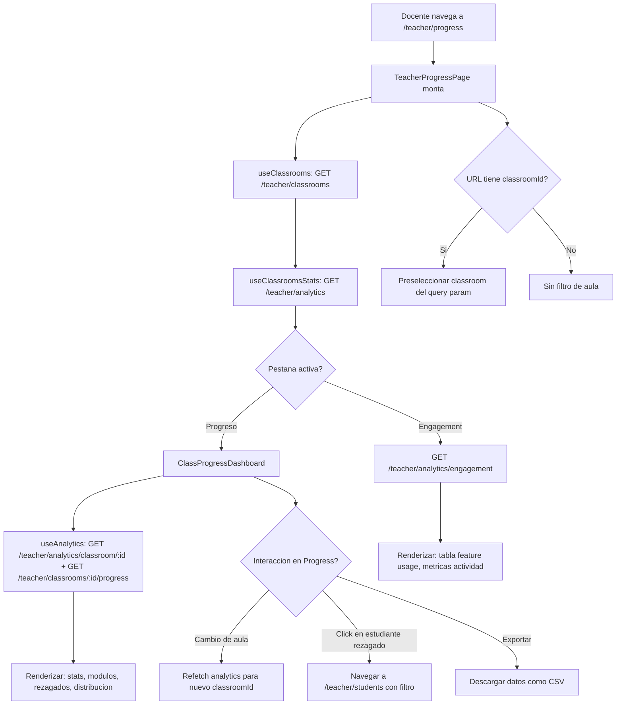

# FL-TCH-10 - Progreso Academico

**ID:** FL-TCH-10
**Version:** 1.0.0
**Fecha:** 2026-02-27
**Estado:** Activo
**Portal:** Teacher
**Prioridad:** P1

---

## 1. Resumen

Flujo de la pagina `/teacher/progress` del portal docente. Permite al maestro visualizar el progreso academico agregado de sus aulas con dos vistas principales: la pestana "Progreso" muestra el `ClassProgressDashboard` con estadisticas generales, progreso por modulo, e identificacion de estudiantes rezagados; la pestana "Engagement" muestra metricas de actividad de la plataforma con tablas de feature usage. El docente puede filtrar por aula, cambiar entre pestanas, y exportar datos de engagement. La pagina tambien permite detectar estudiantes en riesgo y navegar a su perfil detallado.

---

## 2. Precondiciones

- Usuario autenticado con rol `teacher` o `admin_teacher`.
- Sesion activa con JWT valido.
- Docente asignado a al menos un classroom activo.
- Estudiantes matriculados en los classrooms del docente con al menos un intento de ejercicio registrado.

---

## 3. Diagrama Mermaid



---

## 4. Secuencia FE -> BE -> DB

```
=== Carga inicial ===
1. FE: TeacherProgressPage monta -> dispara fetches en paralelo
2. FE: GET /api/v1/teacher/classrooms (useClassrooms hook)
3. BE: TeacherClassroomsController.getClassrooms() -> lista de aulas del docente
4. DB: SELECT FROM social_features.teacher_classrooms WHERE teacher_id = :teacherId
5. BE: Retorna PaginatedTeacherClassroomsResponseDto

6. FE: GET /api/v1/teacher/analytics?classroom_id=:id (useClassroomsStats)
7. BE: TeacherController.getClassroomAnalytics() -> AnalyticsService.getClassroomAnalytics()
8. DB: SELECT FROM progress_tracking.* JOIN social_features.classroom_members ...
       WHERE classroom_id IN (:classroomIds) GROUP BY classroom_id
9. BE: Retorna { classrooms: [], summary: { totalStudents, avgCompletion, ... } }

=== Pestana Progreso - Detalle por aula ===
10. FE: ClassProgressDashboard monta con classroomId seleccionado
11. FE: GET /api/v1/teacher/analytics/classroom/:classroomId
12. BE: TeacherController.getClassroomAnalyticsByClassroomId() -> AnalyticsService.getClassroomAnalyticsByClassroomId()
13. DB: SELECT module_id, COUNT(*), AVG(score), COUNT(DISTINCT user_id)
        FROM progress_tracking.exercise_attempts
        JOIN social_features.classroom_members cm ON attempts.user_id = cm.user_id
        WHERE cm.classroom_id = :classroomId GROUP BY module_id
14. BE: Retorna { studentPerformance, completionRates, scoreDistribution, moduleBreakdown }

15. FE: GET /api/v1/teacher/classrooms/:classroomId/progress
16. BE: TeacherClassroomsController.getClassroomProgress() -> TeacherClassroomsCrudService
17. DB: Calcula classroomData (stats generales) y moduleProgress (por modulo)
18. BE: Retorna { classroomData: { avgCompletion, avgScore, ... }, moduleProgress: ModuleProgress[] }
19. FE: Renderiza dashboard con: estadisticas del aula, progress bars por modulo, tabla de rezagados

=== Pestana Engagement ===
20. FE: GET /api/v1/teacher/analytics/engagement?classroom_id=:id
21. BE: TeacherController.getEngagementMetrics() -> AnalyticsService.getEngagementMetrics()
22. DB: SELECT feature_name, COUNT(*), COUNT(DISTINCT user_id) FROM audit.activity_logs
        WHERE user_id IN (:studentIds) GROUP BY feature_name
23. BE: Retorna { activeStudents, submissionRate, featureUsage: [], weeklyActivity: [] }
24. FE: Renderiza tabla de feature usage con columnas: Funcionalidad, Usos Totales, Usuarios Unicos

=== Exportacion de datos ===
25. FE: Click en boton export -> llama a endpoint de reporte
26. FE: POST /api/v1/teacher/reports/generate (body: { classroomId, format: 'csv', ... })
27. BE: TeacherController.generateInsightsReport() -> ReportsService.generateReport()
28. BE: Genera buffer CSV/XLSX con datos de la clase
29. BE: Responde con Content-Disposition: attachment
30. FE: Dispara descarga del navegador
```

---

## 5. Componentes y artefactos implicados

### Frontend

| Tipo | Archivo |
|------|---------|
| Pagina | `apps/frontend/src/apps/teacher/pages/TeacherProgressPage.tsx` |
| Dashboard progreso | `apps/frontend/src/apps/teacher/components/progress/ClassProgressDashboard.tsx` |
| Hook classrooms | `apps/frontend/src/apps/teacher/hooks/useClassrooms.ts` |
| Hook classrooms stats | `apps/frontend/src/apps/teacher/hooks/useClassroomsStats.ts` |
| Hook analytics | `apps/frontend/src/apps/teacher/hooks/useAnalytics.ts` |
| Ruta | `apps/frontend/src/App.tsx` (ruta: `/teacher/progress`) |

### Backend

| Tipo | Archivo |
|------|---------|
| Controller teacher | `apps/backend/src/modules/teacher/controllers/teacher.controller.ts` |
| Controller classrooms | `apps/backend/src/modules/teacher/controllers/teacher-classrooms.controller.ts` |
| Service analytics | `apps/backend/src/modules/teacher/services/analytics.service.ts` |
| Service classrooms CRUD | `apps/backend/src/modules/teacher/services/teacher-classrooms-crud.service.ts` |
| Service reports | `apps/backend/src/modules/teacher/services/reports.service.ts` |

### Base de Datos

| Tipo | Archivo |
|------|---------|
| Tabla exercise_attempts | `apps/database/ddl/schemas/progress_tracking/tables/02-exercise_attempts.sql` |
| Tabla module_progress | `apps/database/ddl/schemas/progress_tracking/tables/01-module_progress.sql` |
| Tabla classroom_members | `apps/database/ddl/schemas/social_features/tables/classroom_members.sql` |
| Vista teacher_pending_reviews | `apps/database/ddl/schemas/progress_tracking/views/teacher_pending_reviews.sql` |

---

## 6. Endpoints Involucrados

| Metodo | Ruta | Descripcion |
|--------|------|-------------|
| GET | `/api/v1/teacher/classrooms` | Lista classrooms del docente |
| GET | `/api/v1/teacher/analytics` | Analytics agregados de todas las aulas |
| GET | `/api/v1/teacher/analytics/classroom/:id` | Analytics detallados por aula especifica |
| GET | `/api/v1/teacher/classrooms/:id/progress` | Progreso general + por modulo del aula |
| GET | `/api/v1/teacher/analytics/engagement` | Metricas de engagement (feature usage, actividad) |
| POST | `/api/v1/teacher/reports/generate` | Generar reporte PDF/CSV/Excel del progreso |

---

## 7. Reglas y validaciones

| Regla | Capa | Descripcion |
|-------|------|-------------|
| Autenticacion + rol teacher | BE | JwtAuthGuard + RolesGuard(@Roles(ADMIN_TEACHER)) |
| Solo analytics de sus aulas | BE | teacherId del JWT limita classroomIds consultados |
| RLS por tenant | DB | Politicas RLS filtran por tenant_id automaticamente |
| classroomId opcional | FE | Sin filtro muestra datos agregados de todas las aulas |
| Tab activo en URL | FE | Query param `tab` persiste pestana activa al navegar |
| Exportacion formato variable | BE | Soporta PDF, XLSX, CSV segun body.format |

---

## 8. Manejo de errores

| Escenario | Capa | Codigo HTTP | Comportamiento |
|-----------|------|-------------|----------------|
| Token JWT expirado | BE | 401 | Redirige a login |
| Docente sin classrooms | FE | 200 | Dashboard vacio con EmptyState |
| Error en analytics | FE | N/A | Seccion con error muestra retry individual |
| Classroom sin datos de progreso | BE | 200 | Retorna estructura vacia, FE renderiza cero |
| Error en exportacion | BE | 500 | Toast de error en FE |
| Timeout en agregacion | BE | 504 | FE muestra error con retry |

---

## 9. Trazabilidad cruzada

| Capa | Archivo | Evidencia |
|------|---------|-----------|
| Frontend Pagina | `apps/frontend/src/apps/teacher/pages/TeacherProgressPage.tsx` | Vista progreso + engagement |
| Frontend Dashboard | `apps/frontend/src/apps/teacher/components/progress/ClassProgressDashboard.tsx` | Visualizacion detallada por aula |
| Backend Service | `apps/backend/src/modules/teacher/services/analytics.service.ts` | Logica de agregacion de metricas |
| DDL module_progress | `apps/database/ddl/schemas/progress_tracking/tables/01-module_progress.sql` | Progreso por modulo |
| DDL exercise_attempts | `apps/database/ddl/schemas/progress_tracking/tables/02-exercise_attempts.sql` | Intentos de ejercicios |

---

## 10. Referencias

- Flujo analytics y reportes: [FL-TCH-04](./FLUJO-ANALYTICS-REPORTES.md)
- Flujo gestion estudiantes: [FL-TCH-09](./FLUJO-GESTION-ESTUDIANTES.md)
- Flujo monitoreo alertas: [FL-TCH-06](./FLUJO-MONITOREO-ALERTAS.md)
- Guia portal docente: `docs/60-portals/teacher/PORTAL-TEACHER-GUIDE.md`
