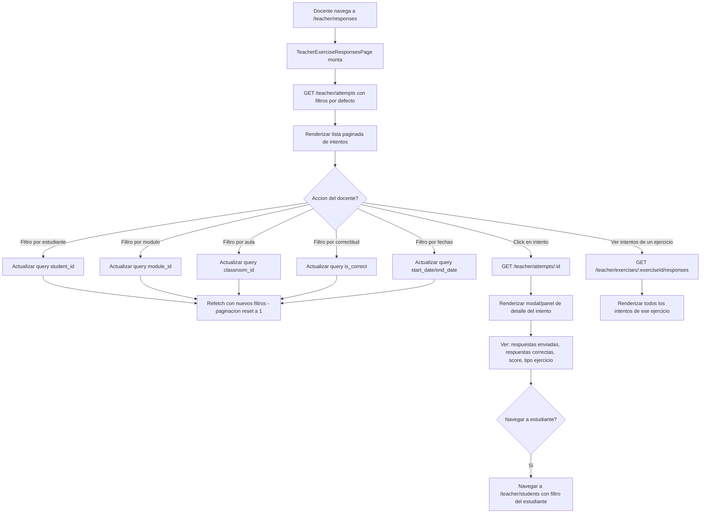

# FL-TCH-12 - Respuestas de Ejercicios

**ID:** FL-TCH-12
**Version:** 1.0.0
**Fecha:** 2026-02-27
**Estado:** Activo
**Portal:** Teacher
**Prioridad:** P2

---

## 1. Resumen

Flujo de la pagina `/teacher/responses` del portal docente. Permite al maestro consultar los intentos de ejercicios (`exercise_attempts`) de sus estudiantes con filtros avanzados: por estudiante, ejercicio, modulo, aula, rango de fechas y correctitud. La pagina muestra una lista paginada de intentos con su score y estado. Al seleccionar un intento especifico, el docente puede ver el detalle completo incluyendo las respuestas enviadas por el estudiante y las respuestas correctas del ejercicio, lo que sirve como herramienta de analisis de desempeno.

---

## 2. Precondiciones

- Usuario autenticado con rol `teacher` o `admin_teacher`.
- Sesion activa con JWT valido.
- Docente asignado a al menos un classroom con estudiantes que hayan realizado ejercicios.
- Los estudiantes consultados deben pertenecer a classrooms del docente (validado por RLS).

---

## 3. Diagrama Mermaid



---

## 4. Secuencia FE -> BE -> DB

```
=== Carga inicial - Lista de intentos ===
1. FE: TeacherExerciseResponsesPage monta con filtros por defecto
2. FE: GET /api/v1/teacher/attempts?limit=20&page=1
3. BE: ExerciseResponsesController.getAttempts() -> ExerciseResponsesService.getAttempts(userId, query)
4. DB: SELECT ea.id, ea.score, ea.is_correct, ea.submitted_at, ea.time_spent,
              u.full_name as student_name, e.title as exercise_title, m.name as module_name
        FROM progress_tracking.exercise_attempts ea
        JOIN auth.users u ON ea.user_id = u.id
        JOIN educational_content.exercises e ON ea.exercise_id = e.id
        JOIN educational_content.modules m ON e.module_id = m.id
        WHERE ea.user_id IN (
          SELECT cm.user_id FROM social_features.classroom_members cm
          JOIN social_features.teacher_classrooms tc ON cm.classroom_id = tc.classroom_id
          WHERE tc.teacher_id = :teacherId
        )
        ORDER BY ea.submitted_at DESC
        LIMIT :limit OFFSET :offset
5. BE: Retorna AttemptsListResponseDto { data: AttemptResponseDto[], total, page, limit }
6. FE: Renderiza tabla con columnas: Estudiante, Ejercicio, Modulo, Score, Correcto, Fecha

=== Aplicar filtros ===
7. FE: Docente aplica filtros (student_id, module_id, classroom_id, is_correct, fechas)
8. FE: GET /api/v1/teacher/attempts?student_id=:id&module_id=:id&is_correct=true&...
9. BE: ExerciseResponsesService.getAttempts() aplica filtros en la query dinamicamente
10. DB: Idem con WHERE adicionales por cada filtro activo
11. BE: Retorna lista filtrada y paginada
12. FE: Actualiza tabla, reset a pagina 1

=== Ver detalle de un intento ===
13. FE: Click en fila de intento -> dispara fetch de detalle
14. FE: GET /api/v1/teacher/attempts/:attemptId
15. BE: ExerciseResponsesController.getAttemptDetail() -> ExerciseResponsesService.getAttemptDetail(userId, id)
16. BE: Valida que el attempt pertenezca a un estudiante de los classrooms del teacher
17. DB: SELECT ea.*, ea.submitted_answers, e.correct_answers, e.exercise_type, e.max_score
         FROM progress_tracking.exercise_attempts ea
         JOIN educational_content.exercises e ON ea.exercise_id = e.id
         WHERE ea.id = :attemptId
18. BE: Retorna AttemptDetailDto { attempt: AttemptData, exercise: ExerciseDetails,
         submittedAnswers: any, correctAnswers: any, score, maxScore }
19. FE: Renderiza panel de detalle: respuestas del estudiante vs respuestas correctas

=== Ver intentos de un ejercicio especifico ===
20. FE: Desde vista de ejercicio, navega a ver todas las respuestas
21. FE: GET /api/v1/teacher/exercises/:exerciseId/responses
22. BE: ExerciseResponsesController.getExerciseResponses() -> ExerciseResponsesService.getExerciseResponses()
23. DB: SELECT ea.*, u.full_name FROM progress_tracking.exercise_attempts ea
         JOIN auth.users u ON ea.user_id = u.id
         WHERE ea.exercise_id = :exerciseId
           AND ea.user_id IN (students de mis classrooms)
         ORDER BY ea.score DESC
24. BE: Retorna AttemptsListResponseDto con todos los intentos del ejercicio
25. FE: Renderiza tabla comparativa de rendimiento en ese ejercicio

=== Ver intentos de un estudiante especifico ===
26. FE: Desde modal de estudiante, ver todos sus intentos
27. FE: GET /api/v1/teacher/attempts/student/:studentId
28. BE: ExerciseResponsesController.getAttemptsByStudent() -> valida acceso al estudiante
29. DB: SELECT * FROM progress_tracking.exercise_attempts
         WHERE user_id = :studentId ORDER BY submitted_at DESC
30. BE: Retorna array de AttemptResponseDto
31. FE: Renderiza historial cronologico del estudiante
```

---

## 5. Componentes y artefactos implicados

### Frontend

| Tipo | Archivo |
|------|---------|
| Pagina | `apps/frontend/src/apps/teacher/pages/TeacherExerciseResponsesPage.tsx` |
| Ruta | `apps/frontend/src/App.tsx` (ruta: `/teacher/responses`) |

### Backend

| Tipo | Archivo |
|------|---------|
| Controller | `apps/backend/src/modules/teacher/controllers/exercise-responses.controller.ts` |
| Service | `apps/backend/src/modules/teacher/services/exercise-responses.service.ts` |
| DTOs | `apps/backend/src/modules/teacher/dto/exercise-responses.dto.ts` |

### Base de Datos

| Tipo | Archivo |
|------|---------|
| Tabla exercise_attempts | `apps/database/ddl/schemas/progress_tracking/tables/02-exercise_attempts.sql` |
| Tabla exercises | `apps/database/ddl/schemas/educational_content/tables/exercises.sql` |
| Tabla classroom_members | `apps/database/ddl/schemas/social_features/tables/classroom_members.sql` |

---

## 6. Endpoints Involucrados

| Metodo | Ruta | Descripcion |
|--------|------|-------------|
| GET | `/api/v1/teacher/attempts` | Lista paginada de intentos con filtros opcionales |
| GET | `/api/v1/teacher/attempts/:id` | Detalle completo de un intento (respuestas enviadas vs correctas) |
| GET | `/api/v1/teacher/attempts/student/:studentId` | Todos los intentos de un estudiante especifico |
| GET | `/api/v1/teacher/exercises/:exerciseId/responses` | Todos los intentos de un ejercicio especifico |

---

## 7. Reglas y validaciones

| Regla | Capa | Descripcion |
|-------|------|-------------|
| Autenticacion + rol teacher | BE | JwtAuthGuard + RolesGuard(@Roles(ADMIN_TEACHER)) |
| Solo intentos de propios estudiantes | BE | Subquery filtra user_id IN (classroom members del teacher) |
| RLS por tenant | DB | Politicas RLS filtran automaticamente |
| Validacion de acceso en detalle | BE | ExerciseResponsesService verifica ownership antes de retornar |
| Paginacion obligatoria en lista | BE | Default limit 20, max configurable via query param |
| Filtros acumulables | BE | Todos los query params son opcionales e independientes |

---

## 8. Manejo de errores

| Escenario | Capa | Codigo HTTP | Comportamiento |
|-----------|------|-------------|----------------|
| Token JWT expirado | BE | 401 | Redirige a login |
| Intento no encontrado | BE | 404 | Toast de error en FE |
| Teacher sin acceso al intento | BE | 403 | ForbiddenException, toast en FE |
| Estudiante no en mis aulas | BE | 403 | ForbiddenException al consultar intentos por student |
| Sin intentos en la BD | BE | 200 | Lista vacia con EmptyState en FE |
| Filtros invalidos | BE | 400 | BadRequestException con detalle del error |

---

## 9. Trazabilidad cruzada

| Capa | Archivo | Evidencia |
|------|---------|-----------|
| Frontend Pagina | `apps/frontend/src/apps/teacher/pages/TeacherExerciseResponsesPage.tsx` | Vista de respuestas |
| Backend Controller | `apps/backend/src/modules/teacher/controllers/exercise-responses.controller.ts` | Endpoints de intentos |
| Backend Service | `apps/backend/src/modules/teacher/services/exercise-responses.service.ts` | Logica de consulta y acceso |
| DDL exercise_attempts | `apps/database/ddl/schemas/progress_tracking/tables/02-exercise_attempts.sql` | Intentos y respuestas |

---

## 10. Referencias

- Flujo revision manual M3-M5: [FL-TCH-07](./FLUJO-REVISION-MANUAL-M3-M5.md)
- Flujo gestion estudiantes: [FL-TCH-09](./FLUJO-GESTION-ESTUDIANTES.md)
- Flujo progreso academico: [FL-TCH-10](./FLUJO-PROGRESO-ACADEMICO.md)
