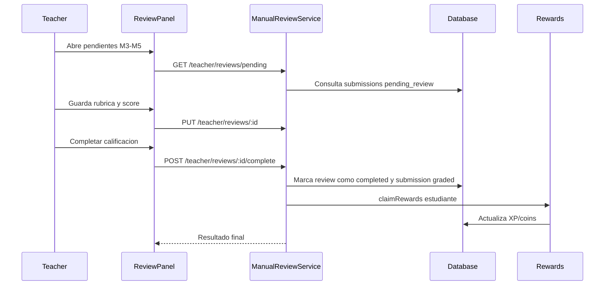

# Flujo Teacher - Revision Manual y Calificacion (Modulos 3-5)

**Version:** 1.2.0
**Fecha:** 2026-02-21
**Estado:** Activo

---

## Resumen

Modela el proceso docente de cola pendiente -> evaluacion con rubrica -> completado -> entrega de recompensas al estudiante. **Los 13 ejercicios de M3-M5 pasan por revision manual sin excepcion.** Ninguno tiene auto-scoring ni evaluacion por IA.

Al completar la revision, backend genera notificacion in-app para estudiante con `notificationType=exercise_feedback` y datos de recompensas.

## Diagrama Mermaid

## Trazabilidad

### Frontend
- `apps/frontend/src/apps/teacher/pages/TeacherReviewPanelPage.tsx`
- `apps/frontend/src/apps/teacher/components/review-panel/ReviewDetail.tsx`
- `apps/frontend/src/apps/teacher/hooks/useManualReviews.ts`

### Backend
- `apps/backend/src/modules/teacher/controllers/manual-review.controller.ts`
- `apps/backend/src/modules/teacher/services/manual-review.service.ts`
- `apps/backend/src/modules/progress/services/exercise-submission.service.ts`
- `apps/backend/src/modules/notifications/services/notification.service.ts`

### Datos
- `progress_tracking.manual_reviews`
- `progress_tracking.exercise_submissions`
- `gamification_system.user_stats`

## Ejercicios bajo revision manual (13 total)

### Modulo 3 — Pensamiento Critico (5)

| Ejercicio | Que revisa el docente |
|-----------|----------------------|
| Debate Digital | Ensayo estructurado: tesis, argumentos a favor, contraargumentos, conclusion. Evaluar coherencia argumentativa y calidad de escritura. |
| Matriz Perspectivas | Respuestas a preguntas de analisis sobre perspectivas pre-cargadas del ejercicio. Evaluar profundidad de analisis. |
| Analisis de Fuentes | Ranking de credibilidad de fuentes + justificacion escrita (min 100 chars). Evaluar criterio de seleccion y calidad de justificacion. |
| Podcast Argumentativo | Guion editado + audio grabado (subido via mediaApi). Evaluar estructura argumentativa del guion y calidad de la presentacion oral. |
| Tribunal Opiniones | Opiniones y veredictos escritos. Evaluar razonamiento y fundamentacion. |

### Modulo 4 — Lectura Digital (5)

| Ejercicio | Que revisa el docente |
|-----------|----------------------|
| Quiz TikTok | Respuestas de seleccion multiple + justificaciones escritas por pregunta (min 30 chars cada una). Sin auto-scoring; el docente evalua la calidad de las justificaciones. |
| Navegacion Hipertextual | Ruta de navegacion (nodos visitados) + reflexiones: resumen (min 150 chars), ruta alternativa (min 80 chars), lo mas importante (min 80 chars). Sin score automatico. |
| Infografia Interactiva | Tarjetas exploradas + respuestas drag & drop + analisis: relacion entre conceptos (min 80 chars), dato sorprendente (min 80 chars), sintesis (min 100 chars). Sin score automatico. |
| Verificador Fake News | Afirmaciones verificadas con veredicto (is_fake) y evidencia escrita. Calificacion 100% manual, sin score automatico. |
| Analisis de Memes | Anotaciones sobre memes SVG (posicion, texto, categoria). Evaluar capacidad de lectura critica de medios visuales. |

### Modulo 5 — Produccion Textual (3)

| Ejercicio | Que revisa el docente |
|-----------|----------------------|
| Diario Multimedia | Entradas de diario con elementos multimedia. Evaluar expresion escrita y uso de medios. |
| Comic Digital | Paneles de comic con texto y diseño. Evaluar narrativa visual y coherencia. |
| Video Carta | Video grabado + guion escrito. Evaluar contenido del mensaje y calidad de produccion. |

## Revision de ejercicios con recursos multimedia

### Analisis de Memes (M4)

El docente revisa anotaciones del estudiante sobre memes SVG:
- El panel de revision muestra el meme SVG original con las anotaciones superpuestas.
- `metadata.memeId` identifica cual meme fue anotado (en ejercicios multi-meme).
- `metadata.fullAnnotations[]` incluye categoria (texto/contexto/humor/critica) para facilitar evaluacion.
- SVGs servidos desde `public/memes/*.svg` (6 memes sobre Marie Curie).

### Comprension Auditiva (Auxiliar)

El docente revisa respuestas de seleccion multiple vinculadas a un audio:
- Las respuestas incluyen timestamps indicando cuando se desbloquearon las preguntas.
- Audio disponible en `public/audio/marie-curie-biografia.mp3` para referencia del docente.

## Riesgo funcional documentado

- Completar review y reclamar recompensas deben tratarse como unidad consistente para evitar `completed` sin recompensa aplicada.
