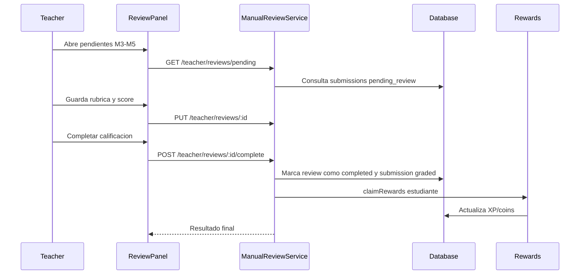

# Flujo Teacher - Revision Manual y Calificacion (Modulos 3-5)

**Version:** 1.0.0  
**Fecha:** 2026-02-17  
**Estado:** Activo

---

## Resumen

Modela el proceso docente de cola pendiente -> evaluacion con rubrica -> completado -> entrega de recompensas al estudiante.

Al completar la revision, backend genera notificacion in-app para estudiante con `notificationType=exercise_feedback` y datos de recompensas.

## Diagrama Mermaid

## Trazabilidad

### Frontend
- `apps/frontend/src/apps/teacher/pages/TeacherReviewPanel.tsx`
- `apps/frontend/src/apps/teacher/components/review-panel/ReviewDetail.tsx`
- `apps/frontend/src/apps/teacher/hooks/useManualReviews.ts`

### Backend
- `apps/backend/src/modules/teacher/controllers/manual-review.controller.ts`
- `apps/backend/src/modules/teacher/services/manual-review.service.ts`
- `apps/backend/src/modules/progress/services/exercise-submission.service.ts`
- `apps/backend/src/modules/notifications/services/notification.service.ts`

### Datos
- `progress_tracking.manual_reviews`
- `progress_tracking.exercise_submissions`
- `gamification_system.user_stats`

## Riesgo funcional documentado

- Completar review y reclamar recompensas deben tratarse como unidad consistente para evitar `completed` sin recompensa aplicada.
