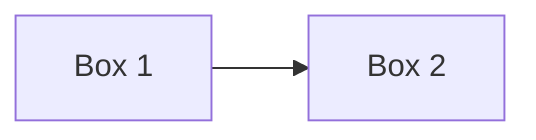

# Estandar de Documentacion

> Formato y estructura para documentos del proyecto gamilit

## Estructura de un Documento

### Encabezado Obligatorio
```markdown
# Titulo del Documento

> Descripcion breve en una linea (blockquote)

## Seccion 1
...
```

### Elementos Opcionales
- Tabla de contenidos (para documentos largos)
- Badges de estado
- Fecha de ultima actualizacion
- Referencias al final

## Formato Markdown

### Titulos
```markdown
# H1 - Solo uno por documento (titulo principal)
## H2 - Secciones principales
### H3 - Subsecciones
#### H4 - Detalles (usar con moderacion)
```

### Tablas
```markdown
| Columna 1 | Columna 2 | Columna 3 |
|-----------|-----------|-----------|
| Valor 1   | Valor 2   | Valor 3   |
```

### Codigo
````markdown
```typescript
// Bloque de codigo con lenguaje
const example = "code";
```

`codigo inline`
````

### Listas
```markdown
- Item sin orden
- Otro item
  - Sub-item

1. Item ordenado
2. Segundo item
```

### Enlaces
```markdown
[Texto del enlace](./ruta/relativa.md)
[Enlace absoluto](/ruta/desde/raiz.md)
```

## Tipos de Documentos

### 1. Indices (_INDEX.md, _MAP.md)
- Lista de archivos con descripcion
- Tabla de contenidos navegable
- Sin contenido extenso

### 2. Guias (GUIA-*.md)
- Instrucciones paso a paso
- Ejemplos practicos
- Verificacion al final

### 3. Estandares (ESTANDAR-*.md)
- Reglas claras en tablas
- Ejemplos de bueno/malo
- Excepciones documentadas

### 4. Referencias (QUICK-*.md)
- Informacion compacta
- Listas y tablas
- Facil de escanear

### 5. ADRs (ADR-*.md)
- Estructura fija (Contexto, Decision, Consecuencias)
- Numerados secuencialmente
- Inmutables una vez aprobados

## Plantillas

### Documento General
```markdown
# Nombre del Documento

> Descripcion en una linea

## Proposito

Explicacion del proposito del documento.

## Contenido Principal

### Seccion 1
...

### Seccion 2
...

## Referencias

- [Enlace 1](./ruta.md)
- [Enlace 2](./otra-ruta.md)
```

### ADR
```markdown
# ADR-NNNN: Titulo de la Decision

## Estado
Propuesto | Aceptado | Deprecado | Reemplazado por ADR-XXXX

## Contexto
Por que necesitamos tomar esta decision?

## Decision
Que decidimos hacer?

## Consecuencias

### Positivas
- Beneficio 1
- Beneficio 2

### Negativas
- Desventaja 1
- Desventaja 2

## Referencias
- [Documento relacionado](./ruta.md)
```

## Jerarquia SSOT de Documentacion de Producto

Cada tipo de artefacto tiene UNA SOLA ubicacion con detalle. Todo lo demas es referencia.

| Artefacto | SSOT (unica fuente) | Formato |
|-----------|---------------------|---------|
| Epicas (narrativa) | `docs/10-requirements/epics/{EPIC-ID}/EPIC.md` | Markdown |
| User Stories (detalle) | `docs/10-requirements/epics/{EPIC-ID}/user-stories/US-*.md` | Markdown |
| Plan de desarrollo | `docs/10-requirements/epics/{EPIC-ID}/PLAN.md` | Markdown |
| Epicas (tracking) | `orchestration/work-items/epics/{EPIC-ID}.yml` | YAML |
| Tasks (tracking) | `orchestration/work-items/tasks/TASK-*.yml` | YAML |
| Tasks (ejecucion) | `orchestration/tareas/activas/TASK-{ID}/` | Carpetas |
| Inventarios | `orchestration/inventarios/` | YAML |
| ADRs locales | `docs/90-adr/` | Markdown |

### Reglas SSOT

1. **PROHIBIDO** copiar contenido de US o epics entre niveles -- solo links
2. **orchestration/work-items/**: Solo YAML (id, status, SP, sprint, `docs_path:`)
3. **Repeticion de info = enlazar**, nunca copiar
4. **US co-localizadas** con su EPIC en `epics/EPIC-{ID}/`
5. **Tareas son operacionales** -- definicion en US, tracking en work-items/tasks/, ejecucion en tareas/activas/

### Jerarquia anidada

```
EPIC (narrativa)
├── US-*.md (co-localizadas)
│   └── Seccion "Tareas" (definicion)
│       └── TASK-*.yml (tracking en orchestration/)
│           └── subtasks[] (array YAML)
└── PLAN.md (secuencia de desarrollo)
```

### Estructura epics en gamilit

```
docs/10-requirements/
├── _INDEX.md
└── epics/
    ├── _INDEX.md
    ├── EPIC-GAM-F{N}-{ID}/
    │   ├── EPIC.md              <- Narrativa detallada
    │   ├── PLAN.md              <- Plan de desarrollo
    │   └── user-stories/
    │       └── US-{ID}/
    │           └── US-{ID}-{nombre}.md
    │           └── tasks/
    │               └── TASK-{ID}-{CODE}/
    └── ...
```

## Buenas Practicas

### Hacer
- Usar oraciones cortas y claras
- Preferir tablas sobre listas largas
- Incluir ejemplos practicos
- Mantener parrafos cortos (3-4 lineas)
- Usar diagramas ASCII cuando ayuden
- Enlazar a la fuente SSOT en vez de copiar contenido

### Evitar
- Parrafos extensos sin estructura
- Jerga innecesaria
- Repeticion de informacion (enlazar, NUNCA copiar)
- Documentos que mezclan temas
- Informacion desactualizada
- Multiples fuentes de verdad para el mismo artefacto

## Diagramas

### ASCII (preferido para simplicidad)
```
┌─────────┐     ┌─────────┐
│  Box 1  │────>│  Box 2  │
└─────────┘     └─────────┘
```

### Mermaid (cuando se soporte)


## Mantenimiento

| Accion | Frecuencia |
|--------|------------|
| Revisar enlaces rotos | Mensual |
| Actualizar fechas | Al modificar |
| Verificar ejemplos | Trimestral |
| Deprecar obsoletos | Cuando aplique |

---

## Referencias

- [ESTANDAR-NOMENCLATURA.md](./ESTANDAR-NOMENCLATURA.md) - Nombres de archivos
- [ESTANDAR-NOMENCLATURA-API.md](./ESTANDAR-NOMENCLATURA-API.md) - Nomenclatura API
- [CommonMark Spec](https://commonmark.org/) - Estandar Markdown
