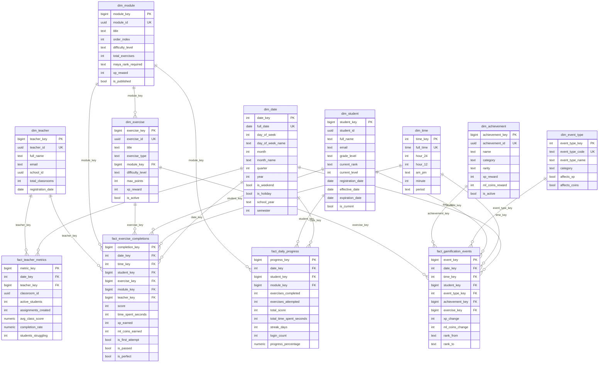

# DIMENSIONAL-MODEL.md - GAMILIT Data Warehouse Schema

**Version:** 1.0.0
**Created:** 2026-02-03
**Sprint:** 2.1 - Data Warehouse Design
**Schema:** data_warehouse
**Author:** Claude Agent (Sprint 2.1)

---

## Table of Contents

1. [Overview](#overview)
2. [Architecture](#architecture)
3. [ERD Diagram](#erd-diagram)
4. [Fact Tables](#fact-tables)
5. [Dimension Tables](#dimension-tables)
6. [Grain Definitions](#grain-definitions)
7. [SCD Strategies](#scd-strategies)
8. [Query Patterns](#query-patterns)
9. [ETL Considerations](#etl-considerations)
10. [Source Mappings](#source-mappings)

---

## Overview

The GAMILIT Data Warehouse implements a **Star Schema** design optimized for analytics and reporting on:

- **Student Performance**: Exercise completions, scores, time spent
- **Progress Tracking**: Daily aggregated progress, module completion
- **Gamification Metrics**: XP earned, achievements, rank progressions
- **Teacher Insights**: Classroom performance, student engagement

### Design Principles

1. **Star Schema**: Denormalized dimensions around fact tables for query performance
2. **Conformed Dimensions**: Shared dimensions (date, time, student) across all facts
3. **SCD Type 2**: Historical tracking for student dimension changes
4. **Additive Measures**: All numeric measures are additive across dimensions

---

## Architecture

```
┌─────────────────────────────────────────────────────────────────────────────┐
│                          OLTP SOURCE SCHEMAS                                 │
├─────────────┬─────────────┬─────────────┬─────────────┬─────────────────────┤
│ auth_mgmt   │ educational │ progress    │ gamification│ social_features     │
│ (profiles)  │ (exercises) │ (attempts)  │ (achievements)│ (classrooms)      │
└──────┬──────┴──────┬──────┴──────┬──────┴──────┬──────┴──────────┬──────────┘
       │             │             │             │                  │
       │             │     ETL EXTRACTION        │                  │
       ▼             ▼             ▼             ▼                  ▼
┌─────────────────────────────────────────────────────────────────────────────┐
│                         DATA WAREHOUSE SCHEMA                                │
│                                                                              │
│  ┌─────────────┐  ┌─────────────┐  ┌─────────────┐  ┌─────────────┐        │
│  │  dim_date   │  │  dim_time   │  │ dim_student │  │dim_exercise │        │
│  │  (conformed)│  │  (conformed)│  │   (SCD2)    │  │             │        │
│  └──────┬──────┘  └──────┬──────┘  └──────┬──────┘  └──────┬──────┘        │
│         │                │                │                 │               │
│         │    ┌───────────┴─────────┬──────┴──────┬─────────┴──────┐        │
│         │    │                     │             │                │        │
│  ┌──────┴────┴─────────────────────┴─────────────┴────────────────┴───┐    │
│  │                    FACT_EXERCISE_COMPLETIONS                        │    │
│  │         (Transaction Grain: One row per exercise attempt)           │    │
│  └─────────────────────────────────────────────────────────────────────┘    │
│                                                                              │
│  ┌─────────────────────────────────────────────────────────────────────┐    │
│  │                      FACT_DAILY_PROGRESS                             │    │
│  │       (Periodic Snapshot: One row per student/module/day)            │    │
│  └─────────────────────────────────────────────────────────────────────┘    │
│                                                                              │
│  ┌─────────────────────────────────────────────────────────────────────┐    │
│  │                    FACT_GAMIFICATION_EVENTS                          │    │
│  │          (Transaction Grain: One row per gamification event)         │    │
│  └─────────────────────────────────────────────────────────────────────┘    │
│                                                                              │
│  ┌─────────────────────────────────────────────────────────────────────┐    │
│  │                      FACT_TEACHER_METRICS                            │    │
│  │      (Periodic Snapshot: One row per teacher/classroom/day)          │    │
│  └─────────────────────────────────────────────────────────────────────┘    │
│                                                                              │
│  ┌─────────────┐  ┌─────────────┐  ┌─────────────┐  ┌─────────────┐        │
│  │ dim_module  │  │ dim_teacher │  │dim_achievement│ │dim_event_type│       │
│  └─────────────┘  └─────────────┘  └─────────────┘  └─────────────┘        │
└─────────────────────────────────────────────────────────────────────────────┘
```

---

## ERD Diagram



---

## Fact Tables

### 1. fact_exercise_completions (Transaction Grain)

**Grain:** One row per exercise attempt or submission

**Business Process:** Exercise completion tracking

| Column | Type | Description |
|--------|------|-------------|
| completion_key | BIGSERIAL | Surrogate PK |
| date_key | INTEGER | FK to dim_date |
| time_key | INTEGER | FK to dim_time |
| student_key | BIGINT | FK to dim_student |
| exercise_key | BIGINT | FK to dim_exercise |
| module_key | BIGINT | FK to dim_module |
| teacher_key | BIGINT | FK to dim_teacher (nullable) |
| score | INTEGER | Points earned |
| score_percentage | NUMERIC(5,2) | Score/max_score * 100 |
| time_spent_seconds | INTEGER | Duration of attempt |
| attempt_number | INTEGER | Which attempt (1, 2, 3...) |
| xp_earned | INTEGER | XP reward |
| ml_coins_earned | INTEGER | Coins reward |
| hints_used | INTEGER | Number of hints |
| is_first_attempt | BOOLEAN | First try flag |
| is_passed | BOOLEAN | Met passing score |
| is_perfect | BOOLEAN | 100% score |

**Measures (Additive):**
- score, time_spent_seconds, xp_earned, ml_coins_earned, hints_used

### 2. fact_daily_progress (Periodic Snapshot)

**Grain:** One row per student per module per day

**Business Process:** Daily progress tracking

| Column | Type | Description |
|--------|------|-------------|
| progress_key | BIGSERIAL | Surrogate PK |
| date_key | INTEGER | FK to dim_date |
| student_key | BIGINT | FK to dim_student |
| module_key | BIGINT | FK to dim_module |
| exercises_completed | INTEGER | Exercises done today |
| exercises_attempted | INTEGER | Exercises tried today |
| total_score | INTEGER | Sum of scores |
| total_time_spent_seconds | INTEGER | Time spent today |
| progress_percentage | NUMERIC(5,2) | Module progress % |
| progress_delta | NUMERIC(5,2) | Change from yesterday |
| streak_days | INTEGER | Current streak |
| login_count | INTEGER | Logins today |
| is_active_day | BOOLEAN | Had activity |

**Measures (Additive):**
- exercises_completed, exercises_attempted, total_score, total_time_spent_seconds, xp_earned, ml_coins_earned

### 3. fact_gamification_events (Transaction Grain)

**Grain:** One row per gamification event

**Business Process:** Gamification engagement

| Column | Type | Description |
|--------|------|-------------|
| event_key | BIGSERIAL | Surrogate PK |
| date_key | INTEGER | FK to dim_date |
| time_key | INTEGER | FK to dim_time |
| student_key | BIGINT | FK to dim_student |
| event_type_key | INTEGER | FK to dim_event_type |
| achievement_key | BIGINT | FK to dim_achievement (nullable) |
| xp_change | INTEGER | XP delta (+/-) |
| ml_coins_change | INTEGER | Coins delta (+/-) |
| rank_from | TEXT | Previous rank |
| rank_to | TEXT | New rank |
| streak_days | INTEGER | Streak at event time |

**Measures (Semi-Additive):**
- xp_change, ml_coins_change, points_change (can be negative)

### 4. fact_teacher_metrics (Periodic Snapshot)

**Grain:** One row per teacher per classroom per day

**Business Process:** Teacher/classroom performance

| Column | Type | Description |
|--------|------|-------------|
| metric_key | BIGSERIAL | Surrogate PK |
| date_key | INTEGER | FK to dim_date |
| teacher_key | BIGINT | FK to dim_teacher |
| classroom_id | UUID | Classroom reference |
| active_students | INTEGER | Students active today |
| total_students | INTEGER | Total enrolled |
| assignments_created | INTEGER | New assignments |
| submissions_received | INTEGER | Submissions today |
| avg_class_score | NUMERIC(5,2) | Average score |
| completion_rate | NUMERIC(5,2) | % exercises completed |
| students_struggling | INTEGER | Below 60% avg |
| students_excelling | INTEGER | Above 90% avg |

**Measures (Additive):**
- active_students, assignments_created, submissions_received, total_time_spent_seconds

---

## Dimension Tables

### Conformed Dimensions

| Dimension | Type | Rows | Description |
|-----------|------|------|-------------|
| dim_date | Static | ~3,650 | 10 years of dates |
| dim_time | Static | 1,440 | Minutes in a day |
| dim_student | SCD Type 2 | Variable | Historical student versions |

### Role-Playing Dimensions

- **dim_date** can be used for:
  - Completion date
  - Registration date
  - Submission date
  - Grading date

### Dimension Details

| Dimension | Source Table | SCD Type | Key Attributes |
|-----------|--------------|----------|----------------|
| dim_student | auth_management.profiles | Type 2 | grade_level, rank, level, status |
| dim_exercise | educational_content.exercises | Type 1 | exercise_type, difficulty, max_points |
| dim_module | educational_content.modules | Type 1 | title, maya_rank_required |
| dim_teacher | auth_management.profiles | Type 1 | school, classrooms |
| dim_achievement | gamification_system.achievements | Type 1 | category, rarity, rewards |
| dim_event_type | System-defined | Static | Pre-seeded lookup table |

---

## Grain Definitions

### Transaction Grain

**fact_exercise_completions:**
> "One row for each exercise attempt or submission made by a student."

- Every attempt creates a new row
- Includes both auto-graded attempts and manual submissions
- Source identified by `source_table` column

**fact_gamification_events:**
> "One row for each gamification event that affects a student's rewards or status."

- Achievement unlocks, rank promotions, level ups
- XP and coin transactions
- Streak milestones

### Periodic Snapshot Grain

**fact_daily_progress:**
> "One row for each student for each module for each day, capturing end-of-day progress state."

- Aggregated from transaction facts
- Includes cumulative running totals
- Non-active days may not have rows (sparse)

**fact_teacher_metrics:**
> "One row for each teacher for each classroom for each day, capturing daily classroom metrics."

- Aggregated from student progress
- Includes at-risk indicators
- Supports teacher dashboard

---

## SCD Strategies

### dim_student - SCD Type 2

Tracks historical changes to student attributes:

**Tracked Attributes:**
- grade_level (promotes each year)
- current_rank (Maya rank progression)
- current_level (XP level)
- status (active/inactive/suspended)
- school_id (transfers)

**SCD Columns:**
```sql
effective_date   DATE     -- When this version became active
expiration_date  DATE     -- When this version expired (NULL = current)
is_current       BOOLEAN  -- TRUE for the active version
version_number   INTEGER  -- Incrementing version counter
```

**Query Patterns:**
```sql
-- Current student record
SELECT * FROM dim_student WHERE is_current = TRUE;

-- Point-in-time lookup
SELECT * FROM dim_student
WHERE student_id = :id
  AND effective_date <= :date
  AND (expiration_date > :date OR expiration_date IS NULL);
```

### Other Dimensions - SCD Type 1

Overwrite strategy for:
- dim_exercise (content rarely changes impact on history)
- dim_module
- dim_teacher
- dim_achievement

---

## Query Patterns

### 1. Student Performance Over Time

```sql
-- Average score by month for a student
SELECT
    d.year,
    d.month_name,
    AVG(f.score_percentage) as avg_score,
    COUNT(*) as exercises_completed,
    SUM(f.xp_earned) as total_xp
FROM fact_exercise_completions f
JOIN dim_date d ON f.date_key = d.date_key
JOIN dim_student s ON f.student_key = s.student_key
WHERE s.student_id = :student_uuid
  AND s.is_current = TRUE
GROUP BY d.year, d.month, d.month_name
ORDER BY d.year, d.month;
```

### 2. Classroom Performance Comparison

```sql
-- Compare classrooms by average score
SELECT
    f.classroom_id,
    COUNT(DISTINCT f.student_key) as students,
    AVG(f.avg_class_score) as avg_score,
    AVG(f.completion_rate) as completion_rate,
    SUM(f.students_struggling) as total_struggling
FROM fact_teacher_metrics f
JOIN dim_date d ON f.date_key = d.date_key
WHERE d.full_date BETWEEN :start_date AND :end_date
GROUP BY f.classroom_id
ORDER BY avg_score DESC;
```

### 3. Exercise Difficulty Analysis

```sql
-- Pass rate by exercise type and difficulty
SELECT
    e.exercise_type,
    e.difficulty_level,
    COUNT(*) as attempts,
    AVG(f.score_percentage) as avg_score,
    SUM(CASE WHEN f.is_passed THEN 1 ELSE 0 END)::float / COUNT(*) * 100 as pass_rate,
    AVG(f.time_spent_seconds) as avg_time_seconds
FROM fact_exercise_completions f
JOIN dim_exercise e ON f.exercise_key = e.exercise_key
WHERE f.is_first_attempt = TRUE
GROUP BY e.exercise_type, e.difficulty_level
ORDER BY pass_rate;
```

### 4. Gamification Leaderboard

```sql
-- Weekly XP leaderboard
SELECT
    s.full_name,
    s.current_rank,
    SUM(g.xp_change) as weekly_xp,
    COUNT(CASE WHEN g.achievement_key IS NOT NULL THEN 1 END) as achievements
FROM fact_gamification_events g
JOIN dim_student s ON g.student_key = s.student_key
JOIN dim_date d ON g.date_key = d.date_key
WHERE d.week_of_year = :week
  AND d.year = :year
  AND s.is_current = TRUE
  AND g.xp_change > 0
GROUP BY s.student_key, s.full_name, s.current_rank
ORDER BY weekly_xp DESC
LIMIT 20;
```

### 5. At-Risk Student Identification

```sql
-- Students with declining performance
SELECT
    s.student_id,
    s.full_name,
    s.grade_level,
    current_week.avg_score as this_week_avg,
    prev_week.avg_score as last_week_avg,
    (current_week.avg_score - prev_week.avg_score) as score_change
FROM dim_student s
JOIN (
    SELECT student_key, AVG(average_score) as avg_score
    FROM fact_daily_progress f
    JOIN dim_date d ON f.date_key = d.date_key
    WHERE d.week_of_year = :current_week AND d.year = :year
    GROUP BY student_key
) current_week ON s.student_key = current_week.student_key
JOIN (
    SELECT student_key, AVG(average_score) as avg_score
    FROM fact_daily_progress f
    JOIN dim_date d ON f.date_key = d.date_key
    WHERE d.week_of_year = :current_week - 1 AND d.year = :year
    GROUP BY student_key
) prev_week ON s.student_key = prev_week.student_key
WHERE s.is_current = TRUE
  AND current_week.avg_score < prev_week.avg_score - 10
ORDER BY score_change ASC;
```

---

## ETL Considerations

### Load Frequency

| Table | Frequency | Method |
|-------|-----------|--------|
| dim_date | One-time | Pre-populated |
| dim_time | One-time | Pre-populated |
| dim_student | Daily | Incremental SCD2 |
| dim_exercise | Daily | Full refresh |
| dim_module | Daily | Full refresh |
| dim_teacher | Daily | Incremental |
| dim_achievement | Daily | Full refresh |
| fact_exercise_completions | Near real-time | Incremental |
| fact_daily_progress | Daily (end of day) | Snapshot |
| fact_gamification_events | Near real-time | Incremental |
| fact_teacher_metrics | Daily (end of day) | Snapshot |

### ETL Batch Tracking

All tables include:
- `etl_loaded_at` - Timestamp of load
- `etl_batch_id` - Batch identifier
- `source_updated_at` - Source system timestamp

### Key Generation

- **Surrogate Keys:** BIGSERIAL auto-increment
- **Date Key:** YYYYMMDD integer format
- **Time Key:** HHMM integer format

---

## Source Mappings

### fact_exercise_completions Sources

| DW Column | Source Table | Source Column |
|-----------|--------------|---------------|
| student_key | Lookup via | dim_student.student_id |
| exercise_key | Lookup via | dim_exercise.exercise_id |
| source_attempt_id | exercise_attempts | id |
| source_attempt_id | exercise_submissions | id |
| score | exercise_attempts | score |
| score | exercise_submissions | score |
| time_spent_seconds | exercise_attempts | time_spent_seconds |
| xp_earned | exercise_attempts | xp_earned |
| ml_coins_earned | exercise_attempts | ml_coins_earned |

### fact_gamification_events Sources

| DW Column | Source Table | Source Column |
|-----------|--------------|---------------|
| student_key | Lookup via | dim_student.student_id |
| event_type_key | Lookup via | dim_event_type.event_type_code |
| xp_change | ml_coins_transactions | amount (when type=xp) |
| ml_coins_change | ml_coins_transactions | amount |
| achievement_key | user_achievements | achievement_id |

---

## Related Documentation

- DDL Files: `apps/database/ddl/schemas/data_warehouse/`
- ETL Specs: (To be created in Sprint 2.2)
- Source Schema Docs: `docs/90-transversal/arquitectura-database/`
- Inventory: `orchestration/inventarios/DATABASE_INVENTORY.yml`

---

*Document maintained by GAMILIT Architecture Team*
*Last updated: 2026-02-03*
