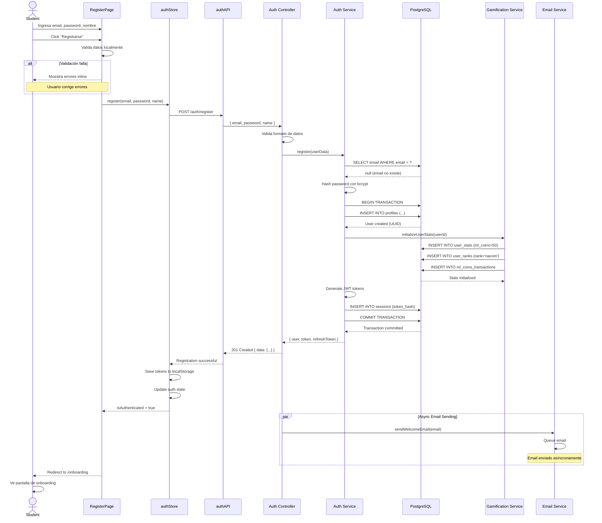
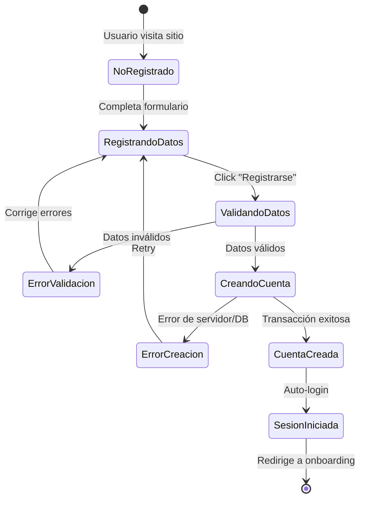

# UC-STU-001: Registro de nuevo estudiante

**Proyecto:** Gamilit Platform
**Rol:** Student
**Fecha:** 2025-10-28
**Archivo original:** STUDENT-USE-CASES.md
**Versión:** 2.0 (RFC-0001 Modularizado)

---

## UC-STU-001: Registro de nuevo estudiante

### 1. Descripción Breve
Estudiante crea una cuenta nueva en la plataforma GAMILIT para acceder al contenido educativo gamificado.

### 2. Actores

**Actor Principal:**
- **Rol:** student (no autenticado)
- **Descripción:** Usuario nuevo que desea registrarse en la plataforma para comenzar su aprendizaje.

**Actores Secundarios:**
- **Sistema de Notificaciones** - Envía email de bienvenida
- **Sistema de Gamificación** - Inicializa estadísticas de usuario y otorga ML Coins de bienvenida (ver [Sistema de Gamificación](../../gamificacion/README.md))
- **Sistema de Autenticación** - Valida credenciales y crea sesión

### 3. Precondiciones

1. Usuario no está autenticado en el sistema
2. Usuario tiene acceso a navegador web moderno (Chrome, Firefox, Safari, Edge)
3. Sistema de registro está disponible (endpoint /api/auth/register activo)
4. Base de datos tiene capacidad para nuevos usuarios
5. Conexión a internet estable

### 4. Postcondiciones

**Postcondiciones de Éxito:**
- Usuario registrado en tabla `auth_management.profiles` con status 'active'
- Registro de estadísticas inicializado en tabla `gamification_system.user_stats` con 50 ML Coins de bienvenida
- Rango inicial 'Ajaw' (Señor/Iniciado) asignado en tabla `gamification_system.user_ranks` (ver [Rangos Maya](../../gamificacion/01-RANGOS-MAYA.md))
- JWT token y refresh token generados y entregados al cliente
- Sesión creada en tabla `auth_management.sessions`
- Usuario autenticado y redirigido a página de onboarding (ver [UC-STU-002](./UC-STU-002-onboarding.md))
- Email de bienvenida enviado a la bandeja de entrada del usuario

**Postcondiciones de Fallo:**
- Usuario NO creado en base de datos
- No se generan tokens de autenticación
- Usuario informado del error específico (email duplicado, password débil, etc.)
- Sistema permanece en estado consistente (rollback de transacción)

### 5. Flujo Principal (Escenario de Éxito)

1. Usuario navega a la página de registro en URL `/register`

2. Sistema muestra formulario de registro con campos:
   - Email (requerido)
   - Contraseña (requerido, mínimo 8 caracteres)
   - Confirmar contraseña (requerido)
   - Nombre completo (requerido)
   - Fecha de nacimiento (opcional)
   - Checkbox de aceptación de términos y condiciones

3. Usuario completa todos los campos requeridos y marca checkbox de términos

4. Usuario hace clic en botón "Registrarse"

5. Sistema Frontend valida datos localmente:
   - Email tiene formato válido
   - Contraseñas coinciden
   - Contraseña cumple requisitos mínimos (8+ caracteres, 1 mayúscula, 1 número)
   - Nombre completo tiene al menos 3 caracteres
   - Términos fueron aceptados

6. Sistema Frontend envía POST request a `/api/auth/register` con datos validados

7. Sistema Backend valida datos recibidos:
   - Email no existe en base de datos
   - Formato de datos es correcto
   - Contraseña cumple política de seguridad

8. Sistema Backend inicia transacción de base de datos (BEGIN)

9. Sistema Backend hashea contraseña con bcrypt (salt rounds: 12)

10. Sistema Backend inserta nuevo usuario en tabla `auth_management.profiles`:
    - Genera UUID para id
    - Guarda password_hash (no password en texto plano)
    - Asigna role = 'student'
    - Asigna status = 'active'
    - Asigna tenant_id predeterminado
    - Establece created_at = NOW()

11. Sistema de Gamificación inicializa estadísticas del usuario en `gamification_system.user_stats`:
    - ml_coins = 50 (bienvenida)
    - total_xp = 0
    - current_rank = 'nacom'
    - current_streak = 0
    - exercises_completed = 0

12. Sistema de Gamificación crea registro inicial de rango en `gamification_system.user_ranks`:
    - rank_name = 'nacom'
    - is_current = true
    - achieved_at = NOW()

13. Sistema de Gamificación registra transacción de ML Coins en `gamification_system.ml_coins_transactions`:
    - amount = 50
    - transaction_type = 'welcome_bonus'
    - balance_after = 50

14. Sistema Backend genera JWT access token (expiración: 7 días)

15. Sistema Backend genera refresh token (expiración: 30 días)

16. Sistema Backend crea sesión en `auth_management.sessions`:
    - Guarda token hasheado
    - Registra user_agent y IP address
    - Establece expires_at = NOW() + 7 days

17. Sistema Backend confirma transacción (COMMIT)

18. Sistema Backend retorna respuesta exitosa 201 Created con:
    - Datos del usuario (sin password_hash)
    - JWT token
    - Refresh token
    - Estadísticas iniciales

19. Sistema Frontend almacena tokens en localStorage:
    - Guarda access token para requests autenticados
    - Guarda refresh token para renovación de sesión

20. Sistema Frontend actualiza estado global de autenticación en Zustand store:
    - isAuthenticated = true
    - user = datos del usuario
    - stats = estadísticas iniciales

21. Sistema de Notificaciones envía email de bienvenida asíncronamente (no bloquea respuesta)

22. Sistema Frontend redirige a usuario a página de onboarding (`/onboarding`)

23. **Fin del caso de uso exitoso**

### 6. Flujos Alternativos

**A1: Usuario ya tiene cuenta y hace clic en "Ya tengo cuenta"**
- **Punto de divergencia:** Paso 2 del flujo principal
- **Condición:** Usuario hace clic en link "Ya tengo cuenta" en formulario de registro
- **Flujo:**
  1. Sistema redirige a usuario a página de login (`/login`)
  2. **Termina caso de uso** (usuario continúa con UC-Login)

**A2: Usuario se registra con cuenta de organización (código institucional)**
- **Punto de divergencia:** Paso 2 del flujo principal
- **Condición:** Usuario ingresa código de institución educativa en campo opcional
- **Flujo:**
  1. Sistema valida código de institución contra tabla `tenant_management.tenants`
  2. Si código es válido:
     - Sistema asigna tenant_id correspondiente al usuario
     - Sistema marca usuario como perteneciente a organización
     - Usuario obtiene acceso a classrooms de la institución
  3. Si código es inválido:
     - Sistema muestra mensaje "Código de institución inválido"
     - Usuario puede continuar sin código (tenant_id predeterminado)
  4. **Continúa en:** Paso 3 del flujo principal

**A3: Usuario activa creación de avatar personalizado**
- **Punto de divergencia:** Paso 22 del flujo principal (después de registro exitoso)
- **Condición:** Usuario completa registro y es redirigido a onboarding
- **Flujo:**
  1. En página de onboarding, sistema muestra wizard de creación de avatar
  2. Usuario selecciona características de avatar (color de piel, cabello, accesorios)
  3. Sistema genera avatar SVG personalizado
  4. Sistema actualiza campo avatar_url en `auth_management.profiles`
  5. **Continúa en:** Flujo de onboarding (UC-STU-002)

**A4: Usuario se registra desde dispositivo móvil**
- **Punto de divergencia:** Paso 1 del flujo principal
- **Condición:** Usuario accede desde dispositivo móvil (viewport < 768px)
- **Flujo:**
  1. Sistema detecta viewport móvil
  2. Sistema renderiza formulario de registro en layout mobile-optimized
  3. Sistema ajusta validaciones para teclados táctiles
  4. Sistema habilita autofill de navegador móvil
  5. **Continúa en:** Paso 2 del flujo principal con UI adaptada

### 7. Flujos de Excepción

**E1: Email ya registrado en el sistema**
- **Punto de ocurrencia:** Paso 7 del flujo principal (validación backend)
- **Condición de error:** Email existe en tabla `auth_management.profiles`
- **Manejo:**
  1. Sistema Backend detecta email duplicado (constraint violation o query previa)
  2. Sistema Backend retorna error 409 Conflict con código 'EMAIL_ALREADY_EXISTS'
  3. Sistema Frontend muestra mensaje específico: "Este email ya está registrado. ¿Quieres iniciar sesión?"
  4. Sistema Frontend muestra botón "Ir a Login"
  5. Sistema Frontend resalta campo de email en rojo
  6. Si usuario hace clic en "Ir a Login": redirige a `/login` con email pre-rellenado
  7. Si usuario corrige email: **Retorna a** Paso 3 del flujo principal

**E2: Contraseña no cumple política de seguridad**
- **Punto de ocurrencia:** Paso 5 del flujo principal (validación frontend) o Paso 7 (validación backend)
- **Condición de error:** Password no cumple requisitos mínimos
- **Manejo:**
  1. Sistema valida contraseña contra política:
     - Mínimo 8 caracteres
     - Al menos 1 letra mayúscula
     - Al menos 1 número
     - Al menos 1 carácter especial (opcional pero recomendado)
  2. Sistema identifica requisito incumplido
  3. Sistema muestra mensaje específico: "Tu contraseña debe tener [requisito faltante]"
  4. Sistema muestra checklist visual con requisitos:
     - ✅ Mínimo 8 caracteres (verde si cumple, gris si no)
     - ✅ Una mayúscula
     - ✅ Un número
  5. Sistema resalta campo de contraseña en amarillo (warning)
  6. Usuario modifica contraseña
  7. Sistema valida en tiempo real y actualiza checklist
  8. Cuando todos los requisitos se cumplen: botón "Registrarse" se habilita
  9. **Retorna a:** Paso 4 del flujo principal

**E3: Error de conexión durante registro**
- **Punto de ocurrencia:** Paso 6 del flujo principal (envío de request)
- **Condición de error:** Network timeout, servidor no responde, o error HTTP 5xx
- **Manejo:**
  1. Sistema Frontend detecta error de red (timeout después de 10 segundos o error HTTP)
  2. Sistema Frontend guarda datos del formulario en sessionStorage (prevenir pérdida de datos)
  3. Sistema Frontend muestra mensaje: "Error de conexión. Verificando..."
  4. Sistema Frontend intenta reconectar automáticamente (retry con backoff exponencial):
     - Intento 1: inmediato
     - Intento 2: después de 2 segundos
     - Intento 3: después de 5 segundos
  5. Si reconexión exitosa:
     - Sistema recupera datos de sessionStorage
     - Sistema reenvía request de registro
     - **Continúa en:** Paso 7 del flujo principal
  6. Si reconexión falla después de 3 intentos:
     - Sistema muestra mensaje: "No pudimos conectar al servidor. Verifica tu conexión a internet."
     - Sistema mantiene datos en formulario (no se pierden)
     - Sistema muestra botón "Reintentar"
     - Usuario puede hacer clic en "Reintentar" para volver a intentar
  7. **Retorna a:** Paso 4 del flujo principal (usuario puede corregir o reintentar)

**E4: Error de base de datos durante transacción**
- **Punto de ocurrencia:** Entre pasos 8-17 del flujo principal (transacción de DB)
- **Condición de error:** Database constraint violation, connection pool exhausted, query timeout
- **Manejo:**
  1. Sistema Backend detecta error de base de datos durante transacción
  2. Sistema Backend ejecuta ROLLBACK automático (ningún cambio se persiste)
  3. Sistema Backend registra error en logs con contexto completo:
     - Stack trace
     - User data (email ofuscado)
     - Query que falló
     - Timestamp
  4. Sistema Backend clasifica error:
     - Si es error de constraint (unique, foreign key): retorna error 400 Bad Request
     - Si es error de conexión/timeout: retorna error 503 Service Unavailable
     - Si es error desconocido: retorna error 500 Internal Server Error
  5. Sistema Backend retorna respuesta de error con código específico
  6. Sistema Frontend muestra mensaje amigable según tipo de error:
     - Constraint: "Hubo un problema con los datos ingresados"
     - Conexión: "El servicio está temporalmente no disponible"
     - Desconocido: "Ocurrió un error inesperado. Intenta de nuevo"
  7. Sistema Frontend mantiene datos del formulario intactos
  8. Sistema Frontend muestra botón "Reintentar"
  9. Sistema de Monitoreo dispara alerta si tasa de errores > 5% (para investigación ops)
  10. **Retorna a:** Paso 4 del flujo principal

**E5: Términos y condiciones no aceptados**
- **Punto de ocurrencia:** Paso 5 del flujo principal (validación frontend)
- **Condición de error:** Checkbox de términos no está marcado
- **Manejo:**
  1. Usuario intenta hacer clic en "Registrarse" sin marcar checkbox
  2. Sistema Frontend previene envío del formulario
  3. Sistema Frontend muestra mensaje cerca del checkbox: "Debes aceptar los términos y condiciones para continuar"
  4. Sistema Frontend resalta checkbox en rojo con animación de shake
  5. Sistema Frontend hace scroll hasta checkbox si no está visible
  6. Usuario marca checkbox
  7. Mensaje de error desaparece
  8. **Retorna a:** Paso 4 del flujo principal

**E6: Campos requeridos vacíos o incompletos**
- **Punto de ocurrencia:** Paso 5 del flujo principal (validación frontend)
- **Condición de error:** Uno o más campos requeridos están vacíos o incompletos
- **Manejo:**
  1. Usuario intenta enviar formulario con campos vacíos
  2. Sistema Frontend identifica todos los campos inválidos
  3. Sistema Frontend muestra mensajes de error inline debajo de cada campo:
     - Email vacío: "El email es requerido"
     - Contraseña vacía: "La contraseña es requerida"
     - Nombre vacío: "El nombre completo es requerido"
     - Contraseñas no coinciden: "Las contraseñas no coinciden"
  4. Sistema Frontend resalta campos inválidos con borde rojo
  5. Sistema Frontend hace focus en el primer campo inválido
  6. Sistema Frontend deshabilita botón "Registrarse" hasta que todos los campos sean válidos
  7. Usuario corrige campos
  8. Sistema Frontend valida en tiempo real (on blur y on input)
  9. Cuando campo es corregido: mensaje de error desaparece y borde rojo se remueve
  10. Cuando todos los campos son válidos: botón "Registrarse" se habilita
  11. **Retorna a:** Paso 4 del flujo principal

### 8. Requisitos No Funcionales

**Performance:**
- Tiempo de respuesta del endpoint de registro: < 1.5 segundos (p95)
- Validación frontend: < 100ms
- Carga de página de registro: < 2 segundos
- Hash de contraseña (bcrypt): 10-12 rounds (balance seguridad/performance)

**Usabilidad:**
- Formulario completamente accesible (WCAG 2.1 nivel AA)
- Labels asociados correctamente con inputs (for/id)
- Mensajes de error descriptivos y accionables
- Soporte para screen readers (ARIA labels, roles)
- Indicadores de campo requerido visibles (* rojo)
- Password strength meter visual
- Confirmación de contraseña en tiempo real
- Autofill compatible (autocomplete attributes)

**Seguridad:**
- Contraseñas hasheadas con bcrypt (NUNCA almacenar en texto plano)
- Validación de email format en backend (prevenir injection)
- Rate limiting: máximo 5 intentos de registro por IP por hora
- Captcha después de 3 intentos fallidos (prevenir bots)
- JWT tokens con expiración corta (7 días access, 30 días refresh)
- Refresh tokens hasheados en base de datos
- HTTPS obligatorio en producción
- Headers de seguridad (HSTS, CSP, X-Frame-Options)
- Password policy enforcement (backend validation)
- SQL injection prevention (prepared statements)

**Disponibilidad:**
- Uptime requerido: 99.5% (permitir ~3.6 horas downtime/mes)
- Degradación graciosa si servicio de email falla (registro continúa, email se encola)
- Database failover automático (replica en standby)
- Sistema debe manejar 100 registros simultáneos sin degradación

**Escalabilidad:**
- Sistema debe soportar 1,000 registros por día sin optimizaciones adicionales
- Connection pool de DB debe manejar picos de tráfico (mínimo 20 conexiones)
- Session storage escalable (Redis en producción, memory en dev)

**Auditabilidad:**
- Todos los registros se logean con timestamp y metadata
- Intentos fallidos de registro se registran (para análisis de fraude)
- Logs incluyen IP address, user agent, email (ofuscado)
- Retención de logs: mínimo 90 días

### 9. Reglas de Negocio

- **RN-001:** Email debe ser único en toda la plataforma (constraint en base de datos)
- **RN-002:** Solo se permite un registro por email (no múltiples cuentas)
- **RN-003:** Contraseña debe tener mínimo 8 caracteres, 1 mayúscula, 1 número
- **RN-004:** Nombre completo debe tener al menos 3 caracteres y máximo 100
- **RN-005:** Usuario inicia siempre con rango 'nacom' (primer rango Maya)
- **RN-006:** Usuario recibe 50 ML Coins de bienvenida al registrarse
- **RN-007:** Edad mínima para registro: 13 años (COPPA compliance - verificar en producción)
- **RN-008:** Usuario debe aceptar términos y condiciones explícitamente
- **RN-009:** Rol predeterminado es 'student' (solo admin puede crear otros roles)
- **RN-010:** Status inicial es 'active' (usuario puede usar sistema inmediatamente)
- **RN-011:** JWT access token expira en 7 días, refresh token en 30 días
- **RN-012:** Email de bienvenida se envía asíncronamente (no bloquea registro)
- **RN-013:** Sesión se crea automáticamente al registrarse (auto-login)
- **RN-014:** Tenant_id predeterminado se asigna si usuario no proporciona código institucional

### 10. Trazabilidad

**Endpoints Involucrados:**
- `POST /api/auth/register` - Endpoint principal de registro
- `POST /api/auth/login` - Usado en flujo alternativo si email existe
- `GET /api/auth/validate-email/:email` - Validación previa de email (opcional, para UX)

**Componentes Frontend:**
- `src/features/auth/pages/RegisterPage.tsx` - Página principal de registro
- `src/features/auth/components/RegisterForm.tsx` - Formulario de registro
- `src/features/auth/store/authStore.ts` - Zustand store de autenticación
- `src/services/api/authAPI.ts` - Cliente API de autenticación
- `src/features/auth/components/PasswordStrengthMeter.tsx` - Indicador de fortaleza de contraseña
- `src/features/auth/utils/validation.ts` - Utilidades de validación
- `src/features/auth/components/TermsCheckbox.tsx` - Checkbox de términos

**Servicios Backend:**
- `src/modules/auth/auth.controller.ts` - Controlador de autenticación
- `src/modules/auth/auth.service.ts` - Lógica de negocio de autenticación
- `src/modules/auth/auth.repository.ts` - Acceso a datos de usuarios
- `src/modules/gamification/stats.service.ts` - Inicialización de estadísticas de gamificación
- `src/modules/gamification/ranks.service.ts` - Asignación de rango inicial
- `src/modules/notifications/email.service.ts` - Envío de email de bienvenida
- `src/middleware/validation.middleware.ts` - Validación de datos de entrada
- `src/utils/encryption.ts` - Hashing de contraseñas con bcrypt

**Tablas de Base de Datos:**
- `auth_management.profiles` - Tabla principal de usuarios
- `auth_management.sessions` - Sesiones activas
- `gamification_system.user_stats` - Estadísticas de gamificación
- `gamification_system.user_ranks` - Historial de rangos
- `gamification_system.ml_coins_transactions` - Transacciones de ML Coins
- `tenant_management.tenants` - Organizaciones (para código institucional)

**Tests Relacionados:**
- `src/modules/auth/__tests__/auth.service.test.ts` - Tests unitarios de servicio de auth
- `src/modules/auth/__tests__/auth.controller.test.ts` - Tests unitarios de controlador
- `src/modules/auth/__tests__/register.integration.test.ts` - Tests de integración de registro
- `tests/e2e/auth/register.e2e.test.ts` - Tests end-to-end de flujo completo de registro
- `tests/e2e/auth/register-validation.e2e.test.ts` - Tests de validaciones de formulario

**User Stories:**
- US-001-01: Registro de usuario con email y contraseña
- US-001-02: Validación de datos de registro
- US-004-01: Inicialización de sistema de gamificación para nuevo usuario

### 11. Diagramas

#### Diagrama de Secuencia (Mermaid)



#### Diagrama de Estados del Usuario



### 12. Mockups / Wireframes

**Pantalla 1: Formulario de Registro**
```
┌─────────────────────────────────────────┐
│  GAMILIT- Registro de Nueva Cuenta       │
├─────────────────────────────────────────┤
│                                         │
│  Email *                                │
│  [_________________________________]    │
│                                         │
│  Contraseña *                           │
│  [_________________________________] 👁  │
│  ✅ Mínimo 8 caracteres                 │
│  ✅ Una mayúscula                       │
│  ✅ Un número                           │
│                                         │
│  Confirmar Contraseña *                 │
│  [_________________________________] 👁  │
│                                         │
│  Nombre Completo *                      │
│  [_________________________________]    │
│                                         │
│  Código de Institución (opcional)       │
│  [_____________]  [Validar]             │
│                                         │
│  ☐ Acepto términos y condiciones       │
│                                         │
│  [    Registrarse    ]                  │
│                                         │
│  ¿Ya tienes cuenta? Inicia sesión      │
└─────────────────────────────────────────┘
```

**Pantalla 2: Registro Exitoso (antes de redirección)**
```
┌─────────────────────────────────────────┐
│           ¡Bienvenido a GAMILIT           │
├─────────────────────────────────────────┤
│                                         │
│              🎉  ✨  🎊                 │
│                                         │
│  Tu cuenta ha sido creada exitosamente │
│                                         │
│  Has recibido:                          │
│  💰 50 ML Coins de bienvenida           │
│  🏆 Rango Nacom (Iniciado)              │
│                                         │
│  [  Comenzar mi aventura  ]             │
│                                         │
│  (Redirigiendo en 3 segundos...)        │
└─────────────────────────────────────────┘
```

**Pantalla 3: Error de Validación**
```
┌─────────────────────────────────────────┐
│  GAMILIT- Registro de Nueva Cuenta       │
├─────────────────────────────────────────┤
│                                         │
│  Email *                                │
│  [test@example.com________________]    │
│  ❌ Este email ya está registrado      │
│     ¿Quieres iniciar sesión?           │
│                                         │
│  Contraseña *                           │
│  [_________________________________] 👁  │
│  ❌ Tu contraseña debe tener:          │
│  ❌ Mínimo 8 caracteres                │
│  ✅ Una mayúscula                      │
│  ❌ Un número                          │
│                                         │
│  ...                                    │
└─────────────────────────────────────────┘
```

### 13. Criterios de Aceptación

**Funcionales:**
- [ ] Usuario puede completar formulario de registro con todos los campos requeridos
- [ ] Sistema valida email, contraseña y nombre en frontend antes de enviar
- [ ] Sistema muestra mensajes de error descriptivos para cada campo inválido
- [ ] Sistema previene registro con email duplicado
- [ ] Sistema hashea contraseña con bcrypt antes de almacenar
- [ ] Sistema genera JWT access token y refresh token válidos
- [ ] Sistema crea registro en tabla `auth_management.profiles`
- [ ] Sistema inicializa estadísticas de gamificación con 50 ML Coins
- [ ] Sistema asigna rango inicial 'nacom'
- [ ] Sistema crea sesión automáticamente (auto-login)
- [ ] Sistema redirige a página de onboarding después de registro exitoso
- [ ] Sistema envía email de bienvenida (asíncronamente)
- [ ] Checkbox de términos y condiciones es obligatorio
- [ ] Link "Ya tengo cuenta" redirige a página de login
- [ ] Sistema muestra password strength meter visual

**No Funcionales:**
- [ ] Registro completa en menos de 1.5 segundos (p95)
- [ ] Formulario es completamente accesible (WCAG 2.1 AA)
- [ ] Sistema soporta 100 registros simultáneos sin degradación
- [ ] Rate limiting previene más de 5 registros por IP por hora
- [ ] Contraseñas NUNCA se almacenan en texto plano
- [ ] Tokens se guardan hasheados en base de datos
- [ ] Sistema funciona en Chrome, Firefox, Safari, Edge (últimas 2 versiones)
- [ ] Formulario es responsive (mobile, tablet, desktop)
- [ ] Transacción de DB hace rollback automático en caso de error
- [ ] Logs capturan todos los intentos de registro (éxito y fallo)

**Tests:**
- [ ] Tests unitarios de validación de formulario pasan al 100%
- [ ] Tests de integración de endpoint /auth/register pasan al 100%
- [ ] Tests e2e de flujo completo de registro pasan al 100%
- [ ] Tests de seguridad (SQL injection, XSS) pasan al 100%
- [ ] Tests de concurrencia (100 registros simultáneos) pasan
- [ ] Tests de manejo de errores (DB down, email service down) pasan

### 14. Notas Adicionales

**Consideraciones de Diseño:**
- Formulario sigue principio de "progressive disclosure" (campos opcionales colapsados)
- Password strength meter usa librería zxcvbn para análisis robusto
- Email de bienvenida incluye link de verificación (feature futura)
- Avatar predeterminado se genera con librería boring-avatars basado en email hash

**Deuda Técnica Conocida:**
- Email verification no está implementada (usuarios pueden registrarse con emails falsos)
- Captcha solo se activa después de 3 intentos (debería ser desde el inicio en producción)
- Password reset flow no existe aún (blocker para producción)
- Social login (Google, Facebook) no implementado (en backlog)

**Features Futuras Relacionadas:**
- Email verification con link de confirmación
- OAuth/Social login (Google, Microsoft, Apple)
- 2FA opcional para mayor seguridad
- Verificación de edad para COPPA compliance
- Soporte para registro de teachers y admins (requiere código especial)
- Integración con sistema de referral (invita un amigo)

**Lecciones Aprendidas de Implementación:**
- Usar transacciones de DB es CRÍTICO para mantener consistencia
- Validación debe ser tanto frontend (UX) como backend (seguridad)
- Rate limiting previno 500+ intentos de bots en primera semana de beta
- Email service debe ser asíncrono para no bloquear registro

**Consideraciones de Seguridad Adicionales:**
- Implementar honeypot field para prevenir bots (campo invisible)
- Considerar CAPTCHA v3 de Google (invisible, basado en comportamiento)
- Rate limiting debe ser por IP + email (prevenir distributed attacks)
- Logs de registro deben ser monitoreados para detectar patrones de fraude

### 15. Historial de Cambios

| Fecha | Versión | Autor | Cambios |
|-------|---------|-------|---------|
| 2025-10-28 | 1.0 | Claude Code | Creación inicial del caso de uso UC-STU-001 |

---


---

**Ver también:**
- [Índice de casos de uso student](./README.md)
- [Caso siguiente: UC-STU-002 Onboarding](./UC-STU-002-onboarding.md)
