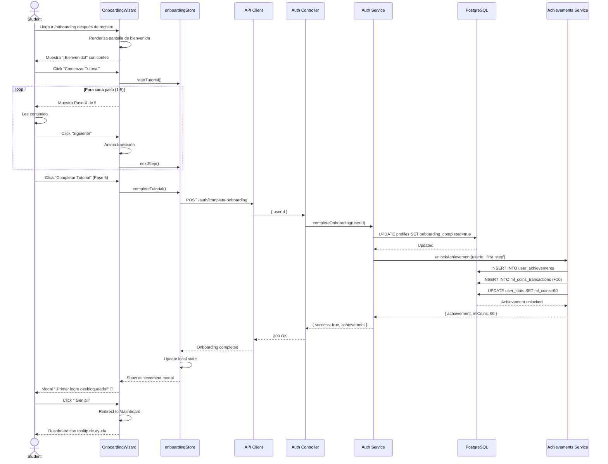
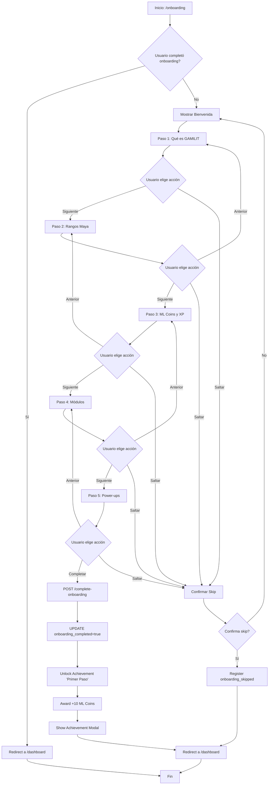

# UC-STU-002: Onboarding y tutorial inicial

**Proyecto:** Gamilit Platform
**Rol:** Student
**Fecha:** 2025-10-28
**Archivo original:** STUDENT-USE-CASES.md
**Versión:** 2.0 (RFC-0001 Modularizado)

---

## UC-STU-002: Onboarding y tutorial inicial

### 1. Descripción Breve
Estudiante completa wizard de onboarding interactivo que explica mecánicas principales de la plataforma y sistema de gamificación Maya.

### 2. Actores

**Actor Principal:**
- **Rol:** student (recién registrado)
- **Descripción:** Usuario nuevo que acaba de completar registro y necesita entender cómo usar la plataforma.

**Actores Secundarios:**
- **Sistema de Tutorial** - Guía paso a paso del onboarding
- **Sistema de Gamificación** - Otorga achievement "Tutorial Completado"
- **Sistema de Progreso** - Marca onboarding como completado

### 3. Precondiciones

1. Usuario completó registro exitosamente (UC-STU-001)
2. Usuario está autenticado con sesión válida
3. Usuario NO ha completado onboarding previamente (flag `onboarding_completed = false`)
4. Usuario fue redirigido a página `/onboarding`
5. Usuario tiene estadísticas inicializadas con rango 'nacom' y 50 ML Coins

### 4. Postcondiciones

**Postcondiciones de Éxito:**
- Campo `onboarding_completed = true` en tabla `auth_management.profiles`
- Usuario comprende conceptos básicos: ML Coins, XP, Rangos Maya, Módulos
- Usuario desbloqueó achievement "Primer Paso" (+10 ML Coins)
- Usuario fue redirigido a dashboard principal (`/dashboard`)
- Sistema registró timestamp de completación de onboarding
- Usuario puede acceder libremente a todas las features de la plataforma

**Postcondiciones de Fallo:**
- Onboarding permanece incompleto (flag = false)
- Usuario puede saltarse onboarding pero verá tooltip prompts en dashboard
- Sistema registra que usuario saltó onboarding (para analytics)

### 5. Flujo Principal (Escenario de Éxito)

1. Usuario llega a página de onboarding (`/onboarding`) después de registro exitoso

2. Sistema muestra pantalla de bienvenida con animación de confeti:
   - Mensaje: "¡Bienvenido a GAMILIT [Nombre]!"
   - Ícono de rango Nacom destacado
   - Texto: "Comenzarás tu aventura como Nacom, el primer rango Maya"
   - Botón "Comenzar Tutorial"

3. Usuario hace clic en "Comenzar Tutorial"

4. Sistema muestra Paso 1/5 del wizard: "¿Qué es GAMILIT"
   - Video corto animado (30 segundos) explicando concepto general
   - Texto: "GAMILIT es una plataforma educativa gamificada donde aprenderás sobre Marie Curie"
   - "Completarás ejercicios interactivos y ganarás recompensas"
   - Botón "Siguiente"

5. Usuario hace clic en "Siguiente"

6. Sistema muestra Paso 2/5: "Sistema de Rangos Maya"
   - Diagrama visual de 5 rangos: Ajaw → Nacom → Ah K'in → Halach Uinic → K'uk'ulkan
   - Explicación: "Al completar módulos, ascenderás de rango"
   - Cada rango tiene multiplicador de recompensas mayor
   - Highlight en rango actual (Ajaw) con badge
   - Botón "Siguiente"

7. Usuario hace clic en "Siguiente"

8. Sistema muestra Paso 3/5: "ML Coins y XP"
   - Animación de monedas cayendo
   - Explicación: "ML Coins = Machine Learning Coins, nuestra moneda virtual"
   - "Gana ML Coins completando ejercicios y úsalos para comprar power-ups"
   - "XP te ayuda a subir de nivel y desbloquear contenido"
   - Balance actual mostrado: "Tienes 50 ML Coins de bienvenida"
   - Botón "Siguiente"

9. Usuario hace clic en "Siguiente"

10. Sistema muestra Paso 4/5: "Módulos y Ejercicios"
    - Tarjetas de los 5 módulos:
      - Módulo 1: Comprensión Literal
      - Módulo 2: Comprensión Inferencial
      - Módulo 3: Comprensión Crítica
      - Módulo 4: Lectura Digital
      - Módulo 5: Producción de Textos
    - Explicación: "Cada módulo tiene ejercicios interactivos sobre Marie Curie"
    - "Crucigramas, líneas de tiempo, debates digitales y más"
    - Botón "Siguiente"

11. Usuario hace clic en "Siguiente"

12. Sistema muestra Paso 5/5: "Power-ups y Achievements"
    - Íconos de 3 power-ups con descripciones:
      - Pistas (15 ML): Revela hints
      - Visión Lectora (25 ML): Resalta keywords
      - Segunda Oportunidad (40 ML): Reintenta sin penalización
    - Grid de achievements con algunos bloqueados (siluetas)
    - Explicación: "Desbloquea logros especiales completando desafíos"
    - Botón "Completar Tutorial"

13. Usuario hace clic en "Completar Tutorial"

14. Sistema ejecuta POST request a `/api/auth/complete-onboarding` con userId

15. Sistema Backend actualiza tabla `auth_management.profiles`:
    - SET onboarding_completed = true
    - SET onboarding_completed_at = NOW()

16. Sistema de Gamificación desbloquea achievement "Primer Paso":
    - INSERT INTO user_achievements (achievement_id = 'first_step', user_id, unlocked_at = NOW())
    - Otorga +10 ML Coins (INSERT INTO ml_coins_transactions)
    - Actualiza user_stats (ml_coins = 60)

17. Sistema Frontend muestra modal de achievement desbloqueado:
    - Animación de confeti
    - Badge de "Primer Paso" con brillo
    - Texto: "¡Desbloqueaste tu primer logro!"
    - "+10 ML Coins ganados"
    - Botón "¡Genial!"

18. Usuario hace clic en "¡Genial!" en modal

19. Sistema Frontend actualiza estado global:
    - authStore.user.onboarding_completed = true
    - economyStore.mlCoins = 60
    - achievementsStore.achievements.push(newAchievement)

20. Sistema Frontend redirige a usuario a dashboard principal (`/dashboard`)

21. Sistema muestra dashboard con tooltip de ayuda en primer elemento:
    - Flecha apuntando a "Módulo 1"
    - Texto: "¡Comienza aquí tu primera aventura!"
    - Auto-desaparece después de 5 segundos

22. **Fin del caso de uso exitoso**

### 6. Flujos Alternativos

**A1: Usuario hace clic en "Saltar Tutorial"**
- **Punto de divergencia:** Pasos 2, 4, 6, 8, 10 del flujo principal (cada paso del wizard)
- **Condición:** Usuario hace clic en link "Saltar tutorial" visible en todas las pantallas
- **Flujo:**
  1. Sistema muestra modal de confirmación: "¿Seguro que quieres saltar el tutorial?"
  2. Sistema muestra dos opciones:
     - "Sí, ir al dashboard" (botón secundario)
     - "No, continuar tutorial" (botón primario destacado)
  3. Si usuario hace clic en "Sí, ir al dashboard":
     - Sistema registra evento de analytics: `onboarding_skipped`
     - Sistema NO actualiza flag onboarding_completed (permanece false)
     - Sistema registra timestamp de skip en campo `onboarding_skipped_at`
     - Sistema redirige a dashboard
     - Dashboard mostrará tooltips contextuales al interactuar con features
     - **Termina caso de uso**
  4. Si usuario hace clic en "No, continuar tutorial":
     - Modal se cierra
     - **Retorna a:** Paso actual del wizard

**A2: Usuario regresa a paso anterior del wizard**
- **Punto de divergencia:** Pasos 4, 6, 8, 10 del flujo principal (pasos 2-5 del wizard)
- **Condición:** Usuario hace clic en botón "Anterior" visible en wizard
- **Flujo:**
  1. Sistema guarda estado actual del paso
  2. Sistema anima transición hacia la izquierda
  3. Sistema renderiza paso anterior del wizard
  4. Usuario puede revisar contenido nuevamente
  5. **Retorna a:** Paso que usuario desea revisar

**A3: Usuario cierra pestaña/navegador durante onboarding**
- **Punto de divergencia:** Cualquier paso del flujo principal
- **Condición:** Usuario cierra ventana o se desconecta antes de completar
- **Flujo:**
  1. Sistema no actualiza flag onboarding_completed (permanece false)
  2. Al volver a iniciar sesión: Sistema detecta onboarding incompleto
  3. Sistema muestra modal: "¿Quieres continuar con el tutorial?"
  4. Si usuario acepta: Sistema redirige a `/onboarding` en el paso donde lo dejó
  5. Si usuario rechaza: Sistema redirige a dashboard con tooltips contextuales
  6. **Continúa en:** Paso donde usuario lo dejó o Flujo alternativo A1

**A4: Usuario prefiere modo interactivo del tutorial**
- **Punto de divergencia:** Paso 2 del flujo principal (bienvenida)
- **Condición:** Usuario hace clic en "Modo Interactivo" en lugar de "Comenzar Tutorial"
- **Flujo:**
  1. Sistema activa tutorial interactivo guiado
  2. En lugar de wizard estático, sistema redirige a dashboard
  3. Sistema activa overlay de tutorial con máscaras (spotlight)
  4. Sistema resalta primer elemento (Módulo 1) con spotlight
  5. Tooltip aparece con explicación contextual y flecha
  6. Usuario hace clic en elemento resaltado
  7. Sistema avanza al siguiente elemento (ML Coins en header)
  8. Proceso se repite para 8 elementos clave del dashboard
  9. Al completar tour interactivo: Sistema marca onboarding como completado
  10. **Continúa en:** Paso 14 del flujo principal (actualización de onboarding_completed)

### 7. Flujos de Excepción

**E1: Error al desbloquear achievement "Primer Paso"**
- **Punto de ocurrencia:** Paso 16 del flujo principal (otorgar achievement)
- **Condición de error:** Database error al insertar en user_achievements o ml_coins_transactions
- **Manejo:**
  1. Sistema Backend detecta error de DB durante otorgamiento de achievement
  2. Sistema Backend registra error en logs pero NO hace rollback de onboarding_completed
  3. Sistema Backend retorna respuesta exitosa (onboarding completado) pero flag achievement_error = true
  4. Sistema Frontend completa redirección normalmente (usuario no ve error)
  5. Sistema Frontend NO muestra modal de achievement desbloqueado
  6. Sistema Backend encola job de retry para otorgar achievement posteriormente:
     - Retry 1: después de 5 minutos
     - Retry 2: después de 1 hora
     - Retry 3: después de 24 horas
  7. Cuando retry es exitoso: Sistema envía notificación in-app al usuario
  8. Usuario verá achievement desbloqueado en su perfil eventualmente
  9. **Continúa en:** Paso 19 del flujo principal (sin modal de achievement)

**E2: Conexión se pierde durante onboarding**
- **Punto de ocurrencia:** Paso 14 del flujo principal (envío de request de completación)
- **Condición de error:** Network timeout o pérdida de conexión a internet
- **Manejo:**
  1. Sistema Frontend detecta timeout después de 10 segundos
  2. Sistema Frontend guarda estado de completación en localStorage:
     - onboarding_completed_pending = true
     - timestamp = NOW()
  3. Sistema Frontend muestra mensaje: "Conexión perdida. Intentando reconectar..."
  4. Sistema Frontend hace retry con backoff exponencial:
     - Intento 1: inmediato
     - Intento 2: 2 segundos
     - Intento 3: 5 segundos
  5. Si reconexión exitosa:
     - Sistema reenvía request de completación
     - Sistema limpia localStorage
     - **Continúa en:** Paso 15 del flujo principal
  6. Si reconexión falla después de 3 intentos:
     - Sistema mantiene estado en localStorage
     - Sistema redirige a dashboard (usuario puede usar plataforma)
     - En próximo login: Sistema detecta pending completion y reintenta
     - **Termina caso de uso** (completación pendiente)

**E3: Usuario ya completó onboarding pero accede a /onboarding**
- **Punto de ocurrencia:** Paso 1 del flujo principal (carga de página)
- **Condición de error:** Usuario con onboarding_completed = true intenta acceder a URL
- **Manejo:**
  1. Sistema Frontend verifica estado de onboarding en authStore
  2. Sistema detecta que onboarding_completed = true
  3. Sistema muestra mensaje flash: "Ya completaste el tutorial"
  4. Sistema redirige automáticamente a dashboard después de 2 segundos
  5. Usuario puede hacer clic en "Ir al dashboard" para skip inmediato
  6. **Termina caso de uso** (redirección)

**E4: Timeout en video de introducción (Paso 4)**
- **Punto de ocurrencia:** Paso 4 del flujo principal (video explicativo)
- **Condición de error:** Video no carga por CDN down o conexión lenta
- **Manejo:**
  1. Sistema Frontend intenta cargar video desde CDN
  2. Después de 5 segundos sin carga exitosa, sistema detecta timeout
  3. Sistema oculta player de video
  4. Sistema muestra contenido alternativo:
     - Ilustración estática en lugar de video
     - Texto descriptivo más detallado
     - Ícono de "Video no disponible temporalmente"
  5. Sistema registra evento de analytics para monitorear CDN issues
  6. Usuario puede continuar tutorial sin problema
  7. **Continúa en:** Paso 5 del flujo principal (botón "Siguiente" sigue funcional)

### 8. Requisitos No Funcionales

**Performance:**
- Carga inicial de página de onboarding: < 1.5 segundos
- Transición entre pasos del wizard: < 300ms con animación fluida
- Video de introducción: < 3 segundos para primer frame (si disponible)
- Actualización de onboarding_completed en DB: < 500ms
- Animaciones de confeti y celebración: 60 FPS consistentes

**Usabilidad:**
- Tutorial completable en 3-5 minutos (tiempo promedio esperado)
- Cada paso del wizard tiene máximo 100 palabras de texto
- Videos tienen máximo 30 segundos de duración
- Botón "Saltar tutorial" siempre visible pero discreto (no destacado)
- Progress indicator visual muestra "Paso X de 5"
- Mobile-friendly: wizard adaptado a pantallas pequeñas
- Accesibilidad: navegable con teclado (Tab, Enter, Escape)
- Screen readers pueden anunciar cada paso y contenido

**Seguridad:**
- Endpoint /complete-onboarding requiere autenticación JWT
- Sistema valida que userId en token coincida con userId en request
- Rate limiting: usuario puede completar onboarding máximo 1 vez (idempotente)
- No se permite marcar onboarding como completado sin estar autenticado

**Disponibilidad:**
- Onboarding funciona offline si assets fueron pre-cacheados (PWA)
- Degradación graciosa si CDN de videos falla (mostrar contenido estático)
- Sistema registra métricas de completación para detectar issues (tasa < 70%)

### 9. Reglas de Negocio

- **RN-015:** Onboarding solo se puede completar una vez por usuario (idempotente)
- **RN-016:** Achievement "Primer Paso" se otorga automáticamente al completar tutorial
- **RN-017:** Usuario puede saltarse tutorial pero verá tooltips contextuales en dashboard
- **RN-018:** Onboarding skipped se registra en analytics para monitoreo de UX
- **RN-019:** Tiempo mínimo en cada paso del wizard: 2 segundos (prevenir clicks accidentales)
- **RN-020:** Flag onboarding_completed persiste permanentemente (no se puede resetear por usuario)
- **RN-021:** Admin puede resetear onboarding de usuario específico (caso de soporte)
- **RN-022:** Sistema debe funcionar sin JavaScript (progressive enhancement) mostrando versión simplificada

### 10. Trazabilidad

**Endpoints Involucrados:**
- `POST /api/auth/complete-onboarding` - Marca onboarding como completado
- `POST /api/gamification/achievements/unlock` - Desbloquea achievement "Primer Paso"
- `GET /api/auth/me` - Obtiene estado actual de onboarding del usuario

**Componentes Frontend:**
- `src/features/onboarding/pages/OnboardingWizard.tsx` - Wizard principal
- `src/features/onboarding/components/WelcomeScreen.tsx` - Pantalla de bienvenida
- `src/features/onboarding/components/OnboardingStep.tsx` - Componente reutilizable de paso
- `src/features/onboarding/components/RanksExplainer.tsx` - Explicación de rangos Maya
- `src/features/onboarding/components/MLCoinsExplainer.tsx` - Explicación de ML Coins
- `src/features/onboarding/components/ModulesOverview.tsx` - Overview de módulos
- `src/features/onboarding/components/PowerupsShowcase.tsx` - Showcase de power-ups
- `src/features/onboarding/components/SkipTutorialModal.tsx` - Modal de confirmación
- `src/features/onboarding/utils/onboardingProgress.ts` - Utilidad para guardar progreso
- `src/features/onboarding/store/onboardingStore.ts` - Zustand store de onboarding

**Servicios Backend:**
- `src/modules/auth/auth.controller.ts` - Controlador de autenticación
- `src/modules/auth/auth.service.ts` - Lógica de negocio de onboarding
- `src/modules/auth/auth.repository.ts` - Acceso a datos de usuarios
- `src/modules/gamification/achievements.service.ts` - Otorgamiento de achievement
- `src/modules/analytics/events.service.ts` - Registro de eventos de onboarding

**Tablas de Base de Datos:**
- `auth_management.profiles` - Campo onboarding_completed, onboarding_completed_at, onboarding_skipped_at
- `gamification_system.user_achievements` - Achievement "Primer Paso"
- `gamification_system.ml_coins_transactions` - Transacción de +10 ML Coins por achievement
- `analytics.events` - Eventos de onboarding_started, onboarding_completed, onboarding_skipped

**Tests Relacionados:**
- `src/features/onboarding/__tests__/OnboardingWizard.test.tsx` - Tests unitarios de wizard
- `src/modules/auth/__tests__/complete-onboarding.test.ts` - Tests de endpoint
- `tests/e2e/onboarding/complete-tutorial.e2e.test.ts` - Test e2e de flujo completo
- `tests/e2e/onboarding/skip-tutorial.e2e.test.ts` - Test e2e de skip
- `tests/performance/onboarding-load.test.ts` - Tests de performance de carga

**User Stories:**
- US-001-03: Onboarding interactivo para nuevos usuarios
- US-004-02: Sistema de achievements con primer logro

### 11. Diagramas

#### Diagrama de Secuencia (Mermaid)



#### Diagrama de Flujo del Wizard



### 12. Mockups / Wireframes

**Pantalla 1: Bienvenida**
```
┌─────────────────────────────────────────┐
│         🎉  GAMILIT Platform  🎊           │
├─────────────────────────────────────────┤
│                                         │
│        ¡Bienvenido a GAMILIT Juan!        │
│                                         │
│             🏆 Rango Nacom 🏆            │
│                                         │
│  Comenzarás tu aventura como Nacom,    │
│  el primer rango de la jerarquía Maya  │
│                                         │
│  [ Comenzar Tutorial ]                  │
│  [ Modo Interactivo ]                   │
│                                         │
│  Saltar tutorial →                      │
└─────────────────────────────────────────┘
```

**Pantalla 2: Paso 2/5 - Rangos Maya**
```
┌─────────────────────────────────────────┐
│  GAMILITTutorial          [Paso 2 de 5]   │
├─────────────────────────────────────────┤
│  Sistema de Rangos Maya                 │
│                                         │
│  Ajaw ➜ Nacom ➜ Ah K'in ➜ Halach Uinic ➜ K'uk'ulkan
│  (TÚ)   1.25x    1.5x      1.75x          2.0x
│                                         │
│  Al completar módulos, ascenderás de   │
│  rango y ganarás multiplicadores para  │
│  tus recompensas.                      │
│                                         │
│  ● ● ○ ○ ○  [Progreso]                 │
│                                         │
│  [  Anterior  ]     [  Siguiente  ]     │
│                                         │
│  Saltar tutorial →                      │
└─────────────────────────────────────────┘
```

**Pantalla 3: Achievement Desbloqueado**
```
┌─────────────────────────────────────────┐
│                                         │
│          ✨ 🎉 ACHIEVEMENT 🎊 ✨         │
│                                         │
│              🏆 Primer Paso              │
│                                         │
│  ¡Desbloqueaste tu primer logro!        │
│                                         │
│        💰 +10 ML Coins ganados          │
│                                         │
│  [         ¡Genial!         ]           │
│                                         │
└─────────────────────────────────────────┘
```

### 13. Criterios de Aceptación

- [ ] Usuario ve pantalla de bienvenida con animación al llegar a /onboarding
- [ ] Wizard tiene 5 pasos claramente identificados con progress indicator
- [ ] Usuario puede navegar entre pasos con botones "Anterior" y "Siguiente"
- [ ] Cada paso muestra contenido relevante y visual atractivo
- [ ] Video de introducción carga en menos de 3 segundos (si disponible)
- [ ] Usuario puede saltar tutorial en cualquier momento
- [ ] Modal de confirmación aparece al intentar saltar tutorial
- [ ] Sistema registra onboarding_completed = true al completar
- [ ] Achievement "Primer Paso" se desbloquea automáticamente
- [ ] Usuario recibe +10 ML Coins (balance = 60) al completar
- [ ] Modal de achievement muestra información correcta con animación
- [ ] Usuario es redirigido a /dashboard después de completar
- [ ] Dashboard muestra tooltip de ayuda en primer elemento
- [ ] Sistema registra evento de analytics (onboarding_completed o onboarding_skipped)
- [ ] Si usuario cierra ventana, puede continuar tutorial al volver
- [ ] Tutorial es responsive (funciona en mobile, tablet, desktop)
- [ ] Tutorial es navegable con teclado (Tab, Enter, Escape)
- [ ] Screen readers pueden anunciar contenido de cada paso
- [ ] Animaciones son fluidas a 60 FPS
- [ ] Sistema funciona con JavaScript deshabilitado (versión simplificada)

### 14. Notas Adicionales

**Consideraciones de Diseño:**
- Wizard usa librería react-joyride para tooltips interactivos en modo interactivo
- Confeti implementado con librería canvas-confetti (ligero, 5KB gzipped)
- Videos alojados en CDN con fallback a ilustraciones estáticas
- Progress indicator usa librería framer-motion para animaciones fluidas

**Métricas de Éxito:**
- Tasa de completación de onboarding objetivo: > 85%
- Tiempo promedio de completación: 3-5 minutos
- Tasa de skip: < 15%
- Usuarios que completan sin saltar ganan achievement adicional (feature futura)

**Features Futuras:**
- Onboarding personalizado según rol (student vs. teacher)
- Modo de tutorial avanzado con ejercicio de práctica guiado
- Recordatorio en dashboard para usuarios que saltaron tutorial
- Opción de ver tutorial nuevamente desde configuración de perfil

### 15. Historial de Cambios

| Fecha | Versión | Autor | Cambios |
|-------|---------|-------|---------|
| 2025-10-28 | 1.0 | Claude Code | Creación inicial del caso de uso UC-STU-002 |

---


---

**Ver también:**
- [Índice de casos de uso student](./README.md)
- [Caso anterior: UC-STU-001 Registro](./UC-STU-001-registro.md)
- [Caso siguiente: UC-STU-003 Resolver ejercicio](./UC-STU-003-resolver-ejercicio.md)
