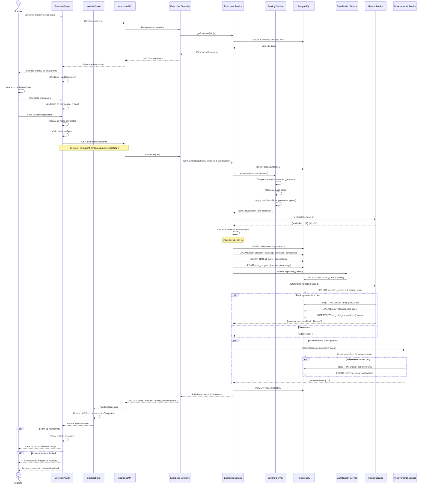

# UC-STU-003: Seleccionar y resolver ejercicio

**Proyecto:** Gamilit Platform
**Rol:** Student
**Fecha:** 2025-10-28
**Archivo original:** STUDENT-USE-CASES.md
**Versión:** 2.0 (RFC-0001 Modularizado)

---

## UC-STU-003: Seleccionar y resolver ejercicio

### 1. Descripción Breve
Estudiante selecciona un ejercicio disponible del catálogo, completa la mecánica educativa correspondiente y recibe feedback con recompensas (ML Coins, XP).

> **Contexto:** Este caso de uso implementa las [31 mecánicas educativas](../../modulos/README-MODULOS-EDUCATIVOS.md) distribuidas en 5 módulos de comprensión lectora.

### 2. Actores

**Actor Principal:**
- **Rol:** student
- **Descripción:** Usuario autenticado que desea practicar comprensión lectora completando ejercicios interactivos sobre Marie Curie.

**Actores Secundarios:**
- **Sistema de Scoring** - Evalúa respuestas y calcula puntuación
- **Sistema de Gamificación** - Otorga ML Coins, XP y verifica rank-up (ver [Economía ML Coins](../../gamificacion/02-ECONOMIA-ML-COINS.md) y [Rangos Maya](../../gamificacion/01-RANGOS-MAYA.md))
- **Sistema de Progreso** - Actualiza estadísticas y progreso de módulo
- **Sistema de Achievements** - Verifica si se desbloquearon logros (ver [Achievements](../../gamificacion/03-ACHIEVEMENTS.md))
- **Sistema de Missions** - Actualiza progreso de misiones activas (ver [Sistemas Complementarios](../../gamificacion/04-SISTEMAS-COMPLEMENTARIOS.md))

### 3. Precondiciones

1. Usuario está autenticado con sesión válida (JWT token)
2. Usuario completó onboarding (onboarding_completed = true)
3. Usuario tiene acceso al módulo donde está el ejercicio (rango suficiente)
4. Ejercicio existe en base de datos y está marcado como activo (is_active = true)
5. Usuario no tiene otro ejercicio en progreso (intento activo)
6. Usuario tiene balance de ML Coins ≥ 0 (para usar power-ups opcionalmente)

### 7. Precondiciones

1. Usuario autenticado con rol 'student'
2. Usuario completó onboarding
3. Ejercicio está disponible y desbloqueado para el usuario
4. Módulo del ejercicio está accesible según rango del usuario
5. Sistema de scoring está operativo

### 4. Postcondiciones

**Postcondiciones de Éxito:**
- Intento de ejercicio registrado en tabla `educational_content.exercise_attempts`
- Score calculado y almacenado (ej: 85/100)
- ML Coins y XP otorgados según performance (con multiplicador de rango)
- Transacciones de ML Coins registradas en `ml_coins_transactions`
- Estadísticas de usuario actualizadas en `user_stats` (exercises_completed, total_xp, ml_coins)
- Progreso de módulo actualizado en `user_progress`
- Si score ≥ 70%: ejercicio marcado como completado
- Si hay rank-up: notificación de ascenso de rango mostrada
- Achievements verificados y desbloqueados si aplica
- Misiones activas progresadas si objetivos coinciden
- Usuario redirigido a pantalla de resultados con feedback detallado

**Postcondiciones de Fallo:**
- Intento fallido registrado en `exercise_attempts` con is_correct = false
- NO se otorgan ML Coins ni XP
- Usuario recibe feedback sobre errores cometidos
- Puede reintentar el ejercicio inmediatamente
- Estadísticas NO se actualizan (intentos fallidos no cuentan para progreso)

### 5. Flujo Principal (Escenario de Éxito)

1. Usuario navega a dashboard principal (`/dashboard`) o página de módulo (`/modules/:moduleId`)

2. Sistema muestra grid/lista de ejercicios disponibles:
   - Cada tarjeta muestra: título, tipo de mecánica, dificultad, XP reward, ML Coins reward
   - Ejercicios completados tienen badge verde "✓ Completado"
   - Ejercicios bloqueados tienen ícono de candado con tooltip "Desbloquea con rango [X]"
   - Ejercicios nuevos tienen badge azul "Nuevo"

3. Usuario hace clic en tarjeta de ejercicio específico (ej: "Crucigrama Científico")

4. Sistema Frontend envía GET request a `/api/educational/exercises/:exerciseId`

5. Sistema Backend valida permisos:
   - Verifica que usuario está autenticado
   - Verifica que ejercicio existe y está activo
   - Verifica que usuario tiene rango suficiente para acceder al módulo
   - Aplica Row-Level Security (tenant_id match)

6. Sistema Backend retorna datos completos del ejercicio:
   - Metadata (título, instrucciones, tipo de mecánica, dificultad)
   - Contenido específico de la mecánica (ej: grid de crucigrama con clues)
   - Texto de Marie Curie asociado (lectura base)
   - Configuración (allow_hints, max_attempts, time_limit)
   - User progress (intentos previos, mejor score)

7. Sistema Frontend renderiza interfaz del ejercicio según tipo de mecánica:
   - Para "Crucigrama": Grid interactivo con clues across/down
   - Para "Línea de Tiempo": Eventos arrastrables para ordenar cronológicamente
   - Para "Quiz TikTok": Interfaz estilo TikTok con video vertical y preguntas
   - Etc. (33 mecánicas diferentes implementadas)

8. Sistema Frontend muestra layout de ejercicio con componentes:
   - Panel izquierdo: Texto de Marie Curie (lectura base) con scroll
   - Panel derecho: Interfaz de la mecánica (crucigrama, quiz, etc.)
   - Header: Timer (si ejercicio tiene límite de tiempo), botón de power-ups, botón "Salir"
   - Footer: Progress bar (preguntas respondidas), botón "Enviar Respuestas"

9. Sistema Frontend inicia tracking de tiempo:
   - startTime = Date.now()
   - Timer empieza a contar (si ejercicio tiene time_limit)

10. Usuario lee texto de Marie Curie en panel izquierdo (ej: biografía, descubrimientos científicos)

11. Usuario interactúa con mecánica en panel derecho:
    - Para Crucigrama: Completa palabras horizontales y verticales
    - Para Línea de Tiempo: Arrastra eventos a posiciones correctas
    - Para Verdadero/Falso: Marca checkboxes para cada afirmación
    - Sistema valida algunas respuestas en tiempo real (feedback visual con colores)

12. Usuario completa todas las preguntas/tareas del ejercicio

13. Usuario hace clic en botón "Enviar Respuestas"

14. Sistema Frontend valida que todas las respuestas requeridas están completas:
    - Si faltan respuestas: Muestra mensaje "Completa todas las preguntas antes de enviar"
    - Si todo está completo: Procede con envío

15. Sistema Frontend calcula timeSpent = Math.floor((Date.now() - startTime) / 1000)

16. Sistema Frontend construye objeto de submission:
    ```typescript
    {
      exerciseId: "uuid",
      answers: { "question_1": "respuesta_1", ... },
      timeSpent: 180, // segundos
      hintsUsed: 0,
      powerupsUsed: [], // ["pista", "vision_lectora"]
    }
    ```

17. Sistema Frontend envía POST request a `/api/educational/exercises/:exerciseId/submit`

18. Sistema Backend inicia transacción de base de datos (BEGIN)

19. Sistema de Scoring evalúa respuestas:
    - Obtiene respuestas correctas de exercise.content.correct_answers
    - Compara cada respuesta del usuario con respuesta correcta
    - Calcula correctness: { "question_1": true, "question_2": false, ... }
    - Calcula score base: (respuestas_correctas / total_preguntas) × 100

20. Sistema de Scoring aplica modificadores:
    - Penalización por hints usados: -10 puntos por hint
    - Penalización por power-ups: -5 puntos por "Visión Lectora"
    - Bonus por velocidad: Si timeSpent < 50% de tiempo estimado → +10 puntos
    - Score final = Math.max(0, Math.min(100, score_base + bonuses - penalties))

21. Sistema de Scoring determina si usuario aprobó:
    - passed = (score_final >= exercise.passing_score) // generalmente 70%

22. Sistema de Scoring calcula recompensas si usuario aprobó (passed = true):
    ```typescript
    // Obtener multiplicador de rango del usuario
    const rankMultiplier = await ranksService.getMultiplier(userId);
    // Ej: Ajaw = 1.0x, Nacom = 1.25x, Ah K'in = 1.5x, etc.

    // Calcular ML Coins y XP base
    let mlCoinsEarned = exercise.ml_coins_reward; // ej: 15
    let xpEarned = exercise.xp_reward; // ej: 20

    // Aplicar bonus por score perfecto
    if (scoreFinal === 100) {
      const difficulty = exercise.difficulty;
      const perfectBonus = {
        'beginner': 6,
        'intermediate': 9,
        'advanced': 12
      }[difficulty];
      mlCoinsEarned += perfectBonus;
      xpEarned += perfectBonus * 2;
    }

    // Aplicar bonus por primer intento
    const attemptNumber = await getAttemptNumber(userId, exerciseId);
    if (attemptNumber === 1 && passed) {
      mlCoinsEarned += 15; // First attempt bonus
    }

    // Aplicar multiplicador de rango
    mlCoinsEarned = Math.floor(mlCoinsEarned * rankMultiplier);
    xpEarned = Math.floor(xpEarned * rankMultiplier);

    // Aplicar bonus de streak
    const currentStreak = await streaksService.getUserStreak(userId);
    const streakBonus = 2 * currentStreak;
    mlCoinsEarned += Math.floor(streakBonus * rankMultiplier);
    ```

23. Sistema Backend registra intento en tabla `exercise_attempts`:
    ```sql
    INSERT INTO educational_content.exercise_attempts (
      id, user_id, exercise_id, attempt_number,
      submitted_answers, is_correct, score,
      time_spent_seconds, hints_used, comodines_used,
      xp_earned, ml_coins_earned, tenant_id, created_at
    ) VALUES (
      uuid_generate_v4(), ?, ?, ?,
      ?, ?, ?,
      ?, ?, ?,
      ?, ?, ?, NOW()
    )
    ```

24. Si usuario aprobó (passed = true):
    - Sistema actualiza `user_stats`:
      ```sql
      UPDATE gamification_system.user_stats
      SET
        ml_coins = ml_coins + ?,
        ml_coins_earned_total = ml_coins_earned_total + ?,
        total_xp = total_xp + ?,
        exercises_completed = exercises_completed + 1,
        perfect_scores = perfect_scores + CASE WHEN score = 100 THEN 1 ELSE 0 END,
        updated_at = NOW()
      WHERE user_id = ?
      ```

    - Sistema registra transacción de ML Coins:
      ```sql
      INSERT INTO gamification_system.ml_coins_transactions (
        id, user_id, amount, transaction_type,
        reason, balance_before, balance_after,
        multiplier, bonus_applied, reference_id, created_at
      ) VALUES (...)
      ```

25. Sistema de Progreso actualiza progreso del módulo:
    - Cuenta ejercicios completados del módulo
    - Calcula percentage_completed = (completados / total) × 100
    - UPDATE user_progress SET percentage_completed = ?, updated_at = NOW()

26. Sistema de Streaks registra actividad:
    - Verifica si es primer ejercicio del día
    - Actualiza current_streak si corresponde
    - Actualiza last_activity_at = NOW()

27. Sistema de Achievements verifica logros desbloqueables:
    - Verifica si cumple condiciones para achievements:
      - "Perfeccionista" (5 scores de 100% consecutivos)
      - "Completista" (todos los ejercicios de un módulo)
      - "Velocista" (completar ejercicio en tiempo récord)
      - Etc.
    - Si se desbloquea achievement: Registra en user_achievements y otorga rewards

28. Sistema de Ranks verifica ascenso:
    ```typescript
    await ranksService.autoCheckPromotion(userId);
    // Verifica si modules_completed >= requisitos del siguiente rango
    // Si es elegible: Crea nuevo registro en user_ranks, otorga bonus de ML Coins
    ```

29. Sistema Backend confirma transacción (COMMIT)

30. Sistema Backend construye respuesta detallada:
    ```json
    {
      "success": true,
      "data": {
        "attemptId": "uuid",
        "score": 85,
        "passed": true,
        "correctAnswers": 17,
        "totalQuestions": 20,
        "timeSpent": 180,
        "rewards": {
          "mlCoins": 38,
          "xp": 45,
          "bonuses": {
            "rankMultiplier": 1.5,
            "streakBonus": 14,
            "firstAttemptBonus": 15
          }
        },
        "feedback": {
          "overall": "¡Excelente trabajo! Dominas la comprensión literal.",
          "answerReview": [
            { "questionId": "q1", "isCorrect": true, "feedback": "Correcto. Marie Curie nació en Polonia en 1867." },
            { "questionId": "q2", "isCorrect": false, "feedback": "El elemento descubierto fue el Polonio, no el Platino." },
            ...
          ]
        },
        "rankUp": {
          "happened": true,
          "newRank": "Nacom",
          "bonus": 75
        },
        "achievementsUnlocked": [
          { "id": "uuid", "name": "Completista Módulo 1", "mlCoinsReward": 50 }
        ],
        "newStats": {
          "mlCoins": 138,
          "totalXP": 465,
          "exercisesCompleted": 15,
          "currentRank": "Nacom"
        }
      }
    }
    ```

31. Sistema Frontend recibe respuesta exitosa

32. Sistema Frontend actualiza stores locales:
    - economyStore.mlCoins = newStats.mlCoins
    - ranksStore.currentRank = newStats.currentRank
    - ranksStore.totalXP = newStats.totalXP
    - progressStore.exercisesCompleted = newStats.exercisesCompleted

33. Si hubo rank-up:
    - Sistema Frontend muestra animación de confeti full-screen
    - Sistema Frontend muestra modal de celebración con nuevo badge de rango
    - Audio de fanfarria se reproduce
    - Animación dura 5 segundos

34. Si hubo achievements desbloqueados:
    - Sistema Frontend muestra modal de achievement con animación
    - Badge del achievement aparece con efecto de brillo
    - Se informa de ML Coins ganados por el achievement

35. Sistema Frontend renderiza pantalla de resultados (ResultsScreen):
    - Score grande y destacado con color (verde si passed, rojo si failed)
    - Barra de progreso visual mostrando score/100
    - ML Coins y XP ganados con iconos animados
    - Breakdown de bonuses aplicados (multiplicador, streak, primer intento)
    - Feedback textual personalizado según performance
    - Sección de "Revisión de Respuestas" colapsable:
      - Cada pregunta con checkmark verde (correcta) o X roja (incorrecta)
      - Respuesta del usuario vs respuesta correcta
      - Feedback específico por pregunta
    - Botones de acción:
      - "Ver Respuestas Correctas" (expande sección de revisión)
      - "Siguiente Ejercicio" (navega a siguiente ejercicio del módulo)
      - "Volver al Dashboard"
      - "Reintentar" (si usuario quiere mejorar score)

36. Sistema registra evento de analytics:
    - Event: exercise_completed
    - Metadata: exerciseId, score, timeSpent, passed, mlCoinsEarned, xpEarned

37. **Fin del caso de uso exitoso**

### 6. Flujos Alternativos

**A1: Usuario pausa ejercicio y regresa más tarde**
- **Punto de divergencia:** Paso 11 del flujo principal (usuario interactuando con mecánica)
- **Condición:** Usuario hace clic en botón "Guardar y Salir" o cierra pestaña
- **Flujo:**
  1. Sistema Frontend detecta intención de salir (click o beforeunload event)
  2. Sistema Frontend muestra modal de confirmación: "¿Quieres guardar tu progreso?"
  3. Si usuario confirma:
     - Sistema guarda estado actual en localStorage:
       ```json
       {
         "exerciseId": "uuid",
         "answers": { "q1": "respuesta", "q2": "..." },
         "timeSpent": 120,
         "startTime": timestamp,
         "savedAt": timestamp
       }
       ```
     - Sistema muestra mensaje: "Progreso guardado. Puedes continuar más tarde."
  4. Usuario abandona página
  5. Cuando usuario regresa al ejercicio:
     - Sistema detecta estado guardado en localStorage
     - Sistema muestra modal: "¿Quieres continuar donde lo dejaste?"
     - Si usuario acepta:
       - Sistema carga respuestas previas en la interfaz
       - Sistema ajusta startTime para descontar tiempo pausado
       - **Retorna a:** Paso 11 del flujo principal
     - Si usuario rechaza:
       - Sistema limpia localStorage
       - Sistema inicia ejercicio desde cero
       - **Retorna a:** Paso 7 del flujo principal

**A2: Ejercicio tiene límite de tiempo y timer expira**
- **Punto de divergencia:** Paso 11 del flujo principal (usuario respondiendo)
- **Condición:** Timer llega a 0 antes de que usuario envíe respuestas
- **Flujo:**
  1. Sistema Frontend monitorea timer cada segundo
  2. Cuando timer llega a 10 segundos: Sistema muestra alerta visual parpadeante en rojo
  3. Cuando timer llega a 0:
     - Sistema bloquea interfaz del ejercicio (no permite más ediciones)
     - Sistema muestra overlay semi-transparente con mensaje: "Tiempo agotado. Enviando respuestas..."
     - Sistema recopila respuestas actuales (incluyendo preguntas sin responder)
  4. Sistema Frontend auto-envía submission con flag timeout = true
  5. Sistema Backend aplica penalización del 20% al score final
  6. Sistema Backend procesa intento normalmente con score penalizado
  7. En pantalla de resultados, sistema muestra mensaje: "Tiempo agotado. Se aplicó penalización del 20%."
  8. **Continúa en:** Paso 23 del flujo principal (registro de intento con penalty)

**A3: Usuario obtiene score perfecto (100%)**
- **Punto de divergencia:** Paso 20 del flujo principal (cálculo de score)
- **Condición:** score_final === 100 (todas las respuestas correctas)
- **Flujo:**
  1. Sistema de Scoring detecta score perfecto
  2. Sistema aplica bonus adicional según dificultad:
     - Beginner: +6 ML Coins, +12 XP
     - Intermediate: +9 ML Coins, +18 XP
     - Advanced: +12 ML Coins, +24 XP
  3. Sistema verifica si es score perfecto consecutivo (streak de perfectos)
  4. Si usuario tiene 3+ scores perfectos consecutivos:
     - Sistema desbloquea achievement "Perfeccionista"
     - Otorga +50 ML Coins adicionales por achievement
  5. En pantalla de resultados:
     - Animación especial de estrellas doradas
     - Badge "Perfect Score" prominente
     - Audio de fanfarria especial
     - Confeti dorado (no confeti regular)
  6. **Continúa en:** Paso 24 del flujo principal con rewards aumentados

**A4: Usuario completa último ejercicio del módulo**
- **Punto de divergencia:** Paso 25 del flujo principal (actualización de progreso)
- **Condición:** percentage_completed llega a 100% del módulo
- **Flujo:**
  1. Sistema de Progreso detecta que módulo está completo
  2. Sistema marca módulo como completado en user_progress:
     - UPDATE user_progress SET is_completed = true, completed_at = NOW()
  3. Sistema incrementa modules_completed en user_stats
  4. Sistema otorga bonus de completación de módulo:
     - +50 ML Coins (con multiplicador de rango)
     - +100 XP (con multiplicador de rango)
  5. Sistema verifica si hay achievement "Completista Módulo [X]":
     - Si existe y no está desbloqueado: Lo desbloquea (+50 ML Coins adicionales)
  6. Sistema ejecuta autoCheckPromotion (puede resultar en rank-up)
  7. En pantalla de resultados:
     - Banner especial: "¡Módulo Completado!"
     - Confeti full-screen
     - Muestra bonus de completación
     - Botón "Ver Certificado" (si módulo otorga certificado)
  8. **Continúa en:** Paso 28 del flujo principal con verificación de rank-up

### 7. Flujos de Excepción

**E1: Usuario envía respuestas pero falla validación backend**
- **Punto de ocurrencia:** Paso 19 del flujo principal (evaluación de respuestas)
- **Condición de error:** Formato de respuestas inválido o datos corruptos
- **Manejo:**
  1. Sistema Backend detecta error de validación (ej: respuestas en formato incorrecto)
  2. Sistema Backend registra error en logs con contexto
  3. Sistema Backend NO crea registro en exercise_attempts (no penalizar por error del sistema)
  4. Sistema Backend retorna error 400 Bad Request con mensaje: "Formato de respuestas inválido"
  5. Sistema Frontend muestra mensaje al usuario: "Ocurrió un error al procesar tus respuestas. Intenta de nuevo."
  6. Sistema Frontend mantiene respuestas del usuario en la interfaz (no se pierden)
  7. Sistema Frontend ofrece botón "Reenviar"
  8. Usuario hace clic en "Reenviar"
  9. Sistema Frontend valida datos localmente antes de reenviar
  10. **Retorna a:** Paso 17 del flujo principal (reenvío de submission)

**E2: Error de base de datos durante transacción de guardado**
- **Punto de ocurrencia:** Paso 23 del flujo principal (INSERT de exercise_attempt)
- **Condición de error:** Database connection error, constraint violation, timeout
- **Manejo:**
  1. Sistema Backend detecta error de DB durante transacción
  2. Sistema Backend ejecuta ROLLBACK automático (ningún cambio persiste)
  3. Sistema Backend registra error en logs con nivel ERROR:
     - Stack trace completo
     - User ID, exercise ID
     - Query que falló
     - Datos de submission (para debug)
  4. Sistema Backend clasifica error:
     - Si es connection error: retorna 503 Service Unavailable
     - Si es timeout: retorna 504 Gateway Timeout
     - Si es constraint violation: retorna 500 Internal Server Error
  5. Sistema Backend retorna respuesta de error con flag retry = true
  6. Sistema Frontend muestra mensaje: "No pudimos guardar tu intento. Reintentando..."
  7. Sistema Frontend guarda submission en localStorage como backup
  8. Sistema Frontend hace retry automático con backoff exponencial:
     - Intento 1: después de 2 segundos
     - Intento 2: después de 5 segundos
     - Intento 3: después de 10 segundos
  9. Si retry exitoso:
     - Sistema limpia localStorage
     - **Continúa en:** Paso 23 del flujo principal
  10. Si retry falla después de 3 intentos:
      - Sistema muestra mensaje: "No pudimos guardar tu intento. Tu progreso está guardado localmente."
      - Sistema mantiene submission en localStorage
      - Usuario puede intentar reenviar manualmente más tarde
      - Sistema de Monitoreo dispara alerta de alta prioridad
      - **Termina caso de uso** (submission pendiente)

**E3: Pérdida de conexión durante ejercicio**
- **Punto de ocurrencia:** Paso 11 del flujo principal (usuario respondiendo) o Paso 17 (envío de submission)
- **Condición de error:** Network offline o timeout
- **Manejo:**
  1. Sistema Frontend detecta pérdida de conexión (navigator.onLine = false o timeout)
  2. Sistema Frontend guarda estado actual inmediatamente en localStorage
  3. Sistema Frontend muestra banner sticky en top de pantalla:
     - Ícono de WiFi desconectado
     - Mensaje: "Conexión perdida. Tus respuestas están guardadas."
     - Color amarillo (warning)
  4. Sistema Frontend congela timer (si hay) para no penalizar por tiempo offline
  5. Sistema Frontend deshabilita botón "Enviar Respuestas" temporalmente
  6. Usuario puede seguir trabajando offline (respuestas guardadas en memoria)
  7. Sistema Frontend intenta reconectar cada 5 segundos (polling)
  8. Cuando conexión se restaura:
     - Banner cambia a verde: "Conexión restaurada"
     - Timer se descongela
     - Botón "Enviar Respuestas" se habilita
  9. Si usuario intentó enviar mientras offline:
     - Sistema automáticamente reenvía submission cuando hay conexión
     - **Continúa en:** Paso 17 del flujo principal
  10. Banner desaparece después de 3 segundos
  11. **Retorna a:** Paso donde se perdió conexión

**E4: Usuario intenta acceder a ejercicio bloqueado**
- **Punto de ocurrencia:** Paso 5 del flujo principal (validación de permisos)
- **Condición de error:** Rango de usuario insuficiente para acceder al módulo
- **Manejo:**
  1. Sistema Backend detecta que usuario no cumple requisito de rango
  2. Sistema Backend retorna error 403 Forbidden con código 'INSUFFICIENT_RANK'
  3. Sistema Backend incluye en respuesta:
     - Rango actual del usuario
     - Rango requerido para el ejercicio
     - Módulos que debe completar para ascender
  4. Sistema Frontend muestra modal informativo:
     - Ícono de candado
     - Mensaje: "Este ejercicio requiere rango [Halach Uinic]"
     - "Tu rango actual: [Nacom]"
     - "Completa [2] módulos más para desbloquear"
     - Barra de progreso visual mostrando path to unlock
  5. Sistema Frontend ofrece botones:
     - "Ver Módulos Disponibles" (redirige a módulos accesibles)
     - "Entendido" (cierra modal)
  6. Usuario hace clic en "Ver Módulos Disponibles"
  7. Sistema redirige a página de módulos con filtro de "Disponibles"
  8. **Termina caso de uso** (usuario no puede acceder al ejercicio)

**E5: Sistema de Scoring falla al evaluar respuestas**
- **Punto de ocurrencia:** Paso 19 del flujo principal (evaluación de respuestas)
- **Condición de error:** Error en lógica de scoring, correct_answers corruptas, o algoritmo falla
- **Manejo:**
  1. Sistema de Scoring detecta excepción durante evaluación
  2. Sistema registra error con nivel CRITICAL en logs:
     - Exercise ID afectado
     - User ID
     - Stack trace completo
     - Respuestas enviadas (para reproducir error)
  3. Sistema Backend NO hace rollback completo (queremos registrar intento)
  4. Sistema Backend registra intento como "needs_manual_review":
     - INSERT attempt con flag needs_review = true
     - Score temporal = NULL
     - Status = 'pending_review'
  5. Sistema Backend encola job para review manual por admin
  6. Sistema Backend retorna respuesta 200 OK pero con flag special_case:
     ```json
     {
       "success": true,
       "data": {
         "status": "pending_review",
         "message": "Tu intento está siendo revisado. Recibirás notificación con resultados.",
         "attemptId": "uuid"
       }
     }
     ```
  7. Sistema Frontend muestra pantalla especial:
     - Mensaje: "Tu intento está siendo revisado manualmente"
     - "Recibirás una notificación con tus resultados pronto"
     - Ícono de reloj de arena
     - Botón "Entendido"
  8. Sistema de Notificaciones dispara alerta a admin/ops team
  9. Admin revisa intento manualmente y asigna score correcto
  10. Sistema envía notificación in-app al usuario cuando review está completa
  11. **Termina caso de uso** (resultado pendiente de review manual)

### 8. Requisitos No Funcionales

**Performance:**
- Carga de ejercicio: < 2 segundos (p95)
- Renderizado de interfaz de mecánica: < 500ms
- Validación de respuestas en tiempo real: < 200ms (para feedback instantáneo)
- Envío y procesamiento de submission completa: < 1.5 segundos (p95)
- Animaciones fluidas a 60 FPS (confeti, transiciones)
- Timer actualiza cada segundo sin lag perceptible

**Usabilidad:**
- Interfaz de ejercicio completamente responsive (mobile, tablet, desktop)
- Teclado shortcuts disponibles:
  - Tab: Navegar entre campos
  - Ctrl+S: Guardar progreso
  - Ctrl+Enter: Enviar respuestas
  - Escape: Salir (con confirmación)
- Accesibilidad WCAG 2.1 nivel AA:
  - Screen readers pueden anunciar preguntas y feedback
  - Alto contraste entre texto y fondo
  - Focus indicators visibles en todos los elementos interactivos
  - Labels descriptivos para todos los inputs
- Tooltips contextuales en elementos complejos
- Confirmación antes de acciones destructivas (salir sin guardar)
- Progress bar visual muestra preguntas completadas
- Feedback instantáneo con colores (verde = correcto, rojo = incorrecto)

**Seguridad:**
- Validación de respuestas SOLO en backend (no confiar en cliente)
- Rate limiting: máximo 100 intentos de ejercicios por usuario por día
- Anti-cheating:
  - Detectar patrones de respuestas demasiado rápidas (posible bot)
  - Detectar intentos de manipular localStorage para alterar scores
  - Validar que timeSpent es realista (no puede ser 1 segundo en ejercicio de 20 preguntas)
- Respuestas correctas NUNCA enviadas al cliente (solo en resultado después de submission)
- SQL injection prevention: prepared statements en todos los queries
- XSS prevention: sanitizar contenido de ejercicios si es user-generated

**Disponibilidad:**
- Ejercicios funcionan offline (PWA) con sync al reconectar
- Degradación graciosa si sistema de gamificación falla (ejercicio completa pero sin rewards)
- Sistema debe soportar 500 estudiantes resolviendo ejercicios simultáneamente sin degradación
- Backup automático de respuestas cada 30 segundos en localStorage

**Escalabilidad:**
- Sistema debe manejar 1,000 submissions por hora sin optimizaciones adicionales
- Connection pool de DB debe escalar para picos de tráfico (ej: clases sincrónicas)
- Redis cache para ejercicios populares (reducir carga en DB)

### 9. Reglas de Negocio

- **RN-023:** Score mínimo para aprobar ejercicio: 70% (configurable por ejercicio)
- **RN-024:** Solo ejercicios aprobados (score ≥ 70%) cuentan para progreso de módulo
- **RN-025:** Usuario puede reintentar ejercicio ilimitadas veces (mejor score se registra)
- **RN-026:** Multiplicador de rango se aplica a ML Coins y XP ganados por ejercicio
- **RN-027:** Bonus de primer intento: +15 ML Coins (solo si aprueba en intento #1)
- **RN-028:** Bonus de score perfecto: +6 a +12 ML Coins según dificultad
- **RN-029:** Bonus de streak: +2 ML Coins × días de streak actual (con multiplicador)
- **RN-030:** Penalización por hints: -10 puntos de score por hint usado
- **RN-031:** Penalización por power-up "Visión Lectora": -5 puntos de score
- **RN-032:** Penalización por timeout: -20% del score final
- **RN-033:** Timeouts NO cuentan como intento fallido (no afectan estadísticas de "fallos")
- **RN-034:** Ejercicios completados actualizan last_activity_at para streak tracking
- **RN-035:** Ascenso de rango se verifica automáticamente después de cada ejercicio aprobado
- **RN-036:** Achievements se verifican en background después de ejercicio (no bloquea respuesta)
- **RN-037:** Usuario NO puede tener dos intentos activos simultáneamente (constraint en UI y backend)

### 10. Trazabilidad

**Endpoints Involucrados:**
- `GET /api/educational/exercises/:exerciseId` - Obtener datos del ejercicio
- `POST /api/educational/exercises/:exerciseId/submit` - Enviar respuestas
- `POST /api/educational/exercises/:exerciseId/start` - Iniciar intento (tracking)
- `GET /api/educational/exercises/:exerciseId/attempts` - Historial de intentos
- `POST /api/gamification/coins/earn` - Otorgar ML Coins (llamado internamente)
- `POST /api/gamification/ranks/check-promotion` - Verificar ascenso de rango
- `POST /api/gamification/achievements/check` - Verificar achievements
- `POST /api/progress/update-module` - Actualizar progreso de módulo

**Componentes Frontend:**
- `src/features/mechanics/ExercisePlayer.tsx` - Contenedor principal del ejercicio
- `src/features/mechanics/ExerciseLayout.tsx` - Layout con paneles izquierdo/derecho
- `src/features/mechanics/Timer.tsx` - Componente de timer
- `src/features/mechanics/PowerUpBar.tsx` - Barra de power-ups
- `src/features/mechanics/SubmitButton.tsx` - Botón de envío
- `src/features/mechanics/ResultsScreen.tsx` - Pantalla de resultados
- `src/features/mechanics/AnswerReview.tsx` - Revisión de respuestas
- `src/features/mechanics/module1/CrucigramaExercise.tsx` - Mecánica de crucigrama
- `src/features/mechanics/module1/LineaTiempoExercise.tsx` - Mecánica de línea de tiempo
- ... (33 mecánicas totales)
- `src/features/gamification/components/RankUpModal.tsx` - Modal de ascenso de rango
- `src/features/gamification/components/AchievementModal.tsx` - Modal de achievement
- `src/features/gamification/components/ConfettiAnimation.tsx` - Animación de confeti
- `src/features/mechanics/hooks/useExerciseSubmission.ts` - Hook para lógica de submission
- `src/features/mechanics/hooks/useExerciseTimer.ts` - Hook para timer
- `src/features/mechanics/store/exerciseStore.ts` - Zustand store de ejercicios

**Servicios Backend:**
- `src/modules/educational/exercises.controller.ts` - Controlador de ejercicios
- `src/modules/educational/exercises.service.ts` - Lógica de negocio de ejercicios
- `src/modules/educational/exercises.repository.ts` - Acceso a datos de ejercicios
- `src/modules/educational/scoring.service.ts` - Evaluación y cálculo de score
- `src/modules/educational/validators/` - Validadores específicos por mecánica
- `src/modules/gamification/ranks.service.ts` - Lógica de rangos y ascensos
- `src/modules/gamification/coins.service.ts` - Lógica de ML Coins
- `src/modules/gamification/achievements.service.ts` - Lógica de achievements
- `src/modules/gamification/streaks.service.ts` - Lógica de streaks
- `src/modules/progress/progress.service.ts` - Lógica de progreso de usuario
- `src/modules/missions/missions.service.ts` - Actualización de misiones

**Tablas de Base de Datos:**
- `educational_content.exercises` - Ejercicios disponibles
- `educational_content.exercise_attempts` - Intentos de ejercicios
- `gamification_system.user_stats` - Estadísticas de usuario
- `gamification_system.ml_coins_transactions` - Transacciones de ML Coins
- `gamification_system.user_ranks` - Historial de rangos
- `gamification_system.user_achievements` - Achievements desbloqueados
- `progress_tracking.user_progress` - Progreso por módulo

**Tests Relacionados:**
- `src/modules/educational/__tests__/exercises.service.test.ts` - Tests unitarios de servicio
- `src/modules/educational/__tests__/scoring.service.test.ts` - Tests unitarios de scoring
- `src/features/mechanics/__tests__/ExercisePlayer.test.tsx` - Tests unitarios de componente
- `tests/integration/exercise-submission.integration.test.ts` - Tests de integración
- `tests/e2e/exercises/complete-crucigrama.e2e.test.ts` - Test e2e de crucigrama
- `tests/e2e/exercises/rank-up-flow.e2e.test.ts` - Test e2e de rank-up
- `tests/e2e/exercises/perfect-score.e2e.test.ts` - Test e2e de score perfecto

**User Stories:**
- US-003-01: Completar ejercicio básico
- US-003-02: Sistema de scoring multi-criterio
- US-004-03: Sistema de power-ups
- US-004-06: Sistema de rangos Maya
- US-005-01: Tracking de progreso por módulo

### 11. Diagramas

#### Diagrama de Secuencia (Mermaid)



### 12. Mockups / Wireframes

**Pantalla 1: Interfaz de Ejercicio (Crucigrama)**
```
┌───────────────────────────────────────────────────────────────────┐
│  GAMILIT- Ejercicio: Crucigrama Científico    [💎 138 ML] [Timer: 04:32] │
├───────────────────────────────────────────────────────────────────┤
│                                                                   │
│  ┌─────────────────────────┐  ┌─────────────────────────────────┐  │
│  │ TEXTO DE MARIE CURIE    │  │  CRUCIGRAMA                     │  │
│  │                         │  │                                 │  │
│  │ Marie Curie nació en    │  │    1  M  A  R  I  E          │  │
│  │ Polonia en 1867. Fue    │  │       2  [  ][  ][  ][  ]    │  │
│  │ la primera mujer en     │  │    3  P  O  L  O  N  I  O     │  │
│  │ ganar un Premio Nobel   │  │       [  ][  ][  ]            │  │
│  │ y la primera persona    │  │    4  [  ][  ][  ][  ]        │  │
│  │ en ganar dos en         │  │                                 │  │
│  │ diferentes campos       │  │  CLUES - Across:                │  │
│  │ científicos...          │  │  1. Nombre de pila (5 letras)  │  │
│  │                         │  │  3. Elemento descubierto       │  │
│  │ (scroll para más)       │  │                                 │  │
│  │                         │  │  CLUES - Down:                  │  │
│  │                         │  │  2. País de nacimiento (7)     │  │
│  │                         │  │  4. Premio ganado (5)          │  │
│  └─────────────────────────┘  └─────────────────────────────────┘  │
│                                                                   │
│  [💡 Pista (15 ML)] [👁 Visión Lectora (25 ML)] [🔄 Segunda Oportunidad (40 ML)]  │
│                                                                   │
│  ████████████████░░░░ 80% completado                              │
│                                                                   │
│  [Guardar Progreso]                         [Enviar Respuestas]  │
└───────────────────────────────────────────────────────────────────┘
```

**Pantalla 2: Resultados (Aprobado con Rank Up)**
```
┌───────────────────────────────────────────┐
│         RESULTADOS DEL EJERCICIO          │
├───────────────────────────────────────────┤
│                                           │
│              ✅ 85 / 100                  │
│         ═══════════════════               │
│                                           │
│  ¡Excelente trabajo!                      │
│  Dominas la comprensión literal           │
│                                           │
│  RECOMPENSAS GANADAS:                     │
│  💰 +38 ML Coins                          │
│  ⭐ +45 XP                                │
│                                           │
│  BONUSES APLICADOS:                       │
│  • Multiplicador Ah K'in: ×1.5            │
│  • Streak (7 días): +14 coins             │
│  • Primer Intento: +15 coins              │
│                                           │
│  ┌─────────────────────────────────────┐  │
│  │  🎊 ¡ASCENDISTE A RANGO Ajaw! 🎊   │  │
│  │                                     │  │
│  │        🏆  Nacom (Noble)  🏆        │  │
│  │                                     │  │
│  │    Multiplicador: 1.25x → 1.5x     │  │
│  │    Bonus: +75 ML Coins             │  │
│  │                                     │  │
│  │    [    ¡Genial!    ]               │  │
│  └─────────────────────────────────────┘  │
│                                           │
│  [Ver Respuestas Correctas ▼]             │
│                                           │
│  [Siguiente Ejercicio] [Volver al Dashboard]  │
└───────────────────────────────────────────┘
```

**Pantalla 3: Revisión de Respuestas (Expandida)**
```
┌───────────────────────────────────────────┐
│  REVISIÓN DE RESPUESTAS                   │
├───────────────────────────────────────────┤
│                                           │
│  Pregunta 1 (Across): Nombre de pila     │
│  Tu respuesta: MARIE           ✅         │
│  Feedback: ¡Correcto! Marie Sklodowska   │
│                                           │
│  Pregunta 2 (Down): País de nacimiento   │
│  Tu respuesta: FRANCIA         ❌         │
│  Respuesta correcta: POLONIA              │
│  Feedback: Marie nació en Polonia,        │
│  aunque vivió gran parte de su vida       │
│  en Francia.                              │
│                                           │
│  Pregunta 3 (Across): Elemento           │
│  Tu respuesta: POLONIO         ✅         │
│  Feedback: ¡Perfecto! Nombrado en         │
│  honor a su Polonia natal.                │
│                                           │
│  ...                                      │
│                                           │
│  Respondiste correctamente 17 de 20       │
│  preguntas (85%)                          │
└───────────────────────────────────────────┘
```

### 13. Criterios de Aceptación

**Funcionales:**
- [ ] Usuario puede seleccionar ejercicio desde dashboard o página de módulo
- [ ] Sistema renderiza interfaz correcta según tipo de mecánica (33 tipos)
- [ ] Texto de Marie Curie se muestra en panel izquierdo con scroll
- [ ] Mecánica interactiva funciona correctamente en panel derecho
- [ ] Timer cuenta correctamente si ejercicio tiene límite de tiempo
- [ ] Usuario puede usar power-ups durante ejercicio (si tiene ML Coins)
- [ ] Sistema valida respuestas en tiempo real con feedback visual
- [ ] Botón "Enviar Respuestas" valida completitud antes de enviar
- [ ] Sistema calcula score correctamente según respuestas
- [ ] Sistema aplica modificadores (hints, powerups, velocidad) al score
- [ ] Sistema otorga ML Coins y XP con multiplicador de rango aplicado
- [ ] Sistema registra intento en exercise_attempts con todos los datos
- [ ] Sistema actualiza estadísticas de usuario correctamente
- [ ] Sistema actualiza progreso de módulo (percentage_completed)
- [ ] Sistema verifica y aplica rank-up si corresponde
- [ ] Sistema verifica y desbloquea achievements si corresponde
- [ ] Pantalla de resultados muestra score, rewards, feedback detallado
- [ ] Usuario puede ver revisión de respuestas con feedback por pregunta
- [ ] Sistema muestra animación de confeti si hay rank-up o achievement
- [ ] Usuario puede reintentar ejercicio para mejorar score
- [ ] Sistema guarda progreso en localStorage si usuario sale
- [ ] Al volver, usuario puede continuar donde lo dejó

**No Funcionales:**
- [ ] Carga de ejercicio completa en < 2 segundos
- [ ] Envío y procesamiento de submission en < 1.5 segundos
- [ ] Animaciones fluidas a 60 FPS
- [ ] Timer actualiza sin lag perceptible
- [ ] Interfaz responsive (mobile, tablet, desktop)
- [ ] Accesible con teclado (Tab, Enter, shortcuts)
- [ ] WCAG 2.1 AA compliant
- [ ] Screen readers pueden navegar ejercicio
- [ ] Sistema soporta 500 estudiantes simultáneos
- [ ] Rate limiting previene abuso (100 intentos/día)
- [ ] Validación de respuestas SOLO en backend
- [ ] Anti-cheating: detectar intentos sospechosos
- [ ] Transacción de DB hace rollback en caso de error
- [ ] Sistema funciona offline con sync al reconectar

**Tests:**
- [ ] Tests unitarios de scoring.service pasan al 100%
- [ ] Tests unitarios de exercises.service pasan al 100%
- [ ] Tests unitarios de componente ExercisePlayer pasan al 100%
- [ ] Tests de integración de submission pasan al 100%
- [ ] Tests e2e de flujo completo pasan (33 mecánicas)
- [ ] Tests e2e de rank-up flow pasan
- [ ] Tests e2e de perfect score pasan
- [ ] Tests de performance (< 2s carga) pasan
- [ ] Tests de concurrencia (500 simultáneos) pasan
- [ ] Tests de manejo de errores (DB down, network error) pasan

### 14. Notas Adicionales

**Consideraciones Técnicas:**
- Cada mecánica tiene validador específico en backend (33 validadores)
- Sistema de scoring es extensible para nuevas mecánicas
- Multiplicador de rango se obtiene en tiempo real (no cacheado)
- Transacción de DB asegura consistencia de rewards
- Achievements se verifican en background (no bloquea respuesta)

**Métricas de Éxito:**
- Tasa de completación de ejercicios: > 80%
- Tiempo promedio por ejercicio: 5-10 minutos
- Tasa de abandono durante ejercicio: < 15%
- Score promedio de estudiantes: > 75%
- Tasa de uso de power-ups: 20-30%

**Features Futuras:**
- Modo multijugador cooperativo (resolver ejercicio en equipo)
- Modo competitivo (dos estudiantes resuelven mismo ejercicio, gana el más rápido)
- Hints contextuales con IA (ChatGPT sugiere pistas específicas)
- Análisis de errores comunes para feedback personalizado
- Certificados digitales por completar módulos

### 15. Historial de Cambios

| Fecha | Versión | Autor | Cambios |
|-------|---------|-------|---------|
| 2025-10-28 | 1.0 | Claude Code | Creación inicial del caso de uso UC-STU-003 |

---


---

**Ver también:**
- [Índice de casos de uso student](./README.md)
- [Caso anterior: UC-STU-002 Onboarding](./UC-STU-002-onboarding.md)
