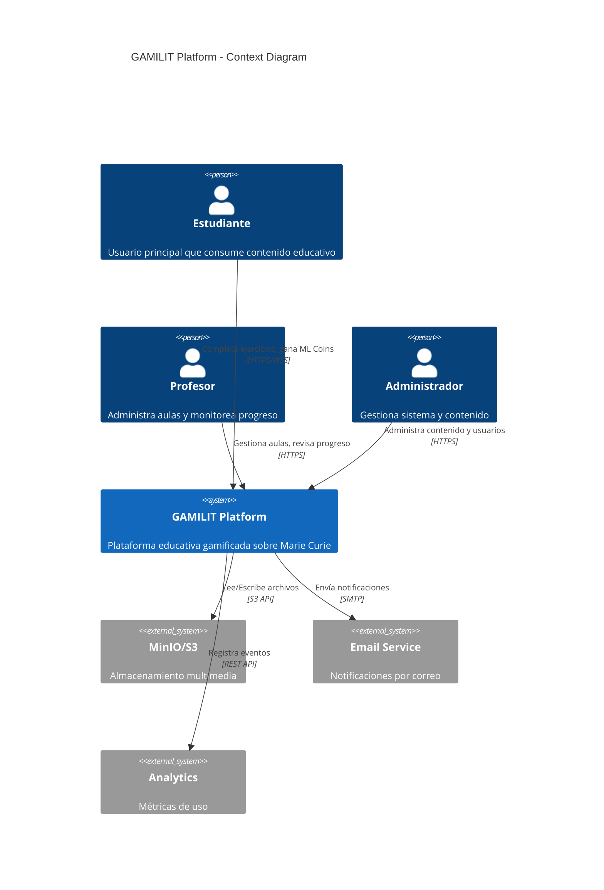
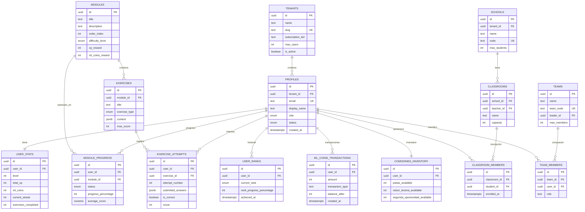
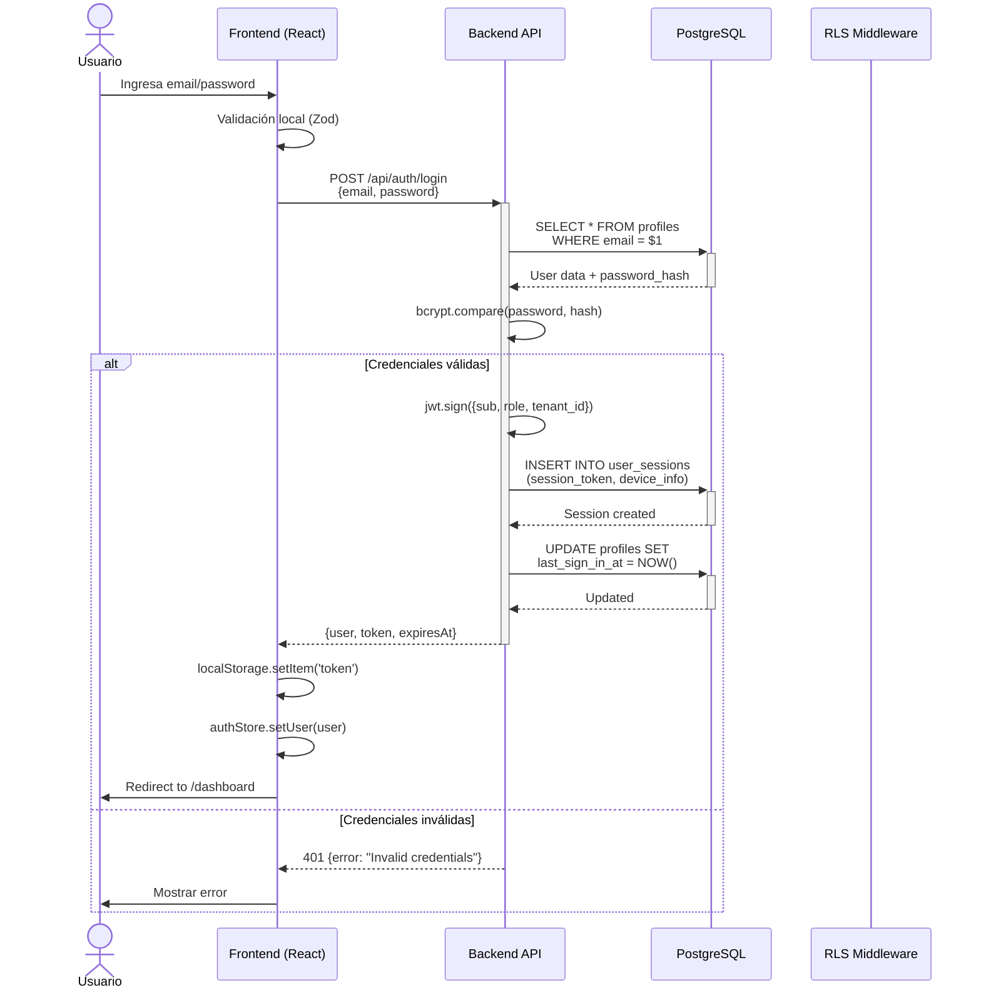
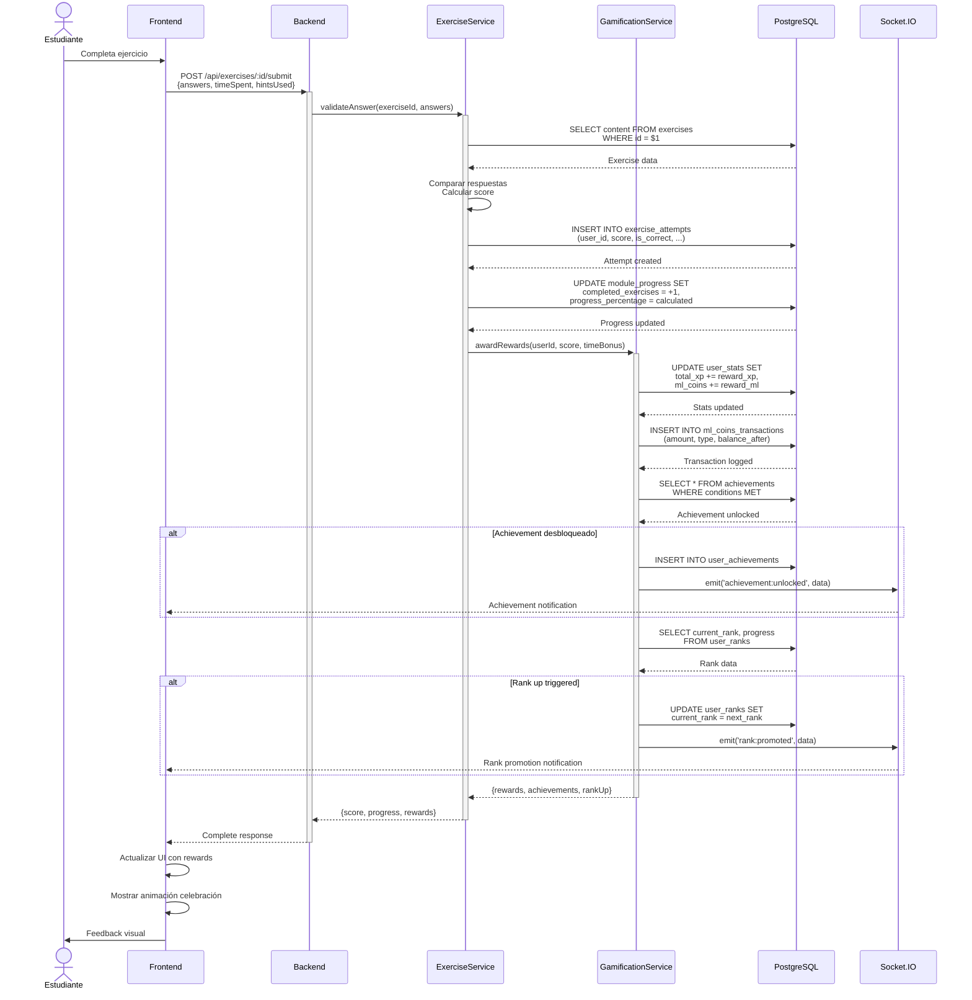
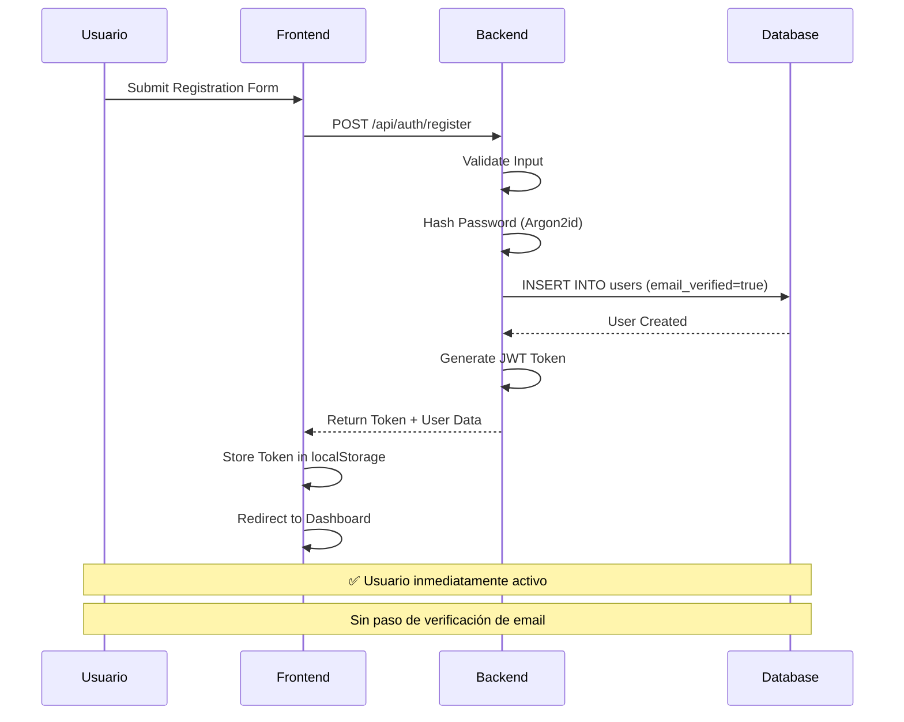

# Diagramas de Arquitectura GAMILIT Platform

**Versión:** 2.0
**Fecha:** Octubre 2025
**Estado:** Consolidado

---

## Introducción

Este documento presenta 5 diagramas visuales clave que ilustran la arquitectura de GAMILIT Platform. Los diagramas usan Mermaid y ASCII art para facilitar la comprensión del sistema completo.

### Actualizaciones Recientes

**Octubre 2025:** Se ha removido el proceso de email verification. El registro de usuarios es ahora directo y automático, sin requerir confirmación de email. El servicio de email se mantiene únicamente para notificaciones post-registro (logros, progreso, alertas).

---

## 1. C4 Context Diagram - Sistema Completo

Este diagrama muestra el contexto del sistema GAMILIT y sus interacciones con actores externos.



### Descripción

GAMILIT Platform es un sistema educativo web multi-tenant que sirve a tres tipos principales de usuarios: estudiantes (quienes consumen contenido y completan ejercicios gamificados), profesores (quienes gestionan aulas virtuales y monitorean el progreso de estudiantes), y administradores (quienes configuran el sistema y gestionan contenido educativo).

El sistema se integra con servicios externos críticos: almacenamiento de objetos (MinIO o AWS S3) para archivos multimedia como imágenes, videos y audios relacionados con Marie Curie; un servicio de email para notificaciones de progreso, logros desbloqueados y alertas (nota: ✅ email verification fue removido en Oct 2025 - registro es directo); y un sistema de analytics para tracking de uso y métricas de engagement.

---

## 2. ERD Simplificado - 15 Tablas Principales

Diagrama de relaciones de las tablas core del sistema.



### Descripción

El modelo de datos está organizado en 11 schemas PostgreSQL con 44 tablas totales. Este ERD muestra las 15 tablas principales que constituyen el núcleo del sistema.

El esquema sigue un patrón multi-tenant donde `TENANTS` es la raíz de aislamiento organizacional. Cada perfil de usuario (`PROFILES`) tiene relaciones 1:1 con `USER_STATS` (métricas de gamificación) y `COMODINES_INVENTORY` (power-ups), además de relaciones 1:N con progreso de módulos, intentos de ejercicios y transacciones de ML Coins. Los rangos Maya se rastrean históricamente en `USER_RANKS`.

La estructura educativa conecta `MODULES` con `EXERCISES` (1:N), y el progreso se rastrea en `MODULE_PROGRESS` y `EXERCISE_ATTEMPTS`. Las características sociales incluyen `SCHOOLS`, `CLASSROOMS` y `TEAMS` con tablas de membresía intermedias para relaciones N:M.

---

## 3. Diagrama de Secuencia: Login Flow

Flujo completo de autenticación con JWT.



### Descripción

El flujo de autenticación usa JWT con validación de contraseña bcrypt. El frontend valida el formato de entrada con Zod antes de enviar la petición. El backend verifica credenciales contra PostgreSQL, genera un JWT firmado con datos del usuario (ID, rol, tenant), registra la sesión con metadata de dispositivo, y actualiza el timestamp de último login. El token se almacena en localStorage del navegador y se usa en headers Authorization para peticiones subsecuentes.

---

## 4. Diagrama de Secuencia: Exercise Submission

Flujo de completar un ejercicio con rewards.



### Descripción

Al completar un ejercicio, el sistema orquesta múltiples operaciones: validación de respuesta, registro del intento, actualización de progreso del módulo, otorgamiento de recompensas (XP y ML Coins), detección de logros desbloqueados, verificación de promoción de rango, y notificaciones en tiempo real vía WebSocket. El ExerciseService coordina la lógica educativa mientras GamificationService gestiona todo el sistema de recompensas. Las transacciones se registran en un ledger inmutable (`ml_coins_transactions`) para auditoría completa.

---

## 5. Capas de Arquitectura

Visualización de las 4 capas principales del sistema.

```
┌───────────────────────────────────────────────────────────────────────────┐
│                          PRESENTATION LAYER                               │
│                                                                           │
│   ┌─────────────────────────────────────────────────────────────────┐   │
│   │  React SPA (Port 5173)                                          │   │
│   │  ━━━━━━━━━━━━━━━━━━━━━━━━━━━━━━━━━━━━━━━━━━━━━━━━━━━━━━━━━━━━  │   │
│   │  • React 19.2.0 + TypeScript 5.9.3                             │   │
│   │  • Vite 7.1.10 (Build Tool)                                    │   │
│   │  • React Router 7.9.4 (Client Routing)                         │   │
│   │  • Zustand 5.0.8 (State Management - 8 stores)                 │   │
│   │  • TanStack Query 5.90.3 (Server State)                        │   │
│   │  • Tailwind CSS 4.1.14 (Styling)                               │   │
│   │  • Framer Motion 12.23.24 (Animations)                         │   │
│   │                                                                 │   │
│   │  Componentes:                                                   │   │
│   │  ├─ 592 archivos TypeScript                                    │   │
│   │  ├─ 180+ React components                                      │   │
│   │  ├─ 33 mecánicas de ejercicios                                 │   │
│   │  ├─ 40+ custom hooks                                           │   │
│   │  └─ 60+ rutas SPA                                              │   │
│   └─────────────────────────────────────────────────────────────────┘   │
└───────────────────────────────────────────────────────────────────────────┘
                                     │
                      HTTP/REST + WebSocket (Socket.IO)
                                     ▼
┌───────────────────────────────────────────────────────────────────────────┐
│                         APPLICATION LAYER                                 │
│                                                                           │
│   ┌─────────────────────────────────────────────────────────────────┐   │
│   │  Node.js Backend API (Port 3001)                                │   │
│   │  ━━━━━━━━━━━━━━━━━━━━━━━━━━━━━━━━━━━━━━━━━━━━━━━━━━━━━━━━━━━━  │   │
│   │  • Node.js 20+ LTS + TypeScript 5.8+                           │   │
│   │  • Express 4.18+ Framework                                     │   │
│   │  • Socket.IO 4.6+ (Real-time)                                  │   │
│   │  • JWT Authentication (jsonwebtoken 9.0+)                      │   │
│   │  • bcrypt 5.1+ (Password hashing)                              │   │
│   │  • Zod 3.22+ (Validation)                                      │   │
│   │                                                                 │   │
│   │  Arquitectura:                                                  │   │
│   │  ├─ 11 módulos funcionales                                     │   │
│   │  ├─ 470+ endpoints REST                                        │   │
│   │  ├─ 35+ controllers                                            │   │
│   │  ├─ 40+ services (lógica de negocio)                           │   │
│   │  ├─ 30+ repositories (acceso a datos)                          │   │
│   │  ├─ 15+ middleware (auth, RLS, validation)                     │   │
│   │  └─ 25+ eventos Socket.IO                                      │   │
│   │                                                                 │   │
│   │  Módulos: auth | gamification | educational | progress |       │   │
│   │           social | content | admin | teacher | analytics |     │   │
│   │           notifications | system                               │   │
│   │                                                                 │   │
│   │  NOTA (Oct 2025): EmailVerificationService fue REMOVIDO.       │   │
│   │  El registro ahora es directo sin requerir verificación.       │   │
│   └─────────────────────────────────────────────────────────────────┘   │
└───────────────────────────────────────────────────────────────────────────┘
                                     │
                            SQL Queries + RLS
                                     ▼
┌───────────────────────────────────────────────────────────────────────────┐
│                            DATA LAYER                                     │
│                                                                           │
│   ┌─────────────────────────────────────────────────────────────────┐   │
│   │  PostgreSQL 16+ Database                                        │   │
│   │  ━━━━━━━━━━━━━━━━━━━━━━━━━━━━━━━━━━━━━━━━━━━━━━━━━━━━━━━━━━━━  │   │
│   │  • Driver: pg (node-postgres) 8.11+                            │   │
│   │  • Timezone: America/Mexico_City                               │   │
│   │  • Multi-tenant: Row Level Security (RLS)                      │   │
│   │                                                                 │   │
│   │  Estructura:                                                    │   │
│   │  ├─ 11 schemas especializados:                                 │   │
│   │  │  ├─ gamilit (utilities)                                     │   │
│   │  │  ├─ auth_management (9 tablas)                              │   │
│   │  │  ├─ gamification_system (7 tablas)                          │   │
│   │  │  ├─ educational_content (4 tablas)                          │   │
│   │  │  ├─ progress_tracking (3 tablas)                            │   │
│   │  │  ├─ social_features (7 tablas)                              │   │
│   │  │  ├─ content_management (4 tablas)                           │   │
│   │  │  ├─ system_configuration (2 tablas)                         │   │
│   │  │  └─ audit_logging (6 tablas)                                │   │
│   │  │                                                              │   │
│   │  ├─ 44 tablas totales                                          │   │
│   │  ├─ 159+ políticas RLS                                         │   │
│   │  ├─ 40+ funciones almacenadas                                  │   │
│   │  ├─ 30 triggers                                                │   │
│   │  ├─ 279+ índices (optimización)                                │   │
│   │  └─ 24 ENUMs custom                                            │   │
│   └─────────────────────────────────────────────────────────────────┘   │
└───────────────────────────────────────────────────────────────────────────┘
                                     │
                            S3 API / MinIO SDK
                                     ▼
┌───────────────────────────────────────────────────────────────────────────┐
│                           STORAGE LAYER                                   │
│                                                                           │
│   ┌─────────────────────────────────────────────────────────────────┐   │
│   │  MinIO / AWS S3 (Object Storage)                                │   │
│   │  ━━━━━━━━━━━━━━━━━━━━━━━━━━━━━━━━━━━━━━━━━━━━━━━━━━━━━━━━━━━━  │   │
│   │  • AWS SDK v3 / MinIO Client                                   │   │
│   │  • Multer 1.4+ (Upload handling)                               │   │
│   │                                                                 │   │
│   │  Contenido almacenado:                                          │   │
│   │  ├─ Imágenes educativas (Marie Curie, laboratorio, época)      │   │
│   │  ├─ Videos explicativos                                        │   │
│   │  ├─ Audios de pronunciación y contexto                         │   │
│   │  ├─ Documentos históricos (PDFs)                               │   │
│   │  ├─ Avatares de usuarios                                       │   │
│   │  └─ Assets de ejercicios interactivos                          │   │
│   └─────────────────────────────────────────────────────────────────┘   │
└───────────────────────────────────────────────────────────────────────────┘
```

### Descripción

La arquitectura de GAMILITsigue un modelo de 4 capas bien definidas, cada una con responsabilidades específicas y comunicación unidireccional descendente.

La **Presentation Layer** (capa de presentación) es una SPA React moderna con ~85,000 LOC que maneja toda la interacción del usuario, validación de formularios, routing client-side, y renderizado de 33 mecánicas educativas diferentes. Usa Zustand para state management local y TanStack Query para sincronización con el servidor.

La **Application Layer** (capa de aplicación) implementa toda la lógica de negocio en Node.js con ~45,000 LOC. Está organizada en 11 módulos funcionales siguiendo el patrón MVC/Repository, con clara separación entre controllers (HTTP), services (lógica de negocio), y repositories (acceso a datos). Maneja autenticación JWT, validación de requests con Zod, y comunicación real-time con Socket.IO.

La **Data Layer** (capa de datos) usa PostgreSQL 16+ con ~25,000 LOC de DDL. Implementa multi-tenancy nativo con Row Level Security, asegurando aislamiento de datos por organización. Los datos están organizados en 11 schemas especializados con 44 tablas, optimizadas con 279+ índices y protegidas por 159+ políticas RLS.

La **Storage Layer** (capa de almacenamiento) gestiona todos los archivos multimedia usando MinIO (self-hosted) o AWS S3 (cloud), con metadata de archivos almacenada en PostgreSQL pero contenido binario en object storage para escalabilidad.

---

## Flujo de Registro (Actualizado Oct 2025)

**IMPORTANTE:** El proceso de email verification ha sido removido completamente. El registro es ahora directo y automático.



### Descripción del Flujo

El flujo de registro ha sido simplificado para eliminar fricción en el onboarding de estudiantes en un contexto educativo supervisado:

1. **Usuario completa formulario** - Ingresa email, contraseña y nombre de usuario
2. **Frontend valida localmente** - Validación de formato con Zod antes de enviar
3. **Backend valida entrada** - Verifica unicidad de email y fortaleza de contraseña
4. **Hash de contraseña** - Usa Argon2id para almacenamiento seguro
5. **Creación de usuario** - Usuario insertado con `email_verified=true` por defecto
6. **Generación de JWT** - Token firmado con datos de usuario (ID, rol, tenant)
7. **Respuesta inmediata** - Token y datos de usuario retornados al frontend
8. **Almacenamiento de token** - Token guardado en localStorage del navegador
9. **Redirección automática** - Usuario llevado directamente al dashboard

**Ventajas del flujo simplificado:**
- ✅ Onboarding sin fricción para estudiantes
- ✅ No requiere acceso a email por parte del estudiante
- ✅ Supervisión por maestros desde Teacher Portal
- ✅ Reducción de soporte por problemas de verificación

### Cambios en Base de Datos

- Se removió: tabla `email_verification_tokens`
- Se removió: campos `email_verified_at` y `verification_token`
- Se agregó: campo `email_verified=true` por defecto en tabla `profiles`
- Se removió: servicio y middleware de EmailVerificationService

---

## Módulos Backend (Actualizado Oct 2025)

**Arquitectura modular del backend con Email Verification Service removido:**

```
┌─────────────────────────────────────────┐
│          API Gateway / Router           │
└─────────────────────────────────────────┘
            │
    ┌───────┴───────────────────┐
    │                           │
┌───▼────┐  ┌──────────┐  ┌────────▼─────┐
│  Auth  │  │  Game    │  │  Education   │
│ Module │  │  Module  │  │   Module     │
└───┬────┘  └──────────┘  └──────────────┘
    │
    ├─ AuthService
    ├─ SessionService
    ├─ PasswordRecoveryService
    └─ ✅ (Email Verification REMOVIDO)
```

### Descripción de Módulos

**API Gateway / Router:**
- Enrutamiento de requests HTTP
- Middleware de autenticación JWT
- Rate limiting y CORS
- Request/response logging

**Auth Module:**
- `AuthService` - Login, logout, registro directo
- `SessionService` - Gestión de sesiones activas
- `PasswordRecoveryService` - Recuperación de contraseña
- ~~`EmailVerificationService`~~ - **REMOVIDO en Oct 2025**

**Game Module:**
- Sistema de gamificación (XP, niveles, rangos)
- ML Coins y transacciones
- Comodines e inventario
- Logros y badges

**Education Module:**
- Módulos educativos y ejercicios
- Tracking de progreso
- Validación de respuestas
- Generación de reportes

**Nota:** El módulo de Email Verification fue completamente removido como parte de la simplificación del flujo de registro. La funcionalidad de email ahora se limita a notificaciones post-registro opcionales.

---

## Referencias

### Documentos Relacionados

- [Arquitectura General](./arquitectura/ARQUITECTURA-GENERAL.md) - Visión completa de la arquitectura
- [Backend Architecture](./arquitectura/BACKEND-ARCHITECTURE.md) - Detalles del backend
- [Frontend Architecture](./arquitectura/FRONTEND-ARCHITECTURE.md) - Detalles del frontend
- [Esquema de Base de Datos](../03-desarrollo/base-de-datos/ESQUEMA-COMPLETO.md) - DDL completo
- [API Reference](./apis/API-REFERENCE.md) - Documentación de endpoints
- [Sistema de Seguridad](./seguridad/SISTEMA-SEGURIDAD.md) - RLS y autenticación

### Herramientas para Visualización

- **Mermaid Live Editor:** https://mermaid.live/
- **PlantUML:** Para diagramas UML adicionales
- **draw.io:** Para diagramas interactivos
- **Excalidraw:** Para wireframes y esquemas rápidos

---

**Documento generado:** Octubre 2025
**Versión:** 2.1
**Mantenido por:** GAMILIT Platform Team
**Última actualización:** 28 de Octubre, 2025
**Cambios recientes:** Diagramas actualizados para reflejar remoción de email verification (Fase 1 Task 3)
