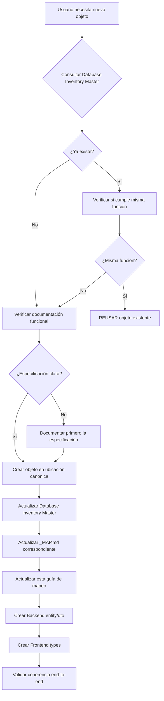

# Guía de Mapeo: Documentación ↔ Objetos DDL
## Unificación de Contexto para Prevenir Duplicaciones

**Generado:** 2025-11-07
**Versión:** 1.0
**Propósito:** Establecer relación clara entre documentación funcional y objetos físicos de database

---

## 🎯 Objetivo

Esta guía establece el **mapeo bidireccional** entre:
- 📄 **Documentación funcional** (especificaciones, requerimientos)
- 🗄️ **Objetos DDL** (tablas, enums, functions, etc.)

**Evita:**
- ❌ Duplicaciones por falta de contexto
- ❌ Objetos con misma función pero diferente nombre
- ❌ Referencias a objetos inexistentes
- ❌ Valores de enums inconsistentes con especificación

---

## 📐 Metodología de Mapeo

### Flujo Completo

```
┌──────────────────────────────────────────────────────────────┐
│                   DOCUMENTACIÓN FUNCIONAL                     │
│  docs/03-desarrollo/base-de-datos/ESPECIFICACIONES.md        │
└──────────────────────┬───────────────────────────────────────┘
                       │
                       │ 1. DEFINE
                       ↓
┌──────────────────────────────────────────────────────────────┐
│                   PROPÓSITO FUNCIONAL                         │
│  "¿Qué hace?" - "¿Para qué sirve?"                           │
│  Ejemplo: "Roles de usuario: estudiante, profesor, admin"    │
└──────────────────────┬───────────────────────────────────────┘
                       │
                       │ 2. MAPEA A
                       ↓
┌──────────────────────────────────────────────────────────────┐
│                 OBJETO DDL CANÓNICO                           │
│  apps/database/ddl/00-prerequisites.sql                      │
│  CREATE TYPE auth_management.gamilit_role AS ENUM (...)      │
└──────────────────────┬───────────────────────────────────────┘
                       │
                       │ 3. REFERENCIADO POR
                       ↓
┌──────────────────────────────────────────────────────────────┐
│              OBJETOS DEPENDIENTES                             │
│  - Tablas (profiles, users, roles)                           │
│  - Functions (get_current_user_role)                         │
│  - RLS Policies (module_progress_select_teacher)             │
└──────────────────────┬───────────────────────────────────────┘
                       │
                       │ 4. IMPLEMENTADO EN
                       ↓
┌──────────────────────────────────────────────────────────────┐
│                    BACKEND / FRONTEND                         │
│  apps/backend/src/shared/constants/roles.enum.ts             │
│  GamilityRoleEnum { STUDENT, ADMIN_TEACHER, SUPER_ADMIN }    │
└──────────────────────────────────────────────────────────────┘
```

---

## 📚 CATEGORÍA 1: ENUMS

### Plantilla de Mapeo para ENUMs

```yaml
ENUM: [nombre_completo_con_schema]

Documentación:
  Especificación: [ruta a documentación]
  Sección: [sección específica]

Propósito Funcional:
  ¿Qué es?: [descripción breve]
  ¿Para qué sirve?: [uso en el sistema]

Definición Canónica:
  Ubicación: apps/database/ddl/00-prerequisites.sql:XX
  Schema: [schema.nombre]
  Valores: [lista de valores con descripción]

Dependencias:
  Tablas: [lista de tablas que lo usan]
  Functions: [lista de funciones que lo usan]
  RLS Policies: [lista de policies que lo usan]

Backend:
  TypeORM: [ruta a entity/enum]
  Validación: [ruta a validators]

Frontend:
  Types: [ruta a types]
  UI: [componentes que lo usan]

Validación:
  ✅ Valores completos según especificación
  ✅ Sin duplicados
  ✅ Referencias correctas
```

---

### Ejemplo Completo: `auth_management.gamilit_role`

```yaml
ENUM: auth_management.gamilit_role

Documentación:
  Especificación: docs/03-desarrollo/autenticacion-y-autorizacion/ROLES.md
  Sección: "2.1 Roles del Sistema GAMILIT"

Propósito Funcional:
  ¿Qué es?: "Roles de usuario que determinan permisos y acceso en GAMILIT"
  ¿Para qué sirve?:
    - Controlar acceso a funcionalidades
    - RLS (Row Level Security) en queries
    - Routing en frontend
    - Permisos de API endpoints

  Valores funcionales:
    - student: Estudiante regular (puede hacer ejercicios, ver progreso propio)
    - admin_teacher: Profesor/Administrador (puede ver progreso de estudiantes, crear contenido)
    - super_admin: Super administrador (acceso total al sistema)

Definición Canónica:
  Ubicación: apps/database/ddl/00-prerequisites.sql:30
  Schema: auth_management
  Nombre completo: auth_management.gamilit_role

  Código SQL:
    ```sql
    CREATE TYPE auth_management.gamilit_role AS ENUM (
        'student',       -- Estudiante regular
        'admin_teacher', -- Profesor/Administrador
        'super_admin'    -- Super administrador
    );
    ```

Dependencias DDL:
  Tablas que lo usan:
    - auth_management.profiles (column: role)
    - auth.users (column: role)
    - auth_management.roles (column: role_name)
    - system_configuration.feature_flags (column: allowed_roles array)

  Functions que lo usan:
    - gamilit.get_current_user_role() RETURNS gamilit_role
    - public.is_feature_enabled(flag_key, user_role)

  RLS Policies que lo usan:
    - progress_tracking.module_progress_select_teacher
    - progress_tracking.learning_sessions_select_teacher
    - progress_tracking.exercise_attempts_select_teacher
    - progress_tracking.exercise_submissions_select_teacher
    - educational_content.modules_select_teacher
    - educational_content.exercises_select_teacher
    - gamification_system.user_stats_select_teacher

Backend (TypeORM):
  Enum TypeScript:
    Ubicación: apps/backend/src/shared/enums/gamilit-role.enum.ts
    Código:
      ```typescript
      export enum GamilityRoleEnum {
        STUDENT = 'student',
        ADMIN_TEACHER = 'admin_teacher',
        SUPER_ADMIN = 'super_admin',
      }
      ```

  Uso en Entities:
    - apps/backend/src/modules/auth/entities/profile.entity.ts
    - apps/backend/src/modules/auth/entities/user.entity.ts

  Guards/Decorators:
    - apps/backend/src/shared/decorators/roles.decorator.ts
    - apps/backend/src/shared/guards/roles.guard.ts

Frontend:
  Types:
    Ubicación: apps/frontend/src/types/auth.types.ts
    Código:
      ```typescript
      export type GamilityRole = 'student' | 'admin_teacher' | 'super_admin';
      ```

  Componentes:
    - RoleBasedRoute (routing condicional)
    - UserRoleBadge (display de rol)
    - AdminPanel (verificación de permisos)

Validación:
  ✅ Valores completos según especificación
  ✅ Sin duplicados (consolidado 2025-11-07)
  ✅ Referencias correctas (corregidas 11 referencias de public.gamilit_role → auth_management.gamilit_role)
  ✅ Backend sincronizado
  ✅ Frontend sincronizado

Historia de Consolidación:
  - 2025-11-07: Eliminado duplicado en auth_management/enums/gamilit_role.sql
  - 2025-11-07: Corregidas 11 referencias incorrectas a public.gamilit_role
  - 2025-11-07: Definición canónica establecida en 00-prerequisites.sql:30
```

---

### Ejemplo 2: `public.auth_provider`

```yaml
ENUM: public.auth_provider

Documentación:
  Especificación: docs/03-desarrollo/autenticacion-y-autorizacion/OAUTH-PROVIDERS.md
  Sección: "3. Proveedores de Autenticación Soportados"

Propósito Funcional:
  ¿Qué es?: "Proveedores de autenticación OAuth/Social + autenticación local"
  ¿Para qué sirve?:
    - Configurar métodos de login disponibles
    - Tracking de origen de usuarios
    - Configuración de OAuth apps

  Valores funcionales:
    - local: Email/password tradicional
    - google: Google OAuth 2.0
    - facebook: Facebook Login
    - apple: Apple Sign In
    - microsoft: Microsoft Account
    - github: GitHub OAuth

Definición Canónica:
  Ubicación: apps/database/ddl/00-prerequisites.sql:38
  Schema: public
  Nombre completo: public.auth_provider

  Código SQL:
    ```sql
    CREATE TYPE public.auth_provider AS ENUM (
        'local',     -- Email/password
        'google',    -- Google OAuth
        'facebook',  -- Facebook Login
        'apple',     -- Apple Sign In
        'microsoft', -- Microsoft Account
        'github'     -- GitHub OAuth
    );
    ```

Dependencias DDL:
  Tablas que lo usan:
    - auth_management.auth_providers (column: provider_name)
    - auth_management.profiles (column: auth_provider)

  Functions que lo usan:
    - auth.get_available_providers() RETURNS auth_provider[]

Backend (TypeORM):
  Enum TypeScript:
    Ubicación: apps/backend/src/modules/auth/enums/auth-provider.enum.ts
    Código:
      ```typescript
      export enum AuthProviderEnum {
        LOCAL = 'local',
        GOOGLE = 'google',
        FACEBOOK = 'facebook',
        APPLE = 'apple',
        MICROSOFT = 'microsoft',
        GITHUB = 'github',
      }
      ```

  Uso:
    - OAuth configuration (oauth.config.ts)
    - Authentication service (auth.service.ts)
    - Provider-specific strategies

Frontend:
  Types:
    ```typescript
    export type AuthProvider = 'local' | 'google' | 'facebook' | 'apple' | 'microsoft' | 'github';
    ```

  Componentes:
    - LoginProviderButtons (botones de OAuth)
    - ProviderIcon (iconos por provider)
    - OAuthCallback (manejo de redirects)

Validación:
  ✅ Valores completos según especificación
  ✅ Sin duplicados (consolidado 2025-11-07)
  ✅ Incluye 'apple' y 'github' (agregados 2025-11-07)
  ✅ Backend sincronizado
  ✅ Frontend sincronizado

Historia de Consolidación:
  - 2025-11-07: Agregados valores 'apple' y 'github' en 00-prerequisites.sql
  - 2025-11-07: Eliminada definición duplicada de auth_management/tables/05-auth_providers.sql
  - 2025-11-07: Definición canónica establecida con 6 valores
```

---

## 📊 CATEGORÍA 2: TABLAS

### Plantilla de Mapeo para TABLAS

```yaml
TABLA: [schema.nombre_tabla]

Documentación:
  Especificación: [ruta a documentación]
  Diagrama ER: [ruta a diagrama]

Propósito Funcional:
  ¿Qué almacena?: [descripción de datos]
  ¿Para qué sirve?: [funcionalidad que soporta]

Definición:
  Ubicación: apps/database/ddl/schemas/[schema]/tables/XX-[nombre].sql
  Schema: [schema]
  Nombre completo: [schema.tabla]

Estructura:
  Columnas principales: [lista]
  Primary Key: [columna(s)]
  Unique constraints: [lista]

Dependencias:
  Foreign Keys a:
    - [schema.tabla] (columna → referencia)

  Enums usados:
    - [schema.enum] en columna [nombre]

  Triggers:
    - [nombre_trigger] → ejecuta [función]

  Indexes:
    - [nombre_index] en [columnas]

  RLS Policies:
    - [nombre_policy]: [descripción]

  Usado por:
    - Functions: [lista]
    - Views: [lista]
    - Materialized Views: [lista]

Backend (TypeORM):
  Entity:
    Ubicación: apps/backend/src/modules/[modulo]/entities/[nombre].entity.ts
    Decorators: @Entity('[schema].[tabla]')

  Repository:
    Ubicación: apps/backend/src/modules/[modulo]/repositories/[nombre].repository.ts

  DTOs:
    - Create: create-[nombre].dto.ts
    - Update: update-[nombre].dto.ts
    - Response: [nombre].dto.ts

Frontend:
  Types:
    Ubicación: apps/frontend/src/types/[modulo].types.ts

  API Hooks:
    - use[Nombre]
    - use[Nombre]List
    - useCreate[Nombre]
    - useUpdate[Nombre]

Validación:
  ✅ Coherencia Backend-DDL (columnas, tipos, constraints)
  ✅ Foreign Keys válidas
  ✅ Enums existen
  ✅ Triggers funcionan
  ✅ RLS policies activas
```

---

### Ejemplo Completo: `auth_management.profiles`

```yaml
TABLA: auth_management.profiles

Documentación:
  Especificación: docs/03-desarrollo/base-de-datos/TABLAS-AUTH.md
  Sección: "2.3 Tabla profiles - Perfiles de Usuario"
  Diagrama ER: docs/03-desarrollo/base-de-datos/diagrams/auth-erd.png

Propósito Funcional:
  ¿Qué almacena?: "Información completa del perfil de usuario (datos personales, configuración, preferencias)"
  ¿Para qué sirve?:
    - Almacenar datos de usuario más allá de autenticación
    - Vincular usuario de Supabase Auth con datos de aplicación
    - Configuración personalizada por usuario
    - Tracking de tenant/organización

Definición:
  Ubicación: apps/database/ddl/schemas/auth_management/tables/03-profiles.sql
  Schema: auth_management
  Nombre completo: auth_management.profiles

Estructura:
  Columnas principales (25 total):
    - id (uuid, PK): ID del perfil
    - user_id (uuid, FK auth.users): Usuario de Supabase Auth
    - tenant_id (uuid, FK tenants): Organización/escuela
    - email (text): Email del usuario
    - full_name (text): Nombre completo
    - role (gamilit_role): Rol en el sistema
    - status (user_status): Estado de la cuenta
    - avatar_url (text): URL de avatar
    - phone (text): Teléfono
    - bio (text): Biografía
    - preferences (jsonb): Preferencias UI/UX
    - settings (jsonb): Configuraciones de cuenta
    - metadata (jsonb): Metadata adicional
    - created_at, updated_at (timestamptz): Timestamps

  Primary Key: id

  Unique Constraints:
    - user_id (1 perfil por usuario)
    - email (único en el sistema)

Dependencias:
  Foreign Keys a:
    - auth.users (user_id → id)
    - auth_management.tenants (tenant_id → id)

  Enums usados:
    - auth_management.gamilit_role en columna role
    - auth_management.user_status en columna status

  Triggers:
    - trg_profiles_updated_at → gamilit.update_updated_at_column()

  Indexes:
    - idx_profiles_user_id (user_id) - UNIQUE
    - idx_profiles_tenant (tenant_id)
    - idx_profiles_email (email) - UNIQUE
    - idx_profiles_role (role)
    - idx_profiles_status (status)

  RLS Policies:
    - profiles_select_own: usuarios ven su propio perfil
    - profiles_select_admin: admins ven todos los perfiles
    - profiles_update_own: usuarios actualizan su perfil
    - profiles_insert_own: creación de perfil propio

  Usado por:
    Functions:
      - gamilit.get_current_user_id() - obtiene user_id del perfil actual
      - gamilit.get_current_user_role() - obtiene rol del perfil actual

    Tablas (15+ FKs desde):
      - auth_management.user_sessions
      - auth_management.memberships
      - gamification_system.user_stats
      - progress_tracking.module_progress
      - social_features.classroom_members
      - (y más...)

Backend (TypeORM):
  Entity:
    Ubicación: apps/backend/src/modules/auth/entities/profile.entity.ts
    Decorators:
      ```typescript
      @Entity('profiles', { schema: 'auth_management' })
      export class ProfileEntity {
        @PrimaryGeneratedColumn('uuid')
        id: string;

        @Column({ type: 'enum', enum: GamilityRoleEnum })
        role: GamilityRoleEnum;

        @Column({ type: 'enum', enum: UserStatusEnum })
        status: UserStatusEnum;

        // ... 25 columnas total
      }
      ```

  Repository:
    Ubicación: apps/backend/src/modules/auth/repositories/profile.repository.ts

  DTOs:
    - CreateProfileDto: create-profile.dto.ts
    - UpdateProfileDto: update-profile.dto.ts
    - ProfileResponseDto: profile.dto.ts

Frontend:
  Types:
    Ubicación: apps/frontend/src/types/auth.types.ts
    ```typescript
    export interface UserProfile {
      id: string;
      email: string;
      fullName: string;
      role: GamilityRole;
      status: UserStatus;
      avatarUrl?: string;
      // ...
    }
    ```

  API Hooks:
    - useUserProfile(): obtiene perfil del usuario actual
    - useUpdateProfile(): actualiza perfil
    - useUsersList(): lista de usuarios (admin)

Validación:
  ✅ 100% coherencia Backend-DDL (25/25 columnas match)
  ✅ Foreign Keys válidas (auth.users, tenants)
  ✅ Enums existen (gamilit_role, user_status)
  ✅ Triggers funcionan (update_updated_at_column)
  ✅ RLS policies activas (4 policies)
  ✅ Indexes optimizados (5 indexes)

Reporte de Validación:
  Fecha: 2025-11-07
  Documento: orchestration/05-validaciones/coherencia/database-auth-management-2025-11-07.md
  Calificación: 100% / A+
```

---

## 🔧 CATEGORÍA 3: FUNCTIONS

### Plantilla de Mapeo para FUNCTIONS

```yaml
FUNCTION: [schema.nombre_funcion]

Documentación:
  Especificación: [ruta]
  Propósito: [descripción funcional]

Definición:
  Ubicación: apps/database/ddl/schemas/[schema]/functions/XX-[nombre].sql
  Schema: [schema]
  Signature: [nombre](params) RETURNS [tipo]

Lógica:
  Descripción: [qué hace]
  Parámetros: [lista con tipos]
  Retorna: [tipo y descripción]

Dependencias:
  Enums usados: [lista]
  Tablas consultadas: [lista]
  Functions llamadas: [lista]

Usado por:
  RLS Policies: [lista]
  Triggers: [lista]
  Aplicación: [Backend/Frontend]

Validación:
  ✅ Sintaxis correcta
  ✅ Dependencias existen
  ✅ Tests unitarios
```

---

## 📋 CATEGORÍA 4: RLS POLICIES

### Plantilla de Mapeo para RLS POLICIES

```yaml
POLICY: [nombre_policy] ON [schema.tabla]

Documentación:
  Especificación: docs/03-desarrollo/base-de-datos/RLS-POLICIES.md
  Propósito: [qué acceso controla]

Definición:
  Ubicación: apps/database/ddl/schemas/[schema]/rls-policies/XX-[tabla].sql
  Tabla: [schema.tabla]
  Comando: SELECT | INSERT | UPDATE | DELETE

Lógica:
  USING: [expresión condicional]
  WITH CHECK: [expresión para inserts/updates]

Dependencias:
  Functions usadas:
    - [schema.function_name]()

  Enums comparados:
    - [schema.enum] = 'valor'

  Tablas consultadas:
    - [schema.tabla]

Validación:
  ✅ Policy activa (ALTER TABLE ... ENABLE ROW LEVEL SECURITY)
  ✅ Functions existen
  ✅ Enums existen
  ✅ Tests de permisos
```

---

## 🎯 FLUJO DE TRABAJO: Crear Nuevo Objeto

### Antes de crear CUALQUIER objeto DDL



---

## ✅ CHECKLIST: Nuevo ENUM

- [ ] **1. DOCUMENTACIÓN**
  - [ ] Especificación funcional clara en docs/
  - [ ] Lista completa de valores con descripción
  - [ ] Justificación de cada valor

- [ ] **2. VERIFICAR DUPLICADOS**
  - [ ] Buscar en Database Inventory Master
  - [ ] Buscar en 00-prerequisites.sql
  - [ ] Grep por nombre similar en DDL

- [ ] **3. CREAR EN UBICACIÓN CANÓNICA**
  - [ ] Definir en `apps/database/ddl/00-prerequisites.sql`
  - [ ] Usar schema explícito (ej: `auth_management.enum_name`)
  - [ ] Agregar COMMENT ON TYPE con descripción
  - [ ] Valores en snake_case, inglés, descriptivos

- [ ] **4. BACKEND**
  - [ ] Crear TypeScript enum en shared/enums/
  - [ ] Valores idénticos a DDL
  - [ ] Usar en entities con @Column({ type: 'enum', enum: ... })

- [ ] **5. FRONTEND**
  - [ ] Crear type en types/ como union type
  - [ ] Documentar valores permitidos

- [ ] **6. DOCUMENTAR MAPEO**
  - [ ] Agregar sección en esta guía
  - [ ] Actualizar Database Inventory Master
  - [ ] Actualizar _MAP.md
  - [ ] Agregar a DOCUMENTACION-REFERENCIA-ENUMS.md

- [ ] **7. VALIDACIÓN**
  - [ ] Tests unitarios backend
  - [ ] Validación de formularios frontend
  - [ ] Migration script probado

---

## ✅ CHECKLIST: Nueva TABLA

- [ ] **1. DOCUMENTACIÓN**
  - [ ] Especificación en docs/03-desarrollo/base-de-datos/
  - [ ] Diagrama ER actualizado
  - [ ] Columnas documentadas

- [ ] **2. VERIFICAR DUPLICADOS**
  - [ ] Buscar tabla con misma función en DIM
  - [ ] Verificar si otra tabla ya almacena estos datos

- [ ] **3. DISEÑO DDL**
  - [ ] Archivo en apps/database/ddl/schemas/[schema]/tables/
  - [ ] Numeración secuencial (XX-nombre.sql)
  - [ ] PRIMARY KEY definida
  - [ ] FOREIGN KEYS a tablas existentes
  - [ ] ENUMs existen en 00-prerequisites.sql
  - [ ] Indexes para queries comunes
  - [ ] COMMENT ON TABLE con descripción
  - [ ] COMMENT ON COLUMN para columnas importantes

- [ ] **4. TRIGGERS**
  - [ ] updated_at trigger si aplica
  - [ ] Triggers de validación si aplica
  - [ ] Functions de triggers existen

- [ ] **5. RLS POLICIES**
  - [ ] ALTER TABLE ENABLE ROW LEVEL SECURITY
  - [ ] Policies para SELECT
  - [ ] Policies para INSERT/UPDATE/DELETE
  - [ ] Functions de RLS existen

- [ ] **6. BACKEND ENTITY**
  - [ ] Entity en modules/[modulo]/entities/
  - [ ] Todas las columnas mapeadas
  - [ ] Tipos correctos (uuid, enum, jsonb, etc.)
  - [ ] Relations (@ManyToOne, @OneToMany) si aplica
  - [ ] Repository
  - [ ] DTOs (Create, Update, Response)
  - [ ] Service con CRUD básico

- [ ] **7. FRONTEND**
  - [ ] Types en types/[modulo].types.ts
  - [ ] API hooks (useQuery, useMutation)
  - [ ] Componentes que consumen datos

- [ ] **8. MIGRATION**
  - [ ] Script de migración en migrations/
  - [ ] Rollback definido
  - [ ] Datos de prueba si aplica

- [ ] **9. DOCUMENTAR MAPEO**
  - [ ] Sección en esta guía con mapeo completo
  - [ ] Actualizar Database Inventory Master
  - [ ] Actualizar _MAP.md del schema
  - [ ] Actualizar diagrama ER

- [ ] **10. VALIDACIÓN**
  - [ ] Coherencia DDL ↔ Backend validada
  - [ ] Tests de Repository
  - [ ] Tests de RLS
  - [ ] Performance de queries con EXPLAIN

---

## 🔄 PROCESO DE CONSOLIDACIÓN

Cuando se detecta un duplicado:

### 1. IDENTIFICAR

```bash
# Buscar en Database Inventory Master
grep -i "nombre_objeto" orchestration/05-validaciones/consolidacion/DATABASE-INVENTORY-MASTER-2025-11-07.md
```

### 2. COMPARAR

- **Valores/estructura:** ¿Son idénticos?
- **Ubicación:** ¿Dónde están definidos?
- **Documentación:** ¿Cuál tiene respaldo en especificación?

### 3. DECIDIR FUENTE DE VERDAD

**Criterios (en orden):**
1. ¿Tiene documentación funcional? → Fuente de verdad
2. ¿Está en ubicación canónica (00-prerequisites.sql)? → Fuente de verdad
3. ¿Tiene valores completos? → Fuente de verdad
4. ¿Más reciente? → Fuente de verdad

### 4. CONSOLIDAR

```bash
# Backup
cp archivo_a_modificar /tmp/backup_$(date +%Y%m%d)/

# Actualizar referencias
sed -i 's/definicion_incorrecta/definicion_correcta/g' archivo.sql

# Eliminar duplicado
rm archivo_duplicado.sql

# Validar
grep -r "definicion_incorrecta" apps/database/ddl  # Debe retornar 0
```

### 5. DOCUMENTAR

- Actualizar Database Inventory Master
- Actualizar esta guía
- Actualizar _MAP.md
- Crear nota en changelog

---

## 📊 ESTADO ACTUAL (2025-11-07)

### ✅ Consolidaciones Completadas

**P0-001: `auth_management.gamilit_role`**
- ✅ Eliminado duplicado en auth_management/enums/gamilit_role.sql
- ✅ Corregidas 11 referencias incorrectas (public.gamilit_role → auth_management.gamilit_role)
- ✅ 1 definición canónica en 00-prerequisites.sql:30
- ✅ Backend sincronizado
- ✅ Documentación actualizada

**P0-002: `public.auth_provider`**
- ✅ Agregados valores 'apple' y 'github' en 00-prerequisites.sql:38
- ✅ Eliminada definición duplicada en auth_management/tables/05-auth_providers.sql
- ✅ 1 definición canónica con 6 valores completos
- ✅ Backend sincronizado
- ✅ Documentación actualizada

---

## 🚀 PRÓXIMOS PASOS

### Pendientes P1 (21 enums duplicados)

Para cada enum:
1. Validar valores en 00-prerequisites.sql
2. Eliminar archivo duplicado en schema-specific directory
3. Agregar comentario en archivo de tabla: "// ENUM definido en 00-prerequisites.sql"
4. Actualizar esta guía con mapeo completo

---

## 📚 REFERENCIAS

- **Database Inventory Master:** `orchestration/05-validaciones/consolidacion/DATABASE-INVENTORY-MASTER-2025-11-07.md`
- **Documentación de Referencia Enums:** `orchestration/05-validaciones/consolidacion/DOCUMENTACION-REFERENCIA-ENUMS.md`
- **Guía de Uso DIM:** `orchestration/05-validaciones/consolidacion/GUIA-USO-DATABASE-INVENTORY-MASTER.md`
- **Database _MAP.md:** `apps/database/_MAP.md`
- **Reporte de Validación Auth:** `orchestration/05-validaciones/coherencia/database-auth-management-2025-11-07.md`

---

**Última actualización:** 2025-11-07
**Versión:** 1.0
**Mantenedor:** SQL Agent / Database Team
**Próxima revisión:** Después de completar consolidación P1
