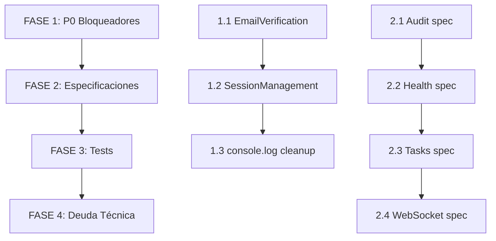

# PLAN DE IMPLEMENTACIONES - BACKEND GAMILIT

**Fecha:** 2025-12-18
**Analista:** Requirements-Analyst
**Basado en:** Análisis de 4 dimensiones + Validación de dependencias

---

## RESUMEN DE HALLAZGOS CRÍTICOS

### Problemas Identificados por Prioridad

| Prioridad | Problema | Impacto | Módulos Afectados |
|-----------|----------|---------|-------------------|
| **P0** | EmailVerificationService no envía emails | Signup flow roto | AUTH, ADMIN |
| **P0** | 59 console.log en producción | Performance/Seguridad | PROGRESS |
| **P0** | 4 módulos sin especificaciones | Mantenibilidad | audit, health, tasks, websocket |
| **P1** | SessionManagementService no inyectado | Logout incompleto | AUTH |
| **P1** | 8 módulos sin tests | Confiabilidad | 50% del backend |
| **P2** | 917 usos de `any` type | Type safety | Global |
| **P2** | AdminModule sobrecargado | Mantenibilidad | ADMIN (23 services) |

---

## ANÁLISIS DE DEPENDENCIAS - RESUMEN

### Módulos Críticos (Hotspots)

```
PROGRESS ⭐⭐⭐ (7 dependencias)
└── Cambios afectan: EDUCATIONAL, TEACHER, ADMIN, GAMIFICATION

NOTIFICATIONS ⭐⭐⭐ (6 dependencias)
└── Cambios afectan: TASKS, PROGRESS, TEACHER

GAMIFICATION ⭐⭐ (5 dependencias)
└── Cambios afectan: AUTH, PROGRESS, TASKS

AUTH ⭐⭐ (5 dependencias)
└── Cambios afectan: PROFILE, ADMIN, TEACHER
```

### Dependencia Circular Detectada

```
PROGRESS ↔ EDUCATIONAL
├── EDUCATIONAL importa ProgressModule
├── PROGRESS usa entities de Educational
└── Estado: Manejado correctamente (forward references)
⚠️ NO MODIFICAR esta relación
```

---

## PLAN DE IMPLEMENTACIÓN POR FASES

### FASE 1: BLOQUEADORES P0 (Semana 1)

#### 1.1 Implementar EmailVerificationService

**Archivo:** `apps/backend/src/modules/auth/services/email-verification.service.ts`

**TODOs a resolver:**
- Línea 47: Inyectar MailerService
- Línea 92: Implementar envío de email

**Dependencias:**
- MailModule (ya importado)
- Profile entity (auth schema)

**Impacto:** AUTH → ADMIN (user registration)

**Validación:**
- [ ] Test: `npm run test -- email-verification.service.spec`
- [ ] Manual: Crear usuario y verificar email enviado

---

#### 1.2 Inyectar SessionManagementService

**Archivo:** `apps/backend/src/modules/auth/services/password-recovery.service.ts`

**TODOs a resolver:**
- Línea 49: Inyectar SessionManagementService
- Línea 163: Implementar logout en reset-password

**Dependencias:**
- SessionManagementService (auth)

**Impacto:** AUTH → PROFILE

**Validación:**
- [ ] Test: `npm run test -- password-recovery.service.spec`
- [ ] Manual: Reset password y verificar logout de sesiones

---

#### 1.3 Limpiar console.log en ExerciseSubmissionService

**Archivo:** `apps/backend/src/modules/progress/services/exercise-submission.service.ts`

**Cambios:**
- Reemplazar 59 console.log/error con NestJS Logger
- NO cambiar lógica de negocio
- Mantener información de debugging en formato estructurado

**Dependencias:** Ninguna (cambio interno)

**Impacto:** NINGUNO en dependencias

**Validación:**
- [ ] Test: `npm run test -- exercise-submission.service.spec`
- [ ] Verificar logs en staging antes de producción

---

### FASE 2: ESPECIFICACIONES (Semana 2)

#### 2.1 Crear Especificación ET-AUD-001 (Audit)

**Ubicación nueva:** `docs/90-transversal/arquitectura/especificaciones/ET-AUD-001-sistema-auditoria.md`

**Contenido a documentar:**
- AuditService: métodos create(), findAll(), findByUser()
- AuditLog entity: estructura y campos
- AuditInterceptor: eventos capturados

**Dependencias:** Ninguna (módulo independiente)

**Impacto:** Ninguno

---

#### 2.2 Crear Especificación ET-HLT-001 (Health)

**Ubicación nueva:** `docs/90-transversal/arquitectura/especificaciones/ET-HLT-001-health-checks.md`

**Contenido a documentar:**
- HealthController: endpoint GET /health
- HealthService: checks de BD, Redis, etc.

**Dependencias:** Ninguna (módulo independiente)

**Impacto:** Ninguno

---

#### 2.3 Crear Especificación ET-TSK-001 (Tasks)

**Ubicación nueva:** `docs/90-transversal/arquitectura/especificaciones/ET-TSK-001-cron-jobs.md`

**Contenido a documentar:**
- MissionsCronService: reset diario de misiones
- NotificationsCronService: limpieza y envío batch
- Schedule: configuración de timings

**Dependencias:**
- GamificationModule (MissionsService)
- NotificationsModule

**Impacto:** AdminModule (usa TasksModule)

**Precaución:** NO cambiar APIs exportadas

---

#### 2.4 Crear Especificación ET-WS-001 (WebSocket)

**Ubicación nueva:** `docs/90-transversal/arquitectura/especificaciones/ET-WS-001-websocket.md`

**Contenido a documentar:**
- WebSocketService: métodos de broadcast
- NotificationsGateway: eventos Socket.IO
- WsJwtGuard: autenticación de sockets

**Dependencias:**
- JwtModule (interno)

**Impacto:** NotificationsModule (usa gateway)

---

### FASE 3: COBERTURA DE TESTS (Semana 3-4)

#### 3.1 Tests para Módulos Sin Cobertura

**Prioridad por criticidad:**

| Orden | Módulo | Tests Requeridos | Razón |
|-------|--------|------------------|-------|
| 1 | notifications | 15+ | Usado por 6 módulos |
| 2 | social | 20+ | Base para classroom/teams |
| 3 | assignments | 10+ | Flujo crítico de tareas |
| 4 | websocket | 5+ | Real-time notifications |
| 5 | tasks | 5+ | CRON jobs críticos |
| 6 | audit | 3+ | Bajo riesgo |
| 7 | mail | 3+ | Bajo riesgo |
| 8 | profile | 3+ | Bajo riesgo |

---

### FASE 4: DEUDA TÉCNICA (Semana 5+)

#### 4.1 Migrar a Strict TypeScript (Gradual)

**Cambio en tsconfig.json:**
```json
{
  "compilerOptions": {
    "strict": true,
    "noImplicitAny": true
  }
}
```

**Impacto:** 917 warnings a resolver gradualmente

---

#### 4.2 Refactorizar AdminModule (Largo plazo)

**Propuesta de descomposición:**
```
AdminModule (facade)
├── AdminUsersModule (5 servicios)
├── AdminOrganizationsModule (2 servicios)
├── AdminContentModule (3 servicios)
├── AdminSystemModule (4 servicios)
├── AdminGamificationModule (2 servicios)
└── AdminReportsModule (3 servicios)
```

---

## MATRIZ DE VALIDACIÓN DE DEPENDENCIAS

### Antes de Implementar - Checklist

| Cambio | Verificar | Módulos a Testear |
|--------|-----------|-------------------|
| EmailVerification | MailService inyectado | AUTH, ADMIN |
| SessionManagement | SessionManagementService disponible | AUTH |
| console.log cleanup | Logger inyectado | PROGRESS |
| Audit specs | AuditInterceptor funciona | ADMIN |
| Tasks specs | CRON schedule correcto | GAMIFICATION |
| WebSocket specs | Socket events llegan | NOTIFICATIONS |

### Después de Implementar - Validación

| Cambio | Test Automático | Test Manual |
|--------|-----------------|-------------|
| EmailVerification | `npm test auth` | Crear usuario → ver email |
| SessionManagement | `npm test auth` | Reset password → verificar logout |
| console.log cleanup | `npm test progress` | Ver logs estructurados en staging |
| Audit specs | `npm test audit` | - |
| Tasks specs | `npm test tasks` | Validar CRON en dev |
| WebSocket specs | `npm test websocket` | Conectar socket y recibir evento |

---

## ORDEN DE EJECUCIÓN SEGURO



### Dependencias Entre Tareas

```
FASE 1 (Secuencial):
1.1 EmailVerification ─┐
                       ├─→ 1.3 console.log (paralelo si recursos)
1.2 SessionManagement ─┘

FASE 2 (Paralelo - módulos independientes):
2.1 Audit ─┬─→ Sin dependencias
2.2 Health ┘

2.3 Tasks ──→ Después de validar GamificationModule
2.4 WebSocket ──→ Después de validar NotificationsModule

FASE 3 (Secuencial por criticidad):
notifications → social → assignments → websocket → tasks → audit → mail → profile

FASE 4 (Gradual):
TypeScript strict → AdminModule refactor
```

---

## RIESGOS Y MITIGACIÓN

| Riesgo | Probabilidad | Impacto | Mitigación |
|--------|--------------|---------|-----------|
| EmailVerification rompe signup | BAJA | CRÍTICO | Testear en staging primero |
| console.log removal pierde debug info | MEDIA | BAJO | Usar Logger con niveles |
| Tasks CRON timing incorrecto | MEDIA | MEDIO | Mock Schedule en tests |
| WebSocket events no llegan | BAJA | MEDIO | Mock NotificationsModule |
| Circular dependency rota | MUY BAJA | CRÍTICO | NO tocar PROGRESS↔EDUCATIONAL |

---

## ENTREGABLES POR FASE

### FASE 1
- [ ] `email-verification.service.ts` implementado
- [ ] `password-recovery.service.ts` con SessionManagement
- [ ] `exercise-submission.service.ts` sin console.log
- [ ] Tests pasando: `npm test auth progress`

### FASE 2
- [ ] `ET-AUD-001-sistema-auditoria.md`
- [ ] `ET-HLT-001-health-checks.md`
- [ ] `ET-TSK-001-cron-jobs.md`
- [ ] `ET-WS-001-websocket.md`

### FASE 3
- [ ] 45+ nuevos archivos .spec.ts
- [ ] Coverage > 50% en módulos críticos
- [ ] CI/CD pipeline pasando

### FASE 4
- [ ] tsconfig.json con strict mode
- [ ] AdminModule descompuesto (opcional)

---

## MÉTRICAS DE ÉXITO

| Métrica | Actual | Objetivo Fase 1-2 | Objetivo Fase 3-4 |
|---------|--------|-------------------|-------------------|
| Cobertura tests | 30% | 40% | 60% |
| console.log en prod | 59 | 0 | 0 |
| Módulos sin specs | 4 | 0 | 0 |
| TODOs P0 | 4 | 0 | 0 |
| Módulos sin tests | 8 | 6 | 2 |

---

**Próximo paso:** Iniciar FASE 1.1 - Implementar EmailVerificationService

---

*Plan generado: 2025-12-18 por Requirements-Analyst*
*Validado contra: Análisis de dependencias de 16 módulos*
