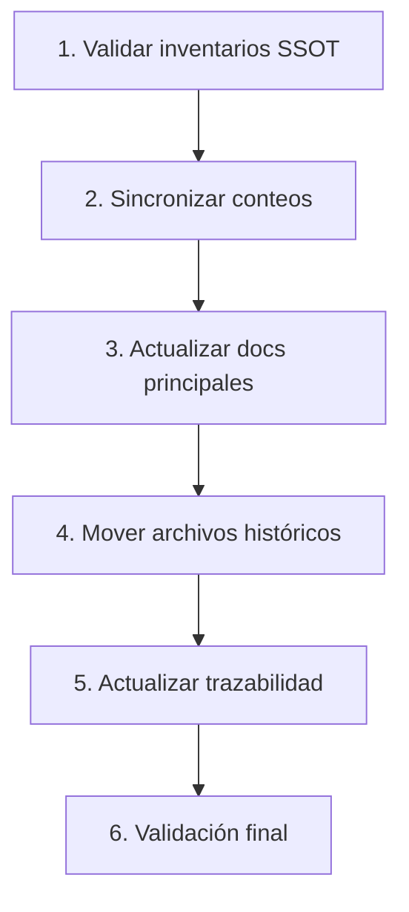

# PLAN DE ANÁLISIS Y ACTUALIZACIÓN DE DOCUMENTACIÓN - GAMILIT

**Fecha:** 2025-12-18
**Rol:** Requirements Analyst
**Proyecto:** GAMILIT
**Objetivo:** Auditar, limpiar y actualizar toda la documentación del proyecto

---

## RESUMEN EJECUTIVO

### Problema Identificado
La documentación del proyecto GAMILIT ha acumulado:
1. **Información histórica mezclada** con definiciones actuales
2. **Reportes de correcciones** dispersos que no reflejan el estado final
3. **Inconsistencias** entre diferentes fuentes de verdad (inventarios vs READMEs)
4. **Fechas desactualizadas** en múltiples documentos
5. **Duplicación de información** entre `docs/` y `orchestration/`

### Principio Rector
> **La documentación definitiva debe contener SOLO el estado actual del sistema.**
>
> Los históricos de cambios y correcciones solo deben existir en:
> - `orchestration/reportes/` - Para tracking de progresión
> - `orchestration/02-planeacion/` - Para planes de tareas ejecutadas

---

## FASE 1: PLANEACIÓN INICIAL - ANÁLISIS DETALLADO

### 1.1 Estructura de Documentación Identificada

```
docs/                                    # 476 archivos .md
├── 00-vision-general/                   # Visión y arquitectura
├── 01-fase-alcance-inicial/             # Fase 1 - Fundamentos MVP
├── 02-fase-robustecimiento/             # Fase 2 - BD Modular
├── 03-fase-extensiones/                 # Fase 3 - Features Enterprise
├── 04-fase-backlog/                     # Fase 4 - Backlog
├── 90-transversal/                      # Documentación transversal
├── 95-guias-desarrollo/                 # Guías
├── 96-quick-reference/                  # Referencias rápidas
├── 97-adr/                              # Architecture Decision Records
├── 98-standards/                        # Estándares
├── 99-finiquito/                        # Documentos de entrega
├── sistema-recompensas/                 # Implementación v2.3.0
├── student-portal/                      # Portal estudiante
├── database/                            # Documentación BD
└── frontend/                            # Especificaciones frontend

orchestration/                           # 390 archivos .md
├── 00-guidelines/                       # Directrices del proyecto
├── 01-analisis/                         # Análisis
├── 02-planeacion/                       # Planes de trabajo
├── 03-tareas/                           # Tareas específicas
├── 04-ejecucion-logs/                   # Logs de ejecución
├── 05-validaciones/                     # Validaciones pre/durante/post
├── 06-subagentes/                       # Contextos de subagentes
├── inventarios/                         # SSOT de componentes
├── reportes/                            # Reportes históricos
├── agentes/                             # Documentación de agentes
└── trazas/                              # Trazabilidad
```

### 1.2 Problemas Identificados

#### A) INCONSISTENCIAS NUMÉRICAS (CRÍTICO)

| Fuente | Tablas BD | Schemas | Endpoints | Componentes |
|--------|-----------|---------|-----------|-------------|
| docs/README.md | 101 | 14 | 125+ | 200+ |
| MASTER_INVENTORY.yml | 123 | 16 | 417 | 483 |
| CONTEXTO-PROYECTO.md | 101 | 14 | 125+ | N/A |
| DATABASE_INVENTORY.yml | 123 | 16 | N/A | N/A |

**Impacto:** Alta confusión sobre el estado real del sistema.

#### B) FECHAS DESACTUALIZADAS

| Documento | Fecha en doc | Fecha real |
|-----------|--------------|------------|
| docs/README.md | 2025-11-29 | 2025-12-18 |
| CONTEXTO-PROYECTO.md | N/A (sin fecha) | 2025-12-18 |
| Múltiples _MAP.md | Varias | Desactualizadas |

#### C) REPORTES DE CORRECCIONES MEZCLADOS

Archivos en `orchestration/reportes/` con información histórica que **NO** debe estar en docs definitiva:

```
orchestration/reportes/
├── HISTORIAL-CORRECCIONES-2025.md        # ✅ OK - es histórico
├── GAMIFICATION-CORRECTION-PLAN-*.md     # ✅ OK - plan
├── REPORTE-CORRECCIONES-*.md             # ✅ OK - reportes
└── COHERENCE-ANALYSIS-*.md               # ⚠️ Revisar - puede tener info definitiva

docs/90-transversal/
├── correcciones/                         # ❌ PROBLEMA - mover a orchestration/
├── archivos-historicos/                  # ⚠️ Revisar qué debe conservarse
└── gaps/                                 # ⚠️ Revisar si están cerrados
```

#### D) DUPLICACIÓN DE INFORMACIÓN

| Ubicación 1 | Ubicación 2 | Tipo |
|-------------|-------------|------|
| docs/90-transversal/inventarios/ | orchestration/inventarios/ | Inventarios |
| docs/90-transversal/arquitectura/ | docs/ARCHITECTURE.md | Arquitectura |
| docs/90-transversal/features/ | docs/03-fase-extensiones/ | Features |

### 1.3 Fuentes de Verdad (SSOT) Definidas

| Dominio | SSOT Oficial | Ubicación |
|---------|--------------|-----------|
| **Base de Datos** | DATABASE_INVENTORY.yml | orchestration/inventarios/ |
| **Backend** | BACKEND_INVENTORY.yml | orchestration/inventarios/ |
| **Frontend** | FRONTEND_INVENTORY.yml | orchestration/inventarios/ |
| **Seeds** | SEEDS_INVENTORY.yml | orchestration/inventarios/ |
| **Consolidado** | MASTER_INVENTORY.yml | orchestration/inventarios/ |
| **Contexto Proyecto** | CONTEXTO-PROYECTO.md | orchestration/00-guidelines/ |
| **Trazabilidad** | TRACEABILITY_MATRIX.yml | orchestration/inventarios/ |

---

## FASE 2: ÁREAS DE ANÁLISIS

### 2.1 Documentación a Analizar por Categoría

#### CATEGORÍA A: Inventarios (PRIORIDAD ALTA)

```yaml
archivos_a_analizar:
  - orchestration/inventarios/MASTER_INVENTORY.yml
  - orchestration/inventarios/DATABASE_INVENTORY.yml
  - orchestration/inventarios/BACKEND_INVENTORY.yml
  - orchestration/inventarios/FRONTEND_INVENTORY.yml
  - orchestration/inventarios/SEEDS_INVENTORY.yml
  - orchestration/inventarios/TRACEABILITY_MATRIX.yml

validaciones_requeridas:
  - Consistencia de conteos entre inventarios
  - Actualización de fechas
  - Eliminación de información histórica (solo estado actual)
```

#### CATEGORÍA B: Documentación de Fases (PRIORIDAD ALTA)

```yaml
archivos_a_analizar:
  - docs/README.md
  - docs/01-fase-alcance-inicial/README.md
  - docs/02-fase-robustecimiento/README.md
  - docs/03-fase-extensiones/README.md
  - docs/04-fase-backlog/README.md
  - Todos los _MAP.md de cada épica

validaciones_requeridas:
  - Estados de épicas correctos
  - Story points actualizados
  - Referencias a documentos existentes válidas
```

#### CATEGORÍA C: Documentación Transversal (PRIORIDAD MEDIA)

```yaml
archivos_a_analizar:
  - docs/90-transversal/**/*.md
  - docs/95-guias-desarrollo/**/*.md
  - docs/96-quick-reference/**/*.md

validaciones_requeridas:
  - Mover correcciones a orchestration/reportes/
  - Eliminar gaps ya cerrados
  - Actualizar guías con estado actual
```

#### CATEGORÍA D: Reportes Históricos (PRIORIDAD MEDIA)

```yaml
archivos_a_analizar:
  - orchestration/reportes/**/*.md
  - orchestration/agentes/**/*.md

validaciones_requeridas:
  - Clasificar en históricos vs información vigente
  - Crear índice de reportes
  - Mover información definitiva a docs/
```

#### CATEGORÍA E: Context/Guidelines (PRIORIDAD ALTA)

```yaml
archivos_a_analizar:
  - orchestration/00-guidelines/CONTEXTO-PROYECTO.md
  - orchestration/00-guidelines/HERENCIA-SIMCO.md
  - docs/ARCHITECTURE.md
  - docs/API.md
  - docs/DEPLOYMENT.md

validaciones_requeridas:
  - Sincronizar con inventarios
  - Actualizar stack tecnológico
  - Verificar paths y referencias
```

---

## FASE 3: PLAN DE IMPLEMENTACIÓN DE CORRECCIONES

### 3.1 Estructura de Correcciones Propuesta

```
Tipo de Corrección → Subagente Recomendado
─────────────────────────────────────────────
Actualización de inventarios → Database-Auditor / Backend-Auditor
Actualización de READMEs → Documentation-Validator
Reorganización de archivos → Workspace-Manager
Validación de coherencia → Architecture-Analyst
Actualización de trazas → Requirements-Analyst
```

### 3.2 Orden de Ejecución



---

## FASE 4: VALIDACIÓN DE DEPENDENCIAS

### 4.1 Matriz de Impacto

| Cambio Propuesto | Impacta a | Requiere Actualizar |
|------------------|-----------|---------------------|
| Actualizar conteo tablas | MASTER_INVENTORY, README, CONTEXTO | Todos los docs que citen número |
| Mover correcciones a orchestration | docs/90-transversal | Referencias internas |
| Actualizar fechas | Todos los _MAP.md | Headers de documentos |
| Sincronizar endpoints | BACKEND_INVENTORY | API.md, quick-reference |

### 4.2 Dependencias Identificadas

```yaml
dependencias:
  MASTER_INVENTORY:
    depende_de:
      - DATABASE_INVENTORY
      - BACKEND_INVENTORY
      - FRONTEND_INVENTORY
      - SEEDS_INVENTORY

  docs/README.md:
    depende_de:
      - MASTER_INVENTORY
      - Todos los README de fases

  CONTEXTO-PROYECTO.md:
    depende_de:
      - MASTER_INVENTORY
      - Stack tecnológico real (package.json)
```

---

## FASE 5: EJECUCIÓN

### 5.1 Subagentes a Utilizar

| Subagente | Tarea | Archivos |
|-----------|-------|----------|
| **Explore-Agent** | Identificar todos los archivos afectados | docs/**/*.md, orchestration/**/*.md |
| **Architecture-Analyst** | Validar coherencia entre capas | Inventarios vs código real |
| **Documentation-Validator** | Actualizar docs principales | README.md, _MAP.md |
| **Workspace-Manager** | Reorganizar archivos históricos | docs/90-transversal/ |

### 5.2 Checklist de Ejecución

```markdown
## Checklist FASE 5

### Inventarios
- [ ] DATABASE_INVENTORY.yml actualizado y validado
- [ ] BACKEND_INVENTORY.yml actualizado y validado
- [ ] FRONTEND_INVENTORY.yml actualizado y validado
- [ ] SEEDS_INVENTORY.yml actualizado y validado
- [ ] MASTER_INVENTORY.yml sincronizado

### Documentación Principal
- [ ] docs/README.md actualizado
- [ ] docs/ARCHITECTURE.md actualizado
- [ ] docs/API.md actualizado
- [ ] CONTEXTO-PROYECTO.md sincronizado

### Reorganización
- [ ] Correcciones movidas a orchestration/reportes/
- [ ] Gaps cerrados eliminados o actualizados
- [ ] Archivos históricos organizados

### Trazabilidad
- [ ] TRACEABILITY_MATRIX.yml actualizado
- [ ] Referencias internas validadas
- [ ] Enlaces rotos corregidos

### Validación Final
- [ ] Sin inconsistencias numéricas
- [ ] Fechas actualizadas (2025-12-18)
- [ ] Solo estado actual en docs definitiva
```

---

## SIGUIENTE PASO

Proceder con **FASE 2: Ejecución del análisis** utilizando subagentes especializados para:

1. **Explore-Agent**: Mapear todos los archivos que requieren actualización
2. **Architecture-Analyst**: Validar coherencia inventarios vs código real
3. **Generar reporte detallado** de discrepancias encontradas

---

**Creado por:** Requirements-Analyst
**Fecha:** 2025-12-18
**Versión:** 1.0
