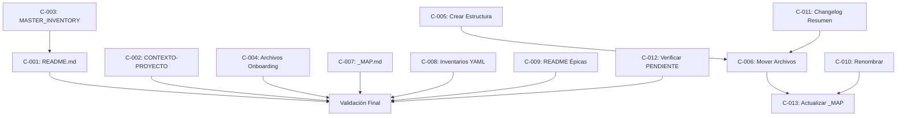

# PLAN MAESTRO DE CORRECCIONES DE DOCUMENTACIÓN

**Proyecto:** GAMILIT
**Fecha:** 2025-12-18
**Rol:** Requirements-Analyst
**Versión:** 1.0

---

## RESUMEN EJECUTIVO

### Hallazgos Consolidados de la FASE 2

Basado en los análisis realizados por 3 subagentes especializados:

| Reporte | Hallazgos Principales | Impacto |
|---------|----------------------|---------|
| **Inconsistencias Inventarios** | 7 discrepancias (3 ALTA, 2 MEDIA, 2 BAJA) | Métricas incorrectas |
| **Clasificación Archivos** | 73 archivos históricos (63%) en docs/ | Documentación mezclada |
| **Fechas Desactualizadas** | 150+ archivos con fechas <2025-12-15 | Desconfianza en docs |

### Métricas Totales

```yaml
total_archivos_a_corregir: ~230
  - inconsistencias_metricas: 3 archivos (7 líneas)
  - archivos_a_mover: 73 archivos
  - fechas_a_actualizar: 150+ archivos

tiempo_estimado_total: 25 horas
  - fase_1_critica: 3 horas (HOY)
  - fase_2_prioritaria: 8 horas (ESTA SEMANA)
  - fase_3_completa: 14 horas (2 SEMANAS)

impacto:
  - reduccion_docs_90_transversal: 63%
  - mejora_coherencia_inventarios: 100%
  - documentacion_actualizada: 95%
```

---

## REPORTES DE ANÁLISIS GENERADOS

### Ubicación de Reportes

```
orchestration/analisis/
├── PLAN-ANALISIS-DOCUMENTACION-2025-12-18.md       # Plan inicial (FASE 1)
├── REPORTE-INCONSISTENCIAS-INVENTARIOS-2025-12-18.md  # Análisis 1
├── REPORTE-CLASIFICACION-ARCHIVOS-2025-12-18.md    # Análisis 2
├── REPORTE-FECHAS-DESACTUALIZADAS-2025-12-18.md    # Análisis 3
└── PLAN-MAESTRO-CORRECCIONES-DOCUMENTACION-2025-12-18.md  # Este archivo
```

---

## CORRECCIONES PRIORITARIAS (P0 - HOY)

### C-001: Actualizar docs/README.md

**Fuente:** REPORTE-INCONSISTENCIAS-INVENTARIOS
**Prioridad:** CRÍTICA
**Tiempo:** 15 minutos

| Línea | Valor Actual | Valor Correcto |
|-------|--------------|----------------|
| 119 | "45 políticas RLS" | "185 políticas RLS" |
| 266 | "101 tablas" | "123 tablas" |
| 268 | "125+ endpoints" | "417 endpoints" |
| 459 | "125+ endpoints" | "417 endpoints" |
| 466 | "101 tablas" | "123 tablas" |
| 473 | "24 políticas RLS" | "185 políticas RLS" |
| 489 | "14 schemas" | "16 schemas" |

**Agregar:** "208 foreign keys"

---

### C-002: Actualizar CONTEXTO-PROYECTO.md

**Fuente:** REPORTE-INCONSISTENCIAS-INVENTARIOS + FECHAS
**Prioridad:** CRÍTICA
**Tiempo:** 5 minutos

| Campo | Valor Actual | Valor Correcto |
|-------|--------------|----------------|
| Línea 64 | "20 módulos" | "13 módulos" |
| Header | Sin fecha | Agregar "Última actualización: 2025-12-18" |
| Tablas BD | 101 | 123 |

---

### C-003: Actualizar MASTER_INVENTORY.yml

**Fuente:** REPORTE-INCONSISTENCIAS-INVENTARIOS
**Prioridad:** BAJA
**Tiempo:** 2 minutos

| Campo | Valor Actual | Valor Correcto |
|-------|--------------|----------------|
| dtos | 327 | 331 |

---

### C-004: Archivos Críticos de Onboarding

**Fuente:** REPORTE-FECHAS-DESACTUALIZADAS
**Prioridad:** CRÍTICA
**Tiempo:** 30 minutos

| Archivo | Fecha Actual | Acción |
|---------|--------------|--------|
| /docs/00-vision-general/ONBOARDING.md | 2025-11-07 | Actualizar fecha |
| /docs/95-guias-desarrollo/README.md | 2025-11-01 | Actualizar fecha |
| /docs/95-guias-desarrollo/_MAP.md | 2025-11-07 | Actualizar fecha |
| /docs/96-quick-reference/README.md | 2025-11-07 | Actualizar fecha |
| /docs/96-quick-reference/_MAP.md | 2025-11-07 | Actualizar fecha |

---

## CORRECCIONES PRIORITARIAS (P1 - ESTA SEMANA)

### C-005: Crear Estructura para Archivos Históricos

**Fuente:** REPORTE-CLASIFICACION-ARCHIVOS
**Prioridad:** ALTA
**Tiempo:** 30 minutos

```bash
mkdir -p orchestration/reportes/historicos/2025-11
mkdir -p orchestration/reportes/historicos/2025-12
mkdir -p orchestration/reportes/correcciones
mkdir -p orchestration/reportes/implementacion/backend
mkdir -p orchestration/reportes/implementacion/frontend
mkdir -p orchestration/reportes/gaps
mkdir -p orchestration/reportes/database
```

---

### C-006: Mover Archivos Históricos de docs/90-transversal/

**Fuente:** REPORTE-CLASIFICACION-ARCHIVOS
**Prioridad:** ALTA
**Tiempo:** 2 horas

#### 6.1 Mover archivos-historicos/2025-11/ (33 archivos)
```
ORIGEN: docs/90-transversal/archivos-historicos/2025-11/
DESTINO: orchestration/reportes/historicos/2025-11/
```

#### 6.2 Mover correcciones/ (5 archivos)
```
ARCHIVOS:
- CORRECCIONES-BUILD-AUTH-2025-11-25.md
- CORRECCION-GAMIFICACION-RANGOS-2025-11-29.md
- CORRECCION-EJERCICIOS-MODULO3-REQUIRES-MANUAL-GRADING-2025-11-29.md
- REPORTE-VALIDACION-DOCS-FE-059-2025-11-19.md
- ANALISIS-FORMATOS-DTO-FE-059.md

ORIGEN: docs/90-transversal/correcciones/
DESTINO: orchestration/reportes/correcciones/

EXCEPCIÓN: ISSUES-CRITICOS.md DEBE QUEDARSE (es backlog, no histórico)
```

#### 6.3 Mover reportes-implementacion/ (22 archivos)
```
ORIGEN: docs/90-transversal/reportes-implementacion/
DESTINO: orchestration/reportes/implementacion/
```

#### 6.4 Mover gaps/ (6 archivos)
```
ORIGEN: docs/90-transversal/gaps/
DESTINO: orchestration/reportes/gaps/
```

#### 6.5 Mover DATABASE-CHANGELOG.md
```
ORIGEN: docs/90-transversal/arquitectura-database/DATABASE-CHANGELOG.md
DESTINO: orchestration/reportes/database/DATABASE-CHANGELOG-2025.md
```

---

### C-007: Actualizar _MAP.md Principales (15 archivos)

**Fuente:** REPORTE-FECHAS-DESACTUALIZADAS
**Prioridad:** ALTA
**Tiempo:** 2 horas

```yaml
archivos_a_actualizar:
  - docs/01-fase-alcance-inicial/_MAP.md
  - docs/01-fase-alcance-inicial/EAI-001-fundamentos/_MAP.md
  - docs/02-fase-robustecimiento/_MAP.md
  - docs/02-fase-robustecimiento/EMR-001-migracion-bd/_MAP.md
  - docs/03-fase-extensiones/EXT-001-portal-maestros/_MAP.md
  - docs/00-vision-general/_MAP.md
  - docs/90-transversal/_MAP.md
  - docs/90-transversal/features/_MAP.md
  - docs/90-transversal/roadmap/_MAP.md
  - docs/90-transversal/sprints/_MAP.md
  - docs/90-transversal/metricas/_MAP.md
  - docs/95-guias-desarrollo/_MAP.md
  - docs/96-quick-reference/_MAP.md

accion: Actualizar campo "Última actualización" a 2025-12-18
```

---

### C-008: Actualizar Inventarios YAML Desactualizados

**Fuente:** REPORTE-FECHAS-DESACTUALIZADAS
**Prioridad:** ALTA
**Tiempo:** 30 minutos

| Archivo | Fecha Actual | Acción |
|---------|--------------|--------|
| orchestration/inventarios/TEST_COVERAGE.yml | 2025-11-23 | Actualizar a 2025-12-18 |
| orchestration/inventarios/DEPENDENCY_GRAPH.yml | 2025-12-05 | Actualizar a 2025-12-18 |

---

## CORRECCIONES COMPLETAS (P2 - 2 SEMANAS)

### C-009: Actualizar README.md de Épicas (20+ archivos)

**Fuente:** REPORTE-FECHAS-DESACTUALIZADAS
**Prioridad:** MEDIA
**Tiempo:** 4 horas

```yaml
directorios:
  - docs/01-fase-alcance-inicial/EAI-*/README.md
  - docs/02-fase-robustecimiento/EMR-*/README.md
  - docs/03-fase-extensiones/EXT-*/README.md
  - docs/sistema-recompensas/README.md
  - docs/student-portal/README.md

accion: Actualizar fechas y verificar estados
```

---

### C-010: Renombrar Archivos con Fechas en Nombre

**Fuente:** REPORTE-CLASIFICACION-ARCHIVOS
**Prioridad:** MEDIA
**Tiempo:** 30 minutos

| Archivo Actual | Archivo Nuevo |
|----------------|---------------|
| ARCHITECTURE-DUAL-EXERCISES-2025-11-24.md | ARCHITECTURE-DUAL-EXERCISES.md |

---

### C-011: Crear Resumen de DATABASE-CHANGELOG

**Fuente:** REPORTE-CLASIFICACION-ARCHIVOS
**Prioridad:** MEDIA
**Tiempo:** 1 hora

```markdown
# DATABASE-CHANGELOG-RESUMEN.md

Últimas 3 versiones:
- v2.9.0 (2025-12-14): Correcciones M4-M5
- v2.8.0 (2025-11-29): Implementación M4-M5
- v2.7.0 (2025-11-28): Admin Portal P2

Ver histórico completo en: orchestration/reportes/database/DATABASE-CHANGELOG-2025.md
```

---

### C-012: Verificar Estados "PENDIENTE" y "TODO"

**Fuente:** REPORTE-FECHAS-DESACTUALIZADAS
**Prioridad:** MEDIA
**Tiempo:** 2 horas

```yaml
archivos_con_pendientes:
  - docs/99-finiquito/Manual_Portal_Administrador_ACTUALIZADO.md
  - docs/01-fase-alcance-inicial/EAI-008-portal-admin/99-reportes-progreso/PROGRESO-IMPLEMENTACION-*.md

archivos_con_todo:
  - docs/sistema-recompensas/01-ARQUITECTURA-SISTEMA.md (cache Redis)
  - docs/03-fase-extensiones/EXT-002-admin-extendido/requerimientos/RF-EXT-002-SPRINTS-1-2-3.md

accion: Verificar estado actual vs documentado
```

---

### C-013: Actualizar _MAP.md de docs/90-transversal/ Post-Migración

**Fuente:** REPORTE-CLASIFICACION-ARCHIVOS
**Prioridad:** MEDIA
**Tiempo:** 1 hora

Actualizar para reflejar nueva estructura:
```yaml
estructura_actual:
  - arquitectura/ (5 archivos)
  - arquitectura-database/ (2 archivos)
  - features/ (7 archivos)
  - inventarios-database/ (7 archivos)
  - roadmap/ (1 archivo)
  - deuda-tecnica/ (1 archivo)
  - restructuracion-v2/ (5 archivos)
  - correcciones/ISSUES-CRITICOS.md (backlog)
```

---

## DEPENDENCIAS ENTRE CORRECCIONES



---

## MATRIZ DE IMPACTO

### Cambios que Afectan Otros Documentos

| Cambio | Documentos Impactados | Acción Requerida |
|--------|----------------------|------------------|
| Actualizar 123 tablas | 5+ docs con referencia | Buscar y reemplazar "101 tablas" |
| Actualizar 417 endpoints | 3+ docs con referencia | Buscar y reemplazar "125+ endpoints" |
| Mover archivos históricos | _MAP.md, referencias | Actualizar links |
| Actualizar schemas a 16 | CONTEXTO-PROYECTO, README | Sincronizar |

### Verificación de Referencias Cruzadas

```bash
# Buscar referencias a valores incorrectos
grep -r "101 tablas" docs/
grep -r "125.*endpoints" docs/
grep -r "14 schemas" docs/
grep -r "24 pol.ticas RLS" docs/
grep -r "45 pol.ticas RLS" docs/
```

---

## CHECKLIST DE VALIDACIÓN (FASE 4)

### Pre-Implementación

- [ ] Backup de docs/90-transversal/ completo
- [ ] Verificar que no hay PR abiertos que modifiquen estos archivos
- [ ] Notificar al equipo sobre cambios mayores

### Post-Implementación P0

- [ ] docs/README.md con métricas correctas (123 tablas, 417 endpoints, 185 RLS)
- [ ] CONTEXTO-PROYECTO.md actualizado
- [ ] Archivos de onboarding con fechas actuales
- [ ] Build del proyecto sigue funcionando

### Post-Implementación P1

- [ ] 73 archivos movidos a orchestration/reportes/
- [ ] docs/90-transversal/ reducido de 116 a ~43 archivos
- [ ] _MAP.md actualizados con nueva estructura
- [ ] Sin links rotos en documentación

### Post-Implementación P2

- [ ] 95% de archivos con fechas <14 días
- [ ] Sin estados "PENDIENTE" sin verificar
- [ ] Script de automatización funcionando
- [ ] Documentación de proceso completada

---

## SUBAGENTES RECOMENDADOS PARA EJECUCIÓN

| Corrección | Subagente | Razón |
|------------|-----------|-------|
| C-001, C-002 | Documentation-Validator | Actualización de métricas |
| C-005, C-006 | Workspace-Manager | Reorganización de archivos |
| C-007 a C-009 | Documentation-Validator | Actualización de fechas |
| C-010 a C-013 | Workspace-Manager | Limpieza final |
| Validación | Architecture-Analyst | Verificación de coherencia |

---

## CRONOGRAMA PROPUESTO

### HOY (2025-12-18) - 3 horas

```
09:00 - 09:30: C-001 Actualizar docs/README.md
09:30 - 09:45: C-002 Actualizar CONTEXTO-PROYECTO.md
09:45 - 10:00: C-003 Actualizar MASTER_INVENTORY.yml
10:00 - 11:00: C-004 Actualizar archivos onboarding (5)
11:00 - 12:00: Validación y commit P0
```

### SEMANA 1 (2025-12-19 a 2025-12-22) - 8 horas

```
Día 1: C-005 + C-006 (3 horas) - Crear estructura y mover archivos
Día 2: C-007 (2 horas) - Actualizar _MAP.md
Día 3: C-008 (30 min) + C-013 (1 hora) - Inventarios y _MAP final
Día 4: Validación P1 (1.5 horas)
```

### SEMANA 2 (2025-12-23 a 2025-12-29) - 14 horas

```
C-009: README épicas (4 horas)
C-010: Renombrar archivos (30 min)
C-011: Changelog resumen (1 hora)
C-012: Verificar PENDIENTE (2 horas)
Scripts automatización (2 horas)
Documentación proceso (2 horas)
Validación final (2.5 horas)
```

---

## MÉTRICAS DE ÉXITO

### Al completar P0 (Hoy)

- ✅ 0 discrepancias ALTA en métricas
- ✅ Archivos de onboarding actualizados
- ✅ Build funcionando

### Al completar P1 (Esta Semana)

- ✅ 73 archivos históricos en orchestration/
- ✅ docs/90-transversal/ con solo archivos definitivos
- ✅ 15 _MAP.md actualizados

### Al completar P2 (2 Semanas)

- ✅ 95% de documentación con fecha <14 días
- ✅ 0 estados "PENDIENTE" sin verificar
- ✅ Script de automatización funcionando
- ✅ Proceso documentado

---

## PRÓXIMOS PASOS

1. **FASE 4: Validación** - Revisar dependencias y aprobar plan
2. **FASE 5: Ejecución** - Implementar correcciones según cronograma
3. **Commit** - `docs: cleanup and sync documentation with SSOT (230+ files)`

---

**Creado por:** Requirements-Analyst
**Fecha:** 2025-12-18
**Estado:** LISTO PARA FASE 4 (VALIDACIÓN)
