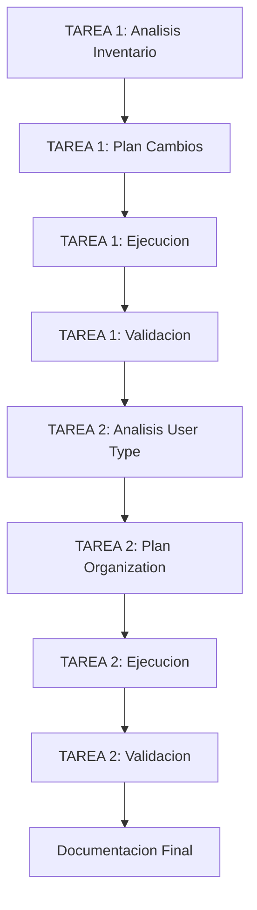

# PLAN DE ACTUALIZACIONES: Post-Correccion Teacher Portal

**Fecha:** 2026-01-07
**Proyecto:** Gamilit - Portal Teacher
**Generado por:** Claude Opus 4.5 (Orquestador)
**Ciclo CAPVED:** Contexto -> Analisis -> Planeacion -> Validacion -> Ejecucion -> Documentacion
**Plan Relacionado:** PLAN-CORRECCION-TEACHER-PAGES-2026-01-07.md

---

## 1. CONTEXTO (C)

### 1.1 Descripcion del Problema

Posterior a la correccion de las paginas Teacher (Classes y Monitoring), se identificaron dos tareas pendientes:

1. **Actualizar Inventario Frontend**: Documentar los cambios realizados en el changelog del inventario
2. **Agregar Organization al tipo User**: Preparar el frontend para soportar datos de organizacion cuando backend lo implemente

### 1.2 Vinculacion con Proyecto

| Campo | Valor |
|-------|-------|
| Proyecto | Gamilit |
| Modulo | Frontend - Auth Types & Documentation |
| Epic | EXT-001-portal-maestros |
| Prioridad | P1 - Alta |
| Dependencia | CORR-TEACHER-PAGES-001 |

### 1.3 Alcance

- **TAREA 1**: Actualizacion de FRONTEND_INVENTORY.yml
- **TAREA 2**: Modificacion de auth.types.ts (Organization interface)

---

## 2. ANALISIS (A)

### 2.1 TAREA 1: Actualizar Inventario Frontend

| Elemento | Descripcion |
|----------|-------------|
| Archivo | orchestration/inventarios/FRONTEND_INVENTORY.yml |
| Seccion | changelog (linea 1189+) |
| Formato | YAML estructurado |
| Cambio Requerido | Nueva entrada changelog + actualizar campo updated |

**Politica del Proyecto:**
- Todos los cambios significativos deben registrarse en el changelog
- Formato estandarizado con date, tarea_id, type, status, description, changes, files_modified

### 2.2 TAREA 2: Agregar Organization al tipo User

| Elemento | Descripcion |
|----------|-------------|
| Archivo | apps/frontend/src/features/auth/types/auth.types.ts |
| Interface Actual | User (linea 29-144) |
| Campos Existentes | tenantId, schoolId |
| Campo Faltante | organization (objeto completo) |

**Archivos Afectados que usan `user?.organization`:**
1. TeacherContentPage.tsx
2. TeacherReviewPanelPage.tsx
3. TeacherAlertsPage.tsx
4. TeacherProgressPage.tsx
5. TeacherReportsPage.tsx
6. TeacherResourcesPage.tsx
7. TeacherAnalyticsPage.tsx
8. TeacherStudentsPage.tsx
9. TeacherExerciseResponsesPage.tsx
10. TeacherAssignmentsPage.tsx
11. TeacherGamificationPage.tsx
12. TeacherDashboardPage.tsx

**Dependencia Backend:**
- UserResponseDto NO incluye organization actualmente
- Backend necesita modificar respuesta de auth para incluir datos del tenant

### 2.3 Impacto en Base de Datos

```yaml
impacto_database: NINGUNO
razon: Todos los cambios son 100% frontend/documentacion
requiere_migracion: false
requiere_recreacion_bd: false
cambios_esquema: 0
cambios_datos: 0
```

---

## 3. PLANEACION (P)

### 3.1 Orden de Ejecucion



### 3.2 Plan TAREA 1: Inventario Frontend

#### Cambio 1.1: Actualizar campo updated
- **Archivo**: FRONTEND_INVENTORY.yml
- **Linea**: 6
- **Cambio**: `updated: 2025-12-26` -> `updated: 2026-01-07`

#### Cambio 1.2: Agregar entrada changelog CORR-TEACHER-PAGES-001
- **Archivo**: FRONTEND_INVENTORY.yml
- **Ubicacion**: Despues de linea 1189 (changelog:)
- **Contenido**: Entrada completa con cambios de Teacher Pages

### 3.3 Plan TAREA 2: Organization Type

#### Cambio 2.1: Crear interface Organization
- **Archivo**: auth.types.ts
- **Ubicacion**: Despues del cierre de interface User (linea 144)
- **Campos**: id, name, slug, domain, logo_url

#### Cambio 2.2: Agregar campo organization a User
- **Archivo**: auth.types.ts
- **Ubicacion**: Dentro de User interface, despues de schoolId (linea 143)
- **Campo**: `organization?: Organization`

#### Cambio 2.3: Actualizar Inventario con IMPL-USER-ORGANIZATION-001
- **Archivo**: FRONTEND_INVENTORY.yml
- **Ubicacion**: Nueva entrada en changelog

---

## 4. VALIDACION (V)

### 4.1 Criterios de Validacion Pre-Ejecucion

| Criterio | Estado |
|----------|--------|
| Archivos existen en rutas especificadas | SI |
| Lineas coinciden con codigo actual | SI |
| Formato YAML valido para inventario | SI |
| Interface User existe y es modificable | SI |
| No hay conflictos con otros cambios | SI |

### 4.2 Criterios de Validacion Post-Ejecucion

| Criterio | Metodo de Verificacion |
|----------|------------------------|
| YAML syntax valida | `python3 -c "import yaml; yaml.safe_load(...)"` |
| TypeScript compila | `npx tsc --noEmit` |
| No errores en auth.types.ts | grep en salida de tsc |
| No errores de organization | grep en salida de tsc |

---

## 5. DEPENDENCIAS

### 5.1 Archivos Modificados

| Archivo | Ruta Completa |
|---------|---------------|
| FRONTEND_INVENTORY.yml | orchestration/inventarios/FRONTEND_INVENTORY.yml |
| auth.types.ts | apps/frontend/src/features/auth/types/auth.types.ts |

### 5.2 Dependencias de Backend (Documentadas)

| Componente | Estado | Descripcion |
|------------|--------|-------------|
| UserResponseDto | PENDIENTE | Debe incluir tenant data en auth response |
| TenantResponseDto | EXISTENTE | Estructura ya definida con campos necesarios |

### 5.3 Impacto en Base de Datos

```yaml
schemas_afectados: 0
tablas_afectadas: 0
migraciones_requeridas: 0
seeds_afectados: 0
scripts_recreate_afectados: NO
```

---

## 6. RIESGOS Y MITIGACION

| Riesgo | Probabilidad | Impacto | Mitigacion |
|--------|--------------|---------|------------|
| YAML syntax invalida | Baja | Alto | Validar con parser YAML |
| TypeScript errors nuevos | Baja | Medio | Verificar tsc --noEmit |
| Conflicto con tipos existentes | Baja | Medio | Verificar no existe Organization previo |

---

## 7. ESTIMACION

| Fase | Tiempo Estimado |
|------|-----------------|
| TAREA 1 Completa | 10 min |
| TAREA 2 Completa | 15 min |
| Documentacion | 20 min |
| **Total** | **45 min** |

---

**Estado del Plan:** APROBADO
**Fecha de Aprobacion:** 2026-01-07
**Siguiente Paso:** Ejecucion (E)
