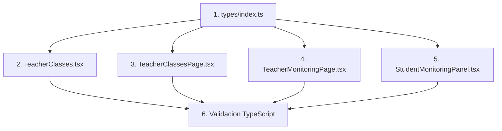

# PLAN DE CORRECCION: Teacher Portal - Pages Classes y Monitoring

**Fecha:** 2026-01-07
**Proyecto:** Gamilit - Portal Teacher
**Generado por:** Claude Opus 4.5 (Orquestador)
**Ciclo CAPVED:** Contexto -> Analisis -> Planeacion -> Validacion -> Ejecucion -> Documentacion

---

## 1. CONTEXTO (C)

### 1.1 Descripcion del Problema

Las paginas `/teacher/classes` y `/teacher/monitoring` del portal Teacher no funcionan correctamente debido a problemas de tipos TypeScript, props faltantes, y referencias a propiedades inexistentes.

### 1.2 Vinculacion con Proyecto

| Campo | Valor |
|-------|-------|
| Proyecto | Gamilit |
| Modulo | Teacher Portal (apps/frontend/src/apps/teacher) |
| Epic | EXT-001-portal-maestros |
| Prioridad | P0 - Critico |
| Impacto | Funcionalidad bloqueada para usuarios teacher |

### 1.3 Alcance

- **Pagina Classes**: `/teacher/classes` - Gestion de aulas
- **Pagina Monitoring**: `/teacher/monitoring` - Monitoreo en tiempo real de estudiantes

---

## 2. ANALISIS (A)

### 2.1 Problemas Identificados - Pagina Classes

| # | Problema | Archivo | Linea | Severidad |
|---|----------|---------|-------|-----------|
| 1 | Toast sin `title` requerido | TeacherClasses.tsx | 67 | Alta |
| 2 | Toast sin `title` requerido | TeacherClasses.tsx | 81 | Alta |
| 3 | Toast sin `title` requerido | TeacherClasses.tsx | 94 | Alta |
| 4 | `user?.organization?.name` inexistente | TeacherClassesPage.tsx | 25 | Alta |

### 2.2 Problemas Identificados - Pagina Monitoring

| # | Problema | Archivo | Linea | Severidad |
|---|----------|---------|-------|-----------|
| 1 | `classroomId` no pasado a modal | StudentMonitoringPanel.tsx | 617 | Critica |
| 2 | `user?.organization?.name` inexistente | TeacherMonitoringPage.tsx | 64 | Alta |
| 3 | `performanceLevel` no en tipo StudentFilter | types/index.ts | 271-279 | Media |
| 4 | Multiples casts `as any` innecesarios | StudentMonitoringPanel.tsx | 132,159,421,428,435 | Media |

### 2.3 Falsos Positivos Descartados

| Problema Reportado | Razon de Descarte |
|--------------------|-------------------|
| Layout duplicado | No existe - TeacherLayout ya maneja el layout |
| Loop infinito useCallback | No existe - dependencias correctas |
| Null en student_count | Tipo correcto en interfaz |
| Mapeo user_id a id | Ya implementado (CORR-2025-12-18) |
| Paginacion limite | Ya implementado (CORR-2025-12-18) |
| InputDetective className | Soportado via className prop |

### 2.4 Impacto en Base de Datos

```yaml
impacto_database: NINGUNO
razon: Todos los cambios son 100% frontend
requiere_migracion: false
requiere_recreacion_bd: false
cambios_esquema: 0
cambios_datos: 0
```

---

## 3. PLANEACION (P)

### 3.1 Orden de Ejecucion



### 3.2 Plan de Cambios Detallado

#### Cambio 1: types/index.ts
- **Accion**: Agregar `performanceLevel` a interface `StudentFilter`
- **Linea**: 279 (despues de `search?: string;`)
- **Codigo**:
```typescript
/** Performance level filter for client-side filtering */
performanceLevel?: ('high' | 'medium' | 'low')[];
```

#### Cambio 2: TeacherClasses.tsx (3 modificaciones)
- **Accion**: Agregar `title: 'Error'` a llamadas showToast
- **Lineas**: 67, 81, 94
- **Patron**:
```typescript
// ANTES:
showToast({ type: 'error', message: '...' });

// DESPUES:
showToast({ type: 'error', title: 'Error', message: '...' });
```

#### Cambio 3: TeacherClassesPage.tsx
- **Accion**: Cambiar referencia inexistente a valor fijo
- **Linea**: 25
- **Codigo**:
```typescript
// ANTES:
organizationName={user?.organization?.name || 'Mi Institucion'}

// DESPUES:
organizationName="Mi Institucion"
```

#### Cambio 4: TeacherMonitoringPage.tsx
- **Accion**: Cambiar referencia inexistente a valor fijo
- **Linea**: 64
- **Codigo**: Igual que Cambio 3

#### Cambio 5: StudentMonitoringPanel.tsx (7 modificaciones)
- **Accion A**: Agregar `classroomId` al modal (Linea 617)
- **Accion B**: Eliminar 6 casts `as any` (Lineas 132, 140, 159, 421, 428, 435)

---

## 4. VALIDACION (V)

### 4.1 Criterios de Validacion Pre-Ejecucion

| Criterio | Verificado |
|----------|------------|
| Archivos existen en rutas especificadas | SI |
| Lineas coinciden con codigo actual | SI |
| Imports necesarios disponibles | SI |
| No hay conflictos con otros cambios | SI |
| Cambios son minimos e invasivos | SI |

### 4.2 Criterios de Validacion Post-Ejecucion

| Criterio | Metodo de Verificacion |
|----------|------------------------|
| TypeScript compila sin errores | `npx tsc --noEmit` |
| No hay regresiones en archivos modificados | Grep errores en archivos especificos |
| Paginas renderizan correctamente | Test manual en navegador |
| Modal de notas funciona | Test con classroomId pasado |

---

## 5. DEPENDENCIAS

### 5.1 Archivos Modificados

| Archivo | Ruta Completa |
|---------|---------------|
| types/index.ts | apps/frontend/src/apps/teacher/types/index.ts |
| TeacherClasses.tsx | apps/frontend/src/apps/teacher/pages/TeacherClasses.tsx |
| TeacherClassesPage.tsx | apps/frontend/src/apps/teacher/pages/TeacherClassesPage.tsx |
| TeacherMonitoringPage.tsx | apps/frontend/src/apps/teacher/pages/TeacherMonitoringPage.tsx |
| StudentMonitoringPanel.tsx | apps/frontend/src/apps/teacher/components/monitoring/StudentMonitoringPanel.tsx |

### 5.2 Componentes Afectados Indirectamente

| Componente | Impacto |
|------------|---------|
| StudentDetailModal | Recibe classroomId (prop ya existente) |
| Toast | Sin cambios requeridos |
| TeacherLayout | Sin cambios requeridos |

### 5.3 Impacto en Base de Datos

```yaml
schemas_afectados: 0
tablas_afectadas: 0
migraciones_requeridas: 0
seeds_afectados: 0
scripts_recreate_afectados: NO
```

---

## 6. RIESGOS Y MITIGACION

| Riesgo | Probabilidad | Impacto | Mitigacion |
|--------|--------------|---------|------------|
| Regresion en otros componentes | Baja | Medio | Verificar TSC en archivos relacionados |
| Toast no muestra mensajes | Baja | Alto | Validar estructura ToastProps |
| Modal de notas sigue fallando | Baja | Alto | Verificar StudentDetailModal recibe classroomId |

---

## 7. ESTIMACION

| Fase | Tiempo Estimado |
|------|-----------------|
| Ejecucion de cambios | 10 min |
| Validacion TypeScript | 5 min |
| Documentacion | 15 min |
| **Total** | **30 min** |

---

**Estado del Plan:** APROBADO
**Fecha de Aprobacion:** 2026-01-07
**Siguiente Paso:** Ejecucion (E)
