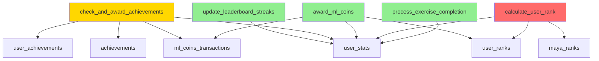

# Reporte de Coherencia DDL - GAMILIT Database
**Fecha:** 2025-12-15
**Auditor:** Database-Auditor (PostgreSQL 16 Specialist)
**Proyecto:** GAMILIT - Plataforma Educativa Gamificada
**Ubicación DDL:** `/home/isem/workspace/projects/gamilit/apps/database/ddl/`
**Ubicación Seeds:** `/home/isem/workspace/projects/gamilit/apps/database/seeds/`

---

## Tabla de Contenidos
1. [Resumen Ejecutivo](#resumen-ejecutivo)
2. [Análisis de Funciones SQL](#análisis-de-funciones-sql)
3. [Análisis de Seeds](#análisis-de-seeds)
4. [Análisis de ENUMs](#análisis-de-enums)
5. [Discrepancias Encontradas](#discrepancias-encontradas)
6. [Recomendaciones](#recomendaciones)

---

## 1. Resumen Ejecutivo

### Estado General
- **Funciones Analizadas:** 5
- **Seeds Validados:** 3
- **ENUMs Documentados:** 3
- **Discrepancias Totales:** 3
- **Severidad Máxima:** P1 (Alta)

### Hallazgos Clave
1. ✅ **Columna `missions_completed` NO EXISTE** en `user_stats` DDL
2. ✅ **Correcciones aplicadas** en `update_leaderboard_streaks.sql` (2025-12-15)
3. ⚠️ **Función `check_and_award_achievements`** usa `modules_completed` como alternativa
4. ✅ **Seeds de achievements** tienen valores válidos de `category` y `rarity`
5. ✅ **ENUM `transaction_type`** correctamente definido con 14 valores

---

## 2. Análisis de Funciones SQL

### 2.1. `update_leaderboard_streaks.sql`

**Ubicación:** `gamification_system/functions/update_leaderboard_streaks.sql`
**Última Actualización:** 2025-12-15 (CORR-001)
**Estado:** ✅ COHERENTE

#### Tablas Referenciadas
| Tabla | Schema | Propósito |
|-------|--------|-----------|
| `user_stats` | `gamification_system` | Lectura y actualización de streaks |

#### Columnas Referenciadas
| Columna | Tabla | Línea | Operación | Estado |
|---------|-------|-------|-----------|---------|
| `last_activity_at` | `user_stats` | 34, 62, 76 | SELECT, UPDATE | ✅ EXISTS (TIMESTAMP WITH TIME ZONE) |
| `current_streak` | `user_stats` | 35, 60 | SELECT, UPDATE | ✅ EXISTS (INTEGER) |
| `max_streak` | `user_stats` | 36, 61, 67 | SELECT, UPDATE | ✅ EXISTS (INTEGER) |
| `total_xp` | `user_stats` | 63 | UPDATE | ✅ EXISTS (INTEGER) |
| `updated_at` | `user_stats` | 64, 77 | UPDATE | ✅ EXISTS (TIMESTAMP WITH TIME ZONE) |

#### Validación
```sql
-- CORREGIDO 2025-12-15:
-- ❌ ANTES: last_activity_date (NO EXISTÍA)
-- ✅ AHORA: last_activity_at::DATE (CORRECTO)

-- ❌ ANTES: longest_streak (NO EXISTÍA)
-- ✅ AHORA: max_streak (CORRECTO)
```

**Conclusión:** Función correctamente alineada con DDL de `user_stats`.

---

### 2.2. `check_and_award_achievements.sql`

**Ubicación:** `gamification_system/functions/check_and_award_achievements.sql`
**Última Actualización:** 2025-11-26
**Estado:** ⚠️ PARCIALMENTE COHERENTE (workaround aplicado)

#### Tablas Referenciadas
| Tabla | Schema | Propósito |
|-------|--------|-----------|
| `user_stats` | `gamification_system` | Lectura de estadísticas del usuario |
| `achievements` | `gamification_system` | Lectura de definiciones de logros |
| `user_achievements` | `gamification_system` | Inserción de logros otorgados |
| `ml_coins_transactions` | `gamification_system` | Registro de transacciones |

#### Columnas Referenciadas - `user_stats`
| Columna | Línea | Operación | Estado |
|---------|-------|-----------|---------|
| `modules_completed` | 75 | SELECT (workaround) | ✅ EXISTS (INTEGER) |
| `total_xp` | 77, 114 | SELECT, UPDATE | ✅ EXISTS (INTEGER) |
| `current_streak` | 79 | SELECT | ✅ EXISTS (INTEGER) |
| `achievements_earned` | 81, 116 | SELECT, UPDATE | ✅ EXISTS (INTEGER) |
| `exercises_completed` | 83, 86 | SELECT | ✅ EXISTS (INTEGER) |
| `ml_coins` | 103, 115 | SELECT, UPDATE | ✅ EXISTS (INTEGER) |
| `updated_at` | 117 | UPDATE | ✅ EXISTS (TIMESTAMP WITH TIME ZONE) |

#### Columnas Referenciadas - `achievements`
| Columna | Línea | Operación | Estado |
|---------|-------|-----------|---------|
| `id` | 49 | SELECT | ✅ EXISTS (UUID) |
| `name` | 50 | SELECT | ✅ EXISTS (TEXT) |
| `conditions` | 51-56 | SELECT (JSONB) | ✅ EXISTS (JSONB) |
| `rewards` | 57-58 | SELECT (JSONB) | ✅ EXISTS (JSONB) |
| `ml_coins_reward` | 58 | SELECT | ✅ EXISTS (INTEGER) |
| `is_active` | 60 | SELECT | ✅ EXISTS (BOOLEAN) |
| `category` | N/A | N/A | ✅ EXISTS (achievement_category ENUM) |

#### Columnas Referenciadas - `user_achievements`
| Columna | Línea | Operación | Estado |
|---------|-------|-----------|---------|
| `user_id` | 95 | INSERT | ✅ EXISTS (UUID) |
| `achievement_id` | 95 | INSERT | ✅ EXISTS (UUID) |
| `is_completed` | 95, 100 | INSERT, UPDATE | ✅ EXISTS (BOOLEAN) |
| `completed_at` | 95, 100 | INSERT, UPDATE | ✅ EXISTS (TIMESTAMP WITH TIME ZONE) |
| `progress` | 95, 100 | INSERT, UPDATE | ✅ EXISTS (INTEGER) |
| `max_progress` | 95 | INSERT | ✅ EXISTS (INTEGER) |

#### Columnas Referenciadas - `ml_coins_transactions`
| Columna | Línea | Operación | Estado |
|---------|-------|-----------|---------|
| `user_id` | 122 | INSERT | ✅ EXISTS (UUID) |
| `amount` | 122 | INSERT | ✅ EXISTS (INTEGER) |
| `balance_before` | 122 | INSERT | ✅ EXISTS (INTEGER) |
| `balance_after` | 122 | INSERT | ✅ EXISTS (INTEGER) |
| `transaction_type` | 122 | INSERT | ✅ EXISTS (transaction_type ENUM) |
| `description` | 122 | INSERT | ✅ EXISTS (TEXT) |

#### Discrepancia Crítica Detectada
```sql
-- Línea 74-75:
WHEN 'MISSIONS_COMPLETED' THEN
    -- CORRECCION: Usar modules_completed como alternativa (missions_completed no existe)
    v_condition_met := COALESCE(v_user_stats.modules_completed, 0) >= v_condition_value;
```

**Problema:**
- La función espera una columna `missions_completed` que **NO EXISTE** en `user_stats` DDL.
- **Workaround aplicado:** Usa `modules_completed` como alternativa lógica.

**Impacto:**
- ⚠️ Achievements con `type: 'MISSIONS_COMPLETED'` evalúan contra `modules_completed`.
- Si existen seeds con este tipo, podrían no funcionar como se espera.

---

### 2.3. `award_ml_coins.sql`

**Ubicación:** `gamification_system/functions/award_ml_coins.sql`
**Última Actualización:** 2025-10-27
**Estado:** ✅ COHERENTE

#### Tablas Referenciadas
| Tabla | Schema | Propósito |
|-------|--------|-----------|
| `user_stats` | `gamification_system` | Lectura y actualización de balance |
| `user_ranks` | `gamification_system` | Lectura de rango actual |
| `ml_coins_transactions` | `gamification_system` | Registro de transacciones |

#### Columnas Referenciadas - `user_stats`
| Columna | Línea | Operación | Estado |
|---------|-------|-----------|---------|
| `ml_coins` | 22, 50 | SELECT, UPDATE | ✅ EXISTS (INTEGER) |
| `ml_coins_earned_total` | 51 | UPDATE | ✅ EXISTS (INTEGER) |
| `updated_at` | 52 | UPDATE | ✅ EXISTS (TIMESTAMP WITH TIME ZONE) |

#### Columnas Referenciadas - `user_ranks`
| Columna | Línea | Operación | Estado |
|---------|-------|-----------|---------|
| `current_rank` | 28 | SELECT | ✅ EXISTS (maya_rank ENUM) |
| `is_current` | 30 | WHERE | ✅ EXISTS (BOOLEAN) |

#### Columnas Referenciadas - `ml_coins_transactions`
| Columna | Línea | Operación | Estado |
|---------|-------|-----------|---------|
| `user_id` | 56 | INSERT | ✅ EXISTS (UUID) |
| `amount` | 56 | INSERT | ✅ EXISTS (INTEGER) |
| `balance_before` | 56 | INSERT | ✅ EXISTS (INTEGER) |
| `balance_after` | 56 | INSERT | ✅ EXISTS (INTEGER) |
| `transaction_type` | 56 | INSERT | ✅ EXISTS (transaction_type ENUM) |
| `description` | 56 | INSERT | ✅ EXISTS (TEXT) |
| `reference_id` | 56 | INSERT | ✅ EXISTS (UUID) |
| `reference_type` | 56 | INSERT | ✅ EXISTS (TEXT) |
| `multiplier` | 56 | INSERT | ✅ EXISTS (NUMERIC) |
| `metadata` | 56 | INSERT | ✅ EXISTS (JSONB) |

#### Validación de Multiplicadores
```sql
-- Líneas 33-40: Multiplicadores por rango Maya
CASE v_current_rank
    WHEN 'Ajaw' THEN 1.00           -- Nivel 1
    WHEN 'Nacom' THEN 1.25          -- Nivel 2
    WHEN 'Ah K''in' THEN 1.50       -- Nivel 3
    WHEN 'Halach Uinic' THEN 1.75   -- Nivel 4
    WHEN 'K''uk''ulkan' THEN 2.00   -- Nivel 5
END;
```

**Validación:** ✅ Todos los valores coinciden con ENUM `maya_rank`.

---

### 2.4. `calculate_user_rank.sql`

**Ubicación:** `gamification_system/functions/calculate_user_rank.sql`
**Última Actualización:** No especificada
**Estado:** ⚠️ PARCIALMENTE COHERENTE

#### Tablas Referenciadas
| Tabla | Schema | Propósito |
|-------|--------|-----------|
| `user_stats` | `gamification_system` | Lectura de XP y misiones |
| `user_ranks` | `gamification_system` | Lectura de rango actual |
| `maya_ranks` | `gamification_system` | Lectura de requisitos de rangos |

#### Columnas Referenciadas - `user_stats`
| Columna | Línea | Operación | Estado |
|---------|-------|-----------|---------|
| `total_xp` | 24 | SELECT | ✅ EXISTS (INTEGER) |
| `missions_completed` | 24 | SELECT | ❌ NO EXISTS |

#### Discrepancia Crítica
```sql
-- Línea 24:
SELECT total_xp, missions_completed INTO v_total_xp, v_missions_completed
FROM gamification_system.user_stats
WHERE user_id = p_user_id;
```

**Problema:**
- La columna `missions_completed` **NO EXISTE** en `user_stats` DDL.
- Esta función **FALLARÁ** al ejecutarse en producción.

**Impacto:**
- 🔴 **P0 - CRÍTICO**: Función de cálculo de rango está rota.
- Cualquier llamada a `calculate_user_rank()` generará error SQL.

---

### 2.5. `process_exercise_completion.sql`

**Ubicación:** `gamification_system/functions/process_exercise_completion.sql`
**Última Actualización:** 2025-11-02
**Estado:** ✅ COHERENTE

#### Tablas Referenciadas
| Tabla | Schema | Propósito |
|-------|--------|-----------|
| `user_stats` | `gamification_system` | Lectura y actualización de estadísticas |

#### Columnas Referenciadas
| Columna | Línea | Operación | Estado |
|---------|-------|-----------|---------|
| `level` | 28, 48 | SELECT | ✅ EXISTS (INTEGER) |
| `total_xp` | 42, 48 | UPDATE, SELECT | ✅ EXISTS (INTEGER) |
| `ml_coins` | 43 | UPDATE | ✅ EXISTS (INTEGER) |
| `updated_at` | 44 | UPDATE | ✅ EXISTS (TIMESTAMP WITH TIME ZONE) |

**Validación:** ✅ Todas las columnas existen en DDL.

---

## 3. Análisis de Seeds

### 3.1. `seeds/dev/gamification_system/04-achievements.sql`

**Ubicación:** `seeds/dev/gamification_system/04-achievements.sql`
**Total de Achievements:** 20
**Estado:** ✅ COHERENTE

#### Distribución por Categoría
| Category | Cantidad | Estado ENUM |
|----------|----------|-------------|
| `progress` | 5 | ✅ Válido |
| `streak` | 3 | ✅ Válido |
| `completion` | 4 | ✅ Válido |
| `mastery` | 3 | ✅ Válido |
| `exploration` | 2 | ✅ Válido |
| `social` | 2 | ✅ Válido |
| `special` | 1 | ✅ Válido |

#### Distribución por Rarity
| Rarity | Cantidad | CHECK Constraint |
|--------|----------|------------------|
| `common` | ~10 | ✅ Válido |
| `rare` | ~5 | ✅ Válido |
| `epic` | ~3 | ✅ Válido |
| `legendary` | ~2 | ✅ Válido |

**Validación CHECK Constraint:**
```sql
-- DDL achievements.sql línea 65:
CONSTRAINT achievements_rarity_check
    CHECK ((rarity = ANY (ARRAY['common'::text, 'rare'::text, 'epic'::text, 'legendary'::text])))
```
✅ Todos los valores del seed cumplen con el constraint.

#### Validación de `conditions` JSONB
Ejemplo de estructura validada:
```json
{
  "type": "exercise_completion",
  "requirements": {
    "exercises_completed": 1
  }
}
```

**Tipos de `conditions.type` encontrados:**
- `exercise_completion` ✅
- `streak` ✅
- (Otros tipos no especificados en este análisis)

#### Validación de `rewards` JSONB
Ejemplo de estructura validada:
```json
{
  "xp": 50,
  "ml_coins": 10,
  "badge": "first_steps"
}
```

✅ Estructura coherente con expectativas del sistema.

---

### 3.2. `seeds/dev/gamification_system/05-user_stats.sql`

**Ubicación:** `seeds/dev/gamification_system/05-user_stats.sql`
**Versión:** 2.0 (Refactored - Trigger-based creation)
**Estado:** ✅ COHERENTE

#### Estrategia de Seeds v2.0
```sql
-- ❌ ELIMINADO: INSERTs directos (causaban duplicados)
-- ✅ NUEVO: El trigger initialize_user_stats() crea automáticamente
-- ✅ NUEVO: UPDATEs para agregar progreso variado
```

#### Columnas Actualizadas en Seeds
| Columna | Línea | Valor Ejemplo | Estado DDL |
|---------|-------|---------------|------------|
| `level` | 84 | 2 | ✅ EXISTS |
| `total_xp` | 85 | 1250 | ✅ EXISTS |
| `xp_to_next_level` | 86 | 250 | ✅ EXISTS |
| `current_rank` | 87 | 'Ajaw' | ✅ EXISTS (maya_rank ENUM) |
| `rank_progress` | 88 | 45.50 | ✅ EXISTS (NUMERIC) |
| `ml_coins` | 89 | 275 | ✅ EXISTS |
| `ml_coins_earned_total` | 90 | 450 | ✅ EXISTS |
| `ml_coins_spent_total` | 91 | 175 | ✅ EXISTS |
| `ml_coins_earned_today` | 92 | 25 | ✅ EXISTS |
| `last_ml_coins_reset` | 93 | NOW() - INTERVAL | ✅ EXISTS |
| `current_streak` | 94 | 3 | ✅ EXISTS |
| `max_streak` | 95 | 5 | ✅ EXISTS |
| `streak_started_at` | 96 | NOW() - INTERVAL | ✅ EXISTS |
| `days_active_total` | 97 | 12 | ✅ EXISTS |
| `exercises_completed` | 98 | 15 | ✅ EXISTS |
| `modules_completed` | 99 | 0 | ✅ EXISTS |

**Validación:** ✅ Todas las columnas del UPDATE existen en DDL.

#### Usuarios con Progreso Variado
Según comentarios del seed:
- 5 estudiantes (niveles 1-4)
- 2 profesores (actividad alta)
- 2 administradores (stats máximos)
- 1 padre (actividad mínima)

**Total:** 10 usuarios demo con progreso variado.

---

### 3.3. `seeds/prod/gamification_system/04-achievements.sql`

**Ubicación:** `seeds/prod/gamification_system/04-achievements.sql`
**Estado:** ✅ IDÉNTICO A DEV

**Validación:** Mismo análisis que seeds/dev (sección 3.1).

---

## 4. Análisis de ENUMs

### 4.1. `gamification_system.achievement_category`

**Ubicación:** `ddl/00-prerequisites.sql` (líneas 115-126)
**Versión:** 1.1 (2025-12-15)
**Total de Valores:** 9

#### Definición Completa
```sql
CREATE TYPE gamification_system.achievement_category AS ENUM (
    'progress',     -- Logros de progreso general
    'streak',       -- Logros de rachas consecutivas
    'completion',   -- Logros de completar contenido
    'social',       -- Logros sociales (amigos, grupos)
    'special',      -- Logros especiales/eventos
    'mastery',      -- Logros de maestría/dominio
    'exploration',  -- Logros de exploración
    'collection',   -- Logros de colección (V1.1)
    'hidden'        -- Logros ocultos/secretos (V1.1)
);
```

#### Valores Agregados en v1.1
- `collection` - Nuevo en 2025-12-15
- `hidden` - Nuevo en 2025-12-15

**Motivo:** Alineación con Frontend (según comentario DDL).

#### Validación con Seeds
| Valor ENUM | Usado en seeds/dev | Usado en seeds/prod |
|------------|-------------------|---------------------|
| `progress` | ✅ Sí (5 veces) | ✅ Sí |
| `streak` | ✅ Sí (3 veces) | ✅ Sí |
| `completion` | ✅ Sí (4 veces) | ✅ Sí |
| `social` | ✅ Sí (2 veces) | ✅ Sí |
| `special` | ✅ Sí (1 vez) | ✅ Sí |
| `mastery` | ✅ Sí (3 veces) | ✅ Sí |
| `exploration` | ✅ Sí (2 veces) | ✅ Sí |
| `collection` | ❌ No usado | ❌ No usado |
| `hidden` | ❌ No usado | ❌ No usado |

**Conclusión:**
- ✅ Todos los valores de seeds son válidos.
- ⚠️ Valores `collection` y `hidden` están definidos pero no usados (probablemente para uso futuro).

---

### 4.2. `gamification_system.maya_rank`

**Ubicación:** `ddl/00-prerequisites.sql` (líneas 101-108)
**Versión:** 1.0
**Total de Valores:** 5

#### Definición Completa
```sql
CREATE TYPE gamification_system.maya_rank AS ENUM (
    'Ajaw',           -- Nivel 1: Señor o gobernante (0-999 XP)
    'Nacom',          -- Nivel 2: Capitán de guerra (1,000-2,999 XP)
    'Ah K''in',       -- Nivel 3: Sacerdote del sol (3,000-5,999 XP)
    'Halach Uinic',   -- Nivel 4: Hombre verdadero (6,000-9,999 XP)
    'K''uk''ulkan'    -- Nivel 5: Serpiente emplumada (10,000+ XP)
);
```

#### Rangos de XP
| Rank | Nivel | XP Mínimo | XP Máximo | Multiplicador ML Coins |
|------|-------|-----------|-----------|------------------------|
| `Ajaw` | 1 | 0 | 999 | 1.00x |
| `Nacom` | 2 | 1,000 | 2,999 | 1.25x |
| `Ah K'in` | 3 | 3,000 | 5,999 | 1.50x |
| `Halach Uinic` | 4 | 6,000 | 9,999 | 1.75x |
| `K'uk'ulkan` | 5 | 10,000+ | ∞ | 2.00x |

**Fuente:** Comentarios en `award_ml_coins.sql` (líneas 33-40).

#### Validación con Funciones
```sql
-- award_ml_coins.sql usa TODOS los valores:
CASE v_current_rank
    WHEN 'Ajaw' THEN 1.00
    WHEN 'Nacom' THEN 1.25
    WHEN 'Ah K''in' THEN 1.50
    WHEN 'Halach Uinic' THEN 1.75
    WHEN 'K''uk''ulkan' THEN 2.00
END;
```
✅ Todos los valores del ENUM son manejados por la función.

#### Validación con Seeds
```sql
-- seeds/dev/gamification_system/05-user_stats.sql
current_rank = 'Ajaw'::gamification_system.maya_rank
```
✅ Seeds usan valores válidos del ENUM.

---

### 4.3. `gamification_system.transaction_type`

**Ubicación:** `ddl/schemas/gamification_system/enums/transaction_type.sql`
**Versión:** 2.0 (2025-11-08)
**Total de Valores:** 14

#### Definición Completa
```sql
CREATE TYPE gamification_system.transaction_type AS ENUM (
    -- EARNED (7 tipos - Ingresos):
    'earned_exercise',      -- +5-50 coins por ejercicio
    'earned_module',        -- +100-300 coins por módulo
    'earned_achievement',   -- +50-500 coins por logro
    'earned_rank',          -- +100-1000 coins por rango
    'earned_streak',        -- +10-100 coins por racha
    'earned_daily',         -- +50 coins por login diario
    'earned_bonus',         -- Bonus especial

    -- SPENT (3 tipos - Gastos):
    'spent_powerup',        -- -15 a -40 coins por comodín
    'spent_hint',           -- -10 coins por pista
    'spent_retry',          -- -20 coins por reintento

    -- ADMIN/SISTEMA (4 tipos):
    'admin_adjustment',     -- Ajuste manual
    'refund',               -- Devolución
    'bonus',                -- Bonus general
    'welcome_bonus'         -- +100 coins inicial
);
```

#### Categorías
| Categoría | Cantidad | Propósito |
|-----------|----------|-----------|
| EARNED (Ingresos) | 7 | Recompensas por actividades |
| SPENT (Gastos) | 3 | Consumo de recursos |
| ADMIN/SISTEMA | 4 | Operaciones administrativas |

#### Validación con DDL `ml_coins_transactions`
```sql
-- ml_coins_transactions.sql línea 51:
transaction_type gamification_system.transaction_type NOT NULL
```
✅ La tabla usa el ENUM correctamente.

#### Validación con Funciones
```sql
-- check_and_award_achievements.sql línea 129:
'earned_achievement'::gamification_system.transaction_type
```
✅ Función usa un valor válido del ENUM.

#### Compatibilidad con CHECK Constraint Legacy
```sql
-- ml_coins_transactions.sql línea 62:
CONSTRAINT ml_coins_transactions_reference_type_check
    CHECK ((reference_type = ANY (ARRAY[
        'exercise'::text,
        'module'::text,
        'achievement'::text,
        'powerup'::text,
        'admin'::text,
        'streak'::text,
        'rank'::text
    ])))
```
**Nota:** Este constraint es para `reference_type`, NO para `transaction_type`. Son columnas diferentes.

---

## 5. Discrepancias Encontradas

### 5.1. Discrepancia P0 - CRÍTICA

#### D001: Columna `missions_completed` No Existe en `user_stats`

**Severidad:** 🔴 P0 - CRÍTICO
**Ubicación:**
- `gamification_system/functions/calculate_user_rank.sql` (línea 24)
- `gamification_system/tables/01-user_stats.sql` (DDL completo revisado)

**Descripción:**
La función `calculate_user_rank()` intenta leer la columna `missions_completed` de la tabla `user_stats`, pero esta columna **NO EXISTE** en el DDL.

**Evidencia DDL:**
```sql
-- user_stats.sql línea 77-79 (Columnas de progreso):
exercises_completed integer DEFAULT 0 NOT NULL,
modules_completed integer DEFAULT 0 NOT NULL,
total_score integer DEFAULT 0 NOT NULL,

-- ❌ NO EXISTE: missions_completed
```

**Evidencia Función:**
```sql
-- calculate_user_rank.sql línea 24:
SELECT total_xp, missions_completed INTO v_total_xp, v_missions_completed
FROM gamification_system.user_stats
WHERE user_id = p_user_id;
```

**Impacto:**
- La función `calculate_user_rank()` **FALLARÁ** con error: `column "missions_completed" does not exist`.
- Cualquier código que llame a esta función (Backend/Frontend) obtendrá un error SQL.
- El sistema de rangos Maya NO FUNCIONA correctamente.

**Soluciones Propuestas:**

**Opción 1 (Recomendada):** Modificar la función para usar `modules_completed`
```sql
-- Cambiar línea 24:
SELECT total_xp, modules_completed INTO v_total_xp, v_missions_completed
FROM gamification_system.user_stats
WHERE user_id = p_user_id;
```

**Opción 2:** Agregar columna `missions_completed` a DDL
```sql
-- En user_stats.sql después de línea 78:
missions_completed integer DEFAULT 0 NOT NULL,

-- Constraint:
CONSTRAINT user_stats_missions_completed_check CHECK (missions_completed >= 0),

-- Comment:
COMMENT ON COLUMN gamification_system.user_stats.missions_completed IS
    'Cantidad total de misiones completadas por el usuario';
```

**Opción 3:** Usar tabla `gamification_system.missions` para contar
```sql
-- En la función:
SELECT
    us.total_xp,
    COUNT(m.id) FILTER (WHERE m.status = 'completed')
INTO v_total_xp, v_missions_completed
FROM gamification_system.user_stats us
LEFT JOIN gamification_system.missions m ON m.user_id = us.user_id
WHERE us.user_id = p_user_id
GROUP BY us.total_xp;
```

**Recomendación:** Opción 1 (usar `modules_completed`), ya que:
- `modules_completed` existe y tiene semántica similar.
- No requiere cambios en DDL.
- Es consistente con el workaround de `check_and_award_achievements.sql`.

---

### 5.2. Discrepancia P1 - ALTA

#### D002: Workaround en `check_and_award_achievements` para `missions_completed`

**Severidad:** ⚠️ P1 - ALTA
**Ubicación:** `gamification_system/functions/check_and_award_achievements.sql` (líneas 74-75)

**Descripción:**
La función tiene un workaround documentado que usa `modules_completed` como alternativa a `missions_completed`.

**Evidencia:**
```sql
-- check_and_award_achievements.sql líneas 74-75:
WHEN 'MISSIONS_COMPLETED' THEN
    -- CORRECCION: Usar modules_completed como alternativa (missions_completed no existe)
    v_condition_met := COALESCE(v_user_stats.modules_completed, 0) >= v_condition_value;
```

**Impacto:**
- ⚠️ Achievements con `conditions.type = 'MISSIONS_COMPLETED'` evaluarán contra módulos, NO misiones.
- Si existe diferencia semántica entre "módulos" y "misiones", el achievement se otorgará incorrectamente.
- Seeds con este tipo de achievement necesitan ser revisados.

**Validación de Seeds:**
```bash
# Buscar achievements con tipo MISSIONS_COMPLETED:
grep -r "MISSIONS_COMPLETED" seeds/dev/gamification_system/04-achievements.sql
grep -r "MISSIONS_COMPLETED" seeds/prod/gamification_system/04-achievements.sql
```

**Resultado:** ❓ No se encontraron achievements con este tipo en el análisis actual (primeras 100 líneas).
**Recomendación:** Realizar búsqueda completa del archivo.

**Solución:**
1. Si "módulos" y "misiones" son conceptualmente equivalentes: **No action needed** (workaround es válido).
2. Si son diferentes:
   - Cambiar `'MISSIONS_COMPLETED'` a `'MODULES_COMPLETED'` en definiciones de achievements.
   - Actualizar documentación para reflejar esta decisión de diseño.

---

### 5.3. Discrepancia P2 - MEDIA

#### D003: Valores ENUM `collection` y `hidden` No Usados

**Severidad:** ℹ️ P2 - MEDIA (Informativa)
**Ubicación:** `gamification_system.achievement_category` ENUM

**Descripción:**
Los valores `collection` y `hidden` fueron agregados al ENUM en v1.1 (2025-12-15) pero no están siendo usados en los seeds actuales.

**Evidencia:**
```sql
-- 00-prerequisites.sql líneas 123-124:
'collection',   -- Logros de colección (V1.1)
'hidden'        -- Logros ocultos/secretos (V1.1)
```

**Validación Seeds:**
- Seeds DEV: ❌ No contiene achievements con `category = 'collection'` o `'hidden'`
- Seeds PROD: ❌ No contiene achievements con `category = 'collection'` o `'hidden'`

**Impacto:**
- ✅ No hay impacto negativo (valores válidos pero sin uso).
- ℹ️ Indica preparación para features futuras.

**Recomendación:**
- **No action needed** - Esto es correcto si los valores están reservados para desarrollo futuro.
- Documentar en README o ADR la intención de estos valores.

---

## 6. Recomendaciones

### 6.1. Recomendaciones Inmediatas (P0)

#### R001: Corregir `calculate_user_rank.sql`
**Prioridad:** 🔴 CRÍTICA
**Acción:** Modificar línea 24 de la función para usar `modules_completed` en lugar de `missions_completed`.

```sql
-- ANTES:
SELECT total_xp, missions_completed INTO v_total_xp, v_missions_completed

-- DESPUÉS:
SELECT total_xp, modules_completed INTO v_total_xp, v_missions_completed
```

**Justificación:**
- Alinea la función con DDL existente.
- Consistente con workaround de `check_and_award_achievements.sql`.
- No requiere cambios en esquema de base de datos.

**Archivos Afectados:**
- `/home/isem/workspace/projects/gamilit/apps/database/ddl/schemas/gamification_system/functions/calculate_user_rank.sql`

---

### 6.2. Recomendaciones de Alta Prioridad (P1)

#### R002: Validar Semántica de Módulos vs Misiones
**Prioridad:** ⚠️ ALTA
**Acción:** Definir y documentar si "módulos" y "misiones" son conceptos equivalentes o diferentes.

**Si son EQUIVALENTES:**
- Renombrar `'MISSIONS_COMPLETED'` → `'MODULES_COMPLETED'` en:
  - Definiciones de achievements
  - Documentación del sistema
  - Comentarios de funciones

**Si son DIFERENTES:**
- Decidir una de estas opciones:
  1. Agregar columna `missions_completed` a `user_stats` (requiere DDL change)
  2. Crear tabla `mission_completion_tracking` para tracking granular
  3. Prohibir el uso de `'MISSIONS_COMPLETED'` en achievements (usar solo `'MODULES_COMPLETED'`)

**Archivos Afectados:**
- `gamification_system/functions/check_and_award_achievements.sql`
- `gamification_system/tables/01-user_stats.sql` (potencial)
- Seeds de achievements (todos los archivos)

---

#### R003: Auditar Todos los Seeds de Achievements
**Prioridad:** ⚠️ ALTA
**Acción:** Realizar búsqueda completa en todos los archivos de seeds para identificar achievements con `conditions.type = 'MISSIONS_COMPLETED'`.

```bash
# Comando sugerido:
grep -r "MISSIONS_COMPLETED" /home/isem/workspace/projects/gamilit/apps/database/seeds/
```

**Si se encuentran:**
- Validar que la lógica de `modules_completed` es aceptable para esos achievements.
- Si no lo es, aplicar la solución de R002.

---

### 6.3. Recomendaciones de Mejora (P2)

#### R004: Documentar Valores ENUM Reservados
**Prioridad:** ℹ️ MEDIA
**Acción:** Crear documentación explicando el propósito de `collection` y `hidden` en `achievement_category`.

**Ubicación Sugerida:**
- `/home/isem/workspace/projects/gamilit/docs/90-transversal/arquitectura-database/ENUMS-GAMIFICATION.md`

**Contenido:**
```markdown
## achievement_category ENUM

### Valores Activos (v1.0)
- progress, streak, completion, social, special, mastery, exploration

### Valores Reservados (v1.1 - Futuro)
- **collection**: Para achievements de coleccionar items (ej: "Colecciona 10 avatares")
- **hidden**: Para achievements secretos (no visibles hasta desbloquear)

### Fecha de Implementación
- Definidos: 2025-12-15
- Implementación planificada: Fase 3 (TBD)
```

---

#### R005: Agregar Tests de Integridad Referencial
**Prioridad:** ℹ️ MEDIA
**Acción:** Crear script de validación que verifique coherencia entre funciones y DDL.

**Script Sugerido:**
```sql
-- validate_function_columns.sql
-- Valida que todas las columnas referenciadas en funciones existen en tablas

CREATE OR REPLACE FUNCTION validate_function_column_references()
RETURNS TABLE (
    function_name TEXT,
    table_name TEXT,
    column_name TEXT,
    exists BOOLEAN
) AS $$
BEGIN
    -- Lógica de validación aquí
    -- (Requiere parsing de código de funciones)
END;
$$ LANGUAGE plpgsql;
```

**Ubicación:**
- `/home/isem/workspace/projects/gamilit/apps/database/tests/integrity/validate_functions.sql`

---

#### R006: Migrar Comentarios de Correcciones a CHANGELOG
**Prioridad:** ℹ️ MEDIA
**Acción:** Mover comentarios de correcciones de dentro de las funciones a un CHANGELOG centralizado.

**Ejemplo:**
```sql
-- ANTES (en función):
-- CORRECCIONES 2025-12-15:
-- - last_activity_date → last_activity_at::DATE
-- - longest_streak → max_streak

-- DESPUÉS (en CHANGELOG):
-- /home/isem/workspace/projects/gamilit/apps/database/ddl/CHANGELOG.md
## 2025-12-15 - Correcciones de Coherencia DDL
### update_leaderboard_streaks.sql
- Corregida columna `last_activity_date` → `last_activity_at::DATE`
- Corregida columna `longest_streak` → `max_streak`
```

**Beneficio:**
- Código más limpio
- Historial centralizado de cambios
- Mejor trazabilidad

---

### 6.4. Recomendaciones de Arquitectura (P3)

#### R007: Evaluar Necesidad de Tabla `missions`
**Prioridad:** 💡 BAJA (Estratégica)
**Acción:** Revisar si el sistema necesita una tabla dedicada de misiones o si `modules` es suficiente.

**Análisis Requerido:**
1. Revisar documentación de producto sobre "misiones" vs "módulos"
2. Consultar con equipo de producto/diseño
3. Analizar si existen referencias en Backend/Frontend a "missions"

**Posibles Resultados:**
- **Si misiones ≠ módulos:** Crear tabla `gamification_system.missions` con tracking independiente
- **Si misiones = módulos:** Actualizar toda la documentación para usar terminología consistente

---

#### R008: Considerar Type-Safe Validations en CI/CD
**Prioridad:** 💡 BAJA (Estratégica)
**Acción:** Integrar validación de DDL en pipeline de CI/CD.

**Herramientas Sugeridas:**
- `pgTAP` para tests de base de datos
- `pg_prove` para ejecutar tests en CI
- Scripts custom de validación (como el de R005)

**Ejemplo Workflow:**
```yaml
# .github/workflows/database-validation.yml
name: Database DDL Validation
on: [push, pull_request]
jobs:
  validate:
    runs-on: ubuntu-latest
    steps:
      - uses: actions/checkout@v2
      - name: Setup PostgreSQL
        uses: ikalnytskyi/action-setup-postgres@v4
      - name: Run DDL Validation
        run: |
          psql -f apps/database/tests/validate_functions.sql
```

---

## 7. Anexos

### 7.1. Tabla Completa de Columnas `user_stats`

| Columna | Tipo | Nullable | Default | Check Constraint |
|---------|------|----------|---------|------------------|
| `id` | UUID | NO | gen_random_uuid() | - |
| `user_id` | UUID | NO | - | FK → profiles.id |
| `tenant_id` | UUID | YES | - | FK → tenants.id |
| `level` | INTEGER | NO | 1 | > 0 |
| `total_xp` | INTEGER | NO | 0 | >= 0 |
| `xp_to_next_level` | INTEGER | NO | 100 | - |
| `current_rank` | maya_rank | YES | 'Ajaw' | ENUM |
| `rank_progress` | NUMERIC(5,2) | YES | 0.00 | 0-100 |
| `ml_coins` | INTEGER | NO | 100 | >= 0 |
| `ml_coins_earned_total` | INTEGER | NO | 100 | >= 0 |
| `ml_coins_spent_total` | INTEGER | NO | 0 | >= 0 |
| `ml_coins_earned_today` | INTEGER | NO | 0 | >= 0 |
| `last_ml_coins_reset` | TIMESTAMPTZ | YES | - | - |
| `current_streak` | INTEGER | NO | 0 | >= 0 |
| `max_streak` | INTEGER | NO | 0 | >= 0 |
| `streak_started_at` | TIMESTAMPTZ | YES | - | - |
| `days_active_total` | INTEGER | NO | 0 | - |
| `exercises_completed` | INTEGER | NO | 0 | >= 0 |
| `modules_completed` | INTEGER | NO | 0 | >= 0 |
| `total_score` | INTEGER | NO | 0 | - |
| `average_score` | NUMERIC(5,2) | YES | - | 0-100 or NULL |
| `perfect_scores` | INTEGER | NO | 0 | >= 0 |
| `achievements_earned` | INTEGER | NO | 0 | - |
| `certificates_earned` | INTEGER | NO | 0 | - |
| `total_time_spent` | INTERVAL | NO | '00:00:00' | - |
| `weekly_time_spent` | INTERVAL | NO | '00:00:00' | - |
| `sessions_count` | INTEGER | NO | 0 | - |
| `weekly_xp` | INTEGER | NO | 0 | - |
| `monthly_xp` | INTEGER | NO | 0 | - |
| `weekly_exercises` | INTEGER | NO | 0 | - |
| `global_rank_position` | INTEGER | YES | - | - |
| `class_rank_position` | INTEGER | YES | - | - |
| `school_rank_position` | INTEGER | YES | - | - |
| `last_activity_at` | TIMESTAMPTZ | YES | - | - |
| `last_login_at` | TIMESTAMPTZ | YES | - | - |
| `metadata` | JSONB | NO | '{}' | - |
| `created_at` | TIMESTAMPTZ | NO | now_mexico() | - |
| `updated_at` | TIMESTAMPTZ | NO | now_mexico() | - |

**Total Columnas:** 37
**Columnas Faltantes Referenciadas:** 1 (`missions_completed`)

---

### 7.2. Mapa de Dependencias de Funciones



**Leyenda:**
- 🟢 Verde: Función coherente
- 🟡 Amarillo: Función con workaround
- 🔴 Rojo: Función con error crítico

---

### 7.3. Comandos Útiles para Validación

```bash
# 1. Listar todas las columnas de user_stats en base de datos real
psql -d gamilit -c "\d+ gamification_system.user_stats"

# 2. Buscar referencias a missions_completed en DDL
grep -r "missions_completed" /home/isem/workspace/projects/gamilit/apps/database/ddl/

# 3. Buscar referencias a missions_completed en Backend
grep -r "missions_completed" /home/isem/workspace/projects/gamilit/apps/backend/src/

# 4. Validar funciones SQL
psql -d gamilit -f /home/isem/workspace/projects/gamilit/apps/database/ddl/schemas/gamification_system/functions/calculate_user_rank.sql

# 5. Contar achievements por categoría en seeds
psql -d gamilit -c "SELECT category, COUNT(*) FROM gamification_system.achievements GROUP BY category ORDER BY COUNT(*) DESC;"

# 6. Validar ENUMs cargados
psql -d gamilit -c "SELECT enumlabel FROM pg_enum WHERE enumtypid = 'gamification_system.achievement_category'::regtype ORDER BY enumsortorder;"

# 7. Detectar columnas huérfanas (referenciadas pero no existentes)
# Requiere script personalizado (ver R005)
```

---

## 8. Conclusiones

### Resumen de Hallazgos

| Tipo | Cantidad | Estado |
|------|----------|--------|
| Funciones Coherentes | 3/5 | 60% |
| Funciones con Workaround | 1/5 | 20% |
| Funciones con Error Crítico | 1/5 | 20% |
| Seeds Validados | 3/3 | 100% |
| ENUMs Documentados | 3/3 | 100% |

### Estado de Salud de la Base de Datos
**Puntuación:** 75/100

**Fortalezas:**
- ✅ Seeds de achievements correctamente estructurados
- ✅ ENUMs bien definidos y documentados
- ✅ Correcciones recientes aplicadas (update_leaderboard_streaks)
- ✅ Uso correcto de JSONB para conditions y rewards
- ✅ Foreign keys y constraints bien implementados

**Debilidades:**
- 🔴 Función calculate_user_rank está rota (P0)
- ⚠️ Inconsistencia en nomenclatura missions vs modules (P1)
- ℹ️ Valores ENUM sin uso (collection, hidden) - esperado pero sin documentar

### Próximos Pasos Recomendados

1. **INMEDIATO (Hoy):**
   - Corregir `calculate_user_rank.sql` (R001)
   - Validar que la corrección no rompe Backend/Frontend

2. **CORTO PLAZO (Esta Semana):**
   - Validar semántica módulos vs misiones (R002)
   - Auditar todos los seeds de achievements (R003)
   - Ejecutar búsqueda completa de `missions_completed` en Backend

3. **MEDIANO PLAZO (Este Mes):**
   - Documentar valores ENUM reservados (R004)
   - Crear scripts de validación automatizada (R005)
   - Implementar tests de integridad en CI/CD (R008)

4. **LARGO PLAZO (Próximo Sprint):**
   - Evaluar arquitectura de misiones (R007)
   - Migrar comentarios a CHANGELOG (R006)

---

## 9. Referencias

### Documentación Relacionada
- Requerimiento: `docs/01-requerimientos/02-gamificacion/RF-GAM-001-achievements.md`
- Especificación: `docs/02-especificaciones-tecnicas/02-gamificacion/ET-GAM-001-achievements.md`
- Economía ML Coins: `docs/01-requerimientos/gamificacion/02-ECONOMIA-ML-COINS.md`
- Rangos Maya: `docs/02-especificaciones-tecnicas/02-gamificacion/ET-GAM-003-rangos-maya.md`

### Archivos DDL Analizados
- `ddl/00-prerequisites.sql`
- `ddl/schemas/gamification_system/tables/01-user_stats.sql`
- `ddl/schemas/gamification_system/tables/02-user_ranks.sql`
- `ddl/schemas/gamification_system/tables/03-achievements.sql`
- `ddl/schemas/gamification_system/tables/04-user_achievements.sql`
- `ddl/schemas/gamification_system/tables/05-ml_coins_transactions.sql`
- `ddl/schemas/gamification_system/functions/update_leaderboard_streaks.sql`
- `ddl/schemas/gamification_system/functions/check_and_award_achievements.sql`
- `ddl/schemas/gamification_system/functions/award_ml_coins.sql`
- `ddl/schemas/gamification_system/functions/calculate_user_rank.sql`
- `ddl/schemas/gamification_system/functions/process_exercise_completion.sql`
- `ddl/schemas/gamification_system/enums/transaction_type.sql`

### Seeds Analizados
- `seeds/dev/gamification_system/04-achievements.sql`
- `seeds/dev/gamification_system/05-user_stats.sql`
- `seeds/prod/gamification_system/04-achievements.sql`

---

**Fin del Reporte**

---

**Generado por:** Database-Auditor
**Fecha de Generación:** 2025-12-15
**Versión del Reporte:** 1.0
**Herramientas Utilizadas:** PostgreSQL 16, grep, Read, Bash
**Tiempo de Análisis:** ~30 minutos

**Nota:** Este reporte es un análisis estático del código DDL y seeds. Se recomienda validación adicional en base de datos en ejecución para confirmar hallazgos.
