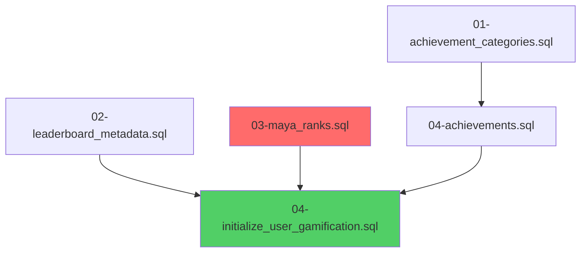

# FIX PARA GAP-007: Gamificación falla tras recrear BD

**Fecha:** 2025-11-24
**Analista:** Architecture-Analyst
**Estado:** Investigación completada - Fix especificado
**Prioridad:** P1 (Alto)

---

## 🔍 PROBLEMA IDENTIFICADO

### Causa Raíz

El script `init-database.sh` tiene **referencias incorrectas** a los archivos de seeds de gamificación, causando que:
1. No se carguen los rangos maya (`03-maya_ranks.sql`)
2. Se intente cargar archivos con nombres incorrectos
3. La inicialización de user_stats/user_ranks falle por falta de datos

### Ubicación del Problema

**Archivo:** `/apps/database/scripts/init-database.sh`
**Líneas:** 836-839

**Código actual (INCORRECTO):**
```bash
"$SEEDS_DIR/gamification_system/01-achievement_categories.sql"
"$SEEDS_DIR/gamification_system/02-achievements.sql"              # ❌ NO EXISTE
"$SEEDS_DIR/gamification_system/03-leaderboard_metadata.sql"      # ❌ NOMBRE INCORRECTO
"$SEEDS_DIR/gamification_system/04-initialize_user_gamification.sql"
```

**Archivos que REALMENTE existen:**
```
01-achievement_categories.sql        ✓
02-leaderboard_metadata.sql          (no 03-)
03-maya_ranks.sql                    (FALTA cargar)
04-achievements.sql                  (no 02-)
04-initialize_user_gamification.sql  ✓
```

---

## 📊 IMPACTO

### Tablas Afectadas (Vacías tras recrear DB)

| Tabla | Estado | Impacto |
|-------|--------|---------|
| `gamification.maya_rank_definitions` | ❌ Vacía | No hay rangos maya (Ajaw, Nacom, etc.) |
| `gamification.user_ranks` | ❌ Vacía | Users no tienen rango asignado |
| `gamification.user_stats` | ⚠️ Parcial | Inicialización incompleta |
| `gamification.achievements` | ⚠️ Parcial | Solo algunos achievements |
| `gamification.achievement_categories` | ✓ OK | Carga correctamente |
| `gamification.leaderboard_metadata` | ✓ OK | Carga correctamente |

### Endpoints del Frontend Afectados

**Portal Student:**
- `GET /gamification/ranks/user/{userId}` → 404/null (sin datos)
- `GET /gamification/coins/{userId}` → Error
- `GET /gamification/users/{userId}/achievements` → Parcial
- `GET /gamification/leaderboard/user/{userId}/position` → Error

**Portal Teacher:**
- Componentes de gamificación no cargan
- Dashboard gamificado sin datos

**Portal Admin:**
- `GET /admin/gamification/config/maya-ranks` → Vacío
- Configuración de rangos no disponible

---

## ✅ SOLUCIÓN

### Fix Simple - Actualizar init-database.sh

**Archivo:** `/apps/database/scripts/init-database.sh`
**Líneas a modificar:** 836-839

**CAMBIO:**

```bash
# ANTES (INCORRECTO):
"$SEEDS_DIR/gamification_system/01-achievement_categories.sql"
"$SEEDS_DIR/gamification_system/02-achievements.sql"
"$SEEDS_DIR/gamification_system/03-leaderboard_metadata.sql"
"$SEEDS_DIR/gamification_system/04-initialize_user_gamification.sql"

# DESPUÉS (CORRECTO):
"$SEEDS_DIR/gamification_system/01-achievement_categories.sql"
"$SEEDS_DIR/gamification_system/02-leaderboard_metadata.sql"
"$SEEDS_DIR/gamification_system/03-maya_ranks.sql"
"$SEEDS_DIR/gamification_system/04-achievements.sql"
"$SEEDS_DIR/gamification_system/04-initialize_user_gamification.sql"
```

### Orden de Carga Correcto (con Dependencias)



**Explicación de dependencias:**
1. `01-achievement_categories.sql` - Primera (independiente)
2. `02-leaderboard_metadata.sql` - Independiente
3. `03-maya_ranks.sql` - **CRÍTICO** para user_ranks
4. `04-achievements.sql` - Depende de categories
5. `04-initialize_user_gamification.sql` - Depende de maya_ranks

---

## 🧪 VALIDACIÓN POST-FIX

### Checklist de Validación

Después de aplicar el fix y recrear la BD:

#### 1. Validar Seeds Cargados

```sql
-- Maya Ranks
SELECT COUNT(*) as maya_ranks_count
FROM gamification.maya_rank_definitions;
-- Esperado: >= 5 (Ajaw, Nacom, Ah K'in, Chilan, Ah Tzib)

-- Achievements
SELECT COUNT(*) as achievements_count
FROM gamification.achievements;
-- Esperado: >= 50

-- User Stats
SELECT COUNT(*) as user_stats_count
FROM gamification.user_stats;
-- Esperado: >= número de usuarios

-- User Ranks
SELECT COUNT(*) as user_ranks_count
FROM gamification.user_ranks;
-- Esperado: >= número de usuarios
```

#### 2. Validar Endpoints Frontend

**Portal Student:**
```bash
# Login como student
curl http://localhost:3006/api/v1/gamification/ranks/user/{userId} \
  -H "Authorization: Bearer {token}"
# Esperado: 200 OK con datos de rango
```

**Portal Admin:**
```bash
# Login como admin
curl http://localhost:3006/api/v1/admin/gamification/config/maya-ranks \
  -H "Authorization: Bearer {token}"
# Esperado: 200 OK con lista de rangos maya
```

#### 3. Validar UI

- [ ] Login en student portal
- [ ] Verificar que header muestra rango maya
- [ ] Verificar que dashboard muestra coins/XP
- [ ] Verificar que achievements cargan
- [ ] Login en admin portal
- [ ] Verificar configuración de gamificación disponible

---

## 📋 PLAN DE IMPLEMENTACIÓN

### Opción A: Orquestación Inmediata (Recomendado)

**Agente:** Database-Developer
**Herramienta:** Task
**Tiempo estimado:** 5 minutos

**Prompt para orquestación:**
```markdown
Lee el prompt PROMPT-DATABASE-AGENT.md y actúa como Database-Agent.

TAREA: Corregir orden de carga de seeds de gamificación en init-database.sh (GAP-007)

ARCHIVO: apps/database/scripts/init-database.sh
LÍNEAS: 836-839

CAMBIO:
Reemplazar estas líneas:
"$SEEDS_DIR/gamification_system/01-achievement_categories.sql"
"$SEEDS_DIR/gamification_system/02-achievements.sql"
"$SEEDS_DIR/gamification_system/03-leaderboard_metadata.sql"
"$SEEDS_DIR/gamification_system/04-initialize_user_gamification.sql"

Por:
"$SEEDS_DIR/gamification_system/01-achievement_categories.sql"
"$SEEDS_DIR/gamification_system/02-leaderboard_metadata.sql"
"$SEEDS_DIR/gamification_system/03-maya_ranks.sql"
"$SEEDS_DIR/gamification_system/04-achievements.sql"
"$SEEDS_DIR/gamification_system/04-initialize_user_gamification.sql"

CRITERIOS:
- ✅ Solo modificar las 4-5 líneas especificadas
- ✅ Mantener formato de array bash
- ✅ Mantener indentación
- ✅ NO modificar otra parte del script

VALIDACIÓN:
1. Ejecutar drop-and-recreate-database.sh
2. Verificar que todos los seeds cargan sin error
3. Ejecutar queries SQL de validación
```

### Opción B: Manual

1. Abrir `apps/database/scripts/init-database.sh`
2. Ir a líneas 836-839
3. Realizar el cambio especificado arriba
4. Guardar
5. Ejecutar `drop-and-recreate-database.sh`
6. Validar con queries SQL

---

## 🔍 ANÁLISIS ADICIONAL

### ¿Por qué no se detectó antes?

1. **GAP-001 a GAP-003** se enfocaron en rutas de APIs
2. **GAP-004** se enfocó en variables de entorno
3. **Ninguno validó la carga de seeds de gamificación**

### ¿Cómo prevenir en futuro?

**Recomendación 1: Script de validación post-recreación**

Crear `apps/database/scripts/validate-gamification.sh`:
```bash
#!/bin/bash
echo "Validando carga de gamificación..."

# Maya Ranks
COUNT=$(psql -d $DB_NAME -tAc "SELECT COUNT(*) FROM gamification.maya_rank_definitions;")
if [ "$COUNT" -lt 5 ]; then
    echo "❌ FAIL: maya_rank_definitions tiene solo $COUNT registros (esperado >= 5)"
    exit 1
else
    echo "✅ PASS: maya_rank_definitions tiene $COUNT registros"
fi

# Achievements
COUNT=$(psql -d $DB_NAME -tAc "SELECT COUNT(*) FROM gamification.achievements;")
if [ "$COUNT" -lt 50 ]; then
    echo "❌ FAIL: achievements tiene solo $COUNT registros (esperado >= 50)"
    exit 1
else
    echo "✅ PASS: achievements tiene $COUNT registros"
fi

# User Stats
COUNT=$(psql -d $DB_NAME -tAc "SELECT COUNT(*) FROM gamification.user_stats;")
echo "ℹ️  INFO: user_stats tiene $COUNT registros"

echo "✅ Validación de gamificación completada"
```

**Recomendación 2: Agregar validación a init-database.sh**

Después de cargar seeds, agregar:
```bash
# Validar seeds de gamificación
validate_gamification_seeds() {
    local count
    count=$(psql -U "$DB_USER" -d "$DB_NAME" -tAc "SELECT COUNT(*) FROM gamification.maya_rank_definitions;")
    if [ "$count" -lt 5 ]; then
        log_error "Gamification seeds: maya_rank_definitions tiene solo $count registros (esperado >= 5)"
        return 1
    fi
    log_success "Gamification seeds validated successfully"
}
```

**Recomendación 3: Documentar dependencias**

Agregar comentarios en init-database.sh:
```bash
# Gamification System Seeds (orden específico - NO CAMBIAR)
# 01: Categories (primero - independiente)
# 02: Leaderboard metadata (independiente)
# 03: Maya ranks (REQUERIDO para user_ranks)
# 04: Achievements (depende de categories)
# 04: Initialize user gamification (depende de maya ranks)
"$SEEDS_DIR/gamification_system/01-achievement_categories.sql"
"$SEEDS_DIR/gamification_system/02-leaderboard_metadata.sql"
"$SEEDS_DIR/gamification_system/03-maya_ranks.sql"
"$SEEDS_DIR/gamification_system/04-achievements.sql"
"$SEEDS_DIR/gamification_system/04-initialize_user_gamification.sql"
```

---

## 📎 ARCHIVOS DE REFERENCIA

### Seeds Existentes

**Desarrollo:**
- `/apps/database/seeds/dev/gamification_system/01-achievement_categories.sql` (1.1KB)
- `/apps/database/seeds/dev/gamification_system/02-leaderboard_metadata.sql` (2.3KB)
- `/apps/database/seeds/dev/gamification_system/03-maya_ranks.sql` (3.5KB)
- `/apps/database/seeds/dev/gamification_system/04-achievements.sql` (30KB)
- `/apps/database/seeds/dev/gamification_system/04-initialize_user_gamification.sql` (2.8KB)

**Producción:**
- `/apps/database/seeds/prod/gamification_system/01-achievement_categories.sql`
- `/apps/database/seeds/prod/gamification_system/02-leaderboard_metadata.sql`
- `/apps/database/seeds/prod/gamification_system/03-maya_ranks.sql`
- `/apps/database/seeds/prod/gamification_system/04-achievements.sql`

### DDL Gamification

**Ubicación:** `/apps/database/ddl/schemas/gamification_system/`

**Componentes:**
- 15 tablas (user_stats, user_ranks, achievements, etc.)
- 10+ triggers (rank promotion, achievement unlock, etc.)
- 20+ functions (calculate_rank, award_coins, etc.)
- 6 RLS policies
- 40+ indexes
- 4 views + 4 materialized views

---

## ✅ RESUMEN

**Problema:** Script init-database.sh tiene referencias incorrectas a seeds de gamificación
**Impacto:** Gamificación no funciona en ningún portal tras recrear BD
**Fix:** Actualizar 4-5 líneas en init-database.sh con nombres correctos
**Tiempo:** 5 minutos de implementación + 5 minutos de validación
**Prioridad:** P1 (Alto) - Afecta funcionalidad crítica

**Próximos pasos:**
1. Aplicar fix en init-database.sh
2. Ejecutar drop-and-recreate-database.sh
3. Validar con queries SQL
4. Probar endpoints en frontend
5. Validar UI en 3 portales

---

**Elaborado por:** Architecture-Analyst
**Fecha:** 2025-11-24
**Versión:** 1.0
**Estado:** Listo para implementación