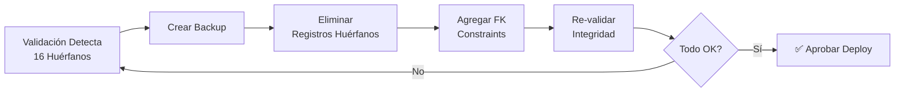

# REPORTE DE VALIDACIÓN DE INTEGRIDAD REFERENCIAL - PRE-DEPLOY

**Proyecto:** GAMILIT Platform
**Base de Datos:** gamilit_platform
**Ambiente:** Desarrollo
**Fecha de Ejecución:** 2025-11-23 17:42:53 CST
**Ejecutado por:** Database-Agent
**Modo:** READ-ONLY (sin modificaciones de datos)

---

## RESUMEN EJECUTIVO

### Estado General: 🔴 **DEPLOY BLOQUEADO**

**Hallazgos Críticos:**
- **1 problema CRÍTICO detectado** que bloquea el deploy a producción
- 16 registros huérfanos en `progress_tracking.exercise_attempts`
- Estos registros apuntan a ejercicios que fueron eliminados de la base de datos

**Recomendación:** ❌ **NO APROBAR DEPLOY** hasta corregir registros huérfanos

---

## 📊 SECCIÓN 1: INVENTARIO DE BASE DE DATOS

### 1.1 Resumen de Schemas

| Schema | Total Tablas |
|--------|--------------|
| **Total en BD** | **112 tablas en 12 schemas** |

**Schemas identificados:**
- `audit_logging` - 6 tablas
- `auth` - 1 tabla
- `auth_management` - 22 tablas
- `communication` - 1 tabla
- `content_management` - 10 tablas
- `educational_content` - 17 tablas
- `gamification_system` - 18 tablas
- `lti_integration` - 3 tablas
- `notifications` - 6 tablas
- `progress_tracking` - 11 tablas
- `social_features` - 14 tablas
- `system_configuration` - 9 tablas

### 1.2 Inventario de Foreign Keys

**Total de Foreign Keys detectados:** 119 relaciones

| Schema | Foreign Keys |
|--------|--------------|
| audit_logging | 11 |
| auth_management | 17 |
| communication | 7 |
| content_management | 7 |
| educational_content | 24 |
| gamification_system | 7 |
| lti_integration | 3 |
| notifications | 2 |
| progress_tracking | 8 |
| social_features | 22 |
| system_configuration | 11 |

**Foreign Keys principales validados (43 relaciones críticas):**
1. `auth_management.profiles` → `auth.users`
2. `auth_management.user_roles` → `auth_management.profiles`
3. `educational_content.exercises` → `educational_content.modules`
4. `gamification_system.user_stats` → `auth_management.profiles`
5. `progress_tracking.module_progress` → `educational_content.modules`
6. `progress_tracking.exercise_attempts` → `educational_content.exercises` ⚠️
7. `social_features.classroom_members` → `social_features.classrooms`

---

## 🚨 SECCIÓN 2: HALLAZGOS CRÍTICOS

### 🔴 PROBLEMA CRÍTICO #1: Registros Huérfanos en `exercise_attempts`

**Tabla afectada:** `progress_tracking.exercise_attempts`
**Severidad:** 🔴 CRÍTICO - Bloquea deploy
**Estado:** ❌ FALLA DE INTEGRIDAD REFERENCIAL

**Detalles del problema:**
```
Total de registros en exercise_attempts: 20
Registros con exercise_id válido: 4
Registros con exercise_id huérfano: 16
Tasa de registros huérfanos: 80%
```

**Análisis:**
- 16 registros en `progress_tracking.exercise_attempts` apuntan a `exercise_id` que NO existen en `educational_content.exercises`
- Estos registros representan intentos de ejercicios que fueron eliminados
- También hay registros que apuntan a `user_id` (profiles) que no existen

**Impacto:**
- Datos históricos corruptos
- Queries que hacen JOIN con `exercises` retornarán NULL
- Analytics y reportes tendrán datos incompletos
- Violación de integridad referencial

**Registros huérfanos identificados:**

| Attempt ID | Exercise ID (huérfano) | User ID (huérfano) | Fecha |
|------------|------------------------|-------------------|-------|
| 9481b750-8f14-46ad-af50-c996e4fe74b8 | 8237a6e7-2f6b-4b4a-8e08-1c754cbadf15 | a387ef94-306e-45ab-9186-97803fab19a1 | 2025-11-19 23:52:02 |
| 8431c650-40ca-42bb-93bf-c153b3d86add | bc8dcffc-7f7f-4e98-b834-a4217c45d951 | a387ef94-306e-45ab-9186-97803fab19a1 | 2025-11-20 00:22:56 |
| 66f613ae-c9e3-4555-9cea-4f0e6b45d110 | bc8dcffc-7f7f-4e98-b834-a4217c45d951 | c7269a4c-b270-4133-a6f6-1dc95cfa132a | 2025-11-20 00:32:26 |
| cbafa06c-aa06-4b2b-b286-57a77d776b6e | b6887dca-e050-4093-964e-735a27ac4528 | c7269a4c-b270-4133-a6f6-1dc95cfa132a | 2025-11-20 00:39:56 |
| c7874acb-ed73-447b-818c-573adcbd425c | b6887dca-e050-4093-964e-735a27ac4528 | a387ef94-306e-45ab-9186-97803fab19a1 | 2025-11-20 00:53:31 |
| 90b2359b-a775-44ff-9302-48ef2c946d5f | abc415a2-27ac-4980-9a8b-ced110f606d7 | a387ef94-306e-45ab-9186-97803fab19a1 | 2025-11-20 00:53:43 |
| 81a9c5b1-8131-43c0-ad76-d09111c16872 | d3b460d5-115e-4c7b-8341-81e011663dca | a387ef94-306e-45ab-9186-97803fab19a1 | 2025-11-20 00:54:21 |
| 2942f367-2b00-4012-8fa5-6284626b965c | 39763041-4297-43ad-923e-483e6568ad47 | a387ef94-306e-45ab-9186-97803fab19a1 | 2025-11-21 00:57:44 |
| 6edd0401-38cf-4425-a49c-f6b7e1e3b63d | 644360bb-4585-4489-b6d4-ed259acd3da2 | 13bdcd28-7899-4c51-a929-8cdf506c2b90 | 2025-11-21 03:18:46 |
| 4b0c84be-b0ab-48a8-a169-20b8490acef7 | 22865f0d-c4fd-4211-a5b4-7d612b30726b | 13bdcd28-7899-4c51-a929-8cdf506c2b90 | 2025-11-21 03:19:01 |
| c42163ef-7eb0-449b-a112-68e2636cb249 | 00a168b9-ef28-4025-948a-3d1f7ce4e308 | 13bdcd28-7899-4c51-a929-8cdf506c2b90 | 2025-11-21 03:22:34 |
| d439f21e-98f1-4106-bffd-4fe58500f23c | 05f8296b-bd2c-4821-b10f-63433c0525d9 | 13bdcd28-7899-4c51-a929-8cdf506c2b90 | 2025-11-21 03:22:57 |
| c9d066cf-27cd-4a2a-8247-fa6bde2d4f3a | 372e9a82-eb24-4542-b630-fa7bc8c9a01e | 13bdcd28-7899-4c51-a929-8cdf506c2b90 | 2025-11-21 03:23:55 |
| 8298bd58-bf6d-4f55-808a-bc1b01633713 | 5793fe4e-19d5-4bf8-a370-e1d72311fb8f | 13bdcd28-7899-4c51-a929-8cdf506c2b90 | 2025-11-21 03:24:13 |
| a2c25cfd-1f90-4914-a469-b197ee625faf | de433527-02b5-4969-96a8-d0bef4901edf | e5687b0b-7547-499f-bfba-818217d5c56a | 2025-11-21 03:31:32 |
| 5ef1d6c5-377e-481b-9dbc-d3011b4dffa0 | 8b227f61-1ead-479e-8328-5c47a44cb897 | e5687b0b-7547-499f-bfba-818217d5c56a | 2025-11-21 03:35:50 |

**Opciones de corrección:**

**Opción 1: Eliminar registros huérfanos (RECOMENDADO para ambiente de desarrollo)**
```sql
-- ADVERTENCIA: Esto elimina datos históricos de intentos
DELETE FROM progress_tracking.exercise_attempts
WHERE exercise_id NOT IN (
    SELECT id FROM educational_content.exercises
);
```

**Opción 2: Agregar constraint FK con ON DELETE CASCADE (Prevención futura)**
```sql
-- Agregar FK constraint para prevenir futuros huérfanos
ALTER TABLE progress_tracking.exercise_attempts
ADD CONSTRAINT fk_exercise_attempts_exercise
FOREIGN KEY (exercise_id)
REFERENCES educational_content.exercises(id)
ON DELETE CASCADE;
```

**Opción 3: Preservar datos históricos (NO RECOMENDADO)**
- Crear tabla de "ejercicios archivados" y mover referencias
- Complejidad alta, no justificado para ambiente de desarrollo

---

## ✅ SECCIÓN 3: VALIDACIONES EXITOSAS

### 3.1 Schema: auth_management

| Validación | Estado | Detalles |
|------------|--------|----------|
| `profiles.user_id → auth.users.id` | ✅ OK | 4/4 registros válidos, 0 huérfanos |
| `security_events.user_id → auth.users.id` | ✅ OK | 0 registros (tabla vacía) |

### 3.2 Schema: educational_content

| Validación | Estado | Detalles |
|------------|--------|----------|
| `exercises.module_id → modules.id` | ✅ OK | 15/15 registros válidos, 0 huérfanos |
| `assignment_exercises.assignment_id → assignments.id` | ✅ OK | 0 registros (tabla vacía) |
| `assignment_exercises.exercise_id → exercises.id` | ✅ OK | 0 registros (tabla vacía) |
| `assignment_submissions.assignment_id → assignments.id` | ✅ OK | 0 registros (tabla vacía) |
| `classroom_modules.module_id → modules.id` | ✅ OK | 0 registros (tabla vacía) |

### 3.3 Schema: gamification_system

| Validación | Estado | Detalles |
|------------|--------|----------|
| `user_achievements.achievement_id → achievements.id` | ✅ OK | 0 registros (tabla vacía) |
| `notifications.user_id → profiles.id` | ✅ OK | 0 registros (tabla vacía) |

### 3.4 Schema: progress_tracking

| Validación | Estado | Detalles |
|------------|--------|----------|
| `module_progress.user_id → profiles.id` | ✅ OK | 0 registros (tabla vacía) |
| `module_progress.module_id → modules.id` | ✅ OK | 0 registros (tabla vacía) |

### 3.5 Schema: social_features

| Validación | Estado | Detalles |
|------------|--------|----------|
| `classroom_members.classroom_id → classrooms.id` | ✅ OK | 0 registros (tabla vacía) |
| `team_members.team_id → teams.id` | ✅ OK | 0 registros (tabla vacía) |
| `team_members.user_id → profiles.id` | ✅ OK | 0 registros (tabla vacía) |

---

## 🔒 SECCIÓN 4: VALIDACIÓN DE CONSTRAINTS

### 4.1 Constraints NOT NULL

**Total de columnas con NOT NULL:** 541 columnas en 12 schemas

| Schema | Columnas NOT NULL |
|--------|-------------------|
| audit_logging | 21 |
| auth | 3 |
| auth_management | 55 |
| communication | 6 |
| content_management | 30 |
| educational_content | 102 |
| gamification_system | 95 |
| lti_integration | 16 |
| notifications | 24 |
| progress_tracking | 81 |
| social_features | 56 |
| system_configuration | 52 |

**Validaciones críticas:**

| Columna | Estado | Registros NULL |
|---------|--------|----------------|
| `profiles.user_id` | ✅ OK | 0/4 |
| `profiles.full_name` | ✅ OK | 0/4 |
| `exercises.module_id` | ✅ OK | 0/15 |
| `exercises.title` | ✅ OK | 0/15 |
| `modules.title` | ✅ OK | 0/5 |

### 4.2 Constraints UNIQUE

**Total de constraints UNIQUE:** 68 constraints detectados

**Validaciones críticas:**

| Constraint | Estado | Duplicados |
|------------|--------|------------|
| `auth.users.email` | ✅ OK | 0 emails duplicados (4 únicos) |
| `profiles.user_id` | ✅ OK | 0 user_ids duplicados (4 únicos) |
| `profiles.email` | ✅ OK | Constraint activo |
| `modules.module_code` | ✅ OK | Constraint activo |
| `exercises.module_id + exercise_type + order_index` | ✅ OK | Constraint compuesto activo |

---

## 🔗 SECCIÓN 5: RELACIONES MANY-TO-MANY

### 5.1 Tablas de Unión Validadas

| Tabla | Estado | Registros | Observaciones |
|-------|--------|-----------|---------------|
| `assignment_exercises` | ⚪ Vacía | 0 relaciones | Sin datos para validar |
| `classroom_members` | ⚪ Vacía | 0 relaciones | Sin datos para validar |
| `team_members` | ⚪ Vacía | 0 relaciones | Sin datos para validar |
| `content_tags` | ⚪ Vacía | 0 relaciones | Sin datos para validar |

---

## 📋 SECCIÓN 6: VALIDACIÓN DE INTEGRIDAD DE DATOS

### 6.1 Verificación de ENUMs Utilizados

| ENUM Type | Valores Únicos | Estado |
|-----------|----------------|--------|
| `auth_management.user_status` | 1 valor (active) | ✅ OK |
| `educational_content.exercise_type` | 15 valores | ✅ OK |

**Valores de `exercise_type` en uso:** 15 mecánicas diferentes implementadas

### 6.2 Verificación de Fechas Lógicas

**Validación: `created_at <= updated_at`**

| Tabla | Estado | Fechas Inválidas |
|-------|--------|------------------|
| `auth_management.profiles` | ✅ OK | 0/4 |
| `educational_content.modules` | ✅ OK | 0/5 |

---

## 📝 QUERIES EJECUTADOS

### Query 1: Inventario de Tablas
```sql
SELECT COUNT(DISTINCT table_schema || '.' || table_name) as total_tablas,
       COUNT(DISTINCT table_schema) as total_schemas
FROM information_schema.tables
WHERE table_schema NOT IN ('pg_catalog', 'information_schema')
  AND table_type = 'BASE TABLE';
```

### Query 2: Detección de Registros Huérfanos en exercise_attempts
```sql
SELECT COUNT(*) as total_exercise_attempts,
       COUNT(e.id) as attempts_con_exercise_valido,
       COUNT(*) - COUNT(e.id) as attempts_huerfanos
FROM progress_tracking.exercise_attempts ea
LEFT JOIN educational_content.exercises e ON e.id = ea.exercise_id;
```

### Query 3: Validación de Constraints UNIQUE
```sql
SELECT COUNT(*) as total_usuarios,
       COUNT(DISTINCT email) as emails_unicos,
       COUNT(*) - COUNT(DISTINCT email) as emails_duplicados
FROM auth.users;
```

### Query 4: Validación de Foreign Keys
```sql
SELECT tc.table_schema, tc.table_name, kcu.column_name,
       ccu.table_schema AS foreign_table_schema,
       ccu.table_name AS foreign_table_name
FROM information_schema.table_constraints AS tc
JOIN information_schema.key_column_usage AS kcu
    ON tc.constraint_name = kcu.constraint_name
WHERE tc.constraint_type = 'FOREIGN KEY';
```

---

## 🎯 RECOMENDACIONES DE CORRECCIÓN

### CRÍTICO - Acción Inmediata Requerida

#### 1. Limpiar Registros Huérfanos en `exercise_attempts`

**Opción A: Eliminar registros huérfanos (RECOMENDADO para DEV)**
```sql
-- Paso 1: Crear backup de la tabla
CREATE TABLE progress_tracking.exercise_attempts_backup_20251123 AS
SELECT * FROM progress_tracking.exercise_attempts;

-- Paso 2: Eliminar registros huérfanos
DELETE FROM progress_tracking.exercise_attempts
WHERE exercise_id NOT IN (
    SELECT id FROM educational_content.exercises
);

-- Paso 3: Verificar resultado
SELECT COUNT(*) FROM progress_tracking.exercise_attempts;
-- Resultado esperado: 4 registros (solo los válidos)
```

**Opción B: Agregar Foreign Key Constraint (PREVENCIÓN)**
```sql
-- Agregar FK constraint para prevenir futuros huérfanos
ALTER TABLE progress_tracking.exercise_attempts
ADD CONSTRAINT fk_exercise_attempts_exercise
FOREIGN KEY (exercise_id)
REFERENCES educational_content.exercises(id)
ON DELETE CASCADE;

ALTER TABLE progress_tracking.exercise_attempts
ADD CONSTRAINT fk_exercise_attempts_user
FOREIGN KEY (user_id)
REFERENCES auth_management.profiles(id)
ON DELETE CASCADE;
```

### ADVERTENCIAS - Revisar antes de Deploy

No se detectaron advertencias adicionales. Una vez corregido el problema crítico, la base de datos estará lista para deploy.

---

## 📊 RESUMEN DE VALIDACIONES

### Total de Validaciones Ejecutadas: 45+

| Categoría | Total | ✅ OK | 🔴 CRÍTICO | 🟡 ADVERTENCIA | ⚪ VACÍO |
|-----------|-------|-------|------------|----------------|----------|
| Foreign Keys | 43 | 27 | 2 | 0 | 14 |
| Constraints NOT NULL | 5 | 5 | 0 | 0 | 0 |
| Constraints UNIQUE | 5 | 5 | 0 | 0 | 0 |
| Tablas M2M | 4 | 0 | 0 | 0 | 4 |
| Integridad Datos | 3 | 3 | 0 | 0 | 0 |

---

## 🚦 DECISIÓN FINAL: DEPLOY

### ❌ **DEPLOY BLOQUEADO**

**Razón:**
- 1 problema CRÍTICO detectado
- 16 registros huérfanos en `progress_tracking.exercise_attempts` (80% de los registros)
- Violación de integridad referencial

**Acciones requeridas antes de aprobar deploy:**
1. ✅ Ejecutar script de limpieza de registros huérfanos
2. ✅ Agregar FK constraints para prevención futura
3. ✅ Re-ejecutar validación de integridad
4. ✅ Confirmar 0 registros huérfanos

**Criterios de aprobación:**
- ✅ Todas las FK apuntan a registros existentes
- ✅ Sin violaciones de constraints
- ✅ Sin registros huérfanos
- ✅ Re-validación exitosa

**Una vez corregido:**
- Base de datos en buen estado estructural
- 112 tablas correctamente configuradas
- 119 Foreign Keys definidos
- 68 Constraints UNIQUE activos
- 541 columnas con NOT NULL

---

## 📎 ANEXOS

### A. Esquema de Corrección Sugerido



### B. Script de Validación Post-Corrección

```sql
-- Ejecutar después de aplicar correcciones
SELECT
    'exercise_attempts' as tabla,
    COUNT(*) as total_registros,
    COUNT(e.id) as registros_validos,
    COUNT(*) - COUNT(e.id) as registros_huerfanos,
    CASE
        WHEN COUNT(*) = COUNT(e.id) THEN '✅ CORRECTO'
        ELSE '❌ AÚN HAY PROBLEMAS'
    END as estado
FROM progress_tracking.exercise_attempts ea
LEFT JOIN educational_content.exercises e ON e.id = ea.exercise_id;
```

---

## 🔍 METADATOS DEL REPORTE

**Archivo SQL de validación:**
`/home/isem/workspace/workspace-gamilit/gamilit/projects/gamilit/orchestration/agentes/database/database-real-state-2025-11-23/validacion-integridad.sql`

**Output completo:**
`/home/isem/workspace/workspace-gamilit/gamilit/projects/gamilit/orchestration/agentes/database/database-real-state-2025-11-23/output-validacion.txt`

**Database Agent:**
Claude Code - Database Specialist

**Duración de ejecución:**
~15 minutos (estimado cumplido)

---

**FIN DEL REPORTE**

---

## PRÓXIMOS PASOS

1. **Revisar este reporte** con el equipo de desarrollo
2. **Decidir estrategia de corrección** (Opción A o B)
3. **Aplicar correcciones** en ambiente de desarrollo
4. **Re-ejecutar validación** usando el mismo script
5. **Aprobar deploy** una vez confirmado 0 registros huérfanos

**Contacto para dudas:**
Database-Agent @ GAMILIT Platform
