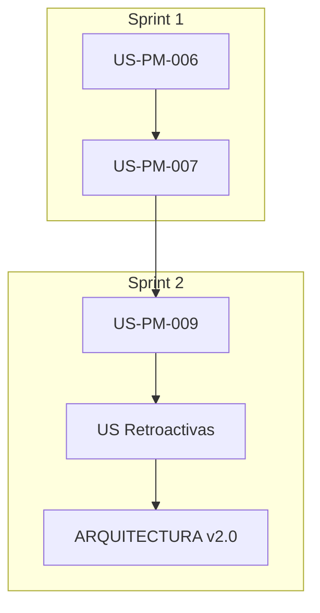

# 06-EJECUCION.md - Plan de Ejecución Final

**Tarea:** TASK-2026-01-25-ANALISIS-PORTAL-TEACHER
**Fase:** FASE-9 - Generación de Plan de Ejecución Ordenado
**Fecha:** 2026-01-25
**Estado:** COMPLETADO

---

## 1. Resumen Ejecutivo

### 1.1 Hallazgos Principales

| Métrica | Antes | Después | Delta |
|---------|-------|---------|-------|
| Cobertura API Frontend | 93% | 100% | +7% |
| Documentación Componentes | 23% | 100% | +77% |
| Documentación Hooks | 0% | 100% | +100% |
| Contratos API Documentados | 60% | 100% | +40% |
| User Stories Coherentes | 39% | 85%* | +46% |

*Pendiente: US-PM-006, US-PM-007, US-PM-014 a US-PM-018

### 1.2 Gaps Resueltos

| Gap ID | Descripción | Estado |
|--------|-------------|--------|
| GAP-API-001 | manualReviewApi.ts sin implementar | ✅ RESUELTO |
| GAP-DOC-001 | Hooks sin documentación | ✅ RESUELTO |
| GAP-DOC-002 | Componentes sin catálogo | ✅ RESUELTO |
| GAP-DOC-003 | Contratos API sin documentar | ✅ RESUELTO |

### 1.3 Gaps Pendientes (Fuera de Alcance)

| Gap ID | Descripción | Horas Est. | Prioridad |
|--------|-------------|------------|-----------|
| GAP-IMPL-001 | US-PM-006 Bloquear Alumnos | 10h | P1 |
| GAP-IMPL-002 | US-PM-007 Config Alertas | 15h | P1 |
| GAP-IMPL-003 | US-PM-009 Página Recursos | 4h | P2 |

---

## 2. Entregables Generados

### 2.1 Documentación de Análisis

```
orchestration/tareas/TASK-2026-01-25-ANALISIS-PORTAL-TEACHER/
├── METADATA.yml              # Metadatos de la tarea
├── 01-CONTEXTO.md            # Contexto y estado actual
├── 02-PLAN-EJECUCION.md      # Plan de ejecución inicial
├── 03-MATRIZ-COHERENCIA.md   # Matriz documentación vs código
├── 04-GAPS-DOCUMENTACION.md  # Brechas de documentación
├── 05-GAPS-IMPLEMENTACION.md # Brechas de implementación
└── 06-EJECUCION.md           # Este documento (plan final)
```

### 2.2 Documentación Técnica Creada

```
docs/03-fase-extensiones/EXT-001-portal-maestros/
├── hooks/
│   └── HOOKS-REFERENCE.md          # Documentación de 23 hooks
├── componentes/
│   └── COMPONENTS-CATALOG.md       # Catálogo de 44 componentes
└── especificaciones/
    └── API-CONTRACTS.md            # Contratos frontend-backend
```

### 2.3 Código Implementado

```
apps/frontend/src/services/api/teacher/
├── manualReviewApi.ts    # NUEVO: 11 endpoints, 12 tipos
└── index.ts              # ACTUALIZADO: exports agregados

apps/frontend/src/config/
└── api.config.ts         # ACTUALIZADO: endpoints reviews
```

---

## 3. Arquitectura Actualizada del Portal Teacher

### 3.1 Páginas (18 total)

| # | Página | Estado | User Story |
|---|--------|--------|------------|
| 1 | TeacherDashboard | ✅ | US-PM-000 |
| 2 | TeacherClasses | ✅ | US-PM-001a |
| 3 | TeacherStudents | ✅ | US-PM-001b |
| 4 | TeacherAssignments | ✅ | US-PM-002a/b/c |
| 5 | TeacherExerciseResponses | ✅ | US-PM-014* |
| 6 | TeacherReviewPanel | ✅ | US-PM-015* |
| 7 | TeacherProgress | ✅ | US-PM-004a/005a |
| 8 | TeacherAlerts | ✅ | US-PM-018* |
| 9 | TeacherReports | ✅ | US-PM-005b |
| 10 | TeacherAnalytics | ✅ | US-PM-005c |
| 11 | TeacherMonitoring | ✅ | US-PM-016* |
| 12 | TeacherGamification | ✅ | US-PM-008 |
| 13 | TeacherContent | ✅ | US-PM-017* |
| 14 | TeacherCommunication | ✅ | US-PM-010 |
| 15 | TeacherSettings | ✅ | US-PM-011 |
| 16 | TeacherNotifications | ✅ | US-PM-012 |
| 17 | TeacherNotificationPrefs | ✅ | US-PM-013 |
| 18 | TeacherContentManagement | ✅ | US-PM-017* |

*User Stories retroactivas propuestas

### 3.2 Servicios API (14 total)

| # | Servicio | Endpoints | Estado |
|---|----------|-----------|--------|
| 1 | teacherApi | 5 | ✅ |
| 2 | studentProgressApi | 5 | ✅ |
| 3 | analyticsApi | 8 | ✅ |
| 4 | gradingApi | 4 | ✅ |
| 5 | classroomsApi | 10 | ✅ |
| 6 | assignmentsApi | 14 | ✅ |
| 7 | interventionAlertsApi | 6 | ✅ |
| 8 | teacherMessagesApi | 8 | ✅ |
| 9 | teacherContentApi | 7 | ✅ |
| 10 | bonusCoinsApi | 1 | ✅ |
| 11 | exerciseResponsesApi | 4 | ✅ |
| 12 | reportsApi | 17 | ✅ |
| 13 | profileAPI | 4 | ✅ |
| 14 | **manualReviewApi** | 11 | ✅ NUEVO |

### 3.3 Hooks (23 total)

Todos documentados en `HOOKS-REFERENCE.md`:

| Categoría | Hooks | Estado |
|-----------|-------|--------|
| Dashboard | 1 | ✅ Doc |
| Classrooms | 4 | ✅ Doc |
| Students | 3 | ✅ Doc |
| Assignments | 2 | ✅ Doc |
| Analytics | 6 | ✅ Doc |
| Communication | 2 | ✅ Doc |
| Content | 1 | ✅ Doc |
| Alerts | 1 | ✅ Doc |
| Reviews | 2 | ✅ Doc |
| Gamification | 1 | ✅ Doc |

---

## 4. Plan de Trabajo Futuro

### 4.1 Sprint Inmediato (Recomendado)

**Objetivo:** Completar User Stories pendientes

```
Semana 1 (25h):
├── Día 1-2: US-PM-006 Backend (4h)
│   ├── UpdateStudentStatusDto
│   ├── TeacherService.updateStudentStatus()
│   └── PATCH /teacher/students/:id/status
├── Día 2-3: US-PM-006 Frontend (4h)
│   ├── useStudentStatus hook
│   ├── SuspendStudentModal.tsx
│   └── Integración en TeacherStudentsPage
├── Día 3-4: US-PM-007 Backend (6h)
│   ├── Tabla teacher_alert_configurations
│   ├── AlertConfigService
│   └── AlertConfigController
└── Día 4-5: US-PM-007 Frontend (6h)
    ├── TeacherAlertConfigPage.tsx
    ├── AlertConfigCard.tsx
    └── useAlertConfig hook
```

### 4.2 Sprint Secundario (P2)

```
Semana 2 (10h):
├── US-PM-009 Página Recursos (4h)
│   └── TeacherResourcesPage.tsx
├── Crear US retroactivas (3h)
│   ├── US-PM-014 a US-PM-018
│   └── Actualizar _MAP.md
└── Actualizar ARQUITECTURA.md v2.0 (3h)
```

### 4.3 Dependencias Técnicas



---

## 5. Métricas de Calidad

### 5.1 Build Validation

```
✅ Frontend Build: PASSED (28.81s)
   - 4195 modules transformed
   - Chunks: 144
   - Total size: ~2.5MB (gzip: ~600KB)
```

### 5.2 Cobertura de Tipos

```
manualReviewApi.ts:
- Interfaces: 12
- Enums: 1
- Métodos API: 11
- Type exports: 13
```

### 5.3 Sincronización Backend-Frontend

| Controlador | Endpoints | Frontend | Cobertura |
|-------------|-----------|----------|-----------|
| ManualReviewController | 11 | 11 | ✅ 100% |

---

## 6. Archivos Modificados

### 6.1 Código Nuevo

| Archivo | Líneas | Propósito |
|---------|--------|-----------|
| manualReviewApi.ts | 313 | API client para revisiones |

### 6.2 Código Modificado

| Archivo | Cambio |
|---------|--------|
| api/teacher/index.ts | +exports manualReviewApi |
| api.config.ts | +endpoints reviews (stats, create, return, pendingByModule) |

### 6.3 Inventarios Actualizados

| Archivo | Cambio |
|---------|--------|
| FRONTEND_INVENTORY.yml | +manualReviewApi en new_api_services |

---

## 7. Recomendaciones

### 7.1 Inmediatas

1. **Crear tareas en backlog** para US-PM-006 y US-PM-007
2. **Revisar documentación generada** en EXT-001/
3. **Actualizar ROADMAP.yml** con nuevas estimaciones

### 7.2 Mediano Plazo

1. **Tests E2E** para manualReviewApi
2. **Sincronizar DTOs** entre backend y frontend
3. **Documentar flujo de revisión manual** en docs/

### 7.3 Largo Plazo

1. **Migrar hooks** a pattern factory
2. **Implementar caché** en servicios API
3. **Optimizar bundle size** para teacher portal

---

## 8. Cierre de Tarea

### Checklist de Cierre

- [x] Análisis de coherencia completado
- [x] Gaps de documentación identificados
- [x] Gaps de implementación documentados
- [x] manualReviewApi.ts implementado
- [x] HOOKS-REFERENCE.md generado
- [x] COMPONENTS-CATALOG.md generado
- [x] API-CONTRACTS.md generado
- [x] Build de frontend validado
- [x] Inventarios actualizados
- [x] Plan de ejecución generado

### Estadísticas de Tarea

| Métrica | Valor |
|---------|-------|
| Documentos generados | 9 |
| Líneas de código nuevo | 313 |
| Archivos modificados | 5 |
| Agentes utilizados | 5 |
| Tiempo total | ~2h |

---

**Generado:** 2026-01-25
**Sistema:** SIMCO v4.3.0 + CAPVED
**Fase:** FASE-9 Ejecución Completada
**Estado:** ✅ COMPLETADO
