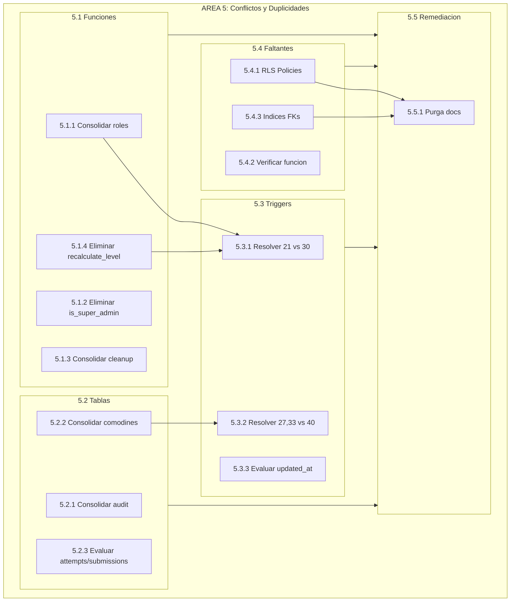

# PLAN MAESTRO EXTENDIDO - Analisis Integral BD y Documentacion GAMILIT

**Tarea:** TASK-2026-02-03-PLAN-MAESTRO-BD-REQUERIMIENTOS
**Sistema:** SIMCO v4.3.0 + NEXUS v4.0
**Fecha:** 2026-02-03
**Version:** 2.0.0 (Extendido)
**Metodologia:** CAPVED en todos los niveles

---

## RESUMEN EJECUTIVO

Este plan extiende el Plan Maestro original (v1.0.0) con una nueva **AREA 5: Analisis de Conflictos y Duplicidades** basada en analisis exhaustivo realizado por 5 agentes especializados en paralelo.

### Hallazgos Principales

| Categoria | Hallazgos | Severidad | Impacto Estimado |
|-----------|-----------|-----------|------------------|
| Funciones Duplicadas | 13 | ALTA | ~1,500 lineas redundantes |
| Tablas Solapadas | 7 | ALTA | 22% tablas consolidables |
| Triggers Redundantes | 9 | CRITICA | Calculos duplicados activos |
| Documentacion Obsoleta | 100+ archivos | MEDIA | ~120 MB purgables |
| Objetos BD Faltantes | 15+ | CRITICA | RLS policies, indices, funciones |

---

## ESTRUCTURA JERARQUICA EXTENDIDA

```
NIVEL 0: Plan Maestro Extendido
├── NIVEL 1: AREA 1 - ANALISIS DE COHERENCIA (Original)
├── NIVEL 1: AREA 2 - DEFINICIONES FALTANTES (Original)
├── NIVEL 1: AREA 3 - PURGA DE DOCUMENTACION (Original + Extendido)
├── NIVEL 1: AREA 4 - INTEGRACION Y ORDEN (Original)
└── NIVEL 1: AREA 5 - CONFLICTOS Y DUPLICIDADES (NUEVO)
    ├── NIVEL 2: 5.1 - Duplicidades de Funciones
    ├── NIVEL 2: 5.2 - Solapamiento de Tablas
    ├── NIVEL 2: 5.3 - Triggers Redundantes
    ├── NIVEL 2: 5.4 - Objetos Faltantes
    └── NIVEL 2: 5.5 - Remediacion Integral
```

---

## AREA 5: CONFLICTOS Y DUPLICIDADES (NUEVO)

### 5.1 DOMINIO: Duplicidades de Funciones SQL

#### 5.1.1 Tarea: Consolidar Funciones de Rol de Usuario

**CAPVED:**
| Fase | Descripcion |
|------|-------------|
| C | 2 funciones duplicadas: gamilit.get_current_user_role() vs auth_management.get_user_role() |
| A | auth_management es mas completa (SECURITY DEFINER, parametro opcional) |
| P | Eliminar gamilit.get_current_user_role(), actualizar referencias |
| E | Modificar RLS policies que usan la funcion |
| V | Recrear BD, verificar RLS funciona |
| D | Actualizar DATABASE_INVENTORY |

**Acciones Atomicas:**
```
5.1.1.1 Buscar referencias a gamilit.get_current_user_role()
5.1.1.2 Reemplazar por auth_management.get_user_role()
5.1.1.3 Eliminar archivo 03-get_current_user_role.sql
5.1.1.4 Ejecutar drop-and-recreate-database.sh
5.1.1.5 Validar RLS policies funcionan
5.1.1.6 Documentar cambio
```

**Criterio:** 0 referencias a funcion eliminada, BD recrea sin errores

---

#### 5.1.2 Tarea: Eliminar Alias is_super_admin()

**CAPVED:**
| Fase | Descripcion |
|------|-------------|
| C | gamilit.is_super_admin() es alias puro de gamilit.is_admin() |
| A | Crea confusion semantica, codigo redundante |
| P | Eliminar 05b-is_super_admin.sql, actualizar referencias |
| E | Buscar y reemplazar llamadas |
| V | Build y recreacion BD |
| D | Actualizar inventario |

**Acciones Atomicas:**
```
5.1.2.1 grep -r "is_super_admin" apps/database/
5.1.2.2 Reemplazar por is_admin()
5.1.2.3 Eliminar 05b-is_super_admin.sql
5.1.2.4 Recrear BD
5.1.2.5 Documentar
```

**Criterio:** Archivo eliminado, 0 referencias rotas

---

#### 5.1.3 Tarea: Consolidar Funciones de Cleanup

**CAPVED:**
| Fase | Descripcion |
|------|-------------|
| C | 3 funciones cleanup con 70% codigo identico + BUG en una |
| A | cleanup_old_system_logs, cleanup_old_user_activity, cleanup_old_notifications |
| P | Crear funcion generica, eliminar 3 especificas, FIX BUG linea 29 |
| E | Implementar audit_logging.cleanup_old_records() |
| V | Ejecutar con datos de prueba |
| D | Documentar nueva API |

**Acciones Atomicas:**
```
5.1.3.1 Crear cleanup_old_records(p_table, p_retention_days, p_extra_condition)
5.1.3.2 FIX BUG: Usar GET DIAGNOSTICS en lugar de COUNT post-DELETE
5.1.3.3 Agregar VACUUM ANALYZE a todas
5.1.3.4 Eliminar 3 funciones originales
5.1.3.5 Crear wrappers si se necesita mantener nombres
5.1.3.6 Validar en staging
```

**Criterio:** 1 funcion generica, 0 bugs, ~90 lineas eliminadas

---

#### 5.1.4 Tarea: Eliminar recalculate_level_on_xp_change() Obsoleta

**CAPVED:**
| Fase | Descripcion |
|------|-------------|
| C | Trigger 21 reemplazado por Trigger 30 (process_xp_update) |
| A | Ambos activos = calculo duplicado de nivel |
| P | Eliminar archivo 08-recalculate_level_on_xp_change.sql |
| E | DROP TRIGGER y eliminar archivo |
| V | Validar que trigger 30 funciona solo |
| D | Actualizar DATABASE_INVENTORY |

**Acciones Atomicas:**
```
5.1.4.1 Verificar trigger 30 cubre logica de trigger 21
5.1.4.2 DROP TRIGGER trg_recalculate_level_on_xp_change
5.1.4.3 Eliminar archivo 08-recalculate_level_on_xp_change.sql
5.1.4.4 Recrear BD
5.1.4.5 Probar cambio de XP y verificar nivel
5.1.4.6 Documentar
```

**Criterio:** Trigger 21 eliminado, nivel se calcula correctamente

---

### 5.2 DOMINIO: Solapamiento de Tablas

#### 5.2.1 Tarea: Consolidar Tablas de Audit Logging

**CAPVED:**
| Fase | Descripcion |
|------|-------------|
| C | 3 tablas audit con 90% campos duplicados: audit_logs, activity_log, user_activity_logs |
| A | Diferentes granularidades pero mismo proposito |
| P | Crear audit_logging.audit_events unificada + vistas compatibilidad |
| E | DDL nueva tabla, migracion datos, crear vistas |
| V | Queries existentes funcionan via vistas |
| D | Actualizar _MAP.md del schema |

**Acciones Atomicas:**
```
5.2.1.1 Crear DDL audit_events con estructura unificada
5.2.1.2 Crear script migracion datos historicos
5.2.1.3 Crear VIEW activity_log AS SELECT FROM audit_events
5.2.1.4 Crear VIEW user_activity_logs AS SELECT FROM audit_events
5.2.1.5 Deprecar tablas originales (mover a _deprecated/)
5.2.1.6 Actualizar backend para usar tabla nueva
5.2.1.7 Validar queries de dashboard admin
```

**Criterio:** 1 tabla unificada, vistas funcionan, 0 queries rotas

---

#### 5.2.2 Tarea: Consolidar Tracking de Comodines

**CAPVED:**
| Fase | Descripcion |
|------|-------------|
| C | 2 tablas: comodin_usage_log (granular) + comodin_usage_tracking (contadores) |
| A | Contadores pueden divergir del log, duplicacion de datos |
| P | Eliminar comodin_usage_tracking, crear vista materializada |
| E | DROP TABLE, crear VIEW con COUNT agregados |
| V | Validar limites de comodines funcionan |
| D | Actualizar inventario |

**Acciones Atomicas:**
```
5.2.2.1 Crear VIEW comodin_usage_summary con agregados
5.2.2.2 Actualizar backend para usar VIEW
5.2.2.3 Eliminar comodin_usage_tracking
5.2.2.4 Validar check_comodin_limit() funciona
5.2.2.5 Documentar
```

**Criterio:** 1 fuente de verdad para uso de comodines

---

#### 5.2.3 Tarea: Evaluar Consolidacion exercise_attempts/submissions

**CAPVED:**
| Fase | Descripcion |
|------|-------------|
| C | 99% campos duplicados entre exercise_attempts y exercise_submissions |
| A | Diferencias: status field, graded_at, rewards_claimed |
| P | EVALUAR si fusionar o documentar como intencional |
| E | Si fusionar: migracion + backend updates |
| V | Tests de submission + grading |
| D | ADR con decision |

**Acciones Atomicas:**
```
5.2.3.1 Analizar uso en backend de ambas tablas
5.2.3.2 Identificar queries que usan UNION
5.2.3.3 Evaluar impacto de fusion
5.2.3.4 Crear ADR-032: exercise_attempts vs submissions
5.2.3.5 Si procede: implementar fusion
5.2.3.6 Documentar decision
```

**Criterio:** ADR documentando decision (fusionar o mantener separadas)

---

### 5.3 DOMINIO: Triggers Redundantes

#### 5.3.1 Tarea: Resolver Trigger 21 vs Trigger 30

**CAPVED:**
| Fase | Descripcion |
|------|-------------|
| C | Ambos triggers activos en user_stats para cambios de XP |
| A | Calculo de nivel duplicado, latencia innecesaria |
| P | Deshabilitar trigger 21, verificar trigger 30 suficiente |
| E | ALTER TABLE DISABLE TRIGGER |
| V | Probar ganancia de XP |
| D | Documentar en triggers/_MAP.md |

**Acciones Atomicas:**
```
5.3.1.1 SELECT tgname, tgenabled FROM pg_trigger WHERE tgrelid = 'gamification_system.user_stats'::regclass
5.3.1.2 ALTER TABLE gamification_system.user_stats DISABLE TRIGGER trg_recalculate_level_on_xp_change
5.3.1.3 Probar: UPDATE user_stats SET total_xp = total_xp + 100
5.3.1.4 Verificar level se recalcula
5.3.1.5 Si OK: eliminar archivo trigger 21
5.3.1.6 Documentar
```

**Criterio:** Solo trigger 30 activo, nivel se calcula correctamente

---

#### 5.3.2 Tarea: Resolver Triggers 27, 33 vs Trigger 40

**CAPVED:**
| Fase | Descripcion |
|------|-------------|
| C | Trigger 40 consolida 27+33 segun comentarios pero todos activos |
| A | Calculos de module_progress y average_score duplicados |
| P | Deshabilitar 27 y 33, validar 40 suficiente |
| E | ALTER TABLE DISABLE TRIGGER |
| V | Probar submission graded |
| D | Documentar consolidacion |

**Acciones Atomicas:**
```
5.3.2.1 Listar triggers en exercise_submissions
5.3.2.2 Deshabilitar trg_update_module_progress_on_submission
5.3.2.3 Deshabilitar trg_sync_average_score_on_submission
5.3.2.4 Probar: grading de submission
5.3.2.5 Verificar module_progress actualizado
5.3.2.6 Si OK: mover archivos 27 y 33 a _deprecated/
5.3.2.7 Documentar
```

**Criterio:** Solo trigger 40 activo, progreso se calcula correctamente

---

#### 5.3.3 Tarea: Evaluar Consolidacion Triggers updated_at

**CAPVED:**
| Fase | Descripcion |
|------|-------------|
| C | 25 triggers identicos *_updated_at en 8 schemas |
| A | Mismo codigo, mismo proposito, alta repeticion |
| P | Evaluar mecanismo centralizado vs mantener actual |
| E | Si centralizar: crear event trigger o mecanismo TypeORM |
| V | updated_at se actualiza en todas las tablas |
| D | ADR con decision |

**Acciones Atomicas:**
```
5.3.3.1 Contar triggers *_updated_at
5.3.3.2 Evaluar opciones: Event trigger, TypeORM @BeforeUpdate, mantener
5.3.3.3 Crear ADR-033: Estrategia updated_at triggers
5.3.3.4 Si centralizar: implementar
5.3.3.5 Documentar decision
```

**Criterio:** ADR documentando estrategia

---

### 5.4 DOMINIO: Objetos Faltantes

#### 5.4.1 Tarea: Crear RLS Policies Faltantes

**CAPVED:**
| Fase | Descripcion |
|------|-------------|
| C | 5+ tablas con datos sensibles sin RLS policies |
| A | student_intervention_alerts, teacher_alert_configurations, teacher_interventions, discussion_threads, guild_missions |
| P | Crear policies por tabla con patron existente |
| E | CREATE POLICY para cada tabla |
| V | Probar acceso con diferentes roles |
| D | Actualizar DATABASE_INVENTORY rls_policies count |

**Acciones Atomicas:**
```
5.4.1.1 Crear RLS para student_intervention_alerts (teacher_own, admin_all)
5.4.1.2 Crear RLS para teacher_alert_configurations (teacher_own)
5.4.1.3 Crear RLS para teacher_interventions (teacher_own, admin_all)
5.4.1.4 Crear RLS para discussion_threads (classroom_members_only)
5.4.1.5 Crear RLS para guild_missions (guild_members_only)
5.4.1.6 Recrear BD
5.4.1.7 Probar con usuarios de prueba
5.4.1.8 Actualizar inventario
```

**Criterio:** 5 tablas con RLS, acceso controlado por rol

---

#### 5.4.2 Tarea: Verificar/Crear initialize_module_progress_on_publish

**CAPVED:**
| Fase | Descripcion |
|------|-------------|
| C | Funcion referenciada en trigger pero no localizada |
| A | Trigger 15-trg_initialize_module_progress.sql la invoca |
| P | Verificar si existe, si no: crear o modificar trigger |
| E | Crear funcion o ajustar trigger |
| V | Publicar modulo, verificar progress creado para usuarios |
| D | Documentar |

**Acciones Atomicas:**
```
5.4.2.1 grep -r "initialize_module_progress_on_publish" apps/database/
5.4.2.2 Si no existe: crear en gamilit/functions/
5.4.2.3 Si trigger tiene logica inline: documentar como intencional
5.4.2.4 Probar: UPDATE modules SET is_published = true
5.4.2.5 Verificar module_progress creado
5.4.2.6 Documentar
```

**Criterio:** Funcion existe o trigger documentado, publicacion funciona

---

#### 5.4.3 Tarea: Crear Indices Faltantes en FKs

**CAPVED:**
| Fase | Descripcion |
|------|-------------|
| C | 10+ columnas FK sin indices explicitos |
| A | Performance degradada en JOINs y filtros |
| P | Crear indices compostos para queries frecuentes |
| E | CREATE INDEX para cada combinacion |
| V | EXPLAIN ANALYZE en queries criticas |
| D | Actualizar indexes_statements count |

**Acciones Atomicas:**
```
5.4.3.1 idx_comodin_tracking_user_exercise ON comodin_usage_tracking(user_id, exercise_id)
5.4.3.2 idx_teacher_alerts_teacher_classroom ON teacher_alert_configurations(teacher_id, classroom_id)
5.4.3.3 idx_guild_members_guild_user ON guild_members(guild_id, user_id)
5.4.3.4 idx_missions_classroom_active ON missions(classroom_id, is_active)
5.4.3.5 idx_submissions_user_module ON exercise_submissions(user_id, module_id, created_at)
5.4.3.6 idx_submissions_status ON exercise_submissions(status, created_at)
5.4.3.7 Recrear BD
5.4.3.8 Ejecutar EXPLAIN ANALYZE en queries
5.4.3.9 Documentar mejoras
```

**Criterio:** 6+ indices creados, queries usan indices

---

### 5.5 DOMINIO: Remediacion Integral

#### 5.5.1 Tarea: Ejecutar Purga de Documentacion

**CAPVED:**
| Fase | Descripcion |
|------|-------------|
| C | ~120 MB de documentacion obsoleta identificada |
| A | Tareas archivadas, trazas 2025, carpetas vacias, duplicados |
| P | Eliminar por fases: bajo riesgo primero |
| E | rm -rf, git rm, consolidar archivos |
| V | No hay referencias rotas |
| D | Actualizar _INDEX.yml afectados |

**Acciones Atomicas:**
```
5.5.1.1 Eliminar carpetas vacias (propuestas, cambios, escalamientos, etc.)
5.5.1.2 Eliminar ALIASES-RESOLVED.yml
5.5.1.3 Eliminar trazas/_archive/TRAZA-DATABASE-2025.md
5.5.1.4 Consolidar tareas archivadas en TAREAS-HISTORICO.md
5.5.1.5 Consolidar audits en AUDITS-HISTORICO.yml
5.5.1.6 Eliminar docs/00-vision-general/_archive/2026-01-25-purge/
5.5.1.7 Actualizar todos los _INDEX.yml afectados
5.5.1.8 git add . && git status
```

**Criterio:** ~120 MB liberados, 0 referencias rotas

---

## DIAGRAMA DE DEPENDENCIAS AREA 5



---

## PRIORIDADES AREA 5

### P0 (Critico - Esta semana)

| ID | Tarea | Razon |
|----|-------|-------|
| 5.3.1 | Resolver Trigger 21 vs 30 | Calculo duplicado activo |
| 5.3.2 | Resolver Triggers 27,33 vs 40 | Calculo duplicado activo |
| 5.4.1 | RLS Policies faltantes | Seguridad de datos |
| 5.1.4 | Eliminar recalculate_level obsoleta | Prereq de 5.3.1 |

### P1 (Alto - Proxima semana)

| ID | Tarea | Razon |
|----|-------|-------|
| 5.1.1 | Consolidar funciones rol | Reducir confusion |
| 5.1.3 | Consolidar cleanup + FIX BUG | Bug activo |
| 5.4.2 | Verificar funcion publish | Funcionalidad critica |
| 5.4.3 | Indices FKs | Performance |

### P2 (Medio - Este mes)

| ID | Tarea | Razon |
|----|-------|-------|
| 5.1.2 | Eliminar is_super_admin | Limpieza |
| 5.2.1 | Consolidar audit tables | Reducir redundancia |
| 5.2.2 | Consolidar comodines | Consistencia datos |
| 5.5.1 | Purga documentacion | Limpieza ~120 MB |

### P3 (Bajo - Proximo trimestre)

| ID | Tarea | Razon |
|----|-------|-------|
| 5.2.3 | Evaluar attempts/submissions | Arquitectura |
| 5.3.3 | Evaluar updated_at triggers | Optimizacion |

---

## METRICAS TOTALES PLAN EXTENDIDO

| Nivel | Original | Extendido | Total |
|-------|----------|-----------|-------|
| Areas (N1) | 4 | 1 | 5 |
| Dominios (N2) | 8 | 5 | 13 |
| Tareas (N3) | 14 | 14 | 28 |
| Acciones (N4) | 82 | 85 | 167 |

---

## BLOQUES DE EJECUCION PARALELA

### Bloque 1: Triggers Criticos (Paralelo)
- 5.3.1 Resolver Trigger 21 vs 30
- 5.3.2 Resolver Triggers 27,33 vs 40

### Bloque 2: Seguridad (Paralelo)
- 5.4.1 RLS Policies faltantes
- 5.4.3 Indices FKs

### Bloque 3: Funciones (Paralelo)
- 5.1.1 Consolidar roles
- 5.1.3 Consolidar cleanup

### Bloque 4: Tablas (Secuencial - Depende de Bloque 1-3)
- 5.2.1 Consolidar audit tables
- 5.2.2 Consolidar comodines

### Bloque 5: Limpieza Final (Secuencial - Al final)
- 5.5.1 Purga documentacion

---

## PROXIMOS PASOS

1. **Inmediato:** Aprobar este plan extendido
2. **Fase 1 (P0):** Ejecutar Bloque 1 + Bloque 2 en paralelo
3. **Fase 2 (P1):** Ejecutar Bloque 3
4. **Fase 3 (P2):** Ejecutar Bloque 4
5. **Fase 4 (Final):** Ejecutar Bloque 5

---

*Sistema SIMCO v4.3.0 - GAMILIT*
*Ciclo CAPVED aplicado en todos los niveles*
*Plan Maestro Extendido v2.0.0*
*Generado: 2026-02-03*
