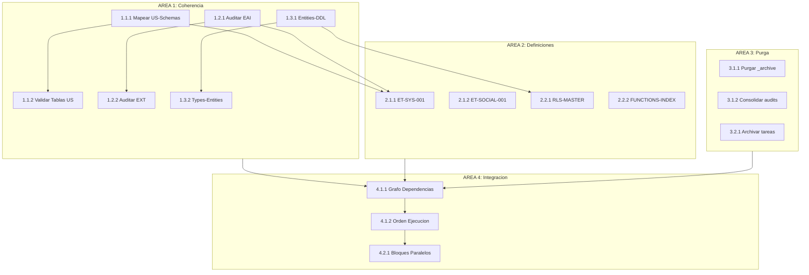

# PLAN MAESTRO - Analisis BD y Requerimientos GAMILIT

**Tarea:** TASK-2026-02-03-PLAN-MAESTRO-BD-REQUERIMIENTOS
**Sistema:** SIMCO v4.3.0 + NEXUS v4.0
**Fecha:** 2026-02-03
**Metodologia:** CAPVED en todos los niveles

---

## ESTRUCTURA JERARQUICA

```
NIVEL 0: Plan Maestro
├── NIVEL 1: Areas de Trabajo (4)
│   ├── NIVEL 2: Dominios (12)
│   │   ├── NIVEL 3: Tareas (28)
│   │   │   └── NIVEL 4: Acciones Atomicas (75+)
```

---

## AREA 1: ANALISIS DE COHERENCIA BD-REQUERIMIENTOS

### 1.1 DOMINIO: Validacion Schemas vs User Stories

#### 1.1.1 Tarea: Mapear User Stories a Schemas BD

**CAPVED:**
| Fase | Descripcion |
|------|-------------|
| C | 5 User Stories (GAM-001 a GAM-005) vs 16 schemas BD |
| A | Identificar que schema(s) implementa cada US |
| P | Crear matriz de trazabilidad |
| E | Generar documento TRACEABILITY-US-SCHEMAS.md |
| V | Validar 100% cobertura |
| D | Actualizar TRACEABILITY-MASTER.yml |

**Acciones Atomicas:**
```
1.1.1.1 Leer GAM-001 (Gamificacion) → gamification_system
1.1.1.2 Leer GAM-002 (Portal Estudiante) → progress_tracking, educational_content
1.1.1.3 Leer GAM-003 (Portal Maestro) → educational_content, social_features
1.1.1.4 Leer GAM-004 (Modulos Educativos) → educational_content
1.1.1.5 Leer GAM-005 (Economia ML-Coins) → gamification_system
1.1.1.6 Crear matriz en TRACEABILITY-US-SCHEMAS.md
1.1.1.7 Validar sin gaps
```

**Criterio:** Matriz completa con 5 US x 16 schemas

---

#### 1.1.2 Tarea: Validar Tablas Requeridas por US

**CAPVED:**
| Fase | Descripcion |
|------|-------------|
| C | Cada US requiere tablas especificas |
| A | Comparar tablas mencionadas vs existentes en DDL |
| P | Documentar gaps si existen |
| E | Crear VALIDATION-TABLES-US.md |
| V | 100% tablas requeridas existen |
| D | Actualizar DATABASE_INVENTORY |

**Acciones Atomicas:**
```
1.1.2.1 GAM-001 requiere: user_stats, maya_ranks, achievements, missions → Verificar
1.1.2.2 GAM-002 requiere: profiles, module_progress, learning_sessions → Verificar
1.1.2.3 GAM-003 requiere: classrooms, assignments, manual_reviews → Verificar
1.1.2.4 GAM-004 requiere: modules, exercises, exercise_mechanics → Verificar
1.1.2.5 GAM-005 requiere: ml_coins_transactions, comodines_inventory → Verificar
1.1.2.6 Documentar estado (EXISTS/MISSING/PARTIAL)
```

**Criterio:** 0 tablas MISSING

---

### 1.2 DOMINIO: Validacion EPICs vs Implementacion

#### 1.2.1 Tarea: Auditar EPICs EAI-001 a EAI-008

**CAPVED:**
| Fase | Descripcion |
|------|-------------|
| C | 8 EPICs de Fase 1 (Alcance Inicial) |
| A | Comparar criterios de aceptacion vs estado actual |
| P | Calcular % completitud real |
| E | Crear AUDIT-EPICS-FASE1.md |
| V | Confirmar con builds |
| D | Actualizar PROJECT-STATUS.md |

**Acciones Atomicas:**
```
1.2.1.1 EAI-001 Fundamentos: Verificar auth, perfiles, dashboard
1.2.1.2 EAI-002 Actividades: Verificar 8 mecanicas de ejercicios
1.2.1.3 EAI-003 Gamificacion: Verificar XP, rangos, logros, misiones
1.2.1.4 EAI-004 Analytics: Verificar dashboards, metricas
1.2.1.5 EAI-005 Admin Base: Verificar CRUD usuarios, aulas
1.2.1.6 EAI-006 Config Sistema: Verificar settings, feature flags
1.2.1.7 EAI-007 Modulos M4-M5: Verificar ejercicios avanzados
1.2.1.8 EAI-008 Admin Avanzado: Verificar analytics, reportes
```

**Criterio:** 8 EPICs con % completitud documentado

---

#### 1.2.2 Tarea: Auditar EPICs EXT-001 a EXT-011

**CAPVED:**
| Fase | Descripcion |
|------|-------------|
| C | 11 EPICs de Fase 3 (Extensiones) |
| A | Verificar Story Points asignados |
| P | Asignar SP faltantes |
| E | Actualizar archivos EPIC |
| V | Validar suma total SP |
| D | Actualizar ROADMAP.yml |

**Acciones Atomicas:**
```
1.2.2.1 EXT-001 Portal Maestros: Verificar/Asignar SP
1.2.2.2 EXT-002 Admin Extendido: Verificar/Asignar SP
1.2.2.3 EXT-003 Notificaciones: Verificar/Asignar SP
1.2.2.4 EXT-004 Perfiles: Verificar/Asignar SP
1.2.2.5 EXT-005 Reportes: Verificar/Asignar SP
1.2.2.6 EXT-006 Contenido: Verificar/Asignar SP
1.2.2.7 EXT-007 LTI Integration: Verificar/Asignar SP
1.2.2.8 EXT-008 White Label: Verificar/Asignar SP
1.2.2.9 EXT-009 Peer Challenges: Verificar/Asignar SP
1.2.2.10 EXT-010 Parent Notifications: Verificar/Asignar SP
1.2.2.11 EXT-011 Parent Portal: Verificar/Asignar SP
```

**Criterio:** 11 EPICs con Story Points asignados

---

### 1.3 DOMINIO: Coherencia DDL-Backend-Frontend

#### 1.3.1 Tarea: Validar Entities vs Tablas DDL

**CAPVED:**
| Fase | Descripcion |
|------|-------------|
| C | 158 entities backend vs 138 tablas DDL |
| A | Delta +20 entities (views, helpers, DTOs) |
| P | Documentar cada entity sin tabla directa |
| E | Crear COHERENCE-ENTITIES-DDL.md |
| V | Confirmar 100% tablas tienen entity |
| D | Actualizar BACKEND_INVENTORY |

**Acciones Atomicas:**
```
1.3.1.1 Listar todas las entities: apps/backend/src/modules/**/entities/
1.3.1.2 Listar todas las tablas: apps/database/ddl/schemas/*/tables/
1.3.1.3 Crear match entity↔tabla
1.3.1.4 Identificar entities sin tabla (DTOs, Views, Aggregates)
1.3.1.5 Identificar tablas sin entity (GAPS CRITICOS)
1.3.1.6 Documentar resultado
```

**Criterio:** 0 tablas sin entity correspondiente

---

#### 1.3.2 Tarea: Validar Types Frontend vs Entities Backend

**CAPVED:**
| Fase | Descripcion |
|------|-------------|
| C | Types TS frontend deben reflejar entities |
| A | Comparar apps/frontend/src/types/ vs entities |
| P | Crear types faltantes si hay gaps |
| E | Generar types con script sync |
| V | npm run validate:types |
| D | Actualizar FRONTEND_INVENTORY |

**Acciones Atomicas:**
```
1.3.2.1 Listar types: apps/frontend/src/types/*.ts
1.3.2.2 Listar entities publicas del backend
1.3.2.3 Comparar campos y tipos
1.3.2.4 Identificar divergencias
1.3.2.5 Ejecutar npm run sync:types si existe
1.3.2.6 Documentar estado
```

**Criterio:** 100% coherencia types-entities

---

## AREA 2: DEFINICIONES FALTANTES

### 2.1 DOMINIO: Especificaciones Tecnicas

#### 2.1.1 Tarea: Crear ET-SYS-001 (Config Sistema)

**CAPVED:**
| Fase | Descripcion |
|------|-------------|
| C | Referenciada pero no existe |
| A | Revisar EAI-006 y system_configuration schema |
| P | Estructura: Campos, APIs, Validaciones |
| E | Escribir especificacion completa |
| V | Validar contra codigo existente |
| D | Registrar en TRACEABILITY |

**Acciones Atomicas:**
```
2.1.1.1 Leer docs/01-fase-alcance-inicial/EAI-006-config-sistema/
2.1.1.2 Leer apps/database/ddl/schemas/system_configuration/
2.1.1.3 Leer apps/backend/src/modules/system-config/
2.1.1.4 Identificar: system_settings, feature_flags, rate_limits
2.1.1.5 Documentar APIs: GET/PUT /config/*
2.1.1.6 Crear ET-SYS-001.md (>80 lineas)
2.1.1.7 Agregar a especificaciones/ de EAI-006
```

**Criterio:** ET-SYS-001.md creado con >80 lineas

---

#### 2.1.2 Tarea: Crear ET-SOCIAL-001 (Social Module)

**CAPVED:**
| Fase | Descripcion |
|------|-------------|
| C | Social features sin especificacion formal |
| A | Revisar social_features schema y modulo |
| P | Documentar: Amistades, Equipos, Retos |
| E | Escribir especificacion |
| V | Validar integridad |
| D | Actualizar inventarios |

**Acciones Atomicas:**
```
2.1.2.1 Leer apps/database/ddl/schemas/social_features/
2.1.2.2 Leer apps/backend/src/modules/social/
2.1.2.3 Documentar: friendships, friend_requests, teams, team_members
2.1.2.4 Documentar: peer_challenges, classrooms, classroom_members
2.1.2.5 Crear ET-SOCIAL-001.md
2.1.2.6 Ubicar en docs/03-fase-extensiones/EXT-009-peer-challenges/
```

**Criterio:** ET-SOCIAL-001.md creado

---

### 2.2 DOMINIO: Indices y Referencias

#### 2.2.1 Tarea: Crear RLS-POLICIES-MASTER.md

**CAPVED:**
| Fase | Descripcion |
|------|-------------|
| C | 282 RLS policies sin indice maestro |
| A | Auditar todos los archivos rls-policies/ |
| P | Estructura: Por schema, tipo, tabla |
| E | Generar indice completo |
| V | Contar debe ser 282 |
| D | Agregar a DATABASE_INVENTORY |

**Acciones Atomicas:**
```
2.2.1.1 find apps/database/ddl -path "*rls*" -name "*.sql"
2.2.1.2 Extraer CREATE POLICY de cada archivo
2.2.1.3 Clasificar: SELECT, INSERT, UPDATE, DELETE
2.2.1.4 Agrupar por schema
2.2.1.5 Crear RLS-POLICIES-MASTER.md
2.2.1.6 Ubicar en docs/90-transversal/arquitectura-database/
2.2.1.7 Referenciar en DATABASE_INVENTORY.yml
```

**Criterio:** Indice con 282 policies documentadas

---

#### 2.2.2 Tarea: Crear FUNCTIONS-INDEX.md

**CAPVED:**
| Fase | Descripcion |
|------|-------------|
| C | 110+ funciones SQL sin indice actualizado |
| A | Auditar apps/database/ddl/schemas/*/functions/ |
| P | Estructura: Por schema, proposito |
| E | Generar indice |
| V | Validar existencia de cada funcion |
| D | Actualizar DATABASE_INVENTORY |

**Acciones Atomicas:**
```
2.2.2.1 find apps/database/ddl -path "*functions*" -name "*.sql"
2.2.2.2 Extraer CREATE FUNCTION de cada archivo
2.2.2.3 Clasificar por proposito (triggers, helpers, views)
2.2.2.4 Documentar parametros y retorno
2.2.2.5 Crear FUNCTIONS-INDEX.md
2.2.2.6 Ubicar en docs/90-transversal/inventarios-database/
```

**Criterio:** Indice con 110+ funciones

---

## AREA 3: PURGA DE DOCUMENTACION

### 3.1 DOMINIO: Archivos Obsoletos

#### 3.1.1 Tarea: Purgar orchestration/_archive/

**CAPVED:**
| Fase | Descripcion |
|------|-------------|
| C | 38 carpetas archivadas 2026-01-24 |
| A | Verificar 0 referencias activas |
| P | Eliminar completamente |
| E | rm -rf orchestration/_archive/ |
| V | ls no muestra _archive |
| D | Actualizar _MAP.md |

**Acciones Atomicas:**
```
3.1.1.1 grep -r "_archive" orchestration/ docs/ | wc -l
3.1.1.2 Si >0, revisar referencias
3.1.1.3 Eliminar referencias o actualizar
3.1.1.4 rm -rf orchestration/_archive/
3.1.1.5 Actualizar orchestration/_MAP.md
```

**Criterio:** Carpeta _archive/ eliminada

---

#### 3.1.2 Tarea: Consolidar docs/98-audits/

**CAPVED:**
| Fase | Descripcion |
|------|-------------|
| C | 6 archivos de auditoria 2026-01-04 redundantes |
| A | Contenido solapado 70% |
| P | Merge en 1 documento consolidado |
| E | Crear AUDITORIA-CONSOLIDADA-ADMIN.md |
| V | Verificar no hay perdida de informacion |
| D | Eliminar originales, actualizar _INDEX |

**Acciones Atomicas:**
```
3.1.2.1 Leer PLAN-AUDIT-PORTAL-ADMIN-2026-01-04.md
3.1.2.2 Leer REPORTE-COMPLETITUD-PORTAL-ADMIN-2026-01-04.md
3.1.2.3 Leer demas archivos relacionados
3.1.2.4 Crear documento consolidado
3.1.2.5 Eliminar 6 archivos originales
3.1.2.6 Actualizar docs/98-audits/_INDEX.yml
```

**Criterio:** 1 archivo consolidado en lugar de 6

---

### 3.2 DOMINIO: Tareas Completadas

#### 3.2.1 Tarea: Archivar Tareas 2026-01-24

**CAPVED:**
| Fase | Descripcion |
|------|-------------|
| C | 7 tareas del 2026-01-24 completadas |
| A | Todas tienen status COMPLETED |
| P | Mover a _archive con resumen |
| E | mv + crear RESUMEN-TAREAS-2026-01-24.md |
| V | Verificar integridad |
| D | Actualizar _INDEX.yml |

**Acciones Atomicas:**
```
3.2.1.1 Listar tareas en orchestration/tareas/2026-01-24/
3.2.1.2 Verificar todas COMPLETED
3.2.1.3 Crear RESUMEN-TAREAS-2026-01-24.md
3.2.1.4 Mover a orchestration/tareas/_archive/
3.2.1.5 Actualizar orchestration/tareas/_INDEX.yml
```

**Criterio:** Tareas archivadas con resumen

---

## AREA 4: INTEGRACION Y ORDEN DE EJECUCION

### 4.1 DOMINIO: Dependencias

#### 4.1.1 Tarea: Crear Grafo de Dependencias de Tareas

**CAPVED:**
| Fase | Descripcion |
|------|-------------|
| C | Tareas tienen dependencias implicitas |
| A | Identificar prerrequisitos de cada tarea |
| P | Crear grafo dirigido |
| E | Generar TASK-DEPENDENCY-GRAPH.md |
| V | Verificar no hay ciclos |
| D | Usar para ordenar ejecucion |

**Acciones Atomicas:**
```
4.1.1.1 Identificar tareas de Area 1 (Analisis)
4.1.1.2 Identificar tareas de Area 2 (Definiciones)
4.1.1.3 Identificar tareas de Area 3 (Purga)
4.1.1.4 Identificar tareas de Area 4 (Integracion)
4.1.1.5 Mapear: Tarea X bloquea Tarea Y
4.1.1.6 Generar grafo en formato Mermaid
4.1.1.7 Verificar no hay dependencias circulares
```

**Criterio:** Grafo sin ciclos generado

---

#### 4.1.2 Tarea: Definir Orden de Ejecucion

**CAPVED:**
| Fase | Descripcion |
|------|-------------|
| C | 28 tareas en 4 areas |
| A | Usar grafo de dependencias |
| P | Ordenar por: Prioridad + Dependencias |
| E | Crear ORDEN-EJECUCION.md |
| V | Validar flujo logico |
| D | Documento final para agentes |

**Acciones Atomicas:**
```
4.1.2.1 Priorizar P0 > P1 > P2
4.1.2.2 Dentro de prioridad, ordenar por dependencias
4.1.2.3 Identificar tareas paralelizables
4.1.2.4 Crear secuencia numerada
4.1.2.5 Estimar tiempo por bloque
4.1.2.6 Generar ORDEN-EJECUCION.md
```

**Criterio:** Orden de 28 tareas definido

---

### 4.2 DOMINIO: Ejecucion Paralela

#### 4.2.1 Tarea: Definir Bloques de Ejecucion Paralela

**CAPVED:**
| Fase | Descripcion |
|------|-------------|
| C | Algunas tareas pueden ejecutarse en paralelo |
| A | Identificar tareas sin dependencias mutuas |
| P | Agrupar en bloques |
| E | Documentar bloques |
| V | Verificar recursos suficientes |
| D | Agregar a ORDEN-EJECUCION.md |

**Acciones Atomicas:**
```
4.2.1.1 Tareas 1.1.1, 1.2.1, 1.3.1 → Paralelo (Auditorias)
4.2.1.2 Tareas 2.1.1, 2.1.2, 2.2.1 → Paralelo (Definiciones)
4.2.1.3 Tareas 3.1.1, 3.1.2, 3.2.1 → Paralelo (Purga)
4.2.1.4 Area 4 → Secuencial (Depende de 1-3)
4.2.1.5 Documentar bloques en ORDEN-EJECUCION.md
```

**Criterio:** 3+ bloques paralelos identificados

---

## RESUMEN CUANTITATIVO

| Nivel | Cantidad | Descripcion |
|-------|----------|-------------|
| Areas (N1) | 4 | Coherencia, Definiciones, Purga, Integracion |
| Dominios (N2) | 8 | Validacion, EPICs, Specs, Indices, etc. |
| Tareas (N3) | 14 | Unidades de trabajo con CAPVED |
| Acciones (N4) | 75+ | Pasos atomicos ejecutables |

---

## DIAGRAMA DE DEPENDENCIAS



---

## PROXIMOS PASOS

1. **Inmediato:** Aprobar este plan
2. **Fase 1:** Ejecutar Area 1 (Analisis de Coherencia) - Paralelizable
3. **Fase 2:** Ejecutar Area 2 (Definiciones Faltantes) - Paralelizable
4. **Fase 3:** Ejecutar Area 3 (Purga) - Paralelizable
5. **Fase 4:** Ejecutar Area 4 (Integracion) - Secuencial

---

*Sistema SIMCO v4.3.0 - GAMILIT*
*Ciclo CAPVED aplicado en todos los niveles*
*Plan Maestro v1.0.0*
