# DIAGRAMA ER COMPLETO - GAMILIT

**Tarea:** TASK-2026-02-05-ANALISIS-INTEGRAL-MODELADO-BD
**Fase:** FASE-4 - TAREA 4.1.1
**Fecha:** 2026-02-05
**Agente:** Compilacion consolidada de SA-F4-01, SA-F4-02, SA-F4-03

---

## RESUMEN

| Metrica | Valor |
|---------|-------|
| Schemas cubiertos | 16 activos + 1 cross-schema overview |
| Tablas representadas | 171 |
| FKs mapeadas | ~300+ |
| Diagramas generados | 14 (por schema) + 1 overview |

---

## 1. SCHEMA: auth (1 tabla)

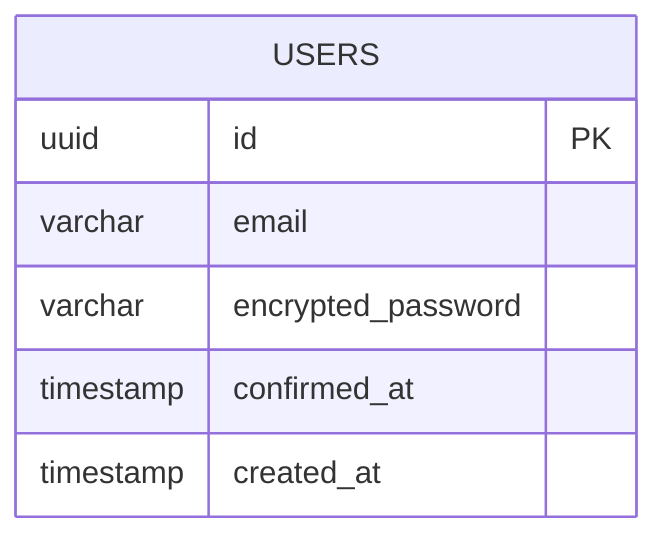

**Nota:** Schema minimo (Supabase/GoTrue). La tabla principal de identidad es `auth_management.profiles`.

---

## 2. SCHEMA: auth_management (17 tablas)

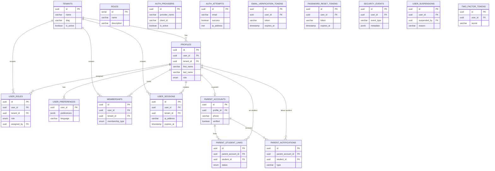

**Cross-schema:** `PROFILES.user_id` → `auth.USERS(id)`, `EMAIL_VERIFICATION_TOKENS.user_id` → `auth.USERS(id)`, `PASSWORD_RESET_TOKENS.user_id` → `auth.USERS(id)`, `SECURITY_EVENTS.user_id` → `auth.USERS(id)`, `USER_SUSPENSIONS.user_id` → `auth.USERS(id)`

---

## 3. SCHEMA: gamification_system (21 tablas)

```mermaid
erDiagram
    MAYA_RANKS {
        serial id PK
        varchar name
        integer min_xp
        integer max_xp
        float xp_multiplier
    }
    USER_STATS {
        uuid id PK
        uuid user_id FK
        integer total_xp
        integer ml_coins
        integer current_streak
    }
    USER_RANKS {
        uuid id PK
        uuid user_id FK
        integer current_rank_id
        integer total_xp
    }
    ACHIEVEMENTS {
        uuid id PK
        varchar name
        varchar category
        jsonb criteria
    }
    ACHIEVEMENT_CATEGORIES {
        serial id PK
        varchar name
        varchar description
    }
    USER_ACHIEVEMENTS {
        uuid id PK
        uuid user_id FK
        uuid achievement_id FK
        timestamp unlocked_at
    }
    MISSIONS {
        uuid id PK
        uuid user_id FK
        varchar title
        enum type
        boolean completed
    }
    MISSION_TEMPLATES {
        uuid id PK
        varchar title
        enum frequency
        jsonb requirements
    }
    ML_COINS_TRANSACTIONS {
        uuid id PK
        uuid user_id FK
        integer amount
        enum transaction_type
        varchar description
    }
    COMODINES_INVENTORY {
        uuid id PK
        uuid user_id FK
        varchar comodin_type
        integer quantity
    }
    COMODIN_USAGE_LOGS {
        uuid id PK
        uuid user_id
        varchar comodin_type
        timestamp used_at
    }
    COMODIN_USAGE_TRACKINGS {
        uuid id PK
        uuid user_id
        varchar tracking_data
    }
    COMODIN_USES {
        uuid id PK
        uuid user_id
        varchar comodin_type
    }
    INVENTORY_TRANSACTIONS {
        uuid id PK
        uuid user_id FK
        varchar item_type
        integer quantity
    }
    SHOP_ITEMS {
        uuid id PK
        varchar name
        integer price_ml_coins
        uuid category_id FK
    }
    SHOP_CATEGORIES {
        serial id PK
        varchar name
    }
    USER_PURCHASES {
        uuid id PK
        uuid user_id
        uuid item_id
        timestamp purchased_at
    }
    ACTIVE_BOOSTS {
        uuid id PK
        uuid user_id
        varchar boost_type
        timestamp expires_at
    }
    LEADERBOARD_METADATAS {
        uuid id PK
        varchar type
        jsonb config
    }

    USER_STATS ||--|| USER_RANKS : "tracks rank"
    ACHIEVEMENTS ||--o{ USER_ACHIEVEMENTS : "unlocked by"
    SHOP_CATEGORIES ||--o{ SHOP_ITEMS : "contains"
    MISSION_TEMPLATES ||--o{ MISSIONS : "generates"
```

**Cross-schema:** `USER_STATS.user_id` → `auth_management.profiles(id)`, `USER_RANKS.user_id` → `auth_management.profiles(id)`, `USER_ACHIEVEMENTS.user_id` → `auth_management.profiles(id)`, `ML_COINS_TRANSACTIONS.user_id` → `auth_management.profiles(id)`, `MISSIONS.user_id` → `auth_management.profiles(id)`, `COMODINES_INVENTORY.user_id` → `auth_management.profiles(id)`, `INVENTORY_TRANSACTIONS.user_id` → `auth_management.profiles(id)`

---

## 4. SCHEMA: educational_content (22 tablas)

```mermaid
erDiagram
    MODULES {
        uuid id PK
        varchar title
        integer order_index
        enum status
        uuid tenant_id FK
        uuid created_by FK
    }
    EXERCISES {
        uuid id PK
        uuid module_id FK
        varchar title
        enum exercise_type
        integer difficulty_level
        uuid created_by FK
    }
    EXERCISE_TYPES {
        serial id PK
        varchar name
        varchar mechanic
    }
    EXERCISE_MECHANIC_MAPPINGS {
        uuid id PK
        uuid exercise_id
        varchar mechanic_type
    }
    ASSESSMENT_RUBRICS {
        uuid id PK
        uuid exercise_id FK
        uuid module_id FK
        jsonb criteria
    }
    DIFFICULTY_CRITERIA {
        uuid id PK
        integer level
        jsonb criteria
    }
    EXERCISE_VALIDATION_CONFIGS {
        uuid id PK
        uuid exercise_type_id
        jsonb config
    }
    EXERCISE_VALIDATION_AUDITS {
        uuid id PK
        uuid exercise_id FK
        varchar result
        uuid original_audit_id FK
    }
    ASSIGNMENTS {
        uuid id PK
        uuid teacher_id FK
        varchar title
        timestamp due_date
    }
    ASSIGNMENT_STUDENTS {
        uuid id PK
        uuid assignment_id FK
        uuid student_id FK
        numeric score
        enum status
    }
    ASSIGNMENT_EXERCISES {
        uuid id PK
        uuid assignment_id FK
        uuid exercise_id FK
    }
    ASSIGNMENT_SUBMISSIONS {
        uuid id PK
        uuid assignment_id FK
        uuid student_id FK
        jsonb answers
        uuid graded_by FK
    }
    CLASSROOM_MODULES {
        uuid id PK
        uuid classroom_id
        uuid module_id
    }
    MEDIA_ATTACHMENTS {
        uuid id PK
        uuid exercise_id FK
        uuid submission_id FK
        uuid user_id FK
        varchar file_url
    }
    MEDIA_RESOURCES {
        uuid id PK
        varchar url
        varchar type
        uuid created_by FK
    }
    TEACHER_CONTENTS {
        uuid id PK
        uuid teacher_id FK
        varchar title
        uuid parent_id FK
    }
    CONTENT_TAGS {
        uuid id PK
        varchar tag_name
        uuid created_by FK
    }
    CONTENT_APPROVALS {
        uuid id PK
        uuid submitted_by FK
        uuid reviewed_by FK
        enum status
    }
    CONTENT_METADATAS {
        uuid id PK
        varchar key
        jsonb value
    }
    MODULE_DEPENDENCIES {
        uuid module_id FK
        uuid prerequisite_module_id FK
    }

    MODULES ||--o{ EXERCISES : "contains"
    MODULES ||--o{ ASSESSMENT_RUBRICS : "has rubrics"
    MODULES ||--o{ MODULE_DEPENDENCIES : "depends on"
    EXERCISES ||--o{ ASSESSMENT_RUBRICS : "graded by"
    EXERCISES ||--o{ EXERCISE_VALIDATION_AUDITS : "audited"
    EXERCISES ||--o{ ASSIGNMENT_EXERCISES : "assigned in"
    EXERCISES ||--o{ MEDIA_ATTACHMENTS : "has media"
    ASSIGNMENTS ||--o{ ASSIGNMENT_STUDENTS : "assigned to"
    ASSIGNMENTS ||--o{ ASSIGNMENT_EXERCISES : "includes"
    ASSIGNMENTS ||--o{ ASSIGNMENT_SUBMISSIONS : "receives"
    TEACHER_CONTENTS }o--o| TEACHER_CONTENTS : "parent/child"
```

**Cross-schema:** `MODULES.tenant_id` → `auth_management.tenants(id)`, `MODULES.created_by` → `auth_management.profiles(id)`, `EXERCISES.created_by` → `auth_management.profiles(id)`, `ASSIGNMENTS.teacher_id` → `auth_management.profiles(id)`, `ASSIGNMENT_STUDENTS.student_id` → `auth_management.profiles(id)`, `MEDIA_ATTACHMENTS.submission_id` → `progress_tracking.exercise_submissions(id)`

---

## 5. SCHEMA: progress_tracking (20 tablas)

```mermaid
erDiagram
    MODULE_PROGRESS {
        uuid id PK
        uuid user_id FK
        uuid module_id FK
        numeric percentage
        enum status
    }
    EXERCISE_SUBMISSIONS {
        uuid id PK
        uuid user_id FK
        uuid exercise_id FK
        jsonb answers
        numeric score
    }
    EXERCISE_ATTEMPTS {
        uuid id PK
        uuid user_id FK
        uuid exercise_id FK
        integer attempt_number
        numeric score
    }
    LEARNING_SESSIONS {
        uuid id PK
        uuid user_id FK
        uuid module_id FK
        uuid exercise_id FK
        integer duration_seconds
    }
    MANUAL_REVIEWS {
        uuid id PK
        uuid submission_id FK
        uuid reviewer_id FK
        numeric score
        text feedback
    }
    SCHEDULED_MISSIONS {
        uuid id PK
        uuid scheduled_by FK
        varchar cron_expression
    }
    LEARNING_PATHS {
        uuid id PK
        varchar title
        uuid created_by FK
    }
    USER_LEARNING_PATHS {
        uuid user_id FK
        uuid learning_path_id FK
        numeric progress
    }
    MASTERY_TRACKINGS {
        uuid id PK
        uuid user_id FK
        uuid module_id FK
        numeric mastery_level
    }
    SKILL_ASSESSMENTS {
        uuid id PK
        uuid user_id FK
        uuid assessed_by_module_id FK
        numeric score
    }
    MODULE_COMPLETION_TRACKINGS {
        uuid id PK
        uuid user_id FK
        uuid module_id FK
        timestamp completed_at
    }
    USER_DIFFICULTY_PROGRESSES {
        uuid id PK
        uuid user_id FK
        integer current_level
    }
    PROGRESS_SNAPSHOTS {
        uuid id PK
        uuid user_id FK
        jsonb snapshot_data
    }
    USER_CURRENT_LEVELS {
        uuid user_id PK
        integer current_level
    }
    ENGAGEMENT_METRICS {
        uuid id PK
        uuid user_id FK
        jsonb metrics
    }
    TEACHER_NOTES {
        uuid id PK
        uuid teacher_id FK
        uuid student_id FK
        text note
    }
    TEACHER_INTERVENTIONS {
        uuid id PK
        uuid teacher_id FK
        uuid student_id FK
        uuid alert_id FK
        uuid classroom_id FK
    }
    STUDENT_INTERVENTION_ALERTS {
        uuid id PK
        uuid student_id FK
        uuid classroom_id FK
        uuid acknowledged_by FK
        uuid resolved_by FK
    }
    TEACHER_ALERT_CONFIGURATIONS {
        uuid id PK
        uuid teacher_id FK
        uuid classroom_id FK
        jsonb config
    }
    CERTIFICATES {
        uuid id PK
        uuid user_id FK
        uuid module_id FK
        uuid classroom_id FK
    }

    EXERCISE_SUBMISSIONS ||--o{ MANUAL_REVIEWS : "reviewed"
    LEARNING_PATHS ||--o{ USER_LEARNING_PATHS : "enrolled"
    STUDENT_INTERVENTION_ALERTS ||--o{ TEACHER_INTERVENTIONS : "triggers"
    MODULE_PROGRESS }o--|| EXERCISE_SUBMISSIONS : "tracks"
```

**Cross-schema:** `MODULE_PROGRESS.module_id` → `educational_content.modules(id)`, `EXERCISE_SUBMISSIONS.exercise_id` → `educational_content.exercises(id)`, `EXERCISE_ATTEMPTS.exercise_id` → `educational_content.exercises(id)`, `LEARNING_SESSIONS.module_id` → `educational_content.modules(id)`, `MASTERY_TRACKINGS.module_id` → `educational_content.modules(id)`, `CERTIFICATES.classroom_id` → `social_features.classrooms(id)`, `TEACHER_INTERVENTIONS.classroom_id` → `social_features.classrooms(id)`, all `user_id` → `auth_management.profiles(id)`

---

## 6. SCHEMA: social_features (30 tablas)

```mermaid
erDiagram
    SCHOOLS {
        uuid id PK
        varchar name
        uuid principal_id FK
        uuid tenant_id FK
    }
    CLASSROOMS {
        uuid id PK
        uuid school_id FK
        uuid teacher_id FK
        varchar name
        uuid tenant_id FK
    }
    CLASSROOM_MEMBERS {
        uuid id PK
        uuid classroom_id FK
        uuid student_id FK
        uuid enrolled_by FK
    }
    TEACHER_CLASSROOMS {
        uuid id PK
        uuid teacher_id FK
        uuid classroom_id FK
    }
    TEAMS {
        uuid id PK
        varchar name
        uuid leader_id
    }
    TEAM_MEMBERS {
        uuid id PK
        uuid team_id FK
        uuid user_id FK
        enum role
    }
    FRIENDSHIPS {
        uuid id PK
        uuid user_id FK
        uuid friend_id FK
    }
    FRIEND_REQUESTS {
        uuid id PK
        uuid requester_id FK
        uuid recipient_id FK
        enum status
    }
    GUILDS {
        uuid id PK
        varchar name
        uuid leader_id FK
        integer emblem_id FK
    }
    GUILD_MEMBERS {
        uuid id PK
        uuid guild_id FK
        uuid user_id FK
        enum role
    }
    GUILD_JOIN_REQUESTS {
        uuid id PK
        uuid guild_id FK
        uuid requester_id FK
        uuid responded_by FK
    }
    GUILD_MISSIONS {
        uuid id PK
        uuid guild_id FK
        varchar title
        enum status
    }
    GUILD_MISSION_CONTRIBUTIONS {
        uuid id PK
        uuid mission_id FK
        uuid user_id FK
        integer points
    }
    GUILD_EMBLEMS {
        serial id PK
        varchar name
        varchar image_url
    }
    PEER_CHALLENGES {
        uuid id PK
        uuid created_by FK
        uuid module_id FK
        uuid exercise_id FK
        enum status
    }
    CHALLENGE_PARTICIPANTS {
        uuid id PK
        uuid challenge_id FK
        uuid user_id FK
        numeric score
    }
    CHALLENGE_RESULTS {
        uuid id PK
        uuid challenge_id FK
        uuid winner_id FK
    }
    ASSIGNMENT_CLASSROOMS {
        uuid assignment_id FK
        uuid classroom_id FK
    }
    DISCUSSION_THREADS {
        uuid id PK
        uuid classroom_id FK
        uuid team_id FK
        uuid created_by FK
        varchar title
    }
    SOCIAL_INTERACTIONS {
        uuid id PK
        uuid user_id FK
        uuid target_user_id FK
        enum type
    }
    USER_FOLLOWS {
        uuid follower_id FK
        uuid following_id FK
    }
    USER_SKILL_RATINGS {
        uuid id PK
        uuid user_id FK
        varchar skill_name
        numeric rating
    }
    USER_BLOCKS {
        uuid id PK
        uuid blocker_id FK
        uuid blocked_id FK
    }
    USER_REPORTS {
        uuid id PK
        uuid reporter_id FK
        uuid reported_user_id FK
        uuid assigned_to FK
        uuid resolved_by FK
    }
    TEAM_VS_TEAM_CHALLENGES {
        uuid id PK
        uuid team_a_captain_id FK
        uuid team_b_captain_id FK
        uuid created_by FK
        uuid module_id FK
    }
    SCHEDULED_REPORTS {
        uuid id PK
        uuid teacher_id FK
        uuid classroom_id FK
    }
    TEACHER_REPORTS {
        uuid id PK
        uuid teacher_id
    }
    SHARED_REPORTS {
        uuid id PK
        uuid report_id FK
        uuid shared_by FK
        uuid shared_with FK
    }

    SCHOOLS ||--o{ CLASSROOMS : "has"
    CLASSROOMS ||--o{ CLASSROOM_MEMBERS : "enrolls"
    CLASSROOMS ||--o{ TEACHER_CLASSROOMS : "taught by"
    CLASSROOMS ||--o{ ASSIGNMENT_CLASSROOMS : "has assignments"
    CLASSROOMS ||--o{ DISCUSSION_THREADS : "discusses"
    TEAMS ||--o{ TEAM_MEMBERS : "has"
    TEAMS ||--o{ DISCUSSION_THREADS : "discusses"
    GUILDS ||--o{ GUILD_MEMBERS : "has"
    GUILDS ||--o{ GUILD_JOIN_REQUESTS : "receives"
    GUILDS ||--o{ GUILD_MISSIONS : "runs"
    GUILD_EMBLEMS ||--o{ GUILDS : "displayed on"
    GUILD_MISSIONS ||--o{ GUILD_MISSION_CONTRIBUTIONS : "tracked"
    PEER_CHALLENGES ||--o{ CHALLENGE_PARTICIPANTS : "participates"
    PEER_CHALLENGES ||--|| CHALLENGE_RESULTS : "has result"
    TEACHER_REPORTS ||--o{ SHARED_REPORTS : "shared"
```

**Cross-schema:** `CLASSROOMS.teacher_id` → `auth_management.profiles(id)`, `ASSIGNMENT_CLASSROOMS.assignment_id` → `educational_content.assignments(id)`, `PEER_CHALLENGES.module_id` → `educational_content.modules(id)`, `PEER_CHALLENGES.exercise_id` → `educational_content.exercises(id)`, `TEAM_VS_TEAM_CHALLENGES.module_id` → `educational_content.modules(id)`
**H-032 (STALE FKs):** `DISCUSSION_THREADS.created_by` → `auth.users(id)` (should be profiles), `SOCIAL_INTERACTIONS.user_id` → `auth.users(id)`, `USER_FOLLOWS.follower_id` → `auth.users(id)`

---

## 7. SCHEMA: content_management (10 tablas)

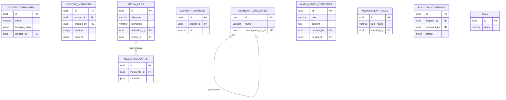

**Cross-schema:** All `created_by`, `uploaded_by`, `flagged_by`, `reviewed_by` → `auth_management.profiles(id)`, `tenant_id` → `auth_management.tenants(id)`

---

## 8. SCHEMA: communication (4 tablas)

```mermaid
erDiagram
    MESSAGES {
        uuid id PK
        uuid sender_id FK
        uuid recipient_id FK
        uuid classroom_id FK
        uuid thread_id FK
        uuid reply_to_id FK
        text content
    }
    MESSAGE_PARTICIPANTS {
        uuid id PK
        uuid message_id FK
        uuid user_id FK
        boolean read
    }
    CONVERSATIONS {
        uuid id PK
        varchar title
        enum type
    }
    CONVERSATION_PARTICIPANTS {
        uuid id PK
        uuid conversation_id FK
        uuid user_id FK
        uuid classroom_id FK
    }

    MESSAGES ||--o{ MESSAGE_PARTICIPANTS : "sent to"
    MESSAGES }o--o| MESSAGES : "reply/thread"
    CONVERSATIONS ||--o{ CONVERSATION_PARTICIPANTS : "has"
```

**Cross-schema:** `MESSAGES.sender_id/recipient_id` → `auth_management.profiles(id)`, `MESSAGES.classroom_id` → `social_features.classrooms(id)`, `CONVERSATION_PARTICIPANTS.classroom_id` → `social_features.classrooms(id)`

---

## 9. SCHEMA: notifications (7 tablas)

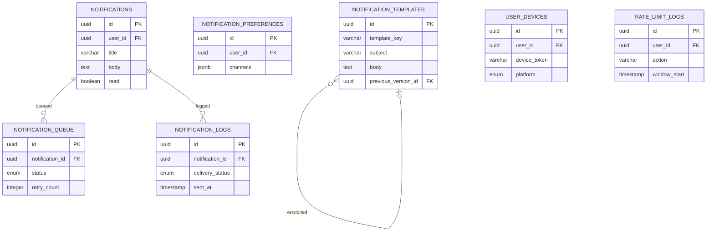

**Cross-schema:** All `user_id` → `auth_management.profiles(id)`

---

## 10. SCHEMA: admin_dashboard (3 tablas + views)

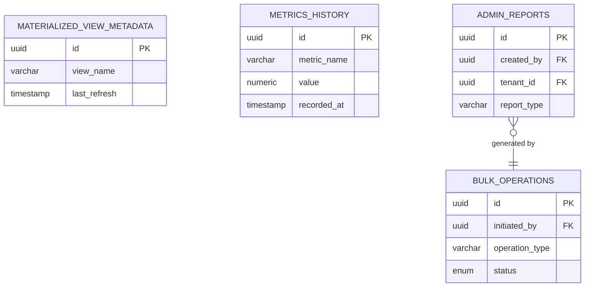

**Cross-schema:** `ADMIN_REPORTS.created_by` → `auth_management.profiles(id)`, `BULK_OPERATIONS.initiated_by` → `auth_management.profiles(id)`

---

## 11. SCHEMA: audit_logging (7 tablas)

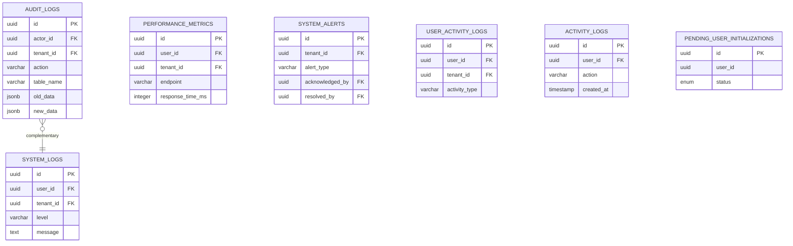

**Cross-schema:** All `user_id/actor_id` → `auth_management.profiles(id)`, `tenant_id` → `auth_management.tenants(id)`

---

## 12. SCHEMA: system_configuration (9 tablas)

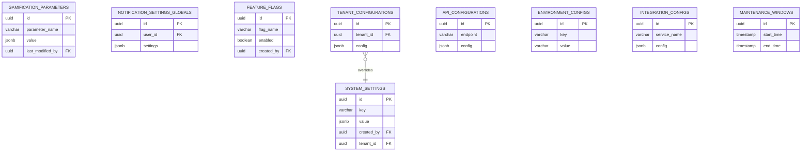

**Cross-schema:** `SYSTEM_SETTINGS.created_by/updated_by` → `auth_management.profiles(id)`, `SYSTEM_SETTINGS.tenant_id` → `auth_management.tenants(id)`, `NOTIFICATION_SETTINGS_GLOBALS.user_id` → `auth_management.profiles(id)`, `FEATURE_FLAGS.created_by` → `auth_management.profiles(id)`, `TENANT_CONFIGURATIONS.tenant_id` → `auth_management.tenants(id)`

---

## 13. SCHEMA: lti_integration (3 tablas)

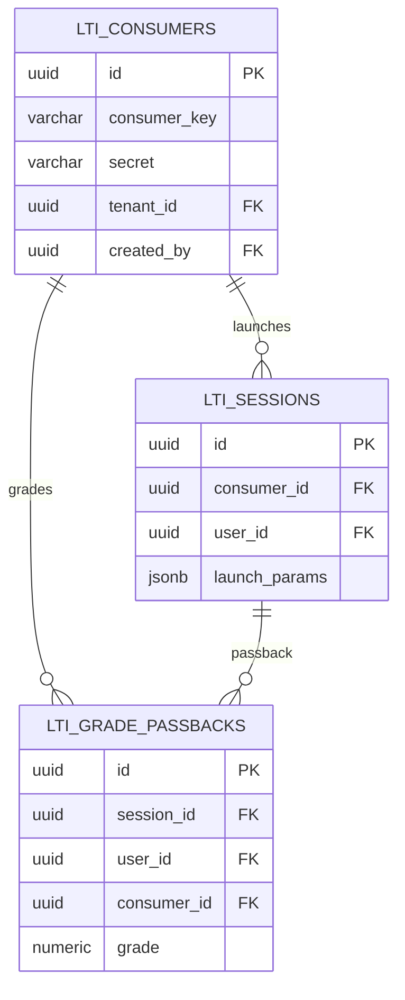

**Cross-schema:** `LTI_CONSUMERS.tenant_id` → `auth_management.tenants(id)`, `LTI_CONSUMERS.created_by` → `auth_management.profiles(id)`, `LTI_SESSIONS.user_id` → `auth_management.profiles(id)`

---

## 14. SCHEMA: data_warehouse (16 tablas)

```mermaid
erDiagram
    DIM_DATE {
        integer date_key PK
        date full_date
        integer year
        integer month
    }
    DIM_TIME {
        integer time_key PK
        time full_time
        integer hour
    }
    DIM_STUDENT {
        integer student_key PK
        uuid source_id
        varchar name
    }
    DIM_MODULE {
        integer module_key PK
        uuid source_id
        varchar title
    }
    DIM_EXERCISE {
        integer exercise_key PK
        uuid source_id
        varchar type
    }
    DIM_TEACHER {
        integer teacher_key PK
        uuid source_id
        varchar name
    }
    DIM_ACHIEVEMENT {
        integer achievement_key PK
        uuid source_id
        varchar name
    }
    DIM_EVENT_TYPE {
        integer event_type_key PK
        varchar event_name
    }
    FACT_DAILY_PROGRESS {
        uuid id PK
        integer date_key FK
        integer student_key FK
        integer module_key FK
        numeric xp_earned
    }
    FACT_EXERCISE_COMPLETIONS {
        uuid id PK
        integer date_key FK
        integer time_key FK
        integer student_key FK
        integer exercise_key FK
        integer module_key FK
        integer teacher_key FK
    }
    FACT_GAMIFICATION_EVENTS {
        uuid id PK
        integer date_key FK
        integer time_key FK
        integer student_key FK
        integer event_type_key FK
        integer achievement_key FK
        integer exercise_key FK
        integer module_key FK
    }
    FACT_TEACHER_METRICS {
        uuid id PK
        integer date_key FK
        integer teacher_key FK
        numeric avg_score
    }
    ETL_JOB_HISTORY {
        uuid id PK
        varchar job_name
        timestamp started_at
        enum status
    }
    ETL_DATA_QUALITY_LOG {
        uuid id PK
        varchar check_name
        boolean passed
    }
    ML_PREDICTION_MODELS {
        uuid id PK
        varchar model_name
        jsonb parameters
    }
    ML_STUDENT_PREDICTIONS {
        uuid id PK
        uuid student_id
        varchar prediction_type
        numeric confidence
    }

    DIM_DATE ||--o{ FACT_DAILY_PROGRESS : "date"
    DIM_STUDENT ||--o{ FACT_DAILY_PROGRESS : "student"
    DIM_MODULE ||--o{ FACT_DAILY_PROGRESS : "module"
    DIM_DATE ||--o{ FACT_EXERCISE_COMPLETIONS : "date"
    DIM_TIME ||--o{ FACT_EXERCISE_COMPLETIONS : "time"
    DIM_STUDENT ||--o{ FACT_EXERCISE_COMPLETIONS : "student"
    DIM_EXERCISE ||--o{ FACT_EXERCISE_COMPLETIONS : "exercise"
    DIM_MODULE ||--o{ FACT_EXERCISE_COMPLETIONS : "module"
    DIM_TEACHER ||--o{ FACT_EXERCISE_COMPLETIONS : "teacher"
    DIM_DATE ||--o{ FACT_GAMIFICATION_EVENTS : "date"
    DIM_STUDENT ||--o{ FACT_GAMIFICATION_EVENTS : "student"
    DIM_EVENT_TYPE ||--o{ FACT_GAMIFICATION_EVENTS : "type"
    DIM_DATE ||--o{ FACT_TEACHER_METRICS : "date"
    DIM_TEACHER ||--o{ FACT_TEACHER_METRICS : "teacher"
```

**Nota:** Schema DW no tiene entities TypeORM (acceso SQL directo). Decision arquitectonica documentada.

---

## 15. CROSS-SCHEMA OVERVIEW

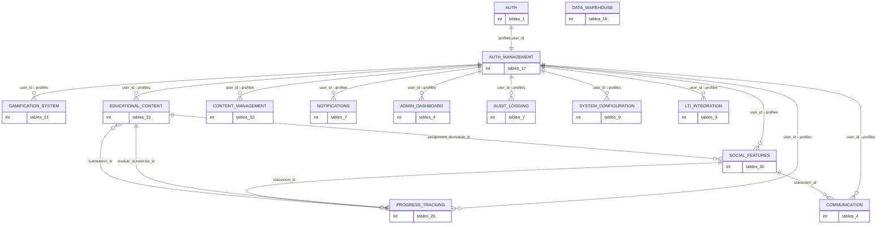

### Resumen Cross-Schema FKs

| Schema Objetivo | FKs Entrantes | Hub? |
|----------------|---------------|------|
| auth_management.profiles | ~110+ | HUB CENTRAL |
| auth_management.tenants | ~30+ | Hub secundario |
| auth.users | ~10 (5 auth_mgmt + 5 stale social) | Legacy |
| educational_content.modules | ~12 | Hub educativo |
| educational_content.exercises | ~8 | Hub ejercicios |
| social_features.classrooms | ~8 | Hub social |
| progress_tracking.exercise_submissions | ~3 | |

---

## HALLAZGOS DE FASE-4 (Diagrama ER)

1. **auth_management.profiles** es el HUB CENTRAL con 110+ FKs entrantes de 12 schemas
2. **auth_management.tenants** es el segundo hub con 30+ FKs (multi-tenancy)
3. **6 FKs stale** apuntan a `auth.users` en lugar de `auth_management.profiles` (H-032)
4. **data_warehouse** es el unico schema completamente autocontenido (star schema)
5. **communication** depende de social_features.classrooms ademas de auth_management

---

*Diagrama ER v1.0.0 - 2026-02-05 (FASE-4 TAREA 4.1.1)*
