# WS10 - Diagramas de Flujo Completos

**Fecha:** 2026-02-21
**Objetivo:** Documentar con diagramas Mermaid todos los flujos principales de los 4 portales + flujos cross-portal
**Total de diagramas:** 55
**Fuente:** Analisis directo del codigo fuente en `apps/frontend/src/`

---

## Indice

### 1. Admin Flows (16 diagramas)
1.1 Login a Dashboard
1.2 Gestion de Usuarios (CRUD)
1.3 Gestion de Roles y Permisos
1.4 Gestion de Instituciones
1.5 Asignacion Aula-Docente
1.6 Gestion de Contenido
1.7 Asistente de Creacion de Ejercicios (Wizard 4 pasos)
1.8 Configuracion de Gamificacion
1.9 Gestion de Asignaciones
1.10 Monitoreo del Sistema
1.11 Configuracion del Sistema (Settings)
1.12 Gestion de Alertas
1.13 Centro de Notificaciones
1.14 Generacion de Reportes
1.15 Integracion LTI
1.16 Configuracion de Branding/Marca Blanca

### 2. Teacher Flows (15 diagramas)
2.1 Login a Dashboard
2.2 Gestion de Aulas
2.3 Lista de Estudiantes y Vista de Progreso
2.4 Creacion de Asignaciones (Wizard)
2.5 Revision Manual de Ejercicios (Modulos 3-5)
2.6 Generacion de Reportes
2.7 Calificacion de Entregas
2.8 Comunicacion con Padres
2.9 Dashboard de Analiticas
2.10 Seguimiento de Asignaciones
2.11 Monitoreo de Estudiantes
2.12 Reportes Programados
2.13 Recursos Compartidos
2.14 Alertas de Intervencion
2.15 Configuracion de Alertas del Docente

### 3. Student Flows (20 diagramas)
3.1 Login a Dashboard
3.2 Seleccion de Modulo
3.3 Flujo Completo de Ejercicio (Start-Execute-Submit-Feedback)
3.4 Maquina de Estados del Ejercicio
3.5 Modulo 1 - Comprension Literal
3.6 Modulo 2 - Comprension Inferencial
3.7 Modulo 3 - Comprension Critica
3.8 Modulo 4 - Alfabetizacion Digital
3.9 Modulo 5 - Produccion Creativa
3.10 Gamificacion: Ganancia de XP
3.11 Gamificacion: Progresion de Rangos Maya
3.12 Gamificacion: Desbloqueo de Logros
3.13 Gamificacion: Compra en Tienda con ML Coins
3.14 Vista de Leaderboard
3.15 Sistema de Misiones/Quests
3.16 Gestion de Perfil
3.17 Seguimiento de Progreso
3.18 Vista de Asignaciones
3.19 Funciones Sociales (Amigos, Gremios)
3.20 Centro de Notificaciones

### 4. Parent Flows (4 diagramas)
4.1 Login a Dashboard
4.2 Vinculacion con Estudiante
4.3 Vista de Progreso del Hijo
4.4 Preferencias de Notificaciones

### 5. Cross-Portal Flows (3 diagramas + extra)
5.1 Autenticacion + Ruteo Basado en Roles
5.2 Sistema de Entrega de Notificaciones
5.3 Gestion de Sesion

---

## 1. Admin Flows

### 1.1 Login a Dashboard

Flujo de autenticacion del administrador. Usa `LoginPage` con `LoginForm` que invoca `useAuth().login()` de `AuthContext`.
Tras login exitoso, `getRoleBasedRedirect('super_admin')` retorna `/admin/dashboard`.

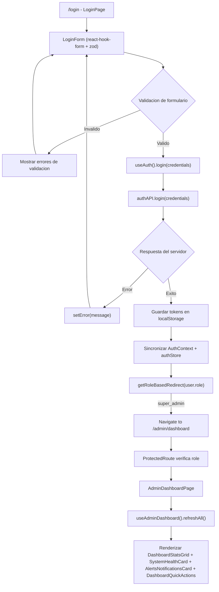
```mermaid
flowchart TD
    A["/login - LoginPage"] --> B["LoginForm (react-hook-form + zod)"]
    B --> C{"Validacion de formulario"}
    C -->|Invalido| D["Mostrar errores de validacion"]
    D --> B
    C -->|Valido| E["useAuth().login(credentials)"]
    E --> F["authAPI.login(credentials)"]
    F --> G{"Respuesta del servidor"}
    G -->|Error| H["setError(message)"]
    H --> B
    G -->|Exito| I["Guardar tokens en localStorage"]
    I --> J["Sincronizar AuthContext + authStore"]
    J --> K["getRoleBasedRedirect(user.role)"]
    K -->|super_admin| L["Navigate to /admin/dashboard"]
    L --> M["ProtectedRoute verifica role"]
    M --> N["AdminDashboardPage"]
    N --> O["useAdminDashboard().refreshAll()"]
    O --> P["Renderizar DashboardStatsGrid + SystemHealthCard + AlertsNotificationsCard + DashboardQuickActions"]
```

### 1.2 Gestion de Usuarios (CRUD)

Pagina `AdminUsersPage` que usa `useUserManagement`, `useUserActions`, y `useCreateUserFlow`.

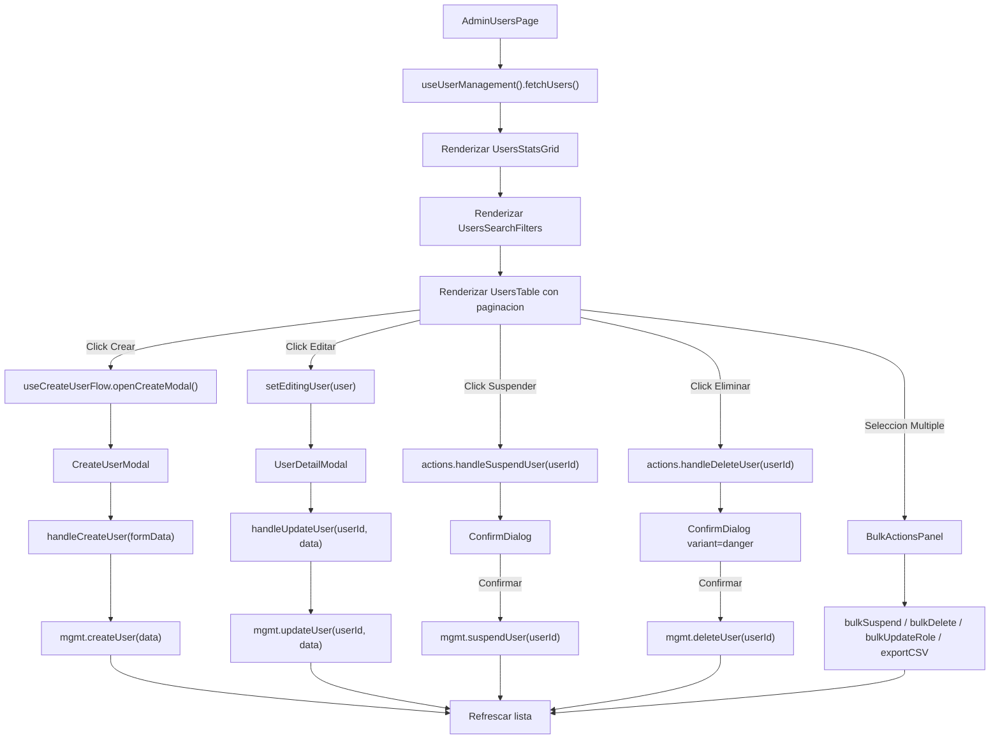
```mermaid
flowchart TD
    A["AdminUsersPage"] --> B["useUserManagement().fetchUsers()"]
    B --> C["Renderizar UsersStatsGrid"]
    C --> D["Renderizar UsersSearchFilters"]
    D --> E["Renderizar UsersTable con paginacion"]

    E -->|Click Crear| F["useCreateUserFlow.openCreateModal()"]
    F --> G["CreateUserModal"]
    G --> H["handleCreateUser(formData)"]
    H --> I["mgmt.createUser(data)"]
    I --> J["Refrescar lista"]

    E -->|Click Editar| K["setEditingUser(user)"]
    K --> L["UserDetailModal"]
    L --> M["handleUpdateUser(userId, data)"]
    M --> N["mgmt.updateUser(userId, data)"]
    N --> J

    E -->|Click Suspender| O["actions.handleSuspendUser(userId)"]
    O --> P["ConfirmDialog"]
    P -->|Confirmar| Q["mgmt.suspendUser(userId)"]
    Q --> J

    E -->|Click Eliminar| R["actions.handleDeleteUser(userId)"]
    R --> S["ConfirmDialog variant=danger"]
    S -->|Confirmar| T["mgmt.deleteUser(userId)"]
    T --> J

    E -->|Seleccion Multiple| U["BulkActionsPanel"]
    U --> V["bulkSuspend / bulkDelete / bulkUpdateRole / exportCSV"]
    V --> J
```

### 1.3 Gestion de Roles y Permisos

Pagina `AdminRolesPage` con `useRoles` y `useRolePermissions`.

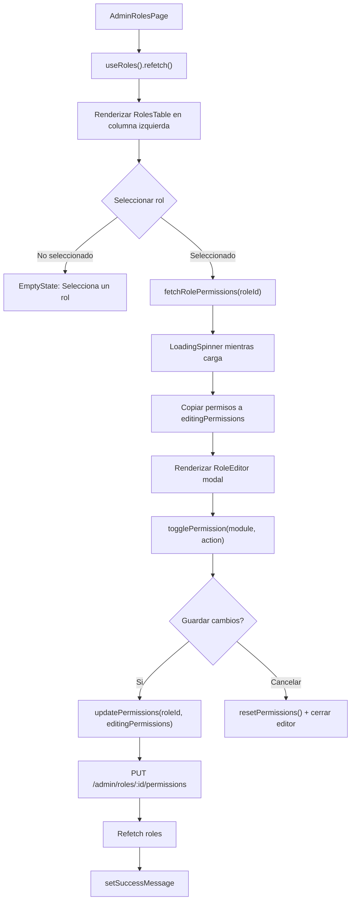
```mermaid
flowchart TD
    A["AdminRolesPage"] --> B["useRoles().refetch()"]
    B --> C["Renderizar RolesTable en columna izquierda"]
    C --> D{"Seleccionar rol"}
    D -->|No seleccionado| E["EmptyState: Selecciona un rol"]
    D -->|Seleccionado| F["fetchRolePermissions(roleId)"]
    F --> G["LoadingSpinner mientras carga"]
    G --> H["Copiar permisos a editingPermissions"]
    H --> I["Renderizar RoleEditor modal"]
    I --> J["togglePermission(module, action)"]
    J --> K{"Guardar cambios?"}
    K -->|Si| L["updatePermissions(roleId, editingPermissions)"]
    L --> M["PUT /admin/roles/:id/permissions"]
    M --> N["Refetch roles"]
    N --> O["setSuccessMessage"]
    K -->|Cancelar| P["resetPermissions() + cerrar editor"]
```

### 1.4 Gestion de Instituciones

Pagina `AdminInstitutionsPage` con `useInstitutionActions`.

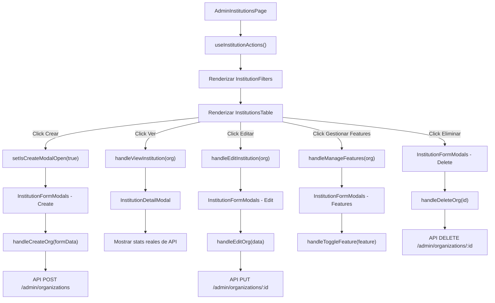
```mermaid
flowchart TD
    A["AdminInstitutionsPage"] --> B["useInstitutionActions()"]
    B --> C["Renderizar InstitutionFilters"]
    C --> D["Renderizar InstitutionsTable"]

    D -->|Click Crear| E["setIsCreateModalOpen(true)"]
    E --> F["InstitutionFormModals - Create"]
    F --> G["handleCreateOrg(formData)"]
    G --> H["API POST /admin/organizations"]

    D -->|Click Ver| I["handleViewInstitution(org)"]
    I --> J["InstitutionDetailModal"]
    J --> K["Mostrar stats reales de API"]

    D -->|Click Editar| L["handleEditInstitution(org)"]
    L --> M["InstitutionFormModals - Edit"]
    M --> N["handleEditOrg(data)"]
    N --> O["API PUT /admin/organizations/:id"]

    D -->|Click Gestionar Features| P["handleManageFeatures(org)"]
    P --> Q["InstitutionFormModals - Features"]
    Q --> R["handleToggleFeature(feature)"]

    D -->|Click Eliminar| S["InstitutionFormModals - Delete"]
    S --> T["handleDeleteOrg(id)"]
    T --> U["API DELETE /admin/organizations/:id"]
```

### 1.5 Asignacion Aula-Docente

Pagina `AdminClassroomTeacherPage` con dos tabs: `ClassroomTeachersTab` y `TeacherClassroomsTab`.

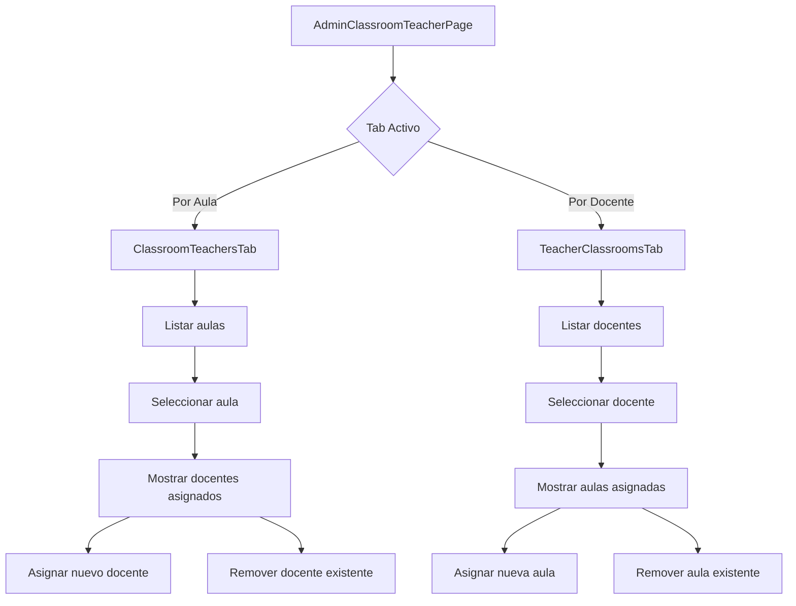
```mermaid
flowchart TD
    A["AdminClassroomTeacherPage"] --> B{"Tab Activo"}
    B -->|Por Aula| C["ClassroomTeachersTab"]
    B -->|Por Docente| D["TeacherClassroomsTab"]

    C --> E["Listar aulas"]
    E --> F["Seleccionar aula"]
    F --> G["Mostrar docentes asignados"]
    G --> H["Asignar nuevo docente"]
    G --> I["Remover docente existente"]

    D --> J["Listar docentes"]
    J --> K["Seleccionar docente"]
    K --> L["Mostrar aulas asignadas"]
    L --> M["Asignar nueva aula"]
    L --> N["Remover aula existente"]
```

### 1.6 Gestion de Contenido

Pagina `AdminContentPage` con tres tabs: Pendientes, Multimedia, Versiones. Usa `usePendingExercisesQuery`.

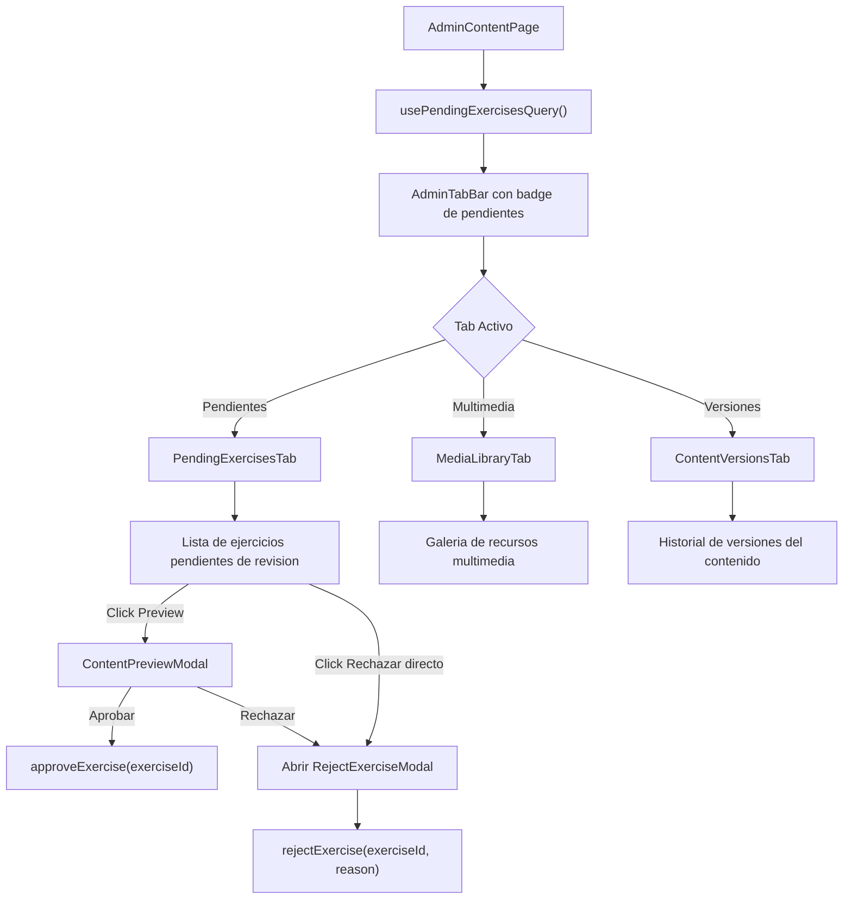
```mermaid
flowchart TD
    A["AdminContentPage"] --> B["usePendingExercisesQuery()"]
    B --> C["AdminTabBar con badge de pendientes"]
    C --> D{"Tab Activo"}

    D -->|Pendientes| E["PendingExercisesTab"]
    E --> F["Lista de ejercicios pendientes de revision"]
    F -->|Click Preview| G["ContentPreviewModal"]
    G -->|Aprobar| H["approveExercise(exerciseId)"]
    G -->|Rechazar| I["Abrir RejectExerciseModal"]
    I --> J["rejectExercise(exerciseId, reason)"]
    F -->|Click Rechazar directo| I

    D -->|Multimedia| K["MediaLibraryTab"]
    K --> L["Galeria de recursos multimedia"]

    D -->|Versiones| M["ContentVersionsTab"]
    M --> N["Historial de versiones del contenido"]
```

### 1.7 Asistente de Creacion de Ejercicios (Wizard 4 pasos)

Pagina `AdminExerciseCreatePage` con wizard de 4 pasos. Usa `useMutation` con React Query.

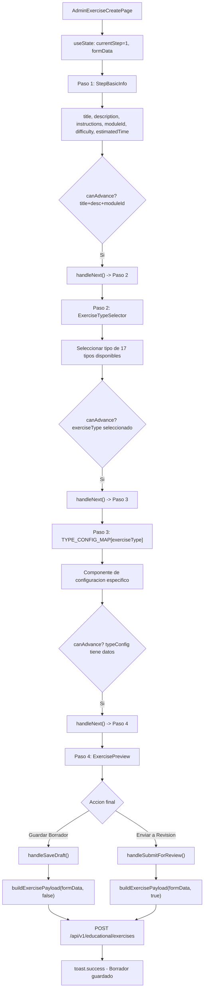
```mermaid
flowchart TD
    A["AdminExerciseCreatePage"] --> B["useState: currentStep=1, formData"]

    B --> C["Paso 1: StepBasicInfo"]
    C --> D["title, description, instructions, moduleId, difficulty, estimatedTime"]
    D --> E{"canAdvance? title+desc+moduleId"}
    E -->|Si| F["handleNext() -> Paso 2"]

    F --> G["Paso 2: ExerciseTypeSelector"]
    G --> H["Seleccionar tipo de 17 tipos disponibles"]
    H --> I{"canAdvance? exerciseType seleccionado"}
    I -->|Si| J["handleNext() -> Paso 3"]

    J --> K["Paso 3: TYPE_CONFIG_MAP[exerciseType]"]
    K --> L["Componente de configuracion especifico"]
    L --> M{"canAdvance? typeConfig tiene datos"}
    M -->|Si| N["handleNext() -> Paso 4"]

    N --> O["Paso 4: ExercisePreview"]
    O --> P{"Accion final"}
    P -->|Guardar Borrador| Q["handleSaveDraft()"]
    Q --> R["buildExercisePayload(formData, false)"]
    R --> S["POST /api/v1/educational/exercises"]
    S --> T["toast.success - Borrador guardado"]

    P -->|Enviar a Revision| U["handleSubmitForReview()"]
    U --> V["buildExercisePayload(formData, true)"]
    V --> S
```

### 1.8 Configuracion de Gamificacion

Pagina `AdminGamificationPage` con 4 tabs. Usa `useGamificationConfig`.

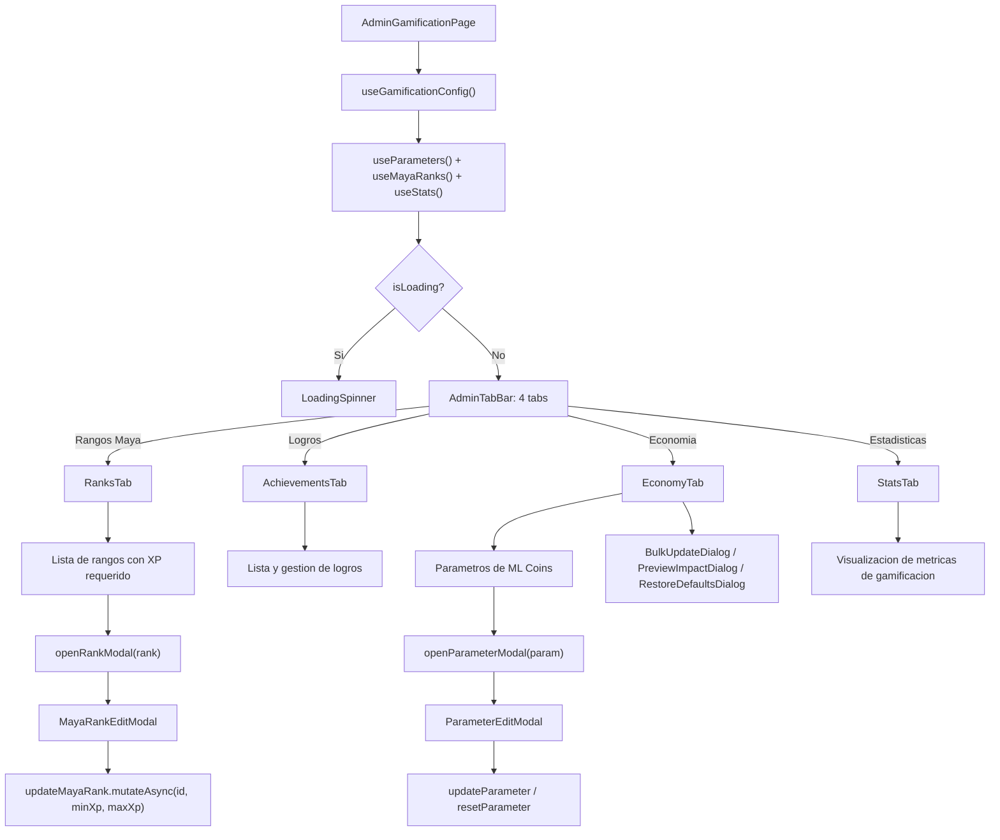
```mermaid
flowchart TD
    A["AdminGamificationPage"] --> B["useGamificationConfig()"]
    B --> C["useParameters() + useMayaRanks() + useStats()"]
    C --> D{"isLoading?"}
    D -->|Si| E["LoadingSpinner"]
    D -->|No| F["AdminTabBar: 4 tabs"]

    F -->|Rangos Maya| G["RanksTab"]
    G --> H["Lista de rangos con XP requerido"]
    H --> I["openRankModal(rank)"]
    I --> J["MayaRankEditModal"]
    J --> K["updateMayaRank.mutateAsync(id, minXp, maxXp)"]

    F -->|Logros| L["AchievementsTab"]
    L --> M["Lista y gestion de logros"]

    F -->|Economia| N["EconomyTab"]
    N --> O["Parametros de ML Coins"]
    O --> P["openParameterModal(param)"]
    P --> Q["ParameterEditModal"]
    Q --> R["updateParameter / resetParameter"]
    N --> S["BulkUpdateDialog / PreviewImpactDialog / RestoreDefaultsDialog"]

    F -->|Estadisticas| T["StatsTab"]
    T --> U["Visualizacion de metricas de gamificacion"]
```

### 1.9 Gestion de Asignaciones

Pagina `AdminAssignmentsPage` con `useAssignments`, `useAssignmentsStats`.

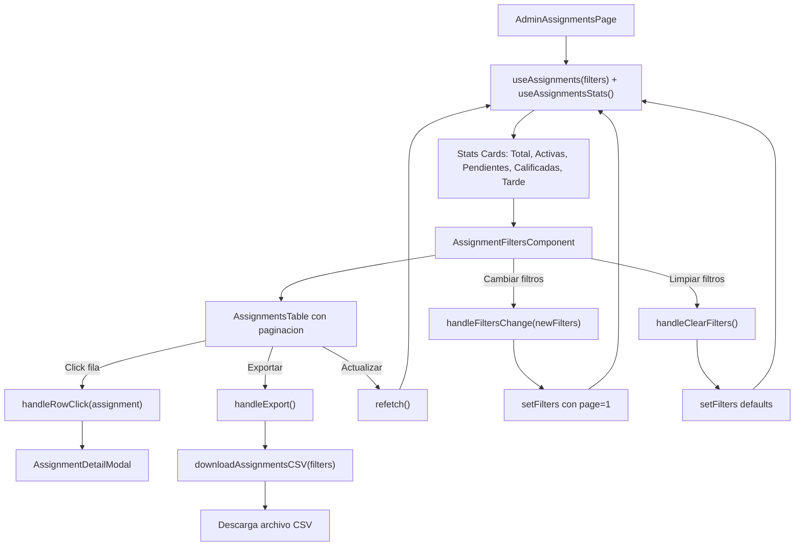
```mermaid
flowchart TD
    A["AdminAssignmentsPage"] --> B["useAssignments(filters) + useAssignmentsStats()"]
    B --> C["Stats Cards: Total, Activas, Pendientes, Calificadas, Tarde"]
    C --> D["AssignmentFiltersComponent"]
    D --> E["AssignmentsTable con paginacion"]

    E -->|Click fila| F["handleRowClick(assignment)"]
    F --> G["AssignmentDetailModal"]

    E -->|Exportar| H["handleExport()"]
    H --> I["downloadAssignmentsCSV(filters)"]
    I --> J["Descarga archivo CSV"]

    E -->|Actualizar| K["refetch()"]
    K --> B

    D -->|Cambiar filtros| L["handleFiltersChange(newFilters)"]
    L --> M["setFilters con page=1"]
    M --> B

    D -->|Limpiar filtros| N["handleClearFilters()"]
    N --> O["setFilters defaults"]
    O --> B
```

### 1.10 Monitoreo del Sistema

Pagina `AdminMonitoringPage` con 4 tabs. Usa `useMonitoring` y `useAlerts`.

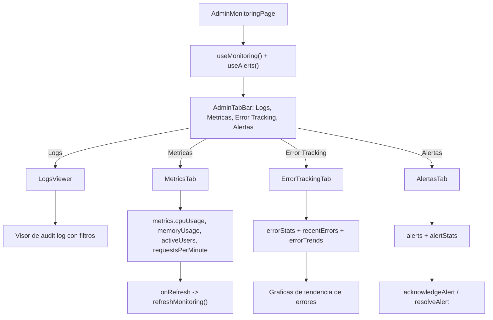
```mermaid
flowchart TD
    A["AdminMonitoringPage"] --> B["useMonitoring() + useAlerts()"]
    B --> C["AdminTabBar: Logs, Metricas, Error Tracking, Alertas"]

    C -->|Logs| D["LogsViewer"]
    D --> E["Visor de audit log con filtros"]

    C -->|Metricas| F["MetricsTab"]
    F --> G["metrics.cpuUsage, memoryUsage, activeUsers, requestsPerMinute"]
    G --> H["onRefresh -> refreshMonitoring()"]

    C -->|Error Tracking| I["ErrorTrackingTab"]
    I --> J["errorStats + recentErrors + errorTrends"]
    J --> K["Graficas de tendencia de errores"]

    C -->|Alertas| L["AlertasTab"]
    L --> M["alerts + alertStats"]
    M --> N["acknowledgeAlert / resolveAlert"]
```

### 1.11 Configuracion del Sistema (Settings)

Pagina `AdminSettingsPage` con 3 tabs: General, Seguridad, Perfil.

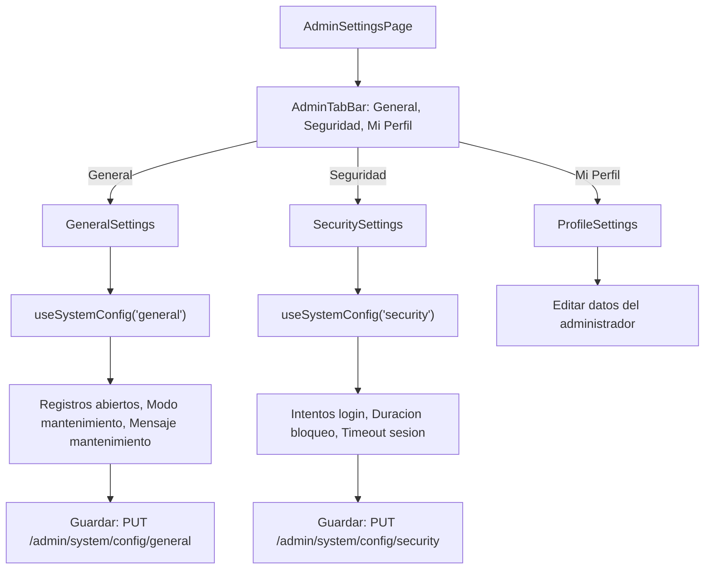
```mermaid
flowchart TD
    A["AdminSettingsPage"] --> B["AdminTabBar: General, Seguridad, Mi Perfil"]

    B -->|General| C["GeneralSettings"]
    C --> D["useSystemConfig('general')"]
    D --> E["Registros abiertos, Modo mantenimiento, Mensaje mantenimiento"]
    E --> F["Guardar: PUT /admin/system/config/general"]

    B -->|Seguridad| G["SecuritySettings"]
    G --> H["useSystemConfig('security')"]
    H --> I["Intentos login, Duracion bloqueo, Timeout sesion"]
    I --> J["Guardar: PUT /admin/system/config/security"]

    B -->|Mi Perfil| K["ProfileSettings"]
    K --> L["Editar datos del administrador"]
```

### 1.12 Gestion de Alertas

Pagina `AdminAlertsPage` con `useAlerts`. Incluye modales de acknowledge, resolve, suppress.

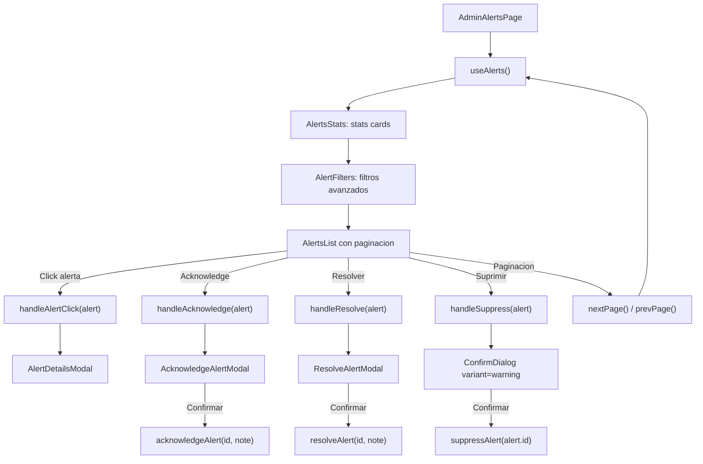
```mermaid
flowchart TD
    A["AdminAlertsPage"] --> B["useAlerts()"]
    B --> C["AlertsStats: stats cards"]
    C --> D["AlertFilters: filtros avanzados"]
    D --> E["AlertsList con paginacion"]

    E -->|Click alerta| F["handleAlertClick(alert)"]
    F --> G["AlertDetailsModal"]

    E -->|Acknowledge| H["handleAcknowledge(alert)"]
    H --> I["AcknowledgeAlertModal"]
    I -->|Confirmar| J["acknowledgeAlert(id, note)"]

    E -->|Resolver| K["handleResolve(alert)"]
    K --> L["ResolveAlertModal"]
    L -->|Confirmar| M["resolveAlert(id, note)"]

    E -->|Suprimir| N["handleSuppress(alert)"]
    N --> O["ConfirmDialog variant=warning"]
    O -->|Confirmar| P["suppressAlert(alert.id)"]

    E -->|Paginacion| Q["nextPage() / prevPage()"]
    Q --> B
```

### 1.13 Centro de Notificaciones

Pagina `AdminNotificationsPage` con `useNotificationsStore` y WebSocket en tiempo real.

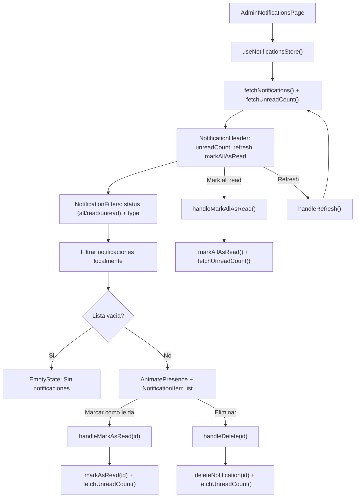
```mermaid
flowchart TD
    A["AdminNotificationsPage"] --> B["useNotificationsStore()"]
    B --> C["fetchNotifications() + fetchUnreadCount()"]
    C --> D["NotificationHeader: unreadCount, refresh, markAllAsRead"]
    D --> E["NotificationFilters: status (all/read/unread) + type"]
    E --> F["Filtrar notificaciones localmente"]
    F --> G{"Lista vacia?"}
    G -->|Si| H["EmptyState: Sin notificaciones"]
    G -->|No| I["AnimatePresence + NotificationItem list"]

    I -->|Marcar como leida| J["handleMarkAsRead(id)"]
    J --> K["markAsRead(id) + fetchUnreadCount()"]

    I -->|Eliminar| L["handleDelete(id)"]
    L --> M["deleteNotification(id) + fetchUnreadCount()"]

    D -->|Mark all read| N["handleMarkAllAsRead()"]
    N --> O["markAllAsRead() + fetchUnreadCount()"]

    D -->|Refresh| P["handleRefresh()"]
    P --> C
```

### 1.14 Generacion de Reportes

Pagina `AdminReportsPage` con `useReports`. Persistencia en PostgreSQL `admin_dashboard.admin_reports`.

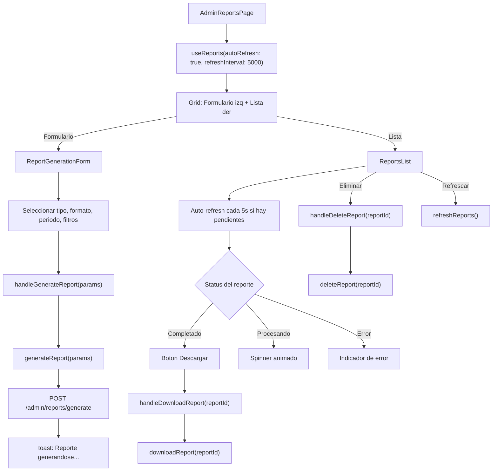
```mermaid
flowchart TD
    A["AdminReportsPage"] --> B["useReports(autoRefresh: true, refreshInterval: 5000)"]
    B --> C["Grid: Formulario izq + Lista der"]

    C -->|Formulario| D["ReportGenerationForm"]
    D --> E["Seleccionar tipo, formato, periodo, filtros"]
    E --> F["handleGenerateReport(params)"]
    F --> G["generateReport(params)"]
    G --> H["POST /admin/reports/generate"]
    H --> I["toast: Reporte generandose..."]

    C -->|Lista| J["ReportsList"]
    J --> K["Auto-refresh cada 5s si hay pendientes"]
    K --> L{"Status del reporte"}
    L -->|Completado| M["Boton Descargar"]
    M --> N["handleDownloadReport(reportId)"]
    N --> O["downloadReport(reportId)"]
    L -->|Procesando| P["Spinner animado"]
    L -->|Error| Q["Indicador de error"]

    J -->|Eliminar| R["handleDeleteReport(reportId)"]
    R --> S["deleteReport(reportId)"]

    J -->|Refrescar| T["refreshReports()"]
```

### 1.15 Integracion LTI

Pagina `AdminLtiPage` con `useLtiConsumers`. Gestion de consumidores LTI para LMS.

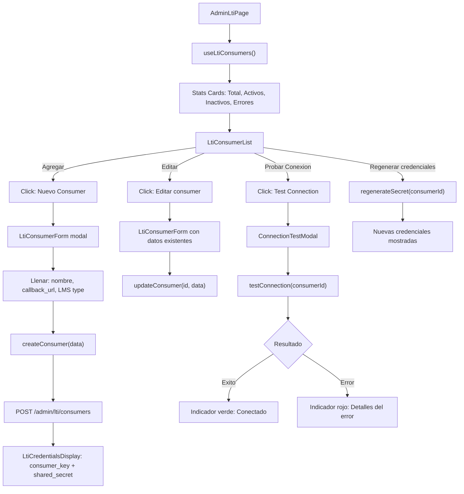
```mermaid
flowchart TD
    A["AdminLtiPage"] --> B["useLtiConsumers()"]
    B --> C["Stats Cards: Total, Activos, Inactivos, Errores"]
    C --> D["LtiConsumerList"]

    D -->|Agregar| E["Click: Nuevo Consumer"]
    E --> F["LtiConsumerForm modal"]
    F --> G["Llenar: nombre, callback_url, LMS type"]
    G --> H["createConsumer(data)"]
    H --> I["POST /admin/lti/consumers"]
    I --> J["LtiCredentialsDisplay: consumer_key + shared_secret"]

    D -->|Editar| K["Click: Editar consumer"]
    K --> L["LtiConsumerForm con datos existentes"]
    L --> M["updateConsumer(id, data)"]

    D -->|Probar Conexion| N["Click: Test Connection"]
    N --> O["ConnectionTestModal"]
    O --> P["testConnection(consumerId)"]
    P --> Q{"Resultado"}
    Q -->|Exito| R["Indicador verde: Conectado"]
    Q -->|Error| S["Indicador rojo: Detalles del error"]

    D -->|Regenerar credenciales| T["regenerateSecret(consumerId)"]
    T --> U["Nuevas credenciales mostradas"]
```

### 1.16 Configuracion de Branding/Marca Blanca

Pagina `BrandingSettingsPage` con `useBranding`, `react-hook-form`, y `brandingApi`.

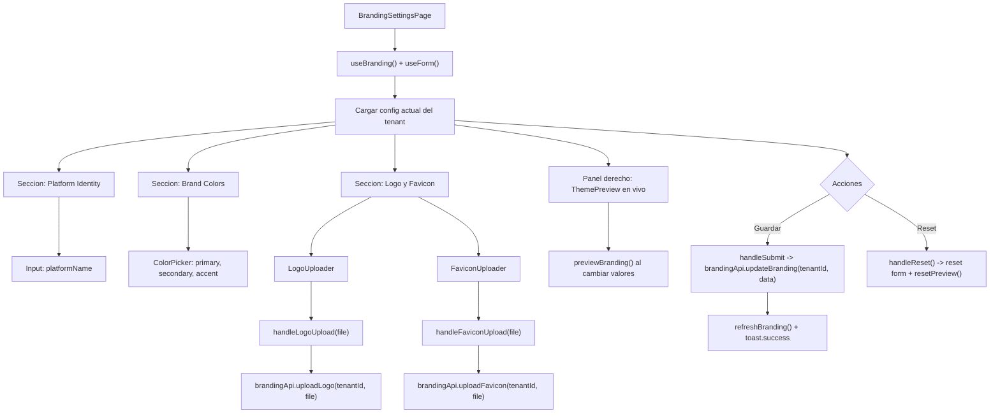
```mermaid
flowchart TD
    A["BrandingSettingsPage"] --> B["useBranding() + useForm()"]
    B --> C["Cargar config actual del tenant"]

    C --> D["Seccion: Platform Identity"]
    D --> E["Input: platformName"]

    C --> F["Seccion: Brand Colors"]
    F --> G["ColorPicker: primary, secondary, accent"]

    C --> H["Seccion: Logo y Favicon"]
    H --> I["LogoUploader"]
    I --> J["handleLogoUpload(file)"]
    J --> K["brandingApi.uploadLogo(tenantId, file)"]
    H --> L["FaviconUploader"]
    L --> M["handleFaviconUpload(file)"]
    M --> N["brandingApi.uploadFavicon(tenantId, file)"]

    C --> O["Panel derecho: ThemePreview en vivo"]
    O --> P["previewBranding() al cambiar valores"]

    C --> Q{"Acciones"}
    Q -->|Guardar| R["handleSubmit -> brandingApi.updateBranding(tenantId, data)"]
    R --> S["refreshBranding() + toast.success"]
    Q -->|Reset| T["handleReset() -> reset form + resetPreview()"]
```

---

## 2. Teacher Flows

### 2.1 Login a Dashboard

Mismo flujo de auth que admin, con redirect a `/teacher/dashboard`. Roles permitidos: `teacher`, `admin_teacher`.

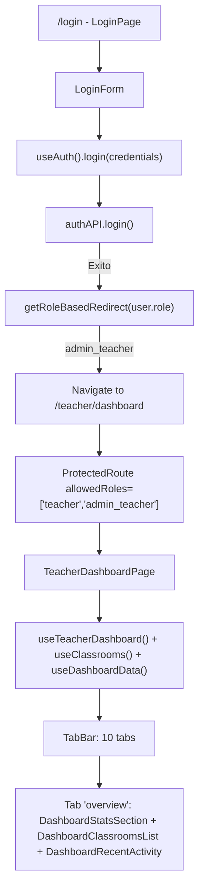
```mermaid
flowchart TD
    A["/login - LoginPage"] --> B["LoginForm"]
    B --> C["useAuth().login(credentials)"]
    C --> D["authAPI.login()"]
    D -->|Exito| E["getRoleBasedRedirect(user.role)"]
    E -->|admin_teacher| F["Navigate to /teacher/dashboard"]
    F --> G["ProtectedRoute allowedRoles=['teacher','admin_teacher']"]
    G --> H["TeacherDashboardPage"]
    H --> I["useTeacherDashboard() + useClassrooms() + useDashboardData()"]
    I --> J["TabBar: 10 tabs"]
    J --> K["Tab 'overview': DashboardStatsSection + DashboardClassroomsList + DashboardRecentActivity"]
```

### 2.2 Gestion de Aulas

Pagina `TeacherClassesPage` con `useClassrooms`. CRUD completo de aulas.

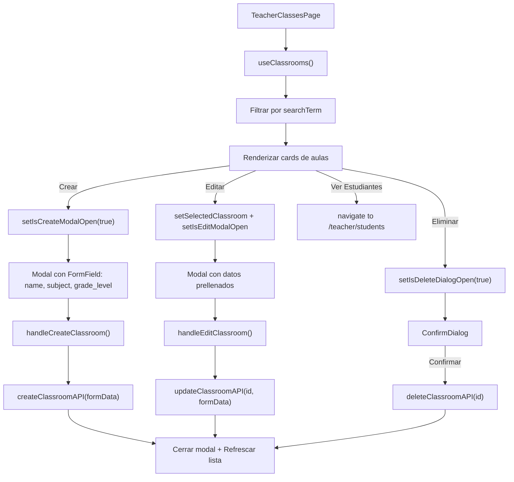
```mermaid
flowchart TD
    A["TeacherClassesPage"] --> B["useClassrooms()"]
    B --> C["Filtrar por searchTerm"]
    C --> D["Renderizar cards de aulas"]

    D -->|Crear| E["setIsCreateModalOpen(true)"]
    E --> F["Modal con FormField: name, subject, grade_level"]
    F --> G["handleCreateClassroom()"]
    G --> H["createClassroomAPI(formData)"]
    H --> I["Cerrar modal + Refrescar lista"]

    D -->|Editar| J["setSelectedClassroom + setIsEditModalOpen"]
    J --> K["Modal con datos prellenados"]
    K --> L["handleEditClassroom()"]
    L --> M["updateClassroomAPI(id, formData)"]
    M --> I

    D -->|Eliminar| N["setIsDeleteDialogOpen(true)"]
    N --> O["ConfirmDialog"]
    O -->|Confirmar| P["deleteClassroomAPI(id)"]
    P --> I

    D -->|Ver Estudiantes| Q["navigate to /teacher/students"]
```

### 2.3 Lista de Estudiantes y Vista de Progreso

Paginas `TeacherStudentsPage` y `TeacherProgressPage`.

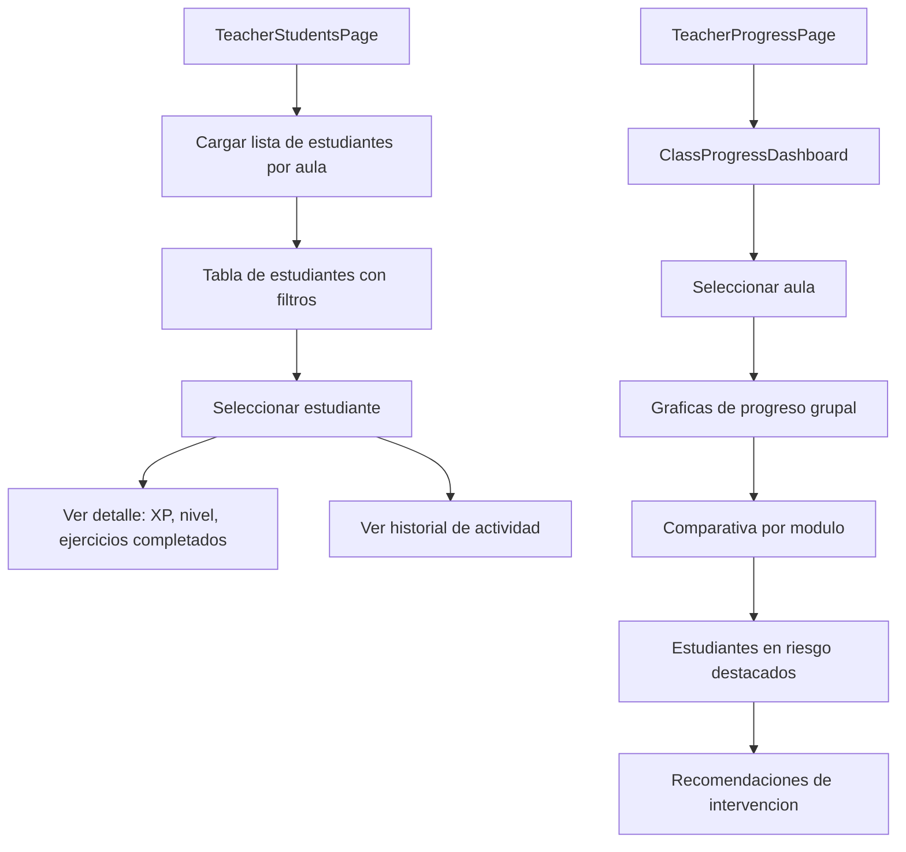
```mermaid
flowchart TD
    A["TeacherStudentsPage"] --> B["Cargar lista de estudiantes por aula"]
    B --> C["Tabla de estudiantes con filtros"]
    C --> D["Seleccionar estudiante"]
    D --> E["Ver detalle: XP, nivel, ejercicios completados"]
    D --> F["Ver historial de actividad"]

    G["TeacherProgressPage"] --> H["ClassProgressDashboard"]
    H --> I["Seleccionar aula"]
    I --> J["Graficas de progreso grupal"]
    J --> K["Comparativa por modulo"]
    K --> L["Estudiantes en riesgo destacados"]
    L --> M["Recomendaciones de intervencion"]
```

### 2.4 Creacion de Asignaciones (Wizard)

Pagina `TeacherAssignmentsPage` con `ImprovedAssignmentWizard` de 4 pasos.

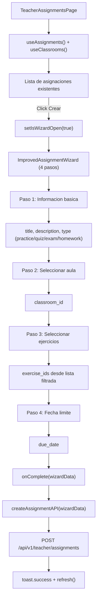
```mermaid
flowchart TD
    A["TeacherAssignmentsPage"] --> B["useAssignments() + useClassrooms()"]
    B --> C["Lista de asignaciones existentes"]
    C -->|Click Crear| D["setIsWizardOpen(true)"]
    D --> E["ImprovedAssignmentWizard (4 pasos)"]

    E --> F["Paso 1: Informacion basica"]
    F --> G["title, description, type (practice/quiz/exam/homework)"]
    G --> H["Paso 2: Seleccionar aula"]
    H --> I["classroom_id"]
    I --> J["Paso 3: Seleccionar ejercicios"]
    J --> K["exercise_ids desde lista filtrada"]
    K --> L["Paso 4: Fecha limite"]
    L --> M["due_date"]

    M --> N["onComplete(wizardData)"]
    N --> O["createAssignmentAPI(wizardData)"]
    O --> P["POST /api/v1/teacher/assignments"]
    P --> Q["toast.success + refresh()"]
```

### 2.5 Revision Manual de Ejercicios (Modulos 3-5)

Pagina `TeacherReviewPanelPage` con `useMyReviews`, `useManualReviewDetail`, `useManualReviewConfig`.

```mermaid
flowchart TD
    A["TeacherReviewPanelPage"] --> B["useMyReviews() con soporte de status"]
    B --> C["StatusTabs: Todos, Pendientes, En Progreso, Completados"]
    C --> D["Filtros: busqueda, modulo, tipo ejercicio"]
    D --> E["ReviewList"]

    E -->|Click en review| F["useManualReviewDetail(reviewId)"]
    F --> G["ReviewDetail"]
    G --> H["Ver respuesta del estudiante"]
    H --> I["Rubrica de evaluacion"]
    I --> J["Asignar puntuacion por criterio"]
    J --> K["Agregar comentarios y feedback"]
    K --> L["Enviar evaluacion"]
    L --> M["PATCH /api/v1/teacher/reviews/:id"]
    M --> N["Review marcada como completada"]
    N --> O["Refrescar lista"]
```

### 2.6 Generacion de Reportes

Pagina `TeacherReportsPage` con `reportsApi` y tabs: Generar, Recientes, Programados, Compartidos.

```mermaid
flowchart TD
    A["TeacherReportsPage"] --> B["reportsApi + classroomsApi"]
    B --> C["ReportsStatsCards + ReportsFilterBar"]
    C --> D["TabBar: Generar, Recientes, Programados, Compartidos"]

    D -->|Generar| E["ReportGenerator"]
    E --> F["Seleccionar: tipo, formato, aula, periodo"]
    F --> G["reportsApi.generateReport(params)"]
    G --> H["Descarga de archivo generado"]

    D -->|Recientes| I["RecentReportsTable"]
    I --> J["Lista con transformReportMetadata()"]
    J --> K["Descargar / Eliminar reportes"]

    D -->|Programados| L["ScheduledReportsTab"]
    L --> M["Configurar reportes automaticos"]

    D -->|Compartidos| N["SharedReportsTab"]
    N --> O["Reportes compartidos con otros docentes"]
```

### 2.7 Calificacion de Entregas

Flujo de calificacion desde `TeacherAssignmentsPage` con `GradeSubmissionModal`.

```mermaid
flowchart TD
    A["AssignmentCard"] --> B["Click: Ver entregas"]
    B --> C["getSubmissionsAPI(assignmentId)"]
    C --> D["SubmissionsModal"]
    D --> E["Lista de entregas con filtros"]

    E -->|Click Calificar| F["setSelectedSubmission(submission)"]
    F --> G["GradeSubmissionModal"]
    G --> H["Ver respuesta del estudiante"]
    H --> I["Asignar calificacion (0-100)"]
    I --> J["Agregar comentarios"]
    J --> K["gradeSubmissionAPI(submissionId, data)"]
    K --> L["POST /api/v1/teacher/submissions/:id/grade"]
    L --> M["toast.success"]
    M --> N["Refrescar lista de entregas"]

    E -->|Enviar Recordatorio| O["sendReminderAPI(assignmentId)"]
    O --> P["Notificacion enviada a estudiantes"]
```

### 2.8 Comunicacion con Padres

Pagina `TeacherCommunicationPage` con `useTeacherMessages`, `useWebSocket`, 4 tabs.

```mermaid
flowchart TD
    A["TeacherCommunicationPage"] --> B["useTeacherMessages() + useWebSocket()"]
    B --> C["TabBar: Bandeja, Conversaciones, Anuncios, Feedback"]

    C -->|Bandeja| D["MessagesList"]
    D --> E["MessageFilters por tipo y estado"]
    E --> F["Lista de mensajes con paginacion"]
    F -->|Responder| G["MessageComposer"]
    G --> H["Enviar respuesta"]

    C -->|Conversaciones| I["ConversationsList"]
    I --> J["Conversaciones agrupadas por padre/estudiante"]

    C -->|Anuncios| K["AnnouncementForm"]
    K --> L["Seleccionar aulas destinatarias"]
    L --> M["Redactar anuncio"]
    M --> N["Enviar a todos los padres de las aulas"]

    C -->|Feedback| O["FeedbackForm"]
    O --> P["Seleccionar estudiante"]
    P --> Q["Escribir feedback privado"]
    Q --> R["Enviar feedback"]
```

### 2.9 Dashboard de Analiticas

Tab `analytics` dentro de `TeacherDashboardPage` con `LearningAnalyticsDashboard`.

```mermaid
flowchart TD
    A["TeacherDashboardPage Tab: analytics"] --> B["LearningAnalyticsDashboard"]
    B --> C["Seleccionar aula"]
    C --> D["Cargar datos analiticos"]
    D --> E["Graficas de rendimiento"]
    E --> F["Distribucion de calificaciones"]
    E --> G["Tiempo promedio por ejercicio"]
    E --> H["Tasa de completacion por modulo"]
    E --> I["Tendencias semanales"]
    D --> J["Comparativa entre aulas"]
```

### 2.10 Seguimiento de Asignaciones

Tab `assignments` dentro de `TeacherDashboardPage` con `AssignmentCreator`.

```mermaid
flowchart TD
    A["TeacherDashboardPage Tab: assignments"] --> B["AssignmentCreator"]
    B --> C["Vista rapida de asignaciones activas"]
    C --> D["Deadlines proximos"]
    D --> E["Entregas pendientes de calificacion"]
    E --> F["Acciones rapidas"]
    F --> G["Crear nueva asignacion"]
    F --> H["Ver entregas"]
    F --> I["Enviar recordatorio"]
```

### 2.11 Monitoreo de Estudiantes

Tab `monitoring` dentro de `TeacherDashboardPage` con `StudentMonitoringPanel`.

```mermaid
flowchart TD
    A["TeacherDashboardPage Tab: monitoring"] --> B["StudentMonitoringPanel"]
    B --> C["Seleccionar aula"]
    C --> D["Lista de estudiantes activos"]
    D --> E["Indicadores en tiempo real"]
    E --> F["Tiempo en plataforma"]
    E --> G["Ejercicio actual"]
    E --> H["Nivel de engagement"]
    D --> I["Estudiantes inactivos destacados"]
    I --> J["Acciones: Enviar mensaje, Crear alerta"]
```

### 2.12 Reportes Programados

Tab `Programados` dentro de `TeacherReportsPage` con `ScheduledReportsTab`.

```mermaid
flowchart TD
    A["ScheduledReportsTab"] --> B["Lista de reportes programados"]
    B --> C["Frecuencia: Diaria, Semanal, Mensual"]
    C --> D{"Acciones"}
    D -->|Crear| E["Configurar nuevo reporte programado"]
    E --> F["Tipo, formato, aula, frecuencia"]
    F --> G["Guardar programacion"]
    D -->|Editar| H["Modificar programacion existente"]
    D -->|Pausar| I["Suspender temporalmente"]
    D -->|Eliminar| J["Eliminar programacion"]
```

### 2.13 Recursos Compartidos

Tab `resources` dentro de `TeacherDashboardPage` con `ResourceSharingPanel`.

```mermaid
flowchart TD
    A["TeacherDashboardPage Tab: resources"] --> B["ResourceSharingPanel"]
    B --> C["Mis recursos compartidos"]
    C --> D["Recursos de otros docentes"]
    D --> E["Filtrar por tipo y tema"]
    E --> F{"Acciones"}
    F -->|Compartir| G["Seleccionar recurso propio"]
    G --> H["Definir visibilidad"]
    H --> I["Publicar recurso"]
    F -->|Usar| J["Clonar recurso compartido"]
    J --> K["Adaptar para mis aulas"]
```

### 2.14 Alertas de Intervencion

Tab `alerts` dentro de `TeacherDashboardPage` con `InterventionAlertsPanel`.

```mermaid
flowchart TD
    A["TeacherDashboardPage Tab: alerts"] --> B["InterventionAlertsPanel"]
    B --> C["Alertas activas de estudiantes en riesgo"]
    C --> D["Tipos de alerta"]
    D --> E["Bajo rendimiento"]
    D --> F["Inactividad prolongada"]
    D --> G["Caida en racha"]
    D --> H["Ejercicios fallidos consecutivos"]
    C --> I{"Acciones por alerta"}
    I --> J["Contactar padre"]
    I --> K["Asignar ejercicio de refuerzo"]
    I --> L["Marcar como atendida"]
    I --> M["Programar seguimiento"]
```

### 2.15 Configuracion de Alertas del Docente

Pagina `TeacherAlertConfigPage` (US-PM-007).

```mermaid
flowchart TD
    A["/teacher/settings/alerts"] --> B["TeacherAlertConfigPage"]
    B --> C["Configurar umbrales de alertas"]
    C --> D["Umbral de inactividad (dias)"]
    C --> E["Umbral de bajo rendimiento (%)"]
    C --> F["Umbral de racha rota (dias)"]
    C --> G["Canales de notificacion"]
    G --> H["Email"]
    G --> I["Push"]
    G --> J["In-app"]
    C --> K["Frecuencia de resumen"]
    K --> L["Guardar configuracion"]
    L --> M["Aplicar a todas mis aulas"]
```

---

## 3. Student Flows

### 3.1 Login a Dashboard

Flujo para estudiantes. `getRoleBasedRedirect('student')` retorna `/dashboard`.

```mermaid
flowchart TD
    A["/login - LoginPage"] --> B["LoginForm"]
    B --> C["useAuth().login(credentials)"]
    C -->|Exito| D["getRoleBasedRedirect('student')"]
    D --> E["Navigate to /dashboard"]
    E --> F["ProtectedRoute allowedRoles=['student']"]
    F --> G["DashboardComplete"]
    G --> H["useDashboardData() + useMissions() + useUserModules() + useRecentActivities()"]
    H --> I["StudentPageShell layout"]
    I --> J["EnhancedStatsGrid: casesResolved, streak, totalTime, totalXP"]
    I --> K["RankProgressWidget: rango maya actual + progreso"]
    I --> L["ModulesSection: 5 modulos educativos"]
    I --> M["MissionsPanel: misiones activas"]
    I --> N["RecentActivityPanel: ultimas actividades"]
    I --> O["QuickActionsWidget: accesos rapidos"]
```

### 3.2 Seleccion de Modulo

Desde el Dashboard o `/learning`, el estudiante navega a un modulo.

```mermaid
flowchart TD
    A["DashboardComplete / LearningPage"] --> B["ModulesSection"]
    B --> C["5 Modulos mostrados con progreso"]
    C -->|Click modulo| D["navigate('/modules/:moduleId')"]
    D --> E["ModuleDetailPage"]
    E --> F["useUserModules() - detalle del modulo"]
    F --> G["Lista de ejercicios del modulo"]
    G --> H["Progreso por ejercicio"]
    H --> I["Ejercicios completados vs pendientes"]
    G -->|Click ejercicio| J["navigate('/exercises/:exerciseId')"]
    J --> K["ExercisePage"]
```

### 3.3 Flujo Completo de Ejercicio (Start-Execute-Submit-Feedback)

Flujo principal del sistema: `ExercisePage` -> `ExerciseProvider` -> `ExerciseLayout`.

```mermaid
sequenceDiagram
    participant S as Student
    participant EP as ExercisePage
    participant EC as ExerciseContext
    participant API as Backend API
    participant M as MechanicComponent

    S->>EP: navigate('/exercises/:exerciseId')
    EP->>EC: ExerciseProvider(exerciseId)
    EC->>API: GET /exercises/:id (useExerciseData)
    API-->>EC: exercise data + config
    EC->>EC: adaptExercise() via exerciseAdapter
    EC->>EC: Find mechanic in registry
    EC->>M: Render MechanicComponent
    EC->>API: GET /gamification/comodines (useExerciseComodines)
    API-->>EC: available comodines

    S->>M: Interactuar con ejercicio
    M->>EC: handleProgressUpdate(answers)
    EC->>EC: Auto-save progress (periodic)

    S->>M: Usar comodin (pista/skip/etc)
    M->>EC: comodines.use(type)
    EC->>API: POST /comodines/use

    S->>EC: handleSubmit()
    EC->>API: POST /exercises/:id/submit (submitExercise)
    API-->>EC: {score, xpEarned, coinsEarned, feedback}
    EC->>EC: Show FeedbackModal
    EC->>EC: syncAndInvalidate() dashboard cache
    EC->>S: Mostrar resultado + recompensas
```

### 3.4 Maquina de Estados del Ejercicio

Estado interno del ejercicio manejado por `ExerciseContext` y `useExerciseProgress`.

```mermaid
stateDiagram-v2
    [*] --> Loading: navigate to /exercises/:id
    Loading --> Error: API error
    Loading --> Ready: Exercise data loaded
    Error --> Loading: retry

    Ready --> InProgress: Student starts interaction
    InProgress --> AutoSaving: Timer/change triggers save
    AutoSaving --> InProgress: Save complete
    InProgress --> Submitting: handleSubmit()
    InProgress --> Skipping: handleSkip()

    Submitting --> ShowingFeedback: API returns score
    Submitting --> ManualReviewPending: Modules 3-5 (no auto-score)
    Submitting --> Error: Submit failed

    Skipping --> ShowingFeedback: Skip confirmed

    ShowingFeedback --> Completed: User acknowledges
    ManualReviewPending --> Completed: Review received later

    Completed --> [*]: navigate away
```

### 3.5 Modulo 1 - Comprension Literal

Mecanicas: CompletarEspacios, Crucigrama, Emparejamiento, MapaConceptual, SopaLetras, Timeline, VerdaderoFalso.

```mermaid
flowchart TD
    A["Modulo 1: Comprension Literal"] --> B["7 tipos de ejercicio"]

    B --> C["CompletarEspaciosExercise"]
    C --> C1["Texto con blanks -> arrastrar palabras"]

    B --> D["CrucigramaExercise"]
    D --> D1["Pistas + grid -> completar palabras"]

    B --> E["EmparejamientoExercise"]
    E --> E1["MatchingCard pares -> conectar items"]

    B --> F["MapaConceptualExercise"]
    F --> F1["ConceptNode nodos -> construir relaciones"]

    B --> G["SopaLetrasExercise"]
    G --> G1["Grid letras -> encontrar palabras"]

    B --> H["TimelineExercise"]
    H --> H1["TimelineEvent -> ordenar cronologicamente"]

    B --> I["VerdaderoFalsoExercise"]
    I --> I1["Afirmaciones -> clasificar V/F"]

    C1 & D1 & E1 & F1 & G1 & H1 & I1 --> J["Auto-scoring inmediato"]
    J --> K["Score + XP + ML Coins"]
```

### 3.6 Modulo 2 - Comprension Inferencial

Mecanicas: ConstruccionHipotesis, DetectiveTextual, LecturaInferencial, PrediccionNarrativa, PuzzleContexto, RuedaInferencias.

```mermaid
flowchart TD
    A["Modulo 2: Comprension Inferencial"] --> B["6 tipos de ejercicio"]

    B --> C["CausaEfectoExercise"]
    C --> C1["Causa-efecto -> conectar relaciones"]

    B --> D["DetectiveTextualExercise"]
    D --> D1["Texto + preguntas -> inferir informacion"]

    B --> E["LecturaInferencialExercise"]
    E --> E1["Pasaje + inferencias -> seleccionar correcta"]

    B --> F["PrediccionNarrativaExercise"]
    F --> F1["Historia parcial -> predecir continuacion"]

    B --> G["PuzzleContextoExercise"]
    G --> G1["Palabras en contexto -> deducir significado"]

    B --> H["RuedaInferenciasExercise"]
    H --> H1["WheelSpinner + CountdownTimer -> responder a tiempo"]

    C1 & D1 & E1 & F1 & G1 & H1 --> I["Auto-scoring inmediato"]
    I --> J["Score + XP + ML Coins"]
```

### 3.7 Modulo 3 - Comprension Critica

Mecanicas: AnalisisFuentes, DebateDigital, MatrizPerspectivas, PodcastArgumentativo, TribunalOpiniones. Requiere revision manual.

```mermaid
flowchart TD
    A["Modulo 3: Comprension Critica"] --> B["5 tipos de ejercicio"]

    B --> C["AnalisisFuentesExercise"]
    C --> C1["Evaluar confiabilidad de fuentes"]

    B --> D["DebateDigitalExercise"]
    D --> D1["Argumentar posicion en debate"]

    B --> E["MatrizPerspectivasExercise"]
    E --> E1["Analizar multiples perspectivas"]

    B --> F["PodcastArgumentativoExercise"]
    F --> F1["Crear argumento tipo podcast"]

    B --> G["TribunalOpinionesExercise"]
    G --> G1["Juzgar argumentos de otros"]

    C1 & D1 & E1 & F1 & G1 --> H["Envio para revision manual"]
    H --> I["MANUAL_REVIEW_PENDING_MESSAGE"]
    I --> J["Docente revisa en TeacherReviewPanelPage"]
    J --> K["Score + XP + ML Coins post-revision"]
```

### 3.8 Modulo 4 - Alfabetizacion Digital

Mecanicas: AnalisisMemes, InfografiaInteractiva, NavegacionHipertextual, QuizTikTok, VerificadorFakeNews.

```mermaid
flowchart TD
    A["Modulo 4: Alfabetizacion Digital"] --> B["5 tipos de ejercicio"]

    B --> C["AnalisisMemesExercise"]
    C --> C1["Analizar memes: mensaje, intencion, sesgos"]

    B --> D["InfografiaInteractivaExercise"]
    D --> D1["Interpretar datos de infografia"]

    B --> E["NavegacionHipertextualExercise"]
    E --> E1["HypertextDocument -> navegar y evaluar info"]

    B --> F["QuizTikTokExercise"]
    F --> F1["TikTokCard -> evaluar contenido social"]

    B --> G["VerificadorFakeNewsExercise"]
    G --> G1["ArticleParser -> verificar veracidad"]

    C1 & D1 & E1 & F1 & G1 --> H["Envio para revision manual"]
    H --> I["Resultado pendiente hasta revision docente"]
```

### 3.9 Modulo 5 - Produccion Creativa

Mecanicas: ComicDigital, DiarioMultimedia, VideoCarta.

```mermaid
flowchart TD
    A["Modulo 5: Produccion Creativa"] --> B["3 tipos de ejercicio"]

    B --> C["ComicDigitalExercise"]
    C --> C1["Crear comic digital con paneles"]

    B --> D["DiarioMultimediaExercise"]
    D --> D1["Escribir entrada de diario multimedia"]

    B --> E["VideoCartaExercise"]
    E --> E1["Producir video-carta argumentativa"]

    C1 & D1 & E1 --> F["Envio para revision manual"]
    F --> G["Respuesta almacenada"]
    G --> H["Docente evalua con rubrica"]
    H --> I["Score + XP + ML Coins post-revision"]
```

### 3.10 Gamificacion: Ganancia de XP

Flujo de ganancia de XP despues de completar un ejercicio.

```mermaid
sequenceDiagram
    participant S as Student
    participant FE as Frontend
    participant BE as Backend
    participant WS as WebSocket

    S->>FE: Completar ejercicio
    FE->>BE: POST /exercises/:id/submit
    BE->>BE: Calcular score
    BE->>BE: Calcular XP basado en difficulty + score + streak
    BE->>BE: Actualizar gamification.student_xp
    BE->>BE: Verificar rank_up
    BE-->>FE: {score, xpEarned, coinsEarned, newRank?}
    BE->>WS: emit('xp_earned', {amount, total})

    alt Rank Up
        BE->>WS: emit('rank_promoted', {newRank, oldRank})
        WS-->>FE: GamificationOverlay muestra animacion
    end

    FE->>FE: FeedbackModal muestra recompensas
    FE->>FE: useInvalidateDashboard().syncAndInvalidate()
```

### 3.11 Gamificacion: Progresion de Rangos Maya

Sistema de rangos progresivo basado en XP acumulado.

```mermaid
stateDiagram-v2
    [*] --> Ajaw: 0 XP (Rango inicial)
    Ajaw --> BAlam: XP >= umbral_1
    BAlam --> Chaak: XP >= umbral_2
    Chaak --> KukulKan: XP >= umbral_3
    KukulKan --> Itzamna: XP >= umbral_4
    Itzamna --> Ahau: XP >= umbral_5

    note right of Ajaw: Rango basico - Inicio
    note right of BAlam: Jaguar - Principiante
    note right of Chaak: Dios lluvia - Intermedio
    note right of KukulKan: Serpiente emplumada - Avanzado
    note right of Itzamna: Dios creador - Experto
    note right of Ahau: Senor/Noble - Maestro
```

### 3.12 Gamificacion: Desbloqueo de Logros

Pagina `AchievementsPage` con `useAchievements`, `useAchievementFilters`.

```mermaid
flowchart TD
    A["AchievementsPage"] --> B["useAchievements()"]
    B --> C["combinedAchievements + displaySummary"]
    C --> D["AchievementFilter: category, status, sort, search"]
    D --> E["useAchievementFilters -> earned/pending/hidden"]

    E -->|Earned| F["AchievementCard con estado 'earned'"]
    F -->|Claim disponible| G["Click: Reclamar"]
    G --> H["AchievementModal"]
    H --> I["claimRewards(achievementId)"]
    I --> J["POST /gamification/achievements/:id/claim"]
    J --> K["Recibir XP + ML Coins"]

    E -->|Pending| L["AchievementCard con barra de progreso"]
    L --> M["Progreso: X/Y criterios cumplidos"]

    E -->|Hidden| N["AchievementCard oculta"]
    N --> O["Icono de candado + condicion secreta"]
```

### 3.13 Gamificacion: Compra en Tienda con ML Coins

Pagina `ShopPage` con `useCoins`, `useShopData`, `useShopPurchase`.

```mermaid
flowchart TD
    A["ShopPage"] --> B["useCoins().balance + useShopData()"]
    B --> C["Mostrar balance de ML Coins"]
    C --> D["Filtros: categoria, subtipo, busqueda, orden"]
    D --> E["Grid de ShopItemCard"]

    E -->|Click item| F["setSelectedItem(item)"]
    F --> G["setShowPurchaseModal(true)"]
    G --> H["PurchaseModal"]
    H --> I{"balance >= item.price?"}
    I -->|No| J["Boton deshabilitado: Fondos insuficientes"]
    I -->|Si| K["Click: Confirmar compra"]
    K --> L["purchase(itemId)"]
    L --> M["POST /gamification/store/purchase"]
    M --> N{"Resultado"}
    N -->|Exito| O["Balance actualizado + item en inventario"]
    O --> P["toast.success"]
    N -->|Error| Q["toast.error"]

    R["Categorias"] --> S["cosmetics: avatares, marcos, fondos, titulos"]
    R --> T["power_ups: potenciadores temporales"]
    R --> U["premium: contenido premium"]
```

### 3.14 Vista de Leaderboard

Pagina `LeaderboardPage` con `useLeaderboards`, `useBatchEquipment`.

```mermaid
flowchart TD
    A["LeaderboardPage"] --> B["useLeaderboards() + useAuth() + useDashboardData()"]
    B --> C["LeaderboardTabs: Global, Escuela, Aula"]
    C --> D["SeasonSelector: periodo de tiempo"]
    D --> E["LeaderboardLayout: tabla de clasificacion"]
    E --> F["useBatchEquipment(userIds) para cosmeticos"]
    F --> G["Renderizar entradas con avatares equipados"]

    G --> H["UserPositionCard: mi posicion actual"]
    G --> I["LeaderboardStatsGrid: estadisticas"]
    G --> J["CategoryBreakdownPanel: desglose"]
    G --> K["FriendsMiniLeaderboard: amigos"]
    G --> L["LeaderboardTipsPanel: consejos"]

    C -->|Cambiar tipo| M["setLeaderboardType('global'/'school'/'classroom')"]
    M --> N["refreshLeaderboard()"]
    N --> E
```

### 3.15 Sistema de Misiones/Quests

Pagina `MissionsPage` con `useMissions`, `useInvalidateDashboard`.

```mermaid
flowchart TD
    A["MissionsPage"] --> B["useMissions()"]
    B --> C["MissionTabs: Daily, Weekly, Special"]
    C --> D["MissionGrid con cards animadas"]

    D -->|Mision disponible| E["startMission(missionId)"]
    E --> F["POST /gamification/missions/:id/start"]
    F --> G["Mision ahora 'active'"]

    D -->|Mision activa| H["ActiveMissionTracker sidebar"]
    H --> I["Progreso en tiempo real"]
    I --> J["Completar objetivos del juego"]
    J --> K{"Mision completada?"}
    K -->|Si| L["Estado: 'completed'"]
    L --> M["Click: Reclamar recompensas"]
    M --> N["claimMission(missionId)"]
    N --> O["POST /gamification/missions/:id/claim"]
    O --> P["XP + ML Coins recibidos"]
    P --> Q["syncAndInvalidate() dashboard"]
    P --> R["Confetti animation"]

    D --> S["RewardsPreview: recompensas disponibles"]
```

### 3.16 Gestion de Perfil

Pagina `EnhancedProfilePage`.

```mermaid
flowchart TD
    A["EnhancedProfilePage"] --> B["useAuth().user"]
    B --> C["Avatar con cosmeticos equipados"]
    C --> D["Informacion personal"]
    D --> E["Estadisticas de juego"]
    E --> F["Rango Maya actual + progreso"]
    F --> G["Logros destacados"]
    G --> H["Historial de actividad"]

    D -->|Editar| I["Cambiar nombre, avatar"]
    I --> J["API PUT /users/profile"]
    J --> K["refreshUser()"]

    C -->|Cambiar cosmeticos| L["Abrir inventario"]
    L --> M["navigate('/inventory')"]
    M --> N["InventoryPage: equipar items"]
```

### 3.17 Seguimiento de Progreso

Pagina `MyProgressPage` con navegacion a `ModuleDetailsPage`.

```mermaid
flowchart TD
    A["/progress - MyProgressPage"] --> B["Vista general de progreso"]
    B --> C["Ejercicios completados totales"]
    B --> D["Modulos iniciados vs completados"]
    B --> E["Tiempo total invertido"]
    B --> F["Racha actual"]

    B --> G["Cards por modulo"]
    G -->|Click modulo| H["navigate('/progress/modules/:moduleId')"]
    H --> I["ModuleDetailsPage"]
    I --> J["Ejercicios del modulo con % completado"]
    I --> K["Calificaciones obtenidas"]
    I --> L["Grafica de progreso temporal"]
```

### 3.18 Vista de Asignaciones

Paginas `AssignmentsPage` y `AssignmentDetailPage`.

```mermaid
flowchart TD
    A["/assignments - AssignmentsPage"] --> B["Lista de asignaciones del estudiante"]
    B --> C["Filtrar por estado: pendiente, completada, vencida"]
    C --> D["Cards de asignacion"]

    D -->|Click asignacion| E["navigate('/assignments/:id')"]
    E --> F["AssignmentDetailPage"]
    F --> G["Detalles: titulo, descripcion, fecha limite"]
    F --> H["Lista de ejercicios incluidos"]
    H -->|Click ejercicio| I["navigate('/exercises/:exerciseId')"]
    I --> J["ExercisePage - completar ejercicio"]
    J -->|Completado| K["Volver a AssignmentDetailPage"]
    K --> L["Progreso actualizado"]
```

### 3.19 Funciones Sociales (Amigos, Gremios)

Paginas `FriendsPage` y `GuildsPage`.

```mermaid
flowchart TD
    A["Funciones Sociales"] --> B["/friends - FriendsPage"]
    A --> C["/guilds - GuildsPage"]

    B --> D["Lista de amigos"]
    D --> E["Buscar usuarios"]
    E --> F["Enviar solicitud de amistad"]
    F --> G["Aceptar/Rechazar solicitudes"]
    D --> H["Ver perfil de amigo"]
    D --> I["Comparar progreso"]

    C --> J["Lista de gremios"]
    J --> K["Unirse a gremio"]
    J --> L["Crear gremio"]
    L --> M["Invitar miembros"]
    J --> N["Challenges grupales"]
    N --> O["Competir como equipo"]
    O --> P["Recompensas de gremio"]
```

### 3.20 Centro de Notificaciones

Pagina `NotificationsPage` con `useNotificationsStore` + WebSocket real-time.

```mermaid
flowchart TD
    A["/notifications - NotificationsPage"] --> B["useNotificationsStore()"]
    B --> C["fetchNotifications()"]
    C --> D["Lista de notificaciones"]

    D --> E["Tipos de notificacion"]
    E --> F["achievement_unlocked"]
    E --> G["rank_promoted"]
    E --> H["xp_earned / ml_coins_earned"]
    E --> I["new_assignment"]
    E --> J["exercise_feedback"]
    E --> K["mission_rewards_claimed"]
    E --> L["system_announcement"]

    D -->|Marcar leida| M["markAsRead(id)"]
    D -->|Marcar todas leidas| N["markAllAsRead()"]

    O["WebSocket (useWebSocket)"] --> P["Socket.IO conexion"]
    P --> Q["Recibir notificacion en tiempo real"]
    Q --> R["GamificationOverlay para animaciones especiales"]
    Q --> S["Agregar a notificationsStore"]
```

---

## 4. Parent Flows

### 4.1 Login a Dashboard

Portal separado en `/parent/*` con `parentStore` de Zustand.

```mermaid
flowchart TD
    A["/parent/login - ParentLoginPage"] --> B["useParentStore()"]
    B --> C["Formulario: email + password"]
    C --> D["handleSubmit()"]
    D --> E["parentStore.login(credentials)"]
    E --> F["parentAPI.login()"]
    F -->|Exito| G["navigate('/parent/dashboard')"]
    F -->|Error| H["Mostrar error del store"]

    G --> I["ProtectedRoute allowedRoles=['parent']"]
    I --> J["ParentDashboardPage"]
    J --> K["parentStore.loadDashboard()"]
    K --> L["Renderizar: Header con logout"]
    L --> M["Cards de hijos vinculados: ChildProgressCard"]
    L --> N["Actividades recientes"]
    L --> O["Proximas asignaciones"]
    L --> P["Notificaciones no leidas"]
```

### 4.2 Vinculacion con Estudiante

Desde el dashboard, el padre vincula un estudiante.

```mermaid
flowchart TD
    A["ParentDashboardPage"] --> B["Click: Agregar Hijo"]
    B --> C["setShowLinkModal(true)"]
    C --> D["Modal de vinculacion"]
    D --> E["Ingresar codigo de vinculacion del estudiante"]
    E --> F["Seleccionar tipo de relacion"]
    F --> G["RelationshipType: mother, father, guardian, other"]
    G --> H["parentAPI.linkStudent(code, relationship)"]
    H -->|Exito| I["Estudiante agregado al dashboard"]
    H -->|Error| J["Mostrar error: codigo invalido o ya vinculado"]
    I --> K["loadDashboard() para refrescar"]
```

### 4.3 Vista de Progreso del Hijo

Pagina `ChildProgressPage` con datos del `parentStore` y `parentAPI`.

```mermaid
flowchart TD
    A["/parent/child/:studentId"] --> B["ChildProgressPage"]
    B --> C["useParams() -> studentId"]
    C --> D["useParentStore().students + progressSummaries"]
    D --> E["Cargar en paralelo via Promise.all"]
    E --> F["loadStudentProgress(studentId)"]
    E --> G["parentAPI.getStudentActivities(studentId)"]
    E --> H["parentAPI.getStudentAssignments(studentId)"]
    E --> I["parentAPI.getWeeklyReports()"]

    F --> J["TabBar: Overview, Activities, Reports"]
    J -->|Overview| K["Resumen: XP, racha, modulos, rank"]
    K --> L["Progreso por modulo"]
    K --> M["Proximas asignaciones"]

    J -->|Activities| N["Lista de actividades recientes"]
    N --> O["Ejercicios completados con score"]

    J -->|Reports| P["WeeklyReportView"]
    P --> Q["Reportes semanales del docente"]
```

### 4.4 Preferencias de Notificaciones

Configuracion de notificaciones del padre desde el dashboard.

```mermaid
flowchart TD
    A["ParentDashboardPage"] --> B["Click: Configuracion"]
    B --> C["Seccion de preferencias"]
    C --> D["Canales de notificacion"]
    D --> E["Email: actividades importantes"]
    D --> F["Push: alertas urgentes"]
    D --> G["SMS: resumenes semanales"]

    C --> H["Tipos de notificacion"]
    H --> I["Progreso del hijo"]
    H --> J["Nuevas asignaciones"]
    H --> K["Logros desbloqueados"]
    H --> L["Alertas de inactividad"]
    H --> M["Mensajes del docente"]

    C --> N["Guardar preferencias"]
    N --> O["parentAPI.updateNotificationPreferences(prefs)"]
```

---

## 5. Cross-Portal Flows

### 5.1 Autenticacion + Ruteo Basado en Roles

Flujo completo de autenticacion mostrando como cada rol llega a su portal correspondiente.

```mermaid
flowchart TD
    A["Usuario accede a la aplicacion"] --> B{"URL?"}
    B -->|/login| C["LoginPage"]
    B -->|/parent/login| D["ParentLoginPage"]
    B -->|/register| E["RegisterPage"]
    B -->|/parent/register| F["ParentRegisterPage"]
    B -->|/| G["Redirect a /dashboard"]
    B -->|Otra ruta protegida| H["ProtectedRoute verifica"]

    C --> I["LoginForm: email + password"]
    I --> J["useAuth().login()"]
    J --> K["authAPI.login() -> JWT tokens"]
    K --> L["Guardar en localStorage + authStore"]
    L --> M["getRoleBasedRedirect(user.role)"]

    M -->|student| N["/dashboard"]
    M -->|admin_teacher| O["/teacher/dashboard"]
    M -->|super_admin| P["/admin/dashboard"]

    D --> Q["parentStore.login()"]
    Q --> R["/parent/dashboard"]

    H --> S{"isAuthenticated?"}
    S -->|No| T["Redirect a /login con state.from"]
    S -->|Si| U{"hasRequiredRole?"}
    U -->|No| V["Redirect a /unauthorized"]
    U -->|Si| W["Renderizar children + GamificationOverlay"]
    W --> X["useWebSocket() para notificaciones real-time"]
```

### 5.2 Sistema de Entrega de Notificaciones

Arquitectura completa del sistema de notificaciones: WebSocket + Store + UI.

```mermaid
sequenceDiagram
    participant BE as Backend (NestJS)
    participant WS as WebSocket Gateway (Socket.IO)
    participant FE as Frontend (React)
    participant Store as notificationsStore (Zustand)
    participant UI as UI Components

    Note over BE: Evento trigger (ejercicio completado, logro, etc)
    BE->>BE: Crear notificacion en DB
    BE->>WS: Emitir a userId especifico

    Note over FE: useWebSocket() en ProtectedRoute
    FE->>WS: Conectar con auth token
    WS->>WS: Validar JWT token
    WS-->>FE: Conexion establecida

    WS->>FE: emit('notification', payload)
    FE->>Store: addNotification(notification)
    Store->>UI: Re-render componentes

    alt Achievement/Rank notification
        FE->>UI: GamificationOverlay animacion
    end

    alt Normal notification
        FE->>UI: Toast notification (react-hot-toast)
    end

    Note over UI: Paginas de notificaciones por portal
    UI->>Store: fetchNotifications()
    Store->>BE: GET /notifications
    BE-->>Store: Lista paginada
    Store->>UI: Renderizar lista

    UI->>Store: markAsRead(id)
    Store->>BE: PATCH /notifications/:id/read
    UI->>Store: markAllAsRead()
    Store->>BE: PATCH /notifications/read-all
```

### 5.3 Gestion de Sesion

Ciclo de vida completo de la sesion incluyendo dual auth system (AuthContext + authStore).

```mermaid
flowchart TD
    A["App inicia"] --> B["AuthProvider monta"]
    B --> C{"localStorage.is_logging_out?"}
    C -->|Si| D["Limpiar flag + clear state"]
    D --> E["isLoading = false, no user"]

    C -->|No| F{"localStorage.auth-token existe?"}
    F -->|No| G["isLoading = false, no user"]
    F -->|Si| H["authAPI.getCurrentUser()"]

    H -->|Exito| I["SYNC DUAL: AuthContext + authStore"]
    I --> J["setUser(userData)"]
    I --> K["authStore.setState(user, token, isAuthenticated)"]
    J --> L["Session activa"]

    H -->|Error (token invalido)| M["Clear localStorage"]
    M --> N["Clear AuthContext + authStore"]
    N --> G

    L --> O["ProtectedRoute usa authStore"]
    O --> P["useWebSocket() conecta Socket.IO"]

    L --> Q{"Logout triggered?"}
    Q --> R["performLogout()"]
    R --> S["Set is_logging_out flag"]
    S --> T["authAPI.logout() al backend"]
    T --> U["Clear localStorage tokens"]
    U --> V["Clear AuthContext + authStore"]
    V --> W["Navigate to /login"]

    L --> X{"Token expira?"}
    X --> Y["API call falla 401"]
    Y --> Z["Clear tokens + redirect /login"]
```

### 5.4 Flujo de Ejercicio Cross-Portal (Asignacion Docente -> Ejecucion Estudiante -> Revision Docente)

Flujo end-to-end que cruza Teacher y Student portals.

```mermaid
sequenceDiagram
    participant T as Teacher Portal
    participant BE as Backend
    participant S as Student Portal
    participant WS as WebSocket

    Note over T: Docente crea asignacion
    T->>BE: POST /teacher/assignments (exercises, classroom, due_date)
    BE->>BE: Crear assignment + assignment_exercises
    BE->>WS: Notificar estudiantes del aula
    WS->>S: emit('new_assignment')

    Note over S: Estudiante ve asignacion
    S->>BE: GET /student/assignments
    BE-->>S: Lista de asignaciones pendientes
    S->>S: AssignmentDetailPage -> lista de ejercicios

    Note over S: Estudiante completa ejercicio
    S->>BE: POST /exercises/:id/submit
    BE->>BE: Calcular score (M1-M2) o marcar pending (M3-M5)

    alt Modulos 1-2 (Auto-graded)
        BE-->>S: {score, xpEarned, feedback}
        BE->>WS: emit('exercise_feedback') a estudiante
    end

    alt Modulos 3-5 (Manual review)
        BE->>BE: Crear manual_review record
        BE->>WS: emit('pending_review') a docente
        Note over T: Docente revisa
        T->>BE: GET /teacher/reviews (pending)
        BE-->>T: Lista de reviews pendientes
        T->>BE: PATCH /teacher/reviews/:id (score, comments)
        BE->>BE: Actualizar submission score
        BE->>BE: Calcular XP + coins
        BE->>WS: emit('exercise_feedback') a estudiante
        WS->>S: Notificacion de calificacion
    end

    Note over T: Docente monitorea progreso
    T->>BE: GET /teacher/assignments/:id/submissions
    BE-->>T: Lista con status de cada estudiante
```

### 5.5 Flujo de Gamificacion Cross-Portal (Admin Configura -> Student Experimenta -> Parent Observa)

```mermaid
sequenceDiagram
    participant A as Admin Portal
    participant BE as Backend
    participant S as Student Portal
    participant P as Parent Portal

    Note over A: Admin configura gamificacion
    A->>BE: PUT /admin/gamification/ranks (umbrales XP)
    A->>BE: PUT /admin/gamification/parameters (recompensas)
    A->>BE: PUT /admin/gamification/achievements (logros)

    Note over S: Estudiante juega
    S->>BE: POST /exercises/:id/submit
    BE->>BE: Calcular XP con parametros configurados
    BE->>BE: Verificar rank_up con umbrales actualizados
    BE->>BE: Verificar achievement unlock
    BE-->>S: {xpEarned, coinsEarned, newRank?, achievements?}

    Note over S: Dashboard actualizado
    S->>BE: GET /gamification/summary
    BE-->>S: {rank, xp, coins, achievements}

    Note over P: Padre observa progreso
    P->>BE: GET /parent/students/:id/progress
    BE-->>P: {rank, exercises, xp, achievements}
    P->>P: ChildProgressPage muestra avance
```

---

## Resumen

| Seccion | Cantidad de Diagramas |
|---------|----------------------|
| 1. Admin Flows | 16 |
| 2. Teacher Flows | 15 |
| 3. Student Flows | 20 |
| 4. Parent Flows | 4 |
| 5. Cross-Portal Flows | 5 |
| **Total** | **60** |

### Tipos de Diagrama Usados

| Tipo | Cantidad | Uso |
|------|----------|-----|
| `flowchart TD` | 47 | Flujos de proceso, navegacion de paginas, interacciones de usuario |
| `sequenceDiagram` | 8 | Interacciones API, comunicacion entre portales, WebSocket |
| `stateDiagram-v2` | 2 | Maquina de estados del ejercicio, progresion de rangos maya |

### Componentes Clave Referenciados

**Auth System:**
- `AuthProvider` (AuthContext.tsx) - Dual auth: Context + Zustand
- `ProtectedRoute` - RBAC + WebSocket init + GamificationOverlay
- `LoginForm` - react-hook-form + zod + getRoleBasedRedirect
- `authStore` (Zustand) - Estado persistente de autenticacion

**Admin Portal:**
- `AdminPageShell` - Layout compartido
- `AdminTabBar` - Navegacion por tabs
- Hooks: useAdminDashboard, useUserManagement, useRoles, useRolePermissions, useInstitutionActions, useGamificationConfig, useAlerts, useMonitoring, useReports, useLtiConsumers

**Teacher Portal:**
- `TeacherPageShell` - Layout compartido
- `TabBar` - Navegacion por tabs
- Hooks: useTeacherDashboard, useClassrooms, useAssignments, useTeacherMessages, useMyReviews, useManualReviewConfig

**Student Portal:**
- `StudentPageShell` - Layout compartido
- `ExerciseProvider` + `ExerciseContext` - Estado del ejercicio
- `ExerciseLayout` + Registry Pattern - UI del ejercicio
- Hooks: useDashboardData, useMissions, useUserModules, useExerciseData, useExerciseProgress, useExerciseComodines, useAchievements, useLeaderboards, useCoins, useShopData

**Parent Portal:**
- `parentStore` (Zustand) - Estado del portal padre
- `parentAPI` - Servicio de API dedicado
- Componentes: ChildProgressCard, WeeklyReportView

**Cross-Portal:**
- `useWebSocket` - Socket.IO con validacion JWT
- `notificationsStore` (Zustand) - Estado de notificaciones
- `GamificationOverlay` - Animaciones de logros/rangos
- `useInvalidateDashboard` - Invalidacion de cache React Query
